# 資源導向的通用業務操作模型

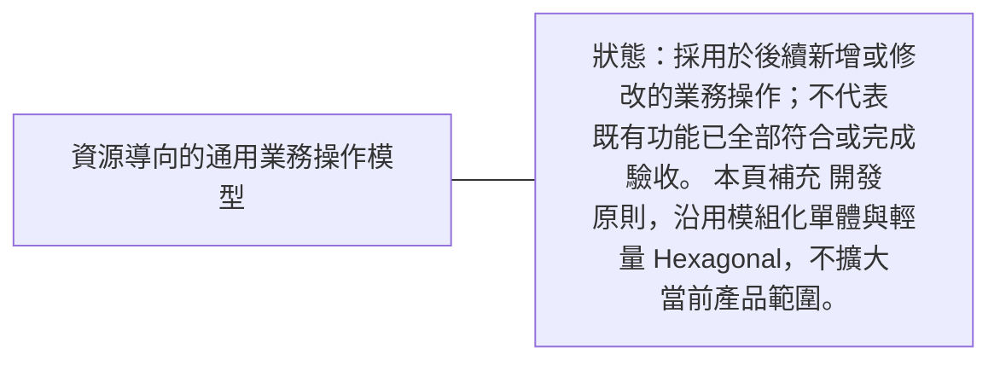
```mermaid
flowchart LR
  h["資源導向的通用業務操作模型"]
  h --- n0["狀態：採用於後續新增或修改的業務操作；不代表<br/>既有功能已全部符合或完成驗收。 本頁補充 開發<br/>原則，沿用模組化單體與輕量 Hexagonal，不擴大<br/>當前產品範圍。"]
  click n0 "../../standards/engineering.md"
```

## 模型與語意

開發與維運指引

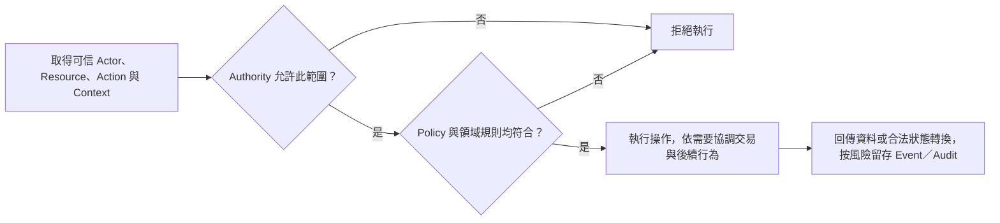
```mermaid
flowchart LR
  A["取得可信 Actor、Resource、Action 與 Context"] --> B{"Authority 允許此範圍？"}
  B -->|否| D["拒絕執行"]
  B -->|是| P{"Policy 與領域規則均符合？"}
  P -->|否| D
  P -->|是| E["執行操作，依需要協調交易與後續行為"]
  E --> R["回傳資料或合法狀態轉換，按風險留存 Event／Audit"]
```

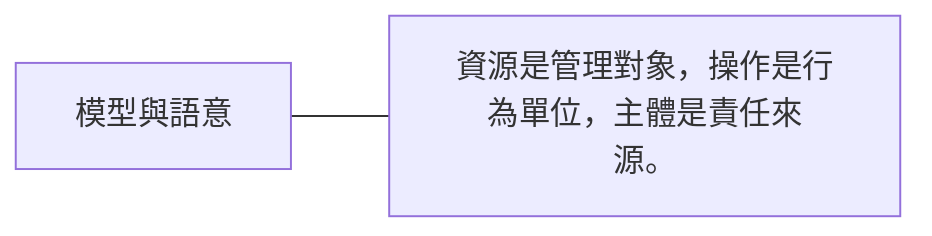
```mermaid
flowchart LR
  h["模型與語意"]
  h --- n0["資源是管理對象，操作是行為單位，主體是責任來<br/>源。"]
```

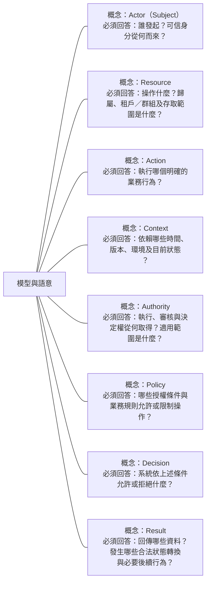
```mermaid
flowchart LR
  h["模型與語意"]
  h --- n0["概念：Actor（Subject）<br/>必須回答：誰發起？可信身分從何而來？"]
  h --- n1["概念：Resource<br/>必須回答：操作什麼？歸屬、租戶／群組及存取範<br/>圍是什麼？"]
  h --- n2["概念：Action<br/>必須回答：執行哪個明確的業務行為？"]
  h --- n3["概念：Context<br/>必須回答：依賴哪些時間、版本、環境及目前狀態<br/>？"]
  h --- n4["概念：Authority<br/>必須回答：執行、審核與決定權從何取得？適用範<br/>圍是什麼？"]
  h --- n5["概念：Policy<br/>必須回答：哪些授權條件與業務規則允許或限制操<br/>作？"]
  h --- n6["概念：Decision<br/>必須回答：系統依上述條件允許或拒絕什麼？"]
  h --- n7["概念：Result<br/>必須回答：回傳哪些資料？發生哪些合法狀態轉換<br/>與必要後續行為？"]
```

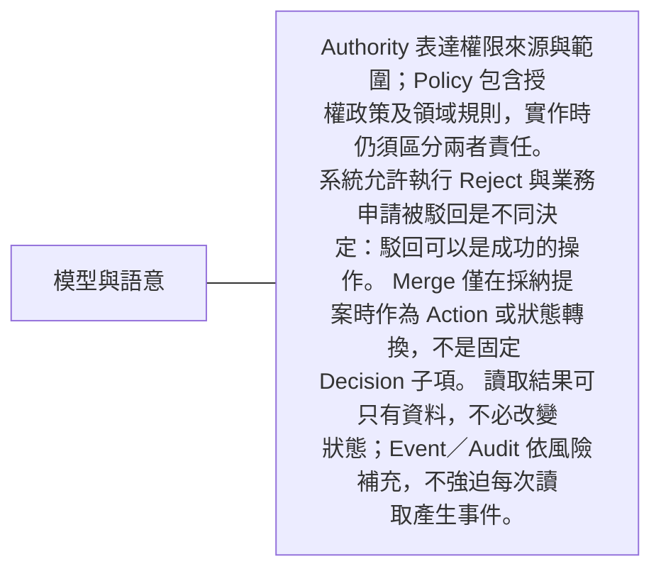
```mermaid
flowchart LR
  h["模型與語意"]
  h --- n0["Authority 表達權限來源與範圍；Policy 包含授<br/>權政策及領域規則，實作時仍須區分兩者責任。 <br/>系統允許執行 Reject 與業務申請被駁回是不同決<br/>定：駁回可以是成功的操作。 Merge 僅在採納提<br/>案時作為 Action 或狀態轉換，不是固定 <br/>Decision 子項。 讀取結果可只有資料，不必改變<br/>狀態；Event／Audit 依風險補充，不強迫每次讀<br/>取產生事件。"]
```

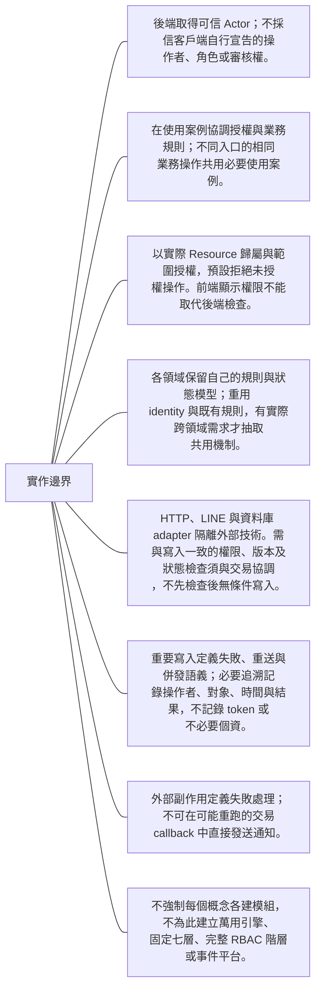
```mermaid
flowchart LR
  h["實作邊界"]
  h --- n0["後端取得可信 Actor；不採信客戶端自行宣告的操<br/>作者、角色或審核權。"]
  h --- n1["在使用案例協調授權與業務規則；不同入口的相同<br/>業務操作共用必要使用案例。"]
  h --- n2["以實際 Resource 歸屬與範圍授權，預設拒絕未授<br/>權操作。前端顯示權限不能取代後端檢查。"]
  h --- n3["各領域保留自己的規則與狀態模型；重用 <br/>identity 與既有規則，有實際跨領域需求才抽取<br/>共用機制。"]
  h --- n4["HTTP、LINE 與資料庫 adapter 隔離外部技術。需<br/>與寫入一致的權限、版本及狀態檢查須與交易協調<br/>，不先檢查後無條件寫入。"]
  h --- n5["重要寫入定義失敗、重送與併發語義；必要追溯記<br/>錄操作者、對象、時間與結果，不記錄 token 或<br/>不必要個資。"]
  h --- n6["外部副作用定義失敗處理；不可在可能重跑的交易<br/> callback 中直接發送通知。"]
  h --- n7["不強制每個概念各建模組，不為此建立萬用引擎、<br/>固定七層、完整 RBAC 階層或事件平台。"]
```

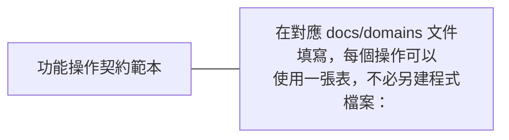
```mermaid
flowchart LR
  h["功能操作契約範本"]
  h --- n0["在對應 docs/domains 文件填寫，每個操作可以<br/>使用一張表，不必另建程式檔案："]
```

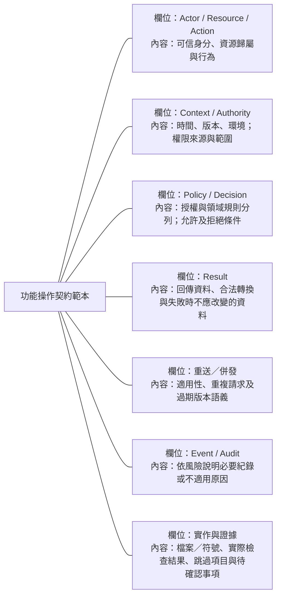
```mermaid
flowchart LR
  h["功能操作契約範本"]
  h --- n0["欄位：Actor / Resource / Action<br/>內容：可信身分、資源歸屬與行為"]
  h --- n1["欄位：Context / Authority<br/>內容：時間、版本、環境；權限來源與範圍"]
  h --- n2["欄位：Policy / Decision<br/>內容：授權與領域規則分列；允許及拒絕條件"]
  h --- n3["欄位：Result<br/>內容：回傳資料、合法轉換與失敗時不應改變的資<br/>料"]
  h --- n4["欄位：重送／併發<br/>內容：適用性、重複請求及過期版本語義"]
  h --- n5["欄位：Event / Audit<br/>內容：依風險說明必要紀錄或不適用原因"]
  h --- n6["欄位：實作與證據<br/>內容：檔案／符號、實際檢查結果、跳過項目與待<br/>確認事項"]
```

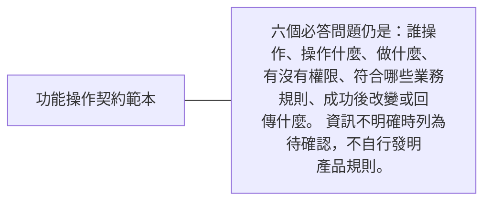
```mermaid
flowchart LR
  h["功能操作契約範本"]
  h --- n0["六個必答問題仍是：誰操作、操作什麼、做什麼、<br/>有沒有權限、符合哪些業務規則、成功後改變或回<br/>傳什麼。 資訊不明確時列為待確認，不自行發明<br/>產品規則。"]
```

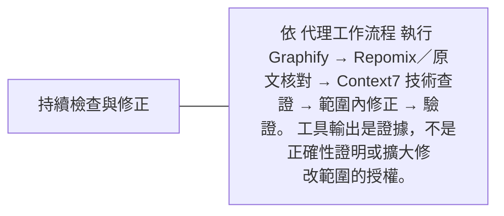
```mermaid
flowchart LR
  h["持續檢查與修正"]
  h --- n0["依 代理工作流程 執行 Graphify → Repomix／原<br/>文核對 → Context7 技術查證 → 範圍內修正 → 驗<br/>證。 工具輸出是證據，不是正確性證明或擴大修<br/>改範圍的授權。"]
  click n0 "../../agents/workflow.md#business-operation-compliance"
```

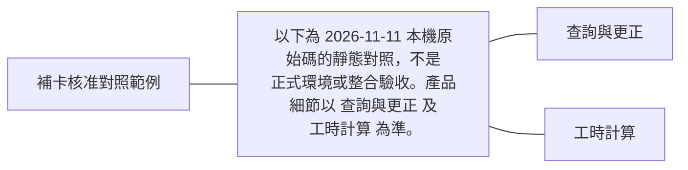
```mermaid
flowchart LR
  h["補卡核准對照範例"]
  h --- n0["以下為 2026-11-11 本機原始碼的靜態對照，不是<br/>正式環境或整合驗收。產品細節以 查詢與更正 及<br/> 工時計算 為準。"]
  n0 --- n0l0["查詢與更正"]
  click n0l0 "../../domains/attendance/queries.md"
  n0 --- n0l1["工時計算"]
  click n0l1 "../../domains/attendance/worktime.md"
```

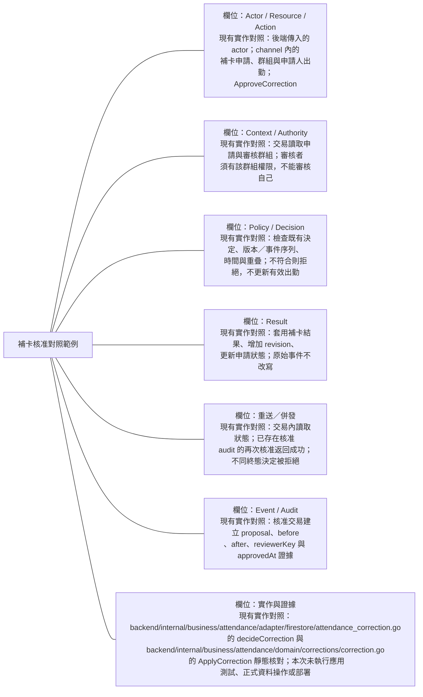
```mermaid
flowchart LR
  h["補卡核准對照範例"]
  h --- n0["欄位：Actor / Resource / Action<br/>現有實作對照：後端傳入的 actor；channel 內的<br/>補卡申請、群組與申請人出勤；<br/>ApproveCorrection"]
  h --- n1["欄位：Context / Authority<br/>現有實作對照：交易讀取申請與審核群組；審核者<br/>須有該群組權限，不能審核自己"]
  h --- n2["欄位：Policy / Decision<br/>現有實作對照：檢查既有決定、版本／事件序列、<br/>時間與重疊；不符合則拒絕，不更新有效出勤"]
  h --- n3["欄位：Result<br/>現有實作對照：套用補卡結果、增加 revision、<br/>更新申請狀態；原始事件不改寫"]
  h --- n4["欄位：重送／併發<br/>現有實作對照：交易內讀取狀態；已存在核准 <br/>audit 的再次核准返回成功；不同終態決定被拒絕"]
  h --- n5["欄位：Event / Audit<br/>現有實作對照：核准交易建立 proposal、before<br/>、after、reviewerKey 與 approvedAt 證據"]
  h --- n6["欄位：實作與證據<br/>現有實作對照：<br/>backend/internal/business/attendance/adapter/firestore/attendance_correction.go<br/> 的 decideCorrection 與 <br/>backend/internal/business/attendance/domain/corrections/correction.go<br/> 的 ApplyCorrection 靜態核對；本次未執行應用<br/>測試、正式資料操作或部署"]
```

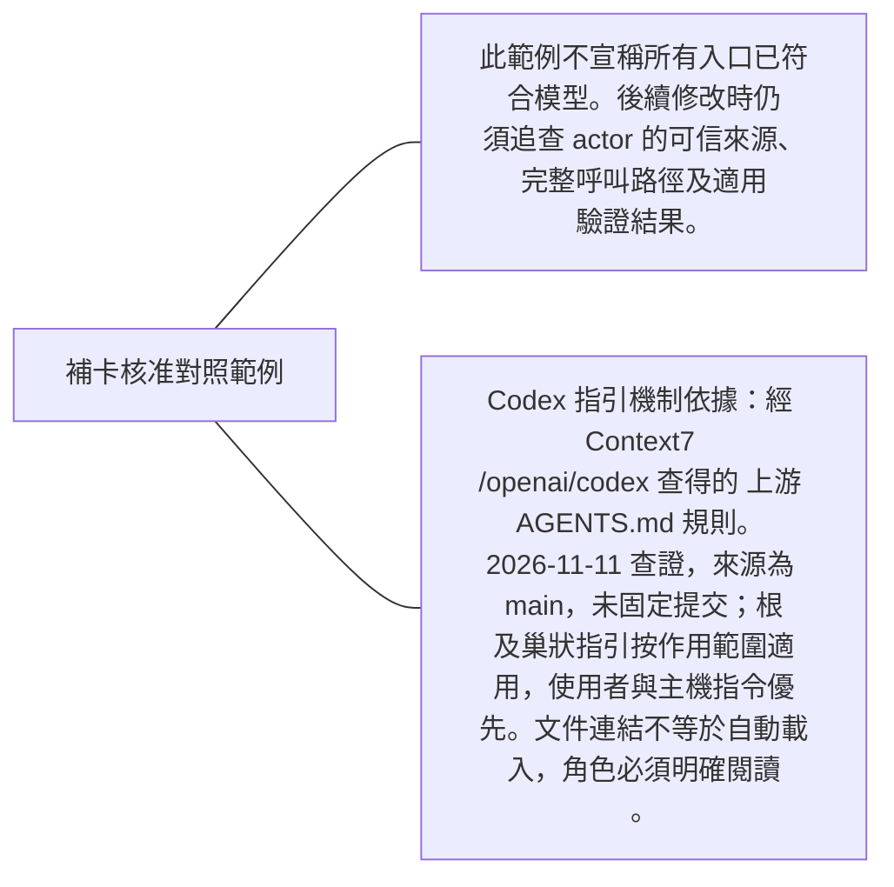
```mermaid
flowchart LR
  h["補卡核准對照範例"]
  h --- n0["此範例不宣稱所有入口已符合模型。後續修改時仍<br/>須追查 actor 的可信來源、完整呼叫路徑及適用<br/>驗證結果。"]
  h --- n1["Codex 指引機制依據：經 Context7 <br/>/openai/codex 查得的 上游 AGENTS.md 規則。 <br/>2026-11-11 查證，來源為 main，未固定提交；根<br/>及巢狀指引按作用範圍適用，使用者與主機指令優<br/>先。文件連結不等於自動載入，角色必須明確閱讀<br/>。"]
  click n1 "https://github.com/openai/codex/blob/main/codex-rs/protocol/src/prompts/base_instructions/default.md"
```

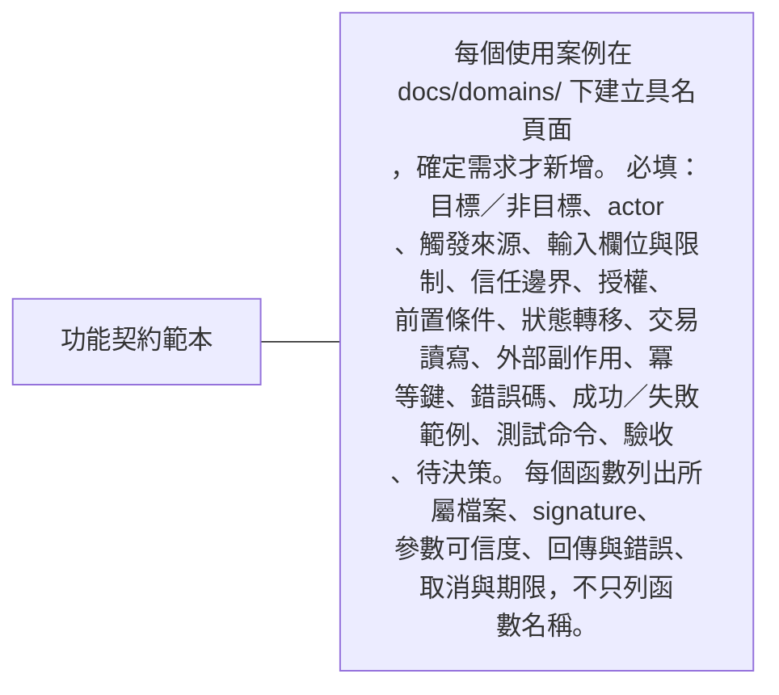
```mermaid
flowchart LR
  h["功能契約範本"]
  h --- n0["每個使用案例在 docs/domains/ 下建立具名頁面<br/>，確定需求才新增。 必填：目標／非目標、actor<br/>、觸發來源、輸入欄位與限制、信任邊界、授權、<br/>前置條件、狀態轉移、交易讀寫、外部副作用、冪<br/>等鍵、錯誤碼、成功／失敗範例、測試命令、驗收<br/>、待決策。 每個函數列出所屬檔案、signature、<br/>參數可信度、回傳與錯誤、取消與期限，不只列函<br/>數名稱。"]
```
