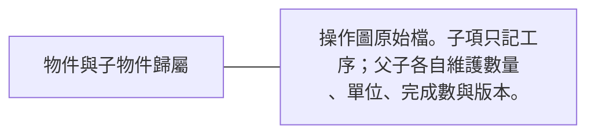

# 物件與子物件歸屬契約

## 物件與子物件歸屬

現行實作

[父子物件的歸屬、授權、防重與版本檢查（Mermaid 原始檔）](diagrams/object-operations.mermaid)

```mermaid
flowchart LR
  h["物件與子物件歸屬"]
  h --- n0["操作圖原始檔。子項只記工序；父子各自維護數量<br/>、單位、完成數與版本。"]
  click n0 "diagrams/object-operations.mermaid"
```
