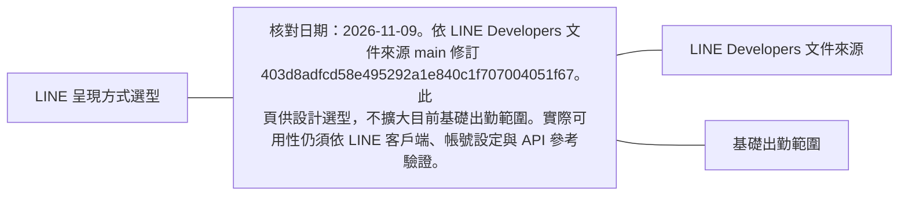
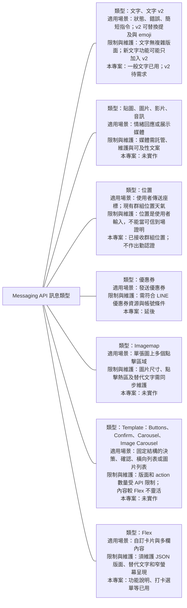
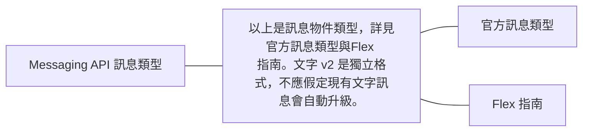
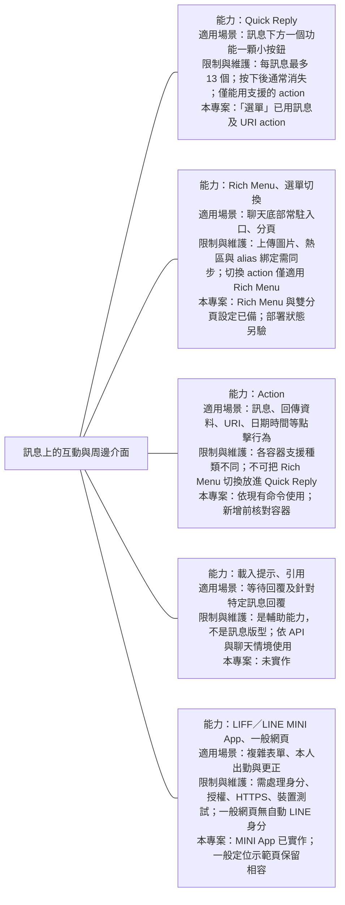
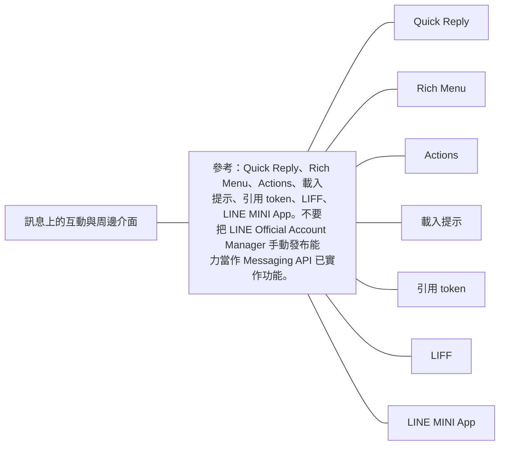

# line-呈現方式選型

```mermaid
flowchart LR
  h["LINE 呈現方式選型"]
  h --- n0["核對日期：2026-11-09。依 LINE Developers 文<br/>件來源 main 修訂 <br/>403d8adfcd58e495292a1e840c1f707004051f67。此<br/>頁供設計選型，不擴大目前基礎出勤範圍。實際可<br/>用性仍須依 LINE 客戶端、帳號設定與 API 參考<br/>驗證。"]
  n0 --- n0l0["LINE Developers 文件來源"]
  click n0l0 "https://github.com/line/line-developers-docs-source"
  n0 --- n0l1["基礎出勤範圍"]
  click n0l1 "../../domains/attendance/README.md"
```

```mermaid
flowchart LR
  h["Messaging API 訊息類型"]
  h --- n0["類型：文字、文字 v2<br/>適用場景：狀態、錯誤、簡短指令；v2 可替換提<br/>及與 emoji<br/>限制與維護：文字無複雜版面；新文字功能可能只<br/>加入 v2<br/>本專案：一般文字已用；v2 待需求"]
  h --- n1["類型：貼圖、圖片、影片、音訊<br/>適用場景：情緒回應或展示媒體<br/>限制與維護：媒體需託管、維護與可及性文案<br/>本專案：未實作"]
  h --- n2["類型：位置<br/>適用場景：使用者傳送座標；現有群組位置天氣<br/>限制與維護：位置是使用者輸入，不能當可信到場<br/>證明<br/>本專案：已接收群組位置；不作出勤認證"]
  h --- n3["類型：優惠券<br/>適用場景：發送優惠券<br/>限制與維護：需符合 LINE 優惠券資源與帳號條件<br/>本專案：延後"]
  h --- n4["類型：Imagemap<br/>適用場景：單張圖上多個點擊區域<br/>限制與維護：圖片尺寸、點擊熱區及替代文字需同<br/>步維護<br/>本專案：未實作"]
  h --- n5["類型：Template：Buttons、Confirm、Carousel、<br/>Image Carousel<br/>適用場景：固定結構的決策、確認、橫向列表或圖<br/>片列表<br/>限制與維護：版面和 action 數量受 API 限制；<br/>內容較 Flex 不靈活<br/>本專案：未實作"]
  h --- n6["類型：Flex<br/>適用場景：自訂卡片與多欄內容<br/>限制與維護：須維護 JSON 版面、替代文字和窄螢<br/>幕呈現<br/>本專案：功能說明、打卡選單等已用"]
```

```mermaid
flowchart LR
  h["Messaging API 訊息類型"]
  h --- n0["以上是訊息物件類型，詳見官方訊息類型與Flex <br/>指南。文字 v2 是獨立格式，不應假定現有文字訊<br/>息會自動升級。"]
  n0 --- n0l0["官方訊息類型"]
  click n0l0 "https://developers.line.biz/en/docs/messaging-api/message-types/"
  n0 --- n0l1["Flex 指南"]
  click n0l1 "https://developers.line.biz/en/docs/messaging-api/using-flex-messages/"
```

```mermaid
flowchart LR
  h["訊息上的互動與周邊介面"]
  h --- n0["能力：Quick Reply<br/>適用場景：訊息下方一個功能一顆小按鈕<br/>限制與維護：每訊息最多 13 個；按下後通常消失<br/>；僅能用支援的 action<br/>本專案：「選單」已用訊息及 URI action"]
  h --- n1["能力：Rich Menu、選單切換<br/>適用場景：聊天底部常駐入口、分頁<br/>限制與維護：上傳圖片、熱區與 alias 綁定需同<br/>步；切換 action 僅適用 Rich Menu<br/>本專案：Rich Menu 與雙分頁設定已備；部署狀態<br/>另驗"]
  h --- n2["能力：Action<br/>適用場景：訊息、回傳資料、URI、日期時間等點<br/>擊行為<br/>限制與維護：各容器支援種類不同；不可把 Rich <br/>Menu 切換放進 Quick Reply<br/>本專案：依現有命令使用；新增前核對容器"]
  h --- n3["能力：載入提示、引用<br/>適用場景：等待回覆及針對特定訊息回覆<br/>限制與維護：是輔助能力，不是訊息版型；依 API<br/> 與聊天情境使用<br/>本專案：未實作"]
  h --- n4["能力：LIFF／LINE MINI App、一般網頁<br/>適用場景：複雜表單、本人出勤與更正<br/>限制與維護：需處理身分、授權、HTTPS、裝置測<br/>試；一般網頁無自動 LINE 身分<br/>本專案：MINI App 已實作；一般定位示範頁保留<br/>相容"]
```

```mermaid
flowchart LR
  h["訊息上的互動與周邊介面"]
  h --- n0["參考：Quick Reply、Rich Menu、Actions、載入<br/>提示、引用 token、LIFF、LINE MINI App。不要<br/>把 LINE Official Account Manager 手動發布能<br/>力當作 Messaging API 已實作功能。"]
  n0 --- n0l0["Quick Reply"]
  click n0l0 "https://developers.line.biz/en/docs/messaging-api/using-quick-reply/"
  n0 --- n0l1["Rich Menu"]
  click n0l1 "https://developers.line.biz/en/docs/messaging-api/using-rich-menus/"
  n0 --- n0l2["Actions"]
  click n0l2 "https://developers.line.biz/en/docs/messaging-api/actions/"
  n0 --- n0l3["載入提示"]
  click n0l3 "https://developers.line.biz/en/docs/messaging-api/use-loading-indicator/"
  n0 --- n0l4["引用 token"]
  click n0l4 "https://developers.line.biz/en/docs/messaging-api/get-quote-tokens/"
  n0 --- n0l5["LIFF"]
  click n0l5 "https://developers.line.biz/en/docs/liff/overview/"
  n0 --- n0l6["LINE MINI App"]
  click n0l6 "https://developers.line.biz/en/docs/line-mini-app/quickstart/"
```
