# line-整合能力與邊界

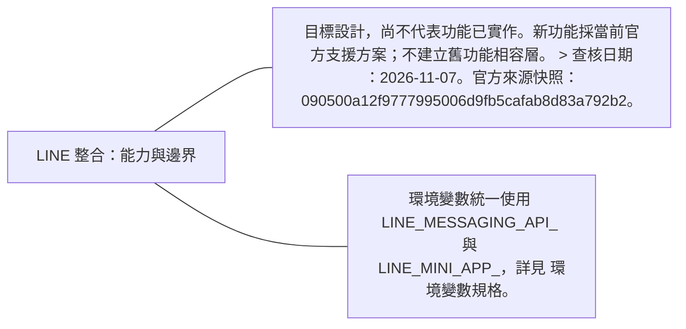
```mermaid
flowchart LR
  h["LINE 整合：能力與邊界"]
  h --- n0["目標設計，尚不代表功能已實作。新功能採當前官<br/>方支援方案；不建立舊功能相容層。 &gt; 查核日期<br/>：2026-11-07。官方來源快照：<br/>090500a12f9777995006d9fb5cafab8d83a792b2。"]
  h --- n1["環境變數統一使用 LINE_MESSAGING_API_ 與 <br/>LINE_MINI_APP_，詳見 環境變數規格。"]
  click n1 "line-environment.md"
```

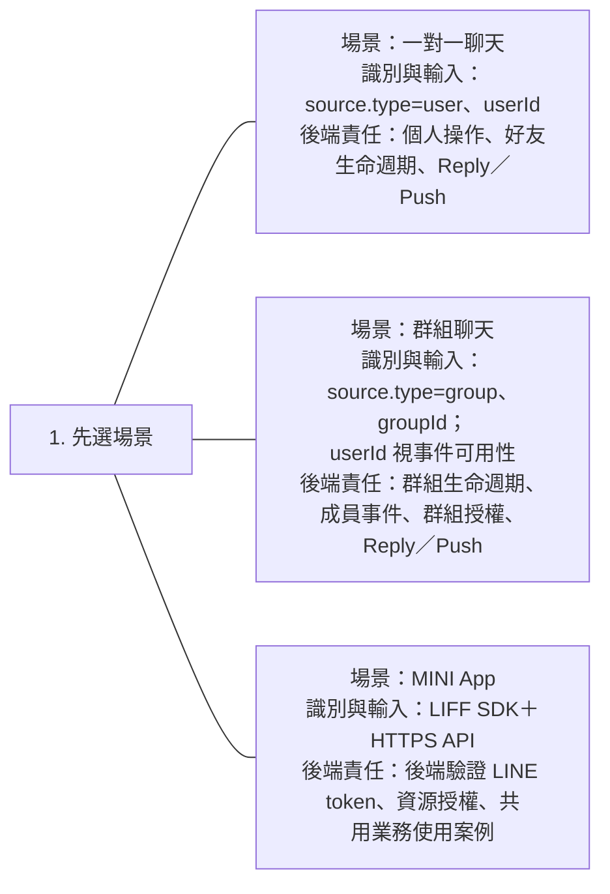
```mermaid
flowchart LR
  h["1. 先選場景"]
  h --- n0["場景：一對一聊天<br/>識別與輸入：source.type=user、userId<br/>後端責任：個人操作、好友生命週期、Reply／<br/>Push"]
  h --- n1["場景：群組聊天<br/>識別與輸入：source.type=group、groupId；<br/>userId 視事件可用性<br/>後端責任：群組生命週期、成員事件、群組授權、<br/>Reply／Push"]
  h --- n2["場景：MINI App<br/>識別與輸入：LIFF SDK＋HTTPS API<br/>後端責任：後端驗證 LINE token、資源授權、共<br/>用業務使用案例"]
```

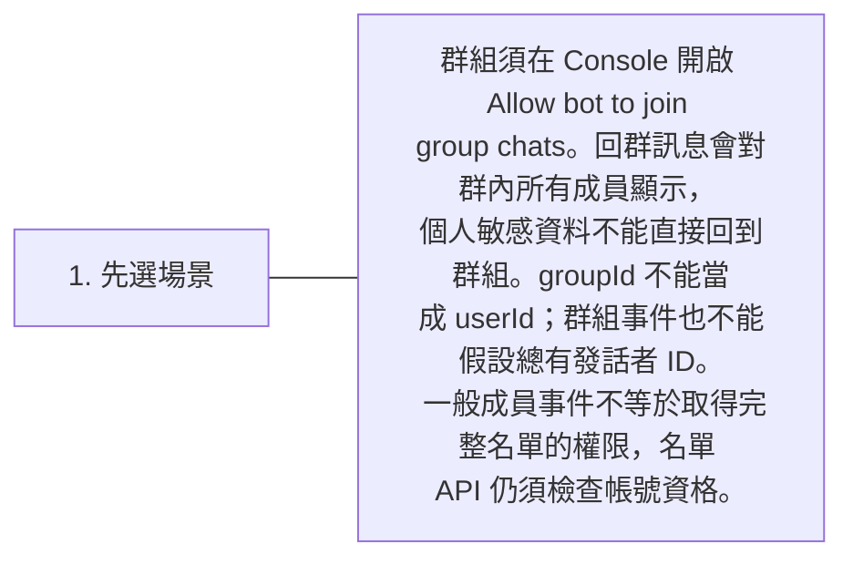
```mermaid
flowchart LR
  h["1. 先選場景"]
  h --- n0["群組須在 Console 開啟 Allow bot to join <br/>group chats。回群訊息會對群內所有成員顯示， <br/>個人敏感資料不能直接回到群組。groupId 不能當<br/>成 userId；群組事件也不能假設總有發話者 ID。<br/> 一般成員事件不等於取得完整名單的權限，名單 <br/>API 仍須檢查帳號資格。"]
```

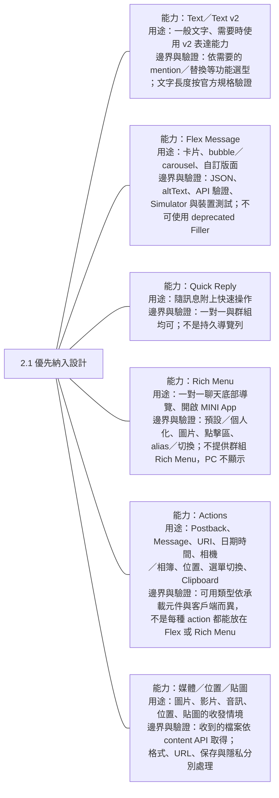
```mermaid
flowchart LR
  h["2.1 優先納入設計"]
  h --- n0["能力：Text／Text v2<br/>用途：一般文字、需要時使用 v2 表達能力<br/>邊界與驗證：依需要的 mention／替換等功能選型<br/>；文字長度按官方規格驗證"]
  h --- n1["能力：Flex Message<br/>用途：卡片、bubble／carousel、自訂版面<br/>邊界與驗證：JSON、altText、API 驗證、<br/>Simulator 與裝置測試；不可使用 deprecated <br/>Filler"]
  h --- n2["能力：Quick Reply<br/>用途：隨訊息附上快速操作<br/>邊界與驗證：一對一與群組均可；不是持久導覽列"]
  h --- n3["能力：Rich Menu<br/>用途：一對一聊天底部導覽、開啟 MINI App<br/>邊界與驗證：預設／個人化、圖片、點擊區、<br/>alias／切換；不提供群組 Rich Menu，PC 不顯示"]
  h --- n4["能力：Actions<br/>用途：Postback、Message、URI、日期時間、相機<br/>／相簿、位置、選單切換、Clipboard<br/>邊界與驗證：可用類型依承載元件與客戶端而異，<br/>不是每種 action 都能放在 Flex 或 Rich Menu"]
  h --- n5["能力：媒體／位置／貼圖<br/>用途：圖片、影片、音訊、位置、貼圖的收發情境<br/>邊界與驗證：收到的檔案依 content API 取得；<br/>格式、URL、保存與隱私分別處理"]
```

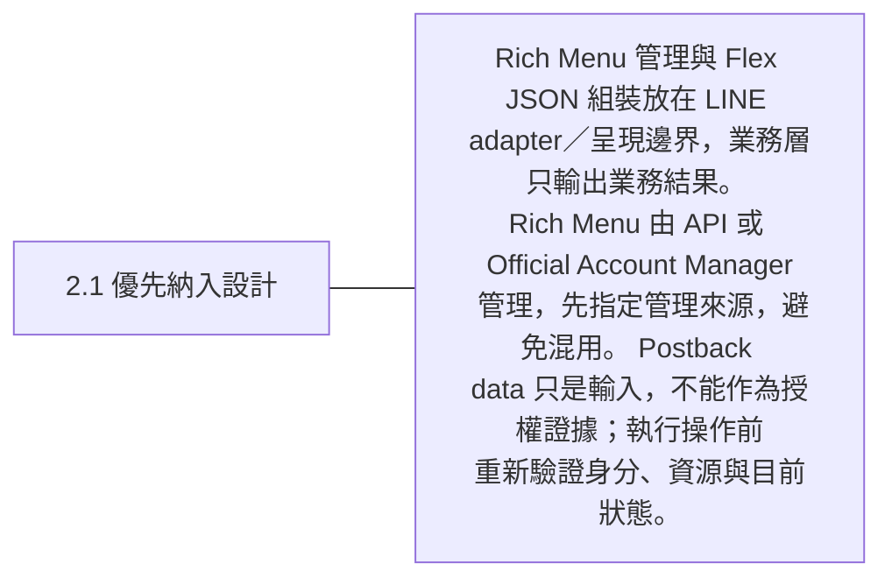
```mermaid
flowchart LR
  h["2.1 優先納入設計"]
  h --- n0["Rich Menu 管理與 Flex JSON 組裝放在 LINE <br/>adapter／呈現邊界，業務層只輸出業務結果。 <br/>Rich Menu 由 API 或 Official Account Manager<br/> 管理，先指定管理來源，避免混用。 Postback <br/>data 只是輸入，不能作為授權證據；執行操作前<br/>重新驗證身分、資源與目前狀態。"]
```

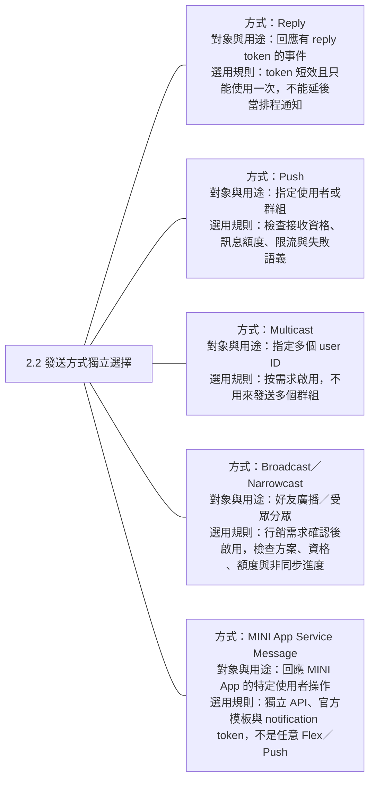
```mermaid
flowchart LR
  h["2.2 發送方式獨立選擇"]
  h --- n0["方式：Reply<br/>對象與用途：回應有 reply token 的事件<br/>選用規則：token 短效且只能使用一次，不能延後<br/>當排程通知"]
  h --- n1["方式：Push<br/>對象與用途：指定使用者或群組<br/>選用規則：檢查接收資格、訊息額度、限流與失敗<br/>語義"]
  h --- n2["方式：Multicast<br/>對象與用途：指定多個 user ID<br/>選用規則：按需求啟用，不用來發送多個群組"]
  h --- n3["方式：Broadcast／Narrowcast<br/>對象與用途：好友廣播／受眾分眾<br/>選用規則：行銷需求確認後啟用，檢查方案、資格<br/>、額度與非同步進度"]
  h --- n4["方式：MINI App Service Message<br/>對象與用途：回應 MINI App 的特定使用者操作<br/>選用規則：獨立 API、官方模板與 notification <br/>token，不是任意 Flex／Push"]
```

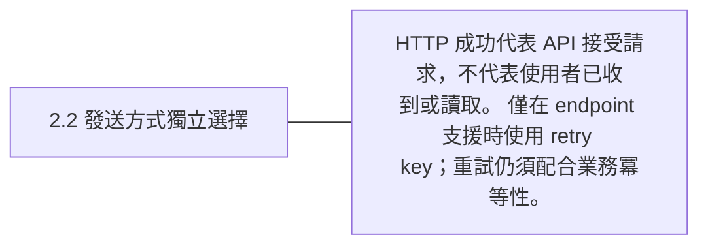
```mermaid
flowchart LR
  h["2.2 發送方式獨立選擇"]
  h --- n0["HTTP 成功代表 API 接受請求，不代表使用者已收<br/>到或讀取。 僅在 endpoint 支援時使用 retry <br/>key；重試仍須配合業務冪等性。"]
```

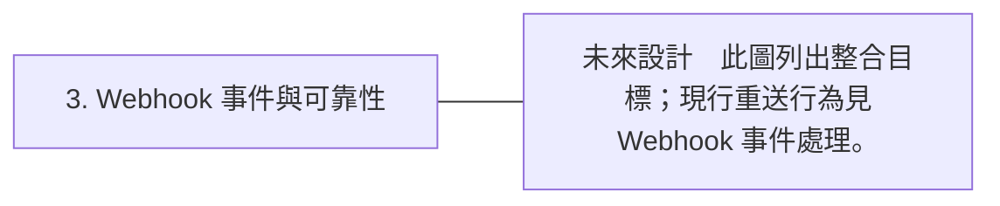
```mermaid
flowchart LR
  h["3. Webhook 事件與可靠性"]
  h --- n0["未來設計　此圖列出整合目標；現行重送行為見<br/>Webhook 事件處理。"]
  click n0 "../contracts/http.md#基礎入口"
```

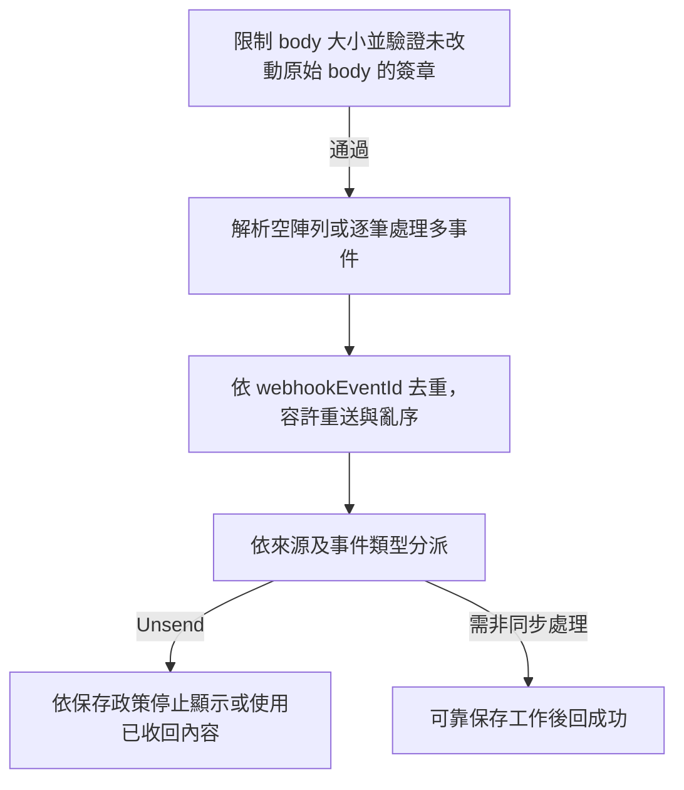
```mermaid
flowchart TB
  Raw["限制 body 大小並驗證未改動原始 body 的簽章"] -->|通過| Parse["解析空陣列或逐筆處理多事件"]
  Parse --> Dedup["依 webhookEventId 去重，容許重送與亂序"]
  Dedup --> Dispatch["依來源及事件類型分派"]
  Dispatch -->|Unsend| Policy["依保存政策停止顯示或使用已收回內容"]
  Dispatch -->|需非同步處理| Work["可靠保存工作後回成功"]
```

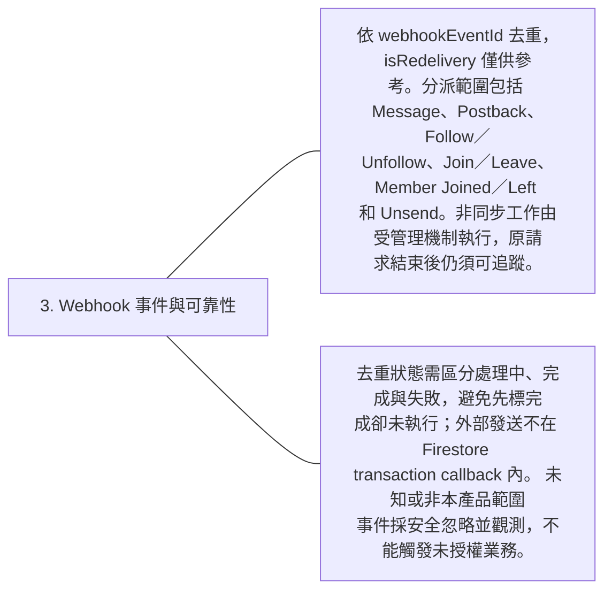
```mermaid
flowchart LR
  h["3. Webhook 事件與可靠性"]
  h --- n0["依 webhookEventId 去重，isRedelivery 僅供參<br/>考。分派範圍包括 Message、Postback、Follow／<br/>Unfollow、Join／Leave、Member Joined／Left <br/>和 Unsend。非同步工作由受管理機制執行，原請<br/>求結束後仍須可追蹤。"]
  h --- n1["去重狀態需區分處理中、完成與失敗，避免先標完<br/>成卻未執行；外部發送不在 Firestore <br/>transaction callback 內。 未知或非本產品範圍<br/>事件採安全忽略並觀測，不能觸發未授權業務。"]
```

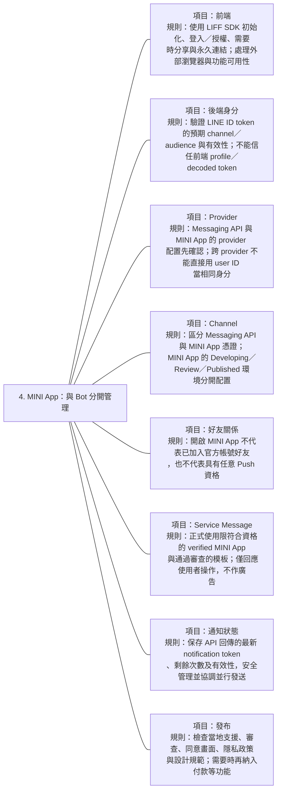
```mermaid
flowchart LR
  h["4. MINI App：與 Bot 分開管理"]
  h --- n0["項目：前端<br/>規則：使用 LIFF SDK 初始化、登入／授權、需要<br/>時分享與永久連結；處理外部瀏覽器與功能可用性"]
  h --- n1["項目：後端身分<br/>規則：驗證 LINE ID token 的預期 channel／<br/>audience 與有效性；不能信任前端 profile／<br/>decoded token"]
  h --- n2["項目：Provider<br/>規則：Messaging API 與 MINI App 的 provider <br/>配置先確認；跨 provider 不能直接用 user ID <br/>當相同身分"]
  h --- n3["項目：Channel<br/>規則：區分 Messaging API 與 MINI App 憑證；<br/>MINI App 的 Developing／Review／Published 環<br/>境分開配置"]
  h --- n4["項目：好友關係<br/>規則：開啟 MINI App 不代表已加入官方帳號好友<br/>，也不代表具有任意 Push 資格"]
  h --- n5["項目：Service Message<br/>規則：正式使用限符合資格的 verified MINI App<br/> 與通過審查的模板；僅回應使用者操作，不作廣<br/>告"]
  h --- n6["項目：通知狀態<br/>規則：保存 API 回傳的最新 notification token<br/>、剩餘次數及有效性，安全管理並協調並行發送"]
  h --- n7["項目：發布<br/>規則：檢查當地支援、審查、同意畫面、隱私政策<br/>與設計規範；需要時再納入付款等功能"]
```

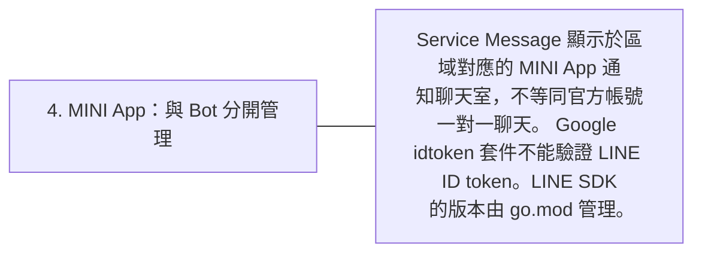
```mermaid
flowchart LR
  h["4. MINI App：與 Bot 分開管理"]
  h --- n0["Service Message 顯示於區域對應的 MINI App 通<br/>知聊天室，不等同官方帳號一對一聊天。 Google <br/>idtoken 套件不能驗證 LINE ID token。LINE SDK<br/> 的版本由 go.mod 管理。"]
```

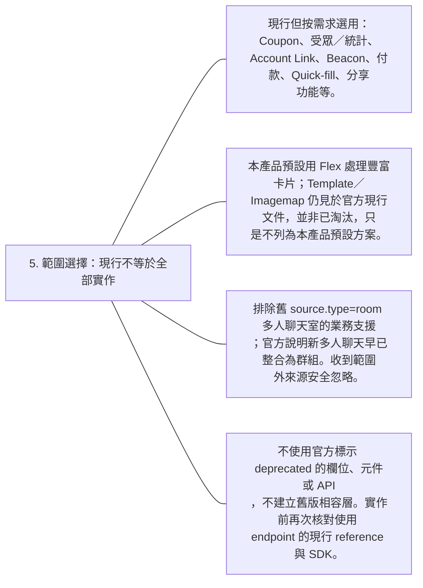
```mermaid
flowchart LR
  h["5. 範圍選擇：現行不等於全部實作"]
  h --- n0["現行但按需求選用：Coupon、受眾／統計、<br/>Account Link、Beacon、付款、Quick-fill、分享<br/>功能等。"]
  h --- n1["本產品預設用 Flex 處理豐富卡片；Template／<br/>Imagemap 仍見於官方現行文件，並非已淘汰，只<br/>是不列為本產品預設方案。"]
  h --- n2["排除舊 source.type=room 多人聊天室的業務支援<br/>；官方說明新多人聊天早已整合為群組。收到範圍<br/>外來源安全忽略。"]
  h --- n3["不使用官方標示 deprecated 的欄位、元件或 API<br/>，不建立舊版相容層。實作前再次核對使用 <br/>endpoint 的現行 reference 與 SDK。"]
```

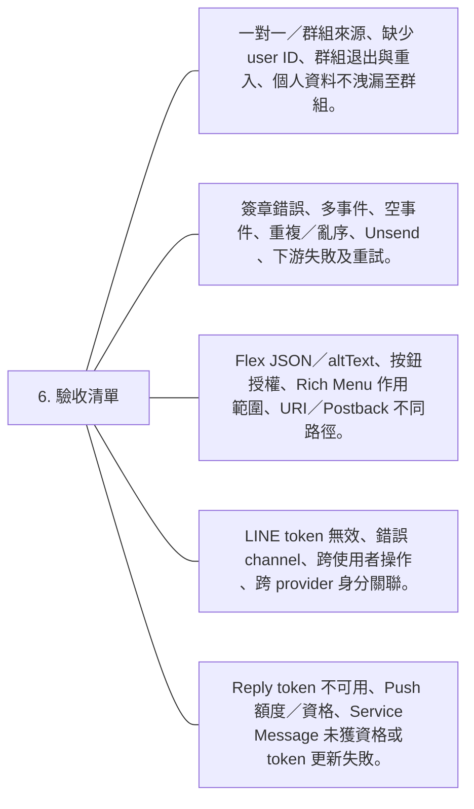
```mermaid
flowchart LR
  h["6. 驗收清單"]
  h --- n0["一對一／群組來源、缺少 user ID、群組退出與重<br/>入、個人資料不洩漏至群組。"]
  h --- n1["簽章錯誤、多事件、空事件、重複／亂序、Unsend<br/>、下游失敗及重試。"]
  h --- n2["Flex JSON／altText、按鈕授權、Rich Menu 作用<br/>範圍、URI／Postback 不同路徑。"]
  h --- n3["LINE token 無效、錯誤 channel、跨使用者操作<br/>、跨 provider 身分關聯。"]
  h --- n4["Reply token 不可用、Push 額度／資格、Service<br/> Message 未獲資格或 token 更新失敗。"]
```

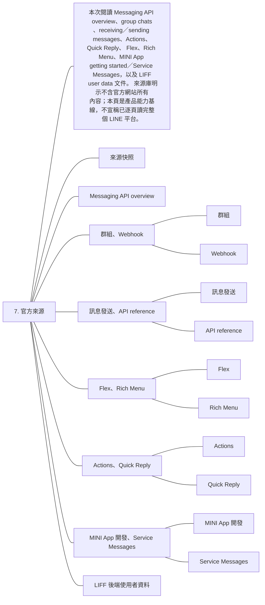
```mermaid
flowchart LR
  h["7. 官方來源"]
  h --- n0["本次閱讀 Messaging API overview、group chats<br/>、receiving／sending messages、Actions、<br/>Quick Reply、 Flex、Rich Menu、MINI App <br/>getting started／Service Messages，以及 LIFF<br/> user data 文件。 來源庫明示不含官方網站所有<br/>內容；本頁是產品能力基線，不宣稱已逐頁讀完整<br/>個 LINE 平台。"]
  h --- n1["來源快照"]
  click n1 "https://github.com/line/line-developers-docs-source/tree/090500a12f9777995006d9fb5cafab8d83a792b2"
  h --- n2["Messaging API overview"]
  click n2 "https://developers.line.biz/en/docs/messaging-api/overview/"
  h --- n3["群組、Webhook"]
  n3 --- n3l0["群組"]
  click n3l0 "https://developers.line.biz/en/docs/messaging-api/group-chats/"
  n3 --- n3l1["Webhook"]
  click n3l1 "https://developers.line.biz/en/docs/messaging-api/receiving-messages/"
  h --- n4["訊息發送、API reference"]
  n4 --- n4l0["訊息發送"]
  click n4l0 "https://developers.line.biz/en/docs/messaging-api/sending-messages/"
  n4 --- n4l1["API reference"]
  click n4l1 "https://developers.line.biz/en/reference/messaging-api/"
  h --- n5["Flex、Rich Menu"]
  n5 --- n5l0["Flex"]
  click n5l0 "https://developers.line.biz/en/docs/messaging-api/using-flex-messages/"
  n5 --- n5l1["Rich Menu"]
  click n5l1 "https://developers.line.biz/en/docs/messaging-api/rich-menus-overview/"
  h --- n6["Actions、Quick Reply"]
  n6 --- n6l0["Actions"]
  click n6l0 "https://developers.line.biz/en/docs/messaging-api/actions/"
  n6 --- n6l1["Quick Reply"]
  click n6l1 "https://developers.line.biz/en/docs/messaging-api/using-quick-reply/"
  h --- n7["MINI App 開發、Service Messages"]
  n7 --- n7l0["MINI App 開發"]
  click n7l0 "https://developers.line.biz/en/docs/line-mini-app/develop/develop-overview/"
  n7 --- n7l1["Service Messages"]
  click n7l1 "https://developers.line.biz/en/docs/line-mini-app/develop/service-messages/"
  h --- n8["LIFF 後端使用者資料"]
  click n8 "https://developers.line.biz/en/docs/liff/using-user-profile/"
```
