# web-geolocation-api-整合契約

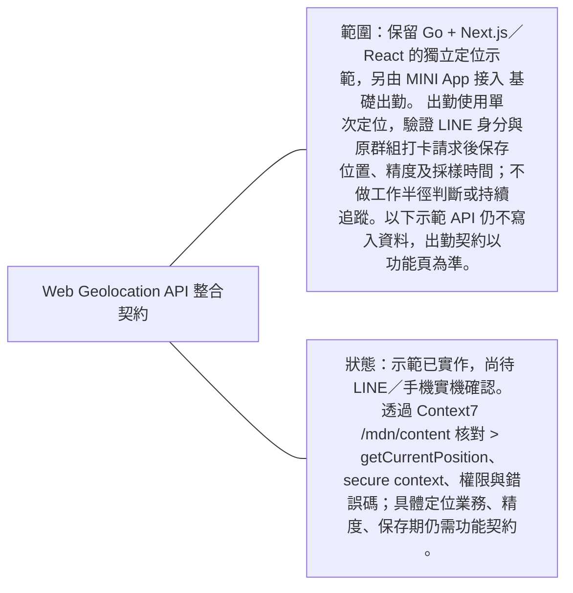
```mermaid
flowchart LR
  h["Web Geolocation API 整合契約"]
  h --- n0["範圍：保留 Go + Next.js／React 的獨立定位示<br/>範，另由 MINI App 接入 基礎出勤。 出勤使用單<br/>次定位，驗證 LINE 身分與原群組打卡請求後保存<br/>位置、精度及採樣時間；不做工作半徑判斷或持續<br/>追蹤。以下示範 API 仍不寫入資料，出勤契約以<br/>功能頁為準。"]
  click n0 "../../domains/attendance/README.md"
  h --- n1["狀態：示範已實作，尚待 LINE／手機實機確認。<br/>透過 Context7 /mdn/content 核對 &gt; <br/>getCurrentPosition、secure context、權限與錯<br/>誤碼；具體定位業務、精度、保存期仍需功能契約<br/>。"]
```

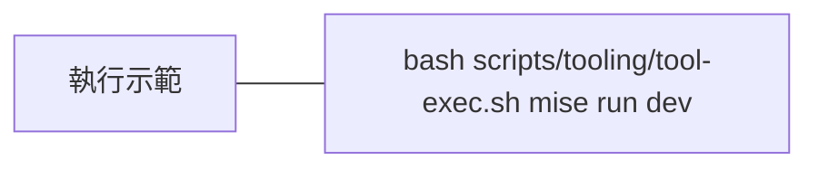
```mermaid
flowchart LR
  h["執行示範"]
  h --- n0["bash scripts/tooling/tool-exec.sh mise run dev"]
```

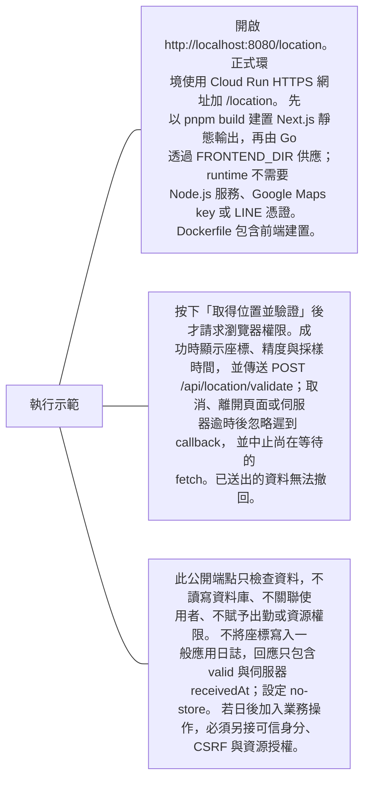
```mermaid
flowchart LR
  h["執行示範"]
  h --- n0["開啟 http://localhost:8080/location。正式環<br/>境使用 Cloud Run HTTPS 網址加 /location。 先<br/>以 pnpm build 建置 Next.js 靜態輸出，再由 Go<br/> 透過 FRONTEND_DIR 供應；runtime 不需要 <br/>Node.js 服務、Google Maps key 或 LINE 憑證。<br/>Dockerfile 包含前端建置。"]
  h --- n1["按下「取得位置並驗證」後才請求瀏覽器權限。成<br/>功時顯示座標、精度與採樣時間， 並傳送 POST <br/>/api/location/validate；取消、離開頁面或伺服<br/>器逾時後忽略遲到 callback， 並中止尚在等待的<br/> fetch。已送出的資料無法撤回。"]
  h --- n2["此公開端點只檢查資料，不讀寫資料庫、不關聯使<br/>用者、不賦予出勤或資源權限。 不將座標寫入一<br/>般應用日誌，回應只包含 valid 與伺服器 <br/>receivedAt；設定 no-store。 若日後加入業務操<br/>作，必須另接可信身分、CSRF 與資源授權。"]
```

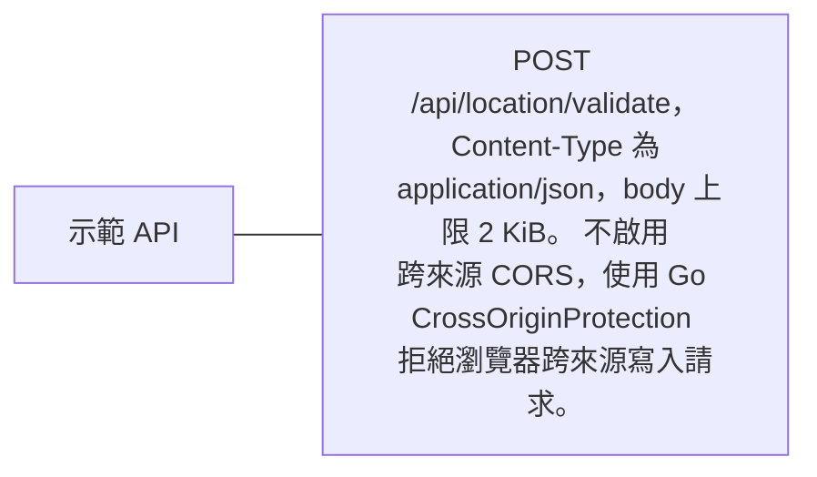
```mermaid
flowchart LR
  h["示範 API"]
  h --- n0["POST /api/location/validate，Content-Type 為<br/> application/json，body 上限 2 KiB。 不啟用<br/>跨來源 CORS，使用 Go CrossOriginProtection <br/>拒絕瀏覽器跨來源寫入請求。"]
```

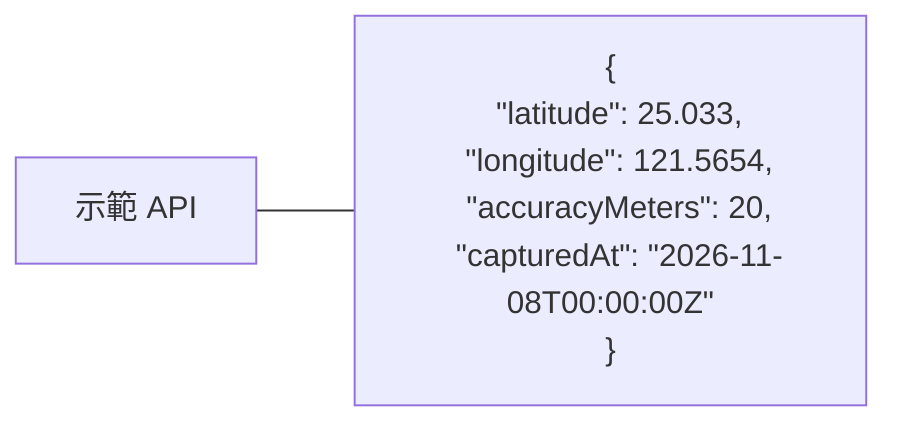
```mermaid
flowchart LR
  h["示範 API"]
  h --- n0["{<br/>  #quot;latitude#quot;: 25.033,<br/>  #quot;longitude#quot;: 121.5654,<br/>  #quot;accuracyMeters#quot;: 20,<br/>  #quot;capturedAt#quot;: #quot;2026-11-08T00:00:00Z#quot;<br/>}"]
```

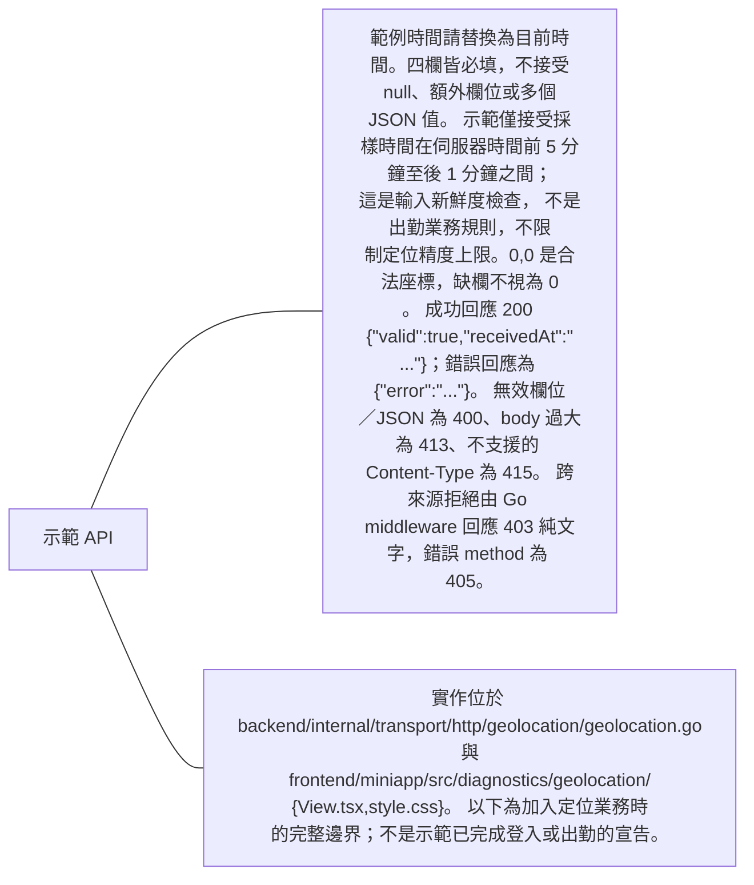
```mermaid
flowchart LR
  h["示範 API"]
  h --- n0["範例時間請替換為目前時間。四欄皆必填，不接受<br/> null、額外欄位或多個 JSON 值。 示範僅接受採<br/>樣時間在伺服器時間前 5 分鐘至後 1 分鐘之間；<br/>這是輸入新鮮度檢查， 不是出勤業務規則，不限<br/>制定位精度上限。0,0 是合法座標，缺欄不視為 0<br/>。 成功回應 200 {#quot;valid#quot;:true,#quot;receivedAt#quot;:#quot;<br/>...#quot;}；錯誤回應為 {#quot;error#quot;:#quot;...#quot;}。 無效欄位<br/>／JSON 為 400、body 過大為 413、不支援的 <br/>Content-Type 為 415。 跨來源拒絕由 Go <br/>middleware 回應 403 純文字，錯誤 method 為 <br/>405。"]
  h --- n1["實作位於 <br/>backend/internal/transport/http/geolocation/geolocation.go<br/> 與 <br/>frontend/miniapp/src/diagnostics/geolocation/<br/>{View.tsx,style.css}。 以下為加入定位業務時<br/>的完整邊界；不是示範已完成登入或出勤的宣告。"]
```

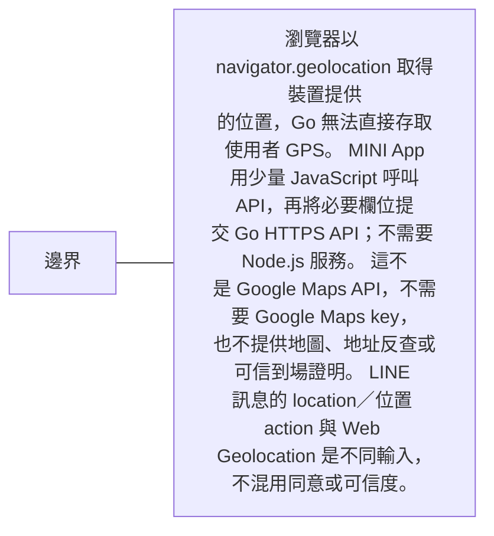
```mermaid
flowchart LR
  h["邊界"]
  h --- n0["瀏覽器以 navigator.geolocation 取得裝置提供<br/>的位置，Go 無法直接存取使用者 GPS。 MINI App<br/> 用少量 JavaScript 呼叫 API，再將必要欄位提<br/>交 Go HTTPS API；不需要 Node.js 服務。 這不<br/>是 Google Maps API，不需要 Google Maps key，<br/>也不提供地圖、地址反查或可信到場證明。 LINE <br/>訊息的 location／位置 action 與 Web <br/>Geolocation 是不同輸入，不混用同意或可信度。"]
```

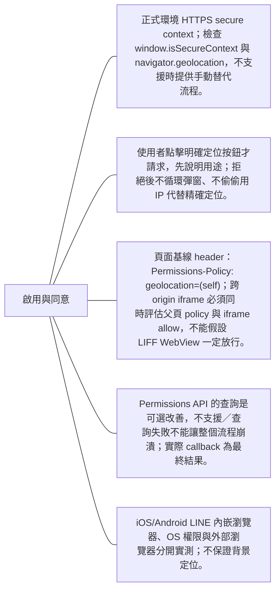
```mermaid
flowchart LR
  h["啟用與同意"]
  h --- n0["正式環境 HTTPS secure context；檢查 <br/>window.isSecureContext 與 <br/>navigator.geolocation，不支援時提供手動替代<br/>流程。"]
  h --- n1["使用者點擊明確定位按鈕才請求，先說明用途；拒<br/>絕後不循環彈窗、不偷偷用 IP 代替精確定位。"]
  h --- n2["頁面基線 header：Permissions-Policy: <br/>geolocation=(self)；跨 origin iframe 必須同<br/>時評估父頁 policy 與 iframe allow，不能假設 <br/>LIFF WebView 一定放行。"]
  h --- n3["Permissions API 的查詢是可選改善，不支援／查<br/>詢失敗不能讓整個流程崩潰；實際 callback 為最<br/>終結果。"]
  h --- n4["iOS/Android LINE 內嵌瀏覽器、OS 權限與外部瀏<br/>覽器分開實測；不保證背景定位。"]
```

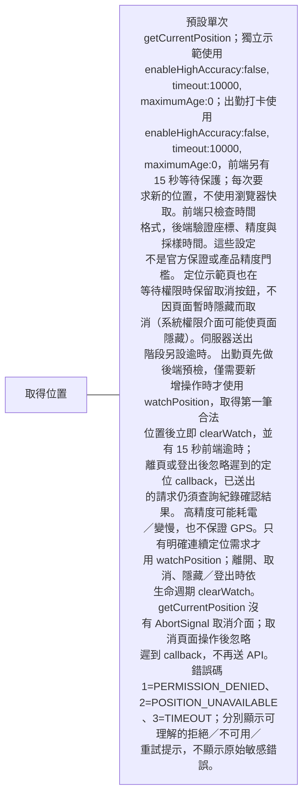
```mermaid
flowchart LR
  h["取得位置"]
  h --- n0["預設單次 getCurrentPosition；獨立示範使用 <br/>enableHighAccuracy:false, timeout:10000, <br/>maximumAge:0；出勤打卡使用 <br/>enableHighAccuracy:false, timeout:10000, <br/>maximumAge:0，前端另有 15 秒等待保護；每次要<br/>求新的位置，不使用瀏覽器快取。前端只檢查時間<br/>格式，後端驗證座標、精度與採樣時間。這些設定<br/>不是官方保證或產品精度門檻。 定位示範頁也在<br/>等待權限時保留取消按鈕，不因頁面暫時隱藏而取<br/>消（系統權限介面可能使頁面隱藏）。伺服器送出<br/>階段另設逾時。 出勤頁先做後端預檢，僅需要新<br/>增操作時才使用 watchPosition，取得第一筆合法<br/>位置後立即 clearWatch，並有 15 秒前端逾時；<br/>離頁或登出後忽略遲到的定位 callback，已送出<br/>的請求仍須查詢紀錄確認結果。 高精度可能耗電<br/>／變慢，也不保證 GPS。只有明確連續定位需求才<br/>用 watchPosition；離開、取消、隱藏／登出時依<br/>生命週期 clearWatch。 getCurrentPosition 沒<br/>有 AbortSignal 取消介面；取消頁面操作後忽略<br/>遲到 callback，不再送 API。 錯誤碼 <br/>1=PERMISSION_DENIED、2=POSITION_UNAVAILABLE<br/>、3=TIMEOUT；分別顯示可理解的拒絕／不可用／<br/>重試提示，不顯示原始敏感錯誤。"]
  click n0 "../../domains/attendance/README.md#定位前預檢狀態與時序"
```

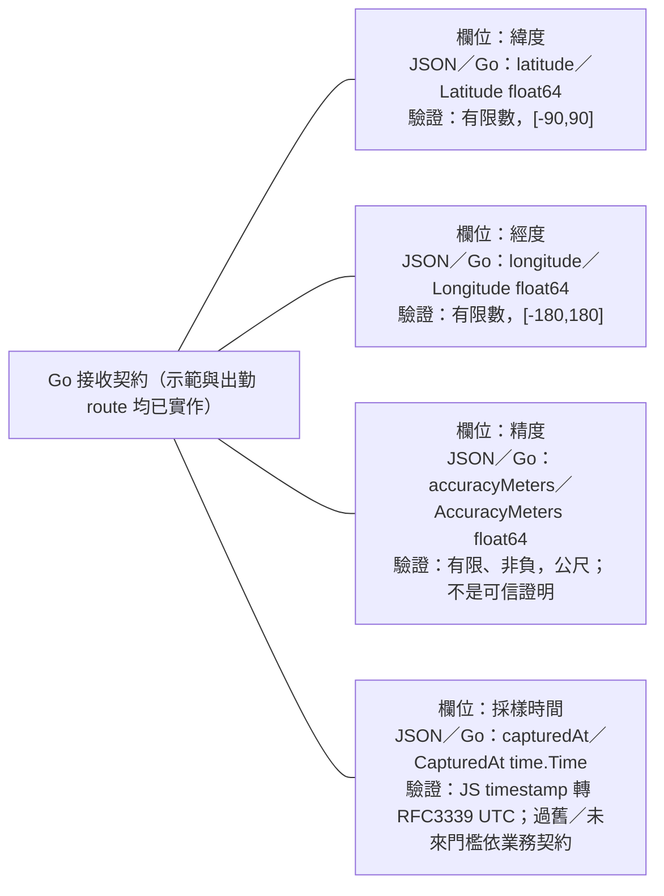
```mermaid
flowchart LR
  h["Go 接收契約（示範與出勤 route 均已實作）"]
  h --- n0["欄位：緯度<br/>JSON／Go：latitude／Latitude float64<br/>驗證：有限數，[-90,90]"]
  h --- n1["欄位：經度<br/>JSON／Go：longitude／Longitude float64<br/>驗證：有限數，[-180,180]"]
  h --- n2["欄位：精度<br/>JSON／Go：accuracyMeters／AccuracyMeters <br/>float64<br/>驗證：有限、非負，公尺；不是可信證明"]
  h --- n3["欄位：採樣時間<br/>JSON／Go：capturedAt／CapturedAt time.Time<br/>驗證：JS timestamp 轉 RFC3339 UTC；過舊／未<br/>來門檻依業務契約"]
```

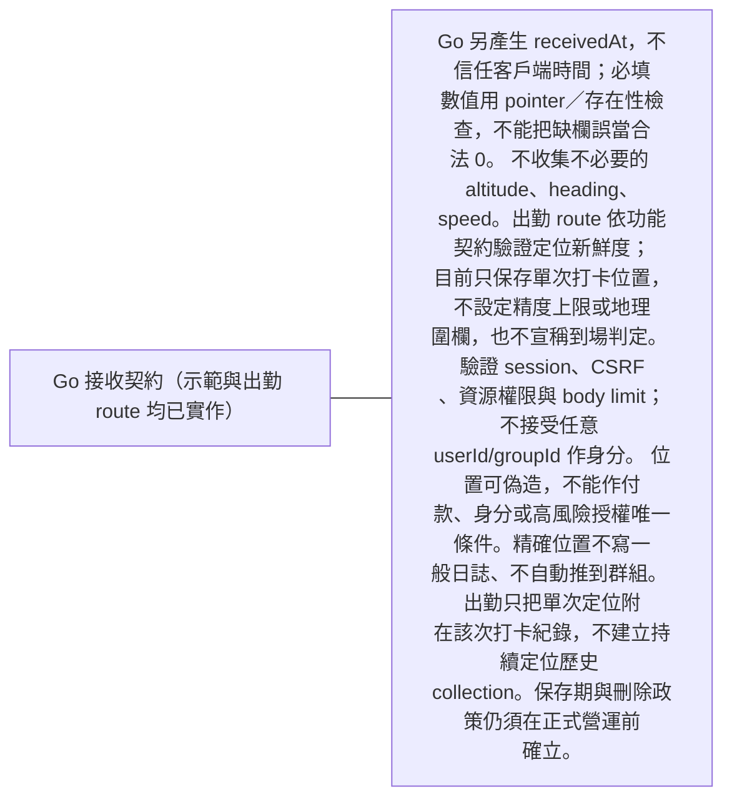
```mermaid
flowchart LR
  h["Go 接收契約（示範與出勤 route 均已實作）"]
  h --- n0["Go 另產生 receivedAt，不信任客戶端時間；必填<br/>數值用 pointer／存在性檢查，不能把缺欄誤當合<br/>法 0。 不收集不必要的 altitude、heading、<br/>speed。出勤 route 依功能契約驗證定位新鮮度；<br/>目前只保存單次打卡位置，不設定精度上限或地理<br/>圍欄，也不宣稱到場判定。 驗證 session、CSRF<br/>、資源權限與 body limit；不接受任意 <br/>userId/groupId 作身分。 位置可偽造，不能作付<br/>款、身分或高風險授權唯一條件。精確位置不寫一<br/>般日誌、不自動推到群組。 出勤只把單次定位附<br/>在該次打卡紀錄，不建立持續定位歷史 <br/>collection。保存期與刪除政策仍須在正式營運前<br/>確立。"]
```

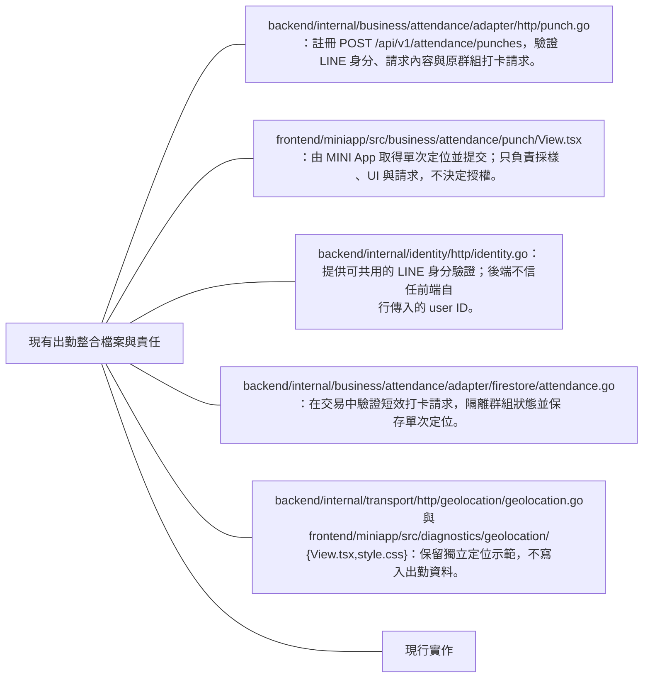
```mermaid
flowchart LR
  h["現有出勤整合檔案與責任"]
  h --- n0["backend/internal/business/attendance/adapter/http/punch.go<br/>：註冊 POST /api/v1/attendance/punches，驗證<br/> LINE 身分、請求內容與原群組打卡請求。"]
  h --- n1["frontend/miniapp/src/business/attendance/punch/View.tsx<br/>：由 MINI App 取得單次定位並提交；只負責採樣<br/>、UI 與請求，不決定授權。"]
  h --- n2["backend/internal/identity/http/identity.go：<br/>提供可共用的 LINE 身分驗證；後端不信任前端自<br/>行傳入的 user ID。"]
  h --- n3["backend/internal/business/attendance/adapter/firestore/attendance.go<br/>：在交易中驗證短效打卡請求，隔離群組狀態並保<br/>存單次定位。"]
  h --- n4["backend/internal/transport/http/geolocation/geolocation.go<br/> 與 <br/>frontend/miniapp/src/diagnostics/geolocation/<br/>{View.tsx,style.css}：保留獨立定位示範，不寫<br/>入出勤資料。"]
  h --- n5["現行實作"]
```

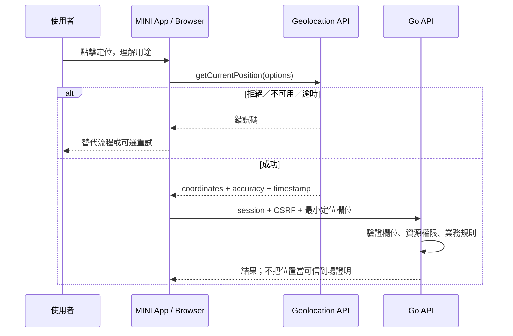
```mermaid
sequenceDiagram
  participant U as 使用者
  participant B as MINI App / Browser
  participant G as Geolocation API
  participant H as Go API
  U->>B: 點擊定位，理解用途
  B->>G: getCurrentPosition(options)
  alt 拒絕／不可用／逾時
    G-->>B: 錯誤碼
    B-->>U: 替代流程或可選重試
  else 成功
    G-->>B: coordinates + accuracy + timestamp
    B->>H: session + CSRF + 最小定位欄位
    H->>H: 驗證欄位、資源權限、業務規則
    H-->>B: 結果；不把位置當可信到場證明
  end
```

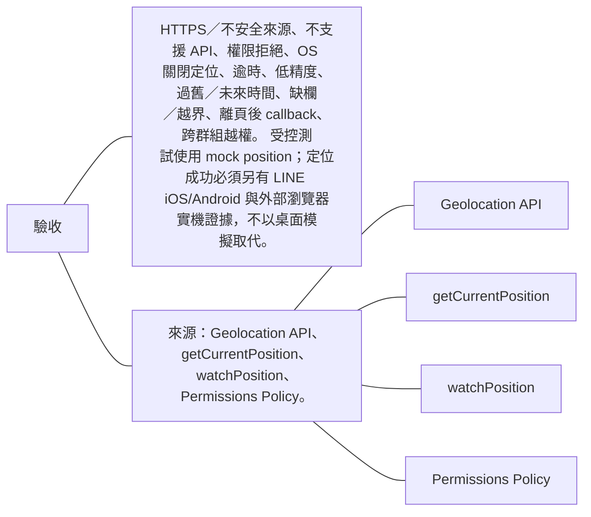
```mermaid
flowchart LR
  h["驗收"]
  h --- n0["HTTPS／不安全來源、不支援 API、權限拒絕、OS <br/>關閉定位、逾時、低精度、過舊／未來時間、缺欄<br/>／越界、離頁後 callback、跨群組越權。 受控測<br/>試使用 mock position；定位成功必須另有 LINE <br/>iOS/Android 與外部瀏覽器實機證據，不以桌面模<br/>擬取代。"]
  h --- n1["來源：Geolocation API、getCurrentPosition、<br/>watchPosition、Permissions Policy。"]
  n1 --- n1l0["Geolocation API"]
  click n1l0 "https://developer.mozilla.org/en-US/docs/Web/API/Geolocation_API"
  n1 --- n1l1["getCurrentPosition"]
  click n1l1 "https://developer.mozilla.org/en-US/docs/Web/API/Geolocation/getCurrentPosition"
  n1 --- n1l2["watchPosition"]
  click n1l2 "https://developer.mozilla.org/en-US/docs/Web/API/Geolocation/watchPosition"
  n1 --- n1l3["Permissions Policy"]
  click n1l3 "https://developer.mozilla.org/en-US/docs/Web/HTTP/Reference/Headers/Permissions-Policy/geolocation"
```
