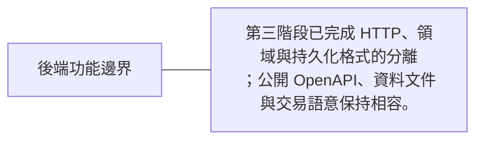
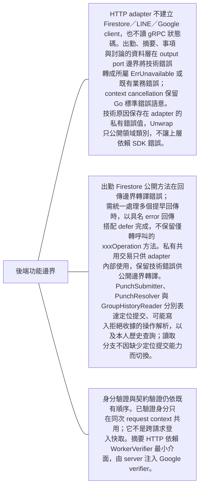
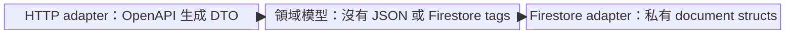
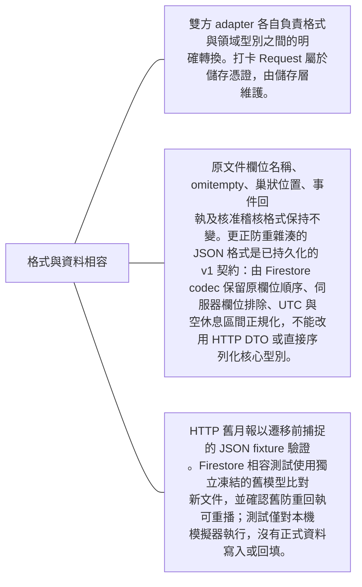
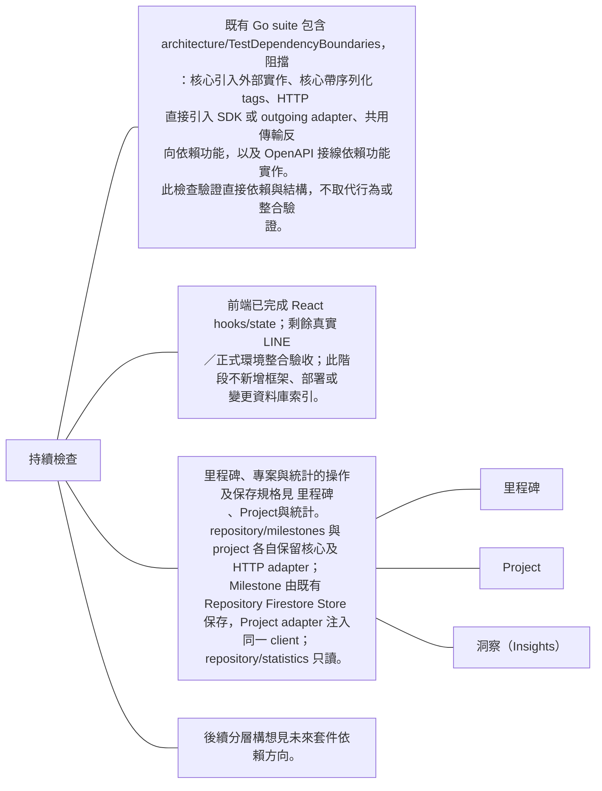

# 後端功能邊界

```mermaid
flowchart LR
  h["後端功能邊界"]
  h --- n0["第三階段已完成 HTTP、領域與持久化格式的分離<br/>；公開 OpenAPI、資料文件與交易語意保持相容。"]
```

```mermaid
flowchart LR
  h["後端功能邊界"]
  h --- n0["目錄：business/attendance/domain、<br/>business/attendance/application<br/>責任與允許依賴：各子功能的模型、規則與能力契<br/>約；依賴方向見 目前模組與責任"]
  click n0 "code-layout.md"
  h --- n1["目錄：business/attendance/adapter/http<br/>責任與允許依賴：出勤 HTTP、生成 DTO 轉換、認<br/>證後的契約驗證；依賴消費端 Authenticator 介<br/>面"]
  h --- n2["目錄：business/issue<br/>責任與允許依賴：事項用例、建立者權限與生命週期<br/>規則；只依賴標準庫與 Repository 核心契約"]
  h --- n3["目錄：business/issue/http、<br/>business/issue/firestore<br/>責任與允許依賴：分別擁有 HTTP DTO／契約驗證<br/>與文件／交易；server 注入既有身分、<br/>Repository client 及共用編號"]
  h --- n4["目錄：business/discussion<br/>責任與允許依賴：主題、單層留言及各自作者編輯<br/>規則；只依賴標準庫與 Repository 核心"]
  h --- n5["目錄：business/discussion/http、<br/>business/discussion/firestore<br/>責任與允許依賴：分別擁有主題／留言 HTTP 契約<br/>及文件／交易；討論配置共用 number，留言不配<br/>置 number"]
  h --- n6["目錄：business/repository/labels、<br/>business/repository/labels/http<br/>責任與允許依賴：標籤目錄列出／建立與 HTTP 轉<br/>換；Firestore 實作保留於既有 <br/>repository/firestore，重用 client；共享 ID <br/>正規化及交易內引用核驗，實際分類寫入仍由 <br/>Issue／Discussion 負責"]
  h --- n7["目錄：business/attendance/adapter/firestore<br/>責任與允許依賴：文件 DTO、查詢／交易、錯誤轉<br/>譯、固定版本防重編碼"]
  h --- n8["目錄：business/attendance/adapter/line、<br/>business/attendance/adapter/presentation<br/>責任與允許依賴：聊天流程、出勤卡片與不依賴 <br/>SDK 的共用呈現"]
  h --- n9["目錄：business/summary/messagecollection、<br/>business/summary/messagecollection/line<br/>責任與允許依賴：訊息模型與收集契約；LINE 文<br/>字收集、編輯與收回，不依賴摘要生成"]
  h --- n10["目錄：business/summary/line<br/>責任與允許依賴：收集與摘要指令的組合入口，先<br/>處理指令，再靜默收集一般文字"]
  h --- n11["目錄：business/summary/summarization<br/>責任與允許依賴：摘要用例與能力契約；不依賴 <br/>SDK"]
  h --- n12["目錄：business/summary/summarization/line、<br/>business/summary/summarization/cloudtasks<br/>責任與允許依賴：摘要指令、佇列排程與結果傳送"]
  h --- n13["目錄：business/summary/summarization/http<br/>責任與允許依賴：摘要工作 HTTP，透過 <br/>WorkerVerifier 驗證工作身分"]
  h --- n14["目錄：business/summary/firestore<br/>責任與允許依賴：收集與摘要共用的文件、版本狀<br/>態與交易"]
  h --- n15["目錄：business/weather/forecast/cwa、<br/>business/weather/forecast/line<br/>責任與允許依賴：預報來源與聊天呈現；組裝由 <br/>server 負責"]
  h --- n16["目錄：identity<br/>責任與允許依賴：身分資料、Verifier 契約及 <br/>request context；不依賴 HTTP／SDK"]
  h --- n17["目錄：identity/http<br/>責任與允許依賴：Bearer 輸入、身分回應、HTTP <br/>錯誤與 MINI App 設定入口"]
  h --- n18["目錄：identity/line、identity/google<br/>責任與允許依賴：LINE 本人身分與 Google 工作<br/>身分驗證的外部整合"]
  h --- n19["目錄：browser、diagnostics/geolocation<br/>責任與允許依賴：靜態頁面／CSP，以及獨立定位<br/>診斷"]
  h --- n20["目錄：httpapi<br/>責任與允許依賴：生成介面接線與 spec，不 <br/>import 功能實作"]
  h --- n21["目錄：transport/http、transport/line<br/>責任與允許依賴：共用 HTTP 格式與 LINE 傳輸；<br/>不依賴功能"]
  h --- n22["目錄：server<br/>責任與允許依賴：設定、外部 client 建立、手動<br/>注入、路由與生命週期"]
```

```mermaid
flowchart LR
  h["後端功能邊界"]
  h --- n0["HTTP adapter 不建立 Firestore／LINE／Google <br/>client，也不讀 gRPC 狀態碼。出勤、摘要、事項<br/>與討論的資料層在 output port 邊界將技術錯誤<br/>轉成所屬 ErrUnavailable 或既有業務錯誤；<br/>context cancellation 保留 Go 標準錯誤語意。<br/>技術原因保存在 adapter 的私有錯誤值，Unwrap <br/>只公開領域類別，不讓上層依賴 SDK 錯誤。"]
  h --- n1["出勤 Firestore 公開方法在回傳邊界轉譯錯誤；<br/>需統一處理多個提早回傳時，以具名 error 回傳<br/>搭配 defer 完成，不保留僅轉呼叫的 <br/>xxxOperation 方法。私有共用交易只供 adapter <br/>內部使用，保留技術錯誤供公開邊界轉譯。 <br/>PunchSubmitter、PunchResolver 與 <br/>GroupHistoryReader 分別表達定位提交、可能寫<br/>入拒絕收據的操作解析，以及本人歷史查詢；讀取<br/>分支不因缺少定位提交能力而切換。"]
  h --- n2["身分驗證與契約驗證仍依既有順序。已驗證身分只<br/>在同次 request context 共用；它不是跨請求登<br/>入快取。摘要 HTTP 依賴 WorkerVerifier 最小介<br/>面，由 server 注入 Google verifier。"]
```

## 格式與資料相容

現行實作

```mermaid
block-beta
  columns 3
  H["HTTP adapter：OpenAPI 生成 DTO"] D["領域模型：沒有 JSON 或 Firestore tags"] F["Firestore adapter：私有 document structs"]
  H --> D
  F --> D
```

```mermaid
flowchart LR
  h["格式與資料相容"]
  h --- n0["雙方 adapter 各自負責格式與領域型別之間的明<br/>確轉換。打卡 Request 屬於儲存憑證，由儲存層<br/>維護。"]
  h --- n1["原文件欄位名稱、omitempty、巢狀位置、事件回<br/>執及核准稽核格式保持不變。更正防重雜湊的 <br/>JSON 格式是已持久化的 v1 契約：由 Firestore <br/>codec 保留原欄位順序、伺服器欄位排除、UTC 與<br/>空休息區間正規化，不能改用 HTTP DTO 或直接序<br/>列化核心型別。"]
  h --- n2["HTTP 舊月報以遷移前捕捉的 JSON fixture 驗證<br/>。Firestore 相容測試使用獨立凍結的舊模型比對<br/>新文件，並確認舊防重回執可重播；測試僅對本機<br/>模擬器執行，沒有正式資料寫入或回填。"]
```

```mermaid
flowchart LR
  h["持續檢查"]
  h --- n0["既有 Go suite 包含 <br/>architecture/TestDependencyBoundaries，阻擋<br/>：核心引入外部實作、核心帶序列化 tags、HTTP <br/>直接引入 SDK 或 outgoing adapter、共用傳輸反<br/>向依賴功能，以及 OpenAPI 接線依賴功能實作。<br/>此檢查驗證直接依賴與結構，不取代行為或整合驗<br/>證。"]
  h --- n1["前端已完成 React hooks/state；剩餘真實 LINE<br/>／正式環境整合驗收；此階段不新增框架、部署或<br/>變更資料庫索引。"]
  h --- n2["里程碑、專案與統計的操作及保存規格見 里程碑<br/>、Project與統計。repository/milestones 與 <br/>project 各自保留核心及 HTTP adapter；<br/>Milestone 由既有 Repository Firestore Store <br/>保存，Project adapter 注入同一 client；<br/>repository/statistics 只讀。"]
  n2 --- n2l0["里程碑"]
  click n2l0 "../../domains/repository/milestones.md"
  n2 --- n2l1["Project"]
  click n2l1 "../../domains/project/project.md"
  n2 --- n2l2["洞察（Insights）"]
  click n2l2 "../../domains/repository/insights.md"
  h --- n3["後續分層構想見未來套件依賴方向。"]
  click n3 "dependencies.md#允許方向"
```
