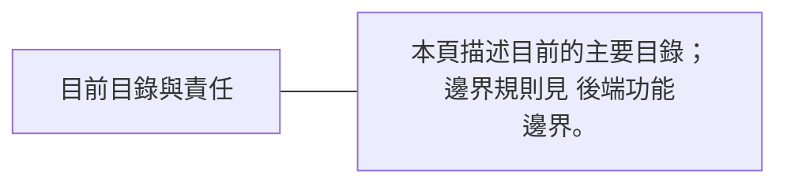
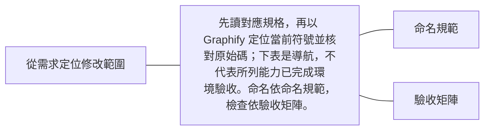
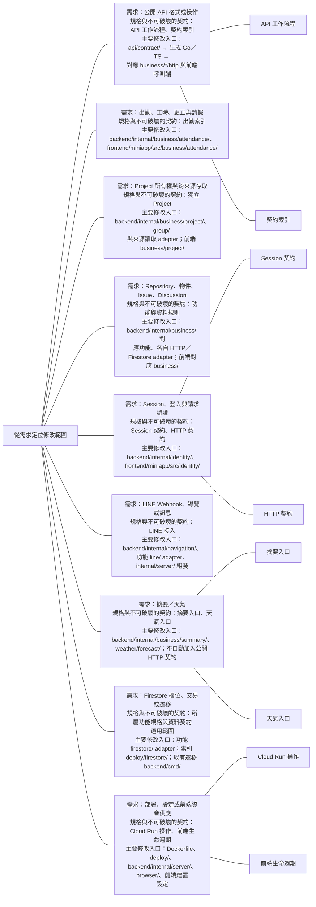
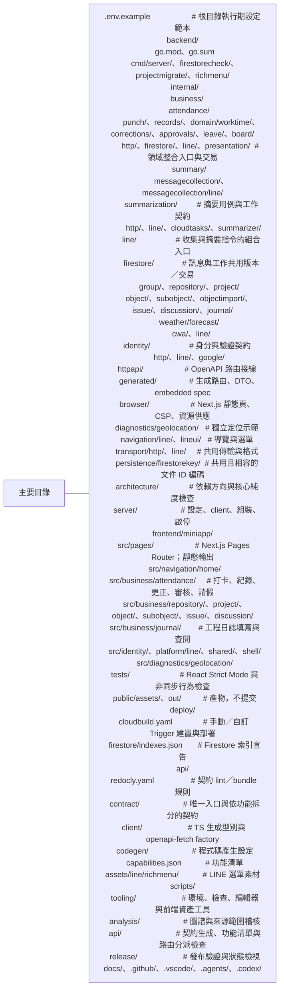
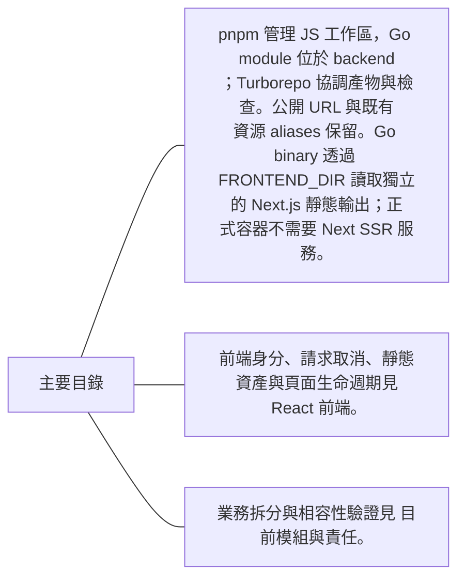

# 目前目錄與責任

```mermaid
flowchart LR
  h["目前目錄與責任"]
  h --- n0["本頁描述目前的主要目錄；邊界規則見 後端功能<br/>邊界。"]
  click n0 "backend-boundaries.md"
```

```mermaid
flowchart LR
  h["從需求定位修改範圍"]
  h --- n0["先讀對應規格，再以 Graphify 定位當前符號並核<br/>對原始碼；下表是導航，不代表所列能力已完成環<br/>境驗收。命名依命名規範，檢查依驗收矩陣。"]
  n0 --- n0l0["命名規範"]
  click n0l0 "../../standards/naming.md"
  n0 --- n0l1["驗收矩陣"]
  click n0l1 "../../agents/acceptance.md#變更驗收矩陣"
```

```mermaid
flowchart LR
  h["從需求定位修改範圍"]
  h --- n0["需求：公開 API 格式或操作<br/>規格與不可破壞的契約：API 工作流程、契約索引<br/>主要修改入口：api/contract/ → 生成 Go／TS → <br/>對應 business/*/http 與前端呼叫端"]
  n0 --- n0l0["API 工作流程"]
  click n0l0 "../../../api/README.md"
  n0 --- n0l1["契約索引"]
  click n0l1 "../../../api/contract/README.md"
  h --- n1["需求：出勤、工時、更正與請假<br/>規格與不可破壞的契約：出勤索引<br/>主要修改入口：<br/>backend/internal/business/attendance/、<br/>frontend/miniapp/src/business/attendance/"]
  click n1 "../../domains/README.md#出勤"
  h --- n2["需求：Project 所有權與跨來源存取<br/>規格與不可破壞的契約：獨立 Project<br/>主要修改入口：<br/>backend/internal/business/project/、group/ <br/>與來源讀取 adapter；前端 business/project/"]
  click n2 "../../domains/project/project.md"
  h --- n3["需求：Repository、物件、Issue、Discussion<br/>規格與不可破壞的契約：功能與資料規則<br/>主要修改入口：backend/internal/business/ 對<br/>應功能、各自 HTTP／Firestore adapter；前端對<br/>應 business/"]
  click n3 "../../domains/README.md#儲存庫"
  h --- n4["需求：Session、登入與請求認證<br/>規格與不可破壞的契約：Session 契約、HTTP 契<br/>約<br/>主要修改入口：backend/internal/identity/、<br/>frontend/miniapp/src/identity/"]
  n4 --- n4l0["Session 契約"]
  click n4l0 "../identity/browser-session.md"
  n4 --- n4l1["HTTP 契約"]
  click n4l1 "../contracts/http.md"
  h --- n5["需求：LINE Webhook、導覽或訊息<br/>規格與不可破壞的契約：LINE 接入<br/>主要修改入口：backend/internal/navigation/、<br/>功能 line/ adapter、internal/server/ 組裝"]
  click n5 "../../guides/line-setup/README.md"
  h --- n6["需求：摘要／天氣<br/>規格與不可破壞的契約：摘要入口、天氣入口<br/>主要修改入口：<br/>backend/internal/business/summary/、<br/>weather/forecast/；不自動加入公開 HTTP 契約"]
  n6 --- n6l0["摘要入口"]
  click n6l0 "../../../api/contract/summary/README.md"
  n6 --- n6l1["天氣入口"]
  click n6l1 "../../../api/contract/weather/README.md"
  h --- n7["需求：Firestore 欄位、交易或遷移<br/>規格與不可破壞的契約：所屬功能規格與資料契約<br/>適用範圍<br/>主要修改入口：功能 firestore/ adapter；索引 <br/>deploy/firestore/；既有遷移 backend/cmd/"]
  click n7 "dependencies.md#契約與不變條件的維護位置"
  h --- n8["需求：部署、設定或前端資產供應<br/>規格與不可破壞的契約：Cloud Run 操作、前端生<br/>命週期<br/>主要修改入口：Dockerfile、deploy/、<br/>backend/internal/server/、browser/、前端建置<br/>設定"]
  n8 --- n8l0["Cloud Run 操作"]
  click n8l0 "../../guides/release/cloud-run.md"
  n8 --- n8l1["前端生命週期"]
  click n8l1 "react-lifecycle.md"
```

```mermaid
flowchart LR
  h["主要目錄"]
  h --- n0[".env.example                   # 根目錄執行期設定範本<br/>backend/<br/>  go.mod、go.sum<br/>  cmd/server/、firestorecheck/、projectmigrate/、richmenu/<br/>  internal/<br/>    business/<br/>      attendance/<br/>        punch/、records/、domain/worktime/、corrections/、approvals/、leave/、board/<br/>        http/、firestore/、line/、presentation/  # 領域整合入口與交易<br/>      summary/<br/>        messagecollection/、messagecollection/line/<br/>        summarization/         # 摘要用例與工作契約<br/>          http/、line/、cloudtasks/、summarizer/<br/>        line/                  # 收集與摘要指令的組合入口<br/>        firestore/             # 訊息與工作共用版本／交易<br/>      group/、repository/、project/<br/>      object/、subobject/、objectimport/、issue/、discussion/、journal/<br/>      weather/forecast/<br/>        cwa/、line/<br/>    identity/                  # 身分與驗證契約<br/>      http/、line/、google/<br/>    httpapi/                   # OpenAPI 路由接線<br/>      generated/               # 生成路由、DTO、embedded spec<br/>    browser/                   # Next.js 靜態頁、CSP、資源供應<br/>    diagnostics/geolocation/   # 獨立定位示範<br/>    navigation/line/、lineui/   # 導覽與選單<br/>    transport/http/、line/     # 共用傳輸與格式<br/>    persistence/firestorekey/  # 共用且相容的文件 ID 編碼<br/>    architecture/              # 依賴方向與核心純度檢查<br/>    server/                    # 設定、client、組裝、啟停<br/>frontend/miniapp/<br/>  src/pages/                   # Next.js Pages Router；靜態輸出<br/>  src/navigation/home/<br/>  src/business/attendance/     # 打卡、紀錄、更正、審核、請假<br/>  src/business/repository/、project/、object/、subobject/、issue/、discussion/<br/>  src/business/journal/        # 工程日誌填寫與查閱<br/>  src/identity/、platform/line/、shared/、shell/<br/>  src/diagnostics/geolocation/<br/>  tests/                       # React Strict Mode 與非同步行為檢查<br/>  public/assets/、out/          # 產物，不提交<br/>deploy/<br/>  cloudbuild.yaml              # 手動／自訂 Trigger 建置與部署<br/>  firestore/indexes.json       # Firestore 索引宣告<br/>api/<br/>  redocly.yaml                 # 契約 lint／bundle 規則<br/>  contract/                    # 唯一入口與依功能拆分的契約<br/>  client/                     # TS 生成型別與 openapi-fetch factory<br/>  codegen/                    # 程式碼產生設定<br/>  capabilities.json           # 功能清單<br/>assets/line/richmenu/           # LINE 選單素材<br/>scripts/<br/>  tooling/                     # 環境、檢查、編輯器與前端資產工具<br/>  analysis/                    # 圖譜與來源範圍稽核<br/>  api/                         # 契約生成、功能清單與路由分派檢查<br/>  release/                     # 發布驗證與狀態檢視<br/>docs/、.github/、.vscode/、.agents/、.codex/"]
```

```mermaid
flowchart LR
  h["主要目錄"]
  h --- n0["pnpm 管理 JS 工作區，Go module 位於 backend<br/>；Turborepo 協調產物與檢查。公開 URL 與既有<br/>資源 aliases 保留。Go binary 透過 <br/>FRONTEND_DIR 讀取獨立的 Next.js 靜態輸出；正<br/>式容器不需要 Next SSR 服務。"]
  h --- n1["前端身分、請求取消、靜態資產與頁面生命週期見<br/> React 前端。"]
  click n1 "react-lifecycle.md"
  h --- n2["業務拆分與相容性驗證見 目前模組與責任。"]
  click n2 "code-layout.md"
```
