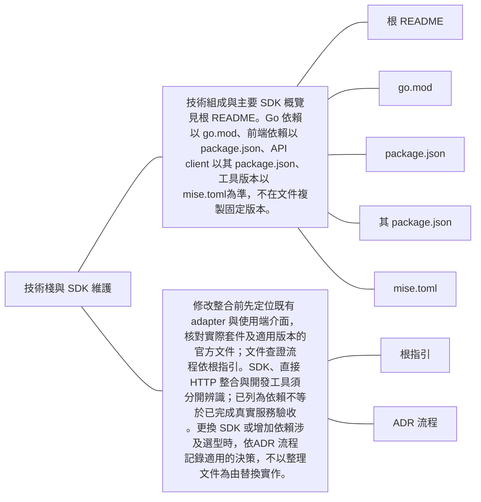
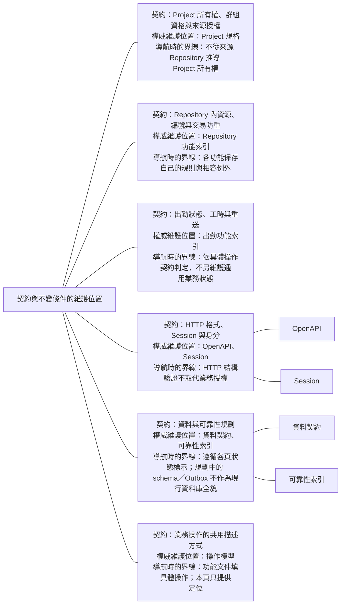
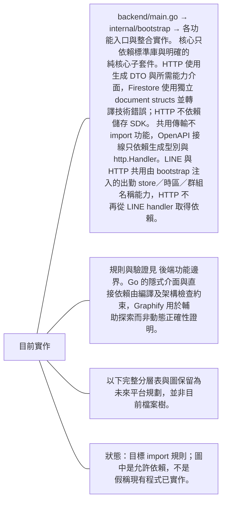
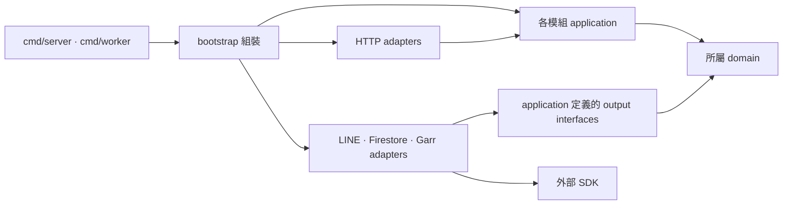
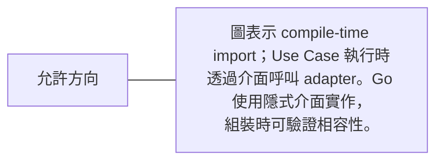
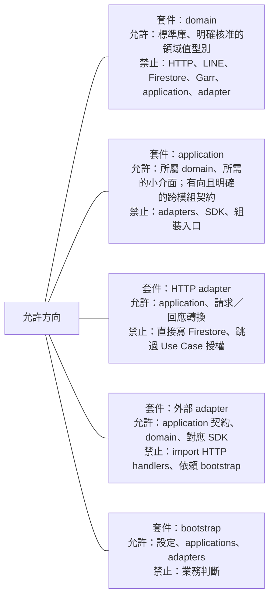
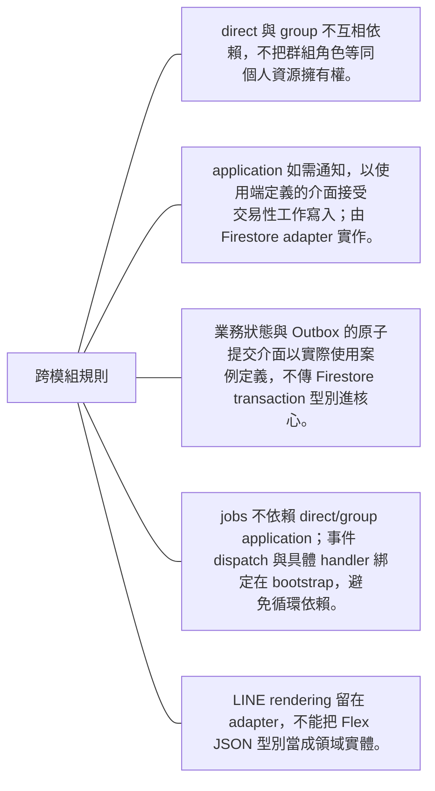
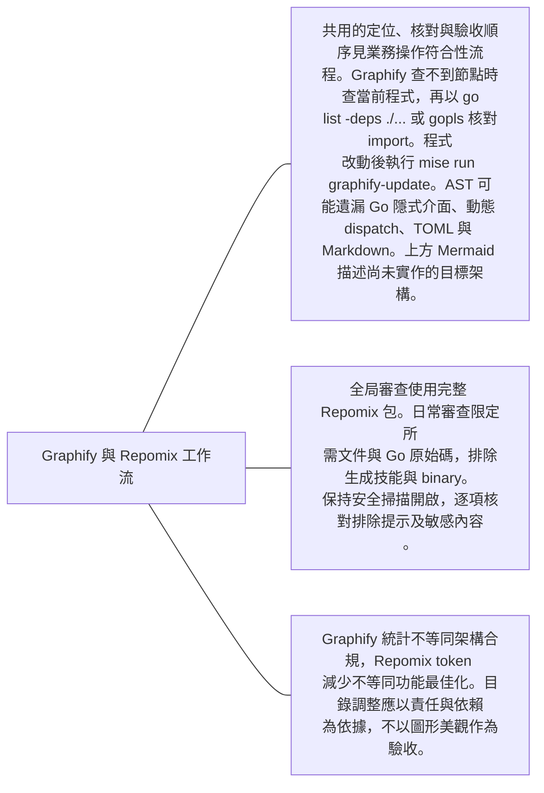

# 套件依賴與圖譜

```mermaid
flowchart LR
  h["技術棧與 SDK 維護"]
  h --- n0["技術組成與主要 SDK 概覽見根 README。Go 依賴<br/>以 go.mod、前端依賴以 package.json、API <br/>client 以其 package.json、工具版本以 <br/>mise.toml為準，不在文件複製固定版本。"]
  n0 --- n0l0["根 README"]
  click n0l0 "../../../README.md#技術棧與-sdk"
  n0 --- n0l1["go.mod"]
  click n0l1 "../../../backend/go.mod"
  n0 --- n0l2["package.json"]
  click n0l2 "../../../frontend/miniapp/package.json"
  n0 --- n0l3["其 package.json"]
  click n0l3 "../../../api/client/package.json"
  n0 --- n0l4["mise.toml"]
  click n0l4 "../../../mise.toml"
  h --- n1["修改整合前先定位既有 adapter 與使用端介面，<br/>核對實際套件及適用版本的官方文件；文件查證流<br/>程依根指引。SDK、直接 HTTP 整合與開發工具須<br/>分開辨識；已列為依賴不等於已完成真實服務驗收<br/>。更換 SDK 或增加依賴涉及選型時，依ADR 流程<br/>記錄適用的決策，不以整理文件為由替換實作。"]
  n1 --- n1l0["根指引"]
  click n1l0 "../../../AGENTS.md#mandatory-documentation-verification"
  n1 --- n1l1["ADR 流程"]
  click n1l1 "../README.md#architecture-decision-records"
```

```mermaid
flowchart LR
  h["契約與不變條件的維護位置"]
  h --- n0["契約：Project 所有權、群組資格與來源授權<br/>權威維護位置：Project 規格<br/>導航時的界線：不從來源 Repository 推導 <br/>Project 所有權"]
  click n0 "../../domains/project/project.md"
  h --- n1["契約：Repository 內資源、編號與交易防重<br/>權威維護位置：Repository 功能索引<br/>導航時的界線：各功能保存自己的規則與相容例外"]
  click n1 "../../domains/README.md#儲存庫"
  h --- n2["契約：出勤狀態、工時與重送<br/>權威維護位置：出勤功能索引<br/>導航時的界線：依具體操作契約判定，不另維護通<br/>用業務狀態"]
  click n2 "../../domains/README.md#出勤"
  h --- n3["契約：HTTP 格式、Session 與身分<br/>權威維護位置：OpenAPI、Session<br/>導航時的界線：HTTP 結構驗證不取代業務授權"]
  n3 --- n3l0["OpenAPI"]
  click n3l0 "../../../api/README.md"
  n3 --- n3l1["Session"]
  click n3l1 "../../contracts/identity.md"
  h --- n4["契約：資料與可靠性規劃<br/>權威維護位置：資料契約、可靠性索引<br/>導航時的界線：遵循各頁狀態標示；規劃中的 <br/>schema／Outbox 不作為現行資料庫全貌"]
  n4 --- n4l0["資料契約"]
  click n4l0 "../../proposals/firestore-data-contracts.md"
  n4 --- n4l1["可靠性索引"]
  click n4l1 "../README.md#可靠性設計參考"
  h --- n5["契約：業務操作的共用描述方式<br/>權威維護位置：操作模型<br/>導航時的界線：功能文件填具體操作；本頁只提供<br/>定位"]
  click n5 "../../contracts/business-operations.md"
```

```mermaid
flowchart LR
  h["目前實作"]
  h --- n0["backend/main.go → internal/bootstrap → 各功<br/>能入口與整合實作。 核心只依賴標準庫與明確的<br/>純核心子套件。HTTP 使用生成 DTO 與所需能力介<br/>面，Firestore 使用獨立 document structs 並轉<br/>譯技術錯誤；HTTP 不依賴儲存 SDK。 共用傳輸不<br/> import 功能，OpenAPI 接線只依賴生成型別與 <br/>http.Handler。LINE 與 HTTP 共用由 bootstrap 注<br/>入的出勤 store／時區／群組名稱能力，HTTP 不<br/>再從 LINE handler 取得依賴。"]
  h --- n1["規則與驗證見 後端功能邊界。Go 的隱式介面與直<br/>接依賴由編譯及架構檢查約束，Graphify 用於輔<br/>助探索而非動態正確性證明。"]
  click n1 "backend-boundaries.md"
  h --- n2["以下完整分層表與圖保留為未來平台規劃，並非目<br/>前檔案樹。"]
  h --- n3["狀態：目標 import 規則；圖中是允許依賴，不是<br/>假稱現有程式已實作。"]
```

## 允許方向

未來設計

```mermaid
flowchart LR
  CMD[cmd/server · cmd/worker] --> BOOT[bootstrap 組裝]
  BOOT --> HTTP[HTTP adapters]
  BOOT --> APP[各模組 application]
  BOOT --> OUT[LINE · Firestore · Garr adapters]
  HTTP --> APP
  OUT --> PORT[application 定義的 output interfaces]
  APP --> DOMAIN[所屬 domain]
  PORT --> DOMAIN
  OUT --> SDK[外部 SDK]
```

```mermaid
flowchart LR
  h["允許方向"]
  h --- n0["圖表示 compile-time import；Use Case 執行時<br/>透過介面呼叫 adapter。Go 使用隱式介面實作，<br/>組裝時可驗證相容性。"]
```

```mermaid
flowchart LR
  h["允許方向"]
  h --- n0["套件：domain<br/>允許：標準庫、明確核准的領域值型別<br/>禁止：HTTP、LINE、Firestore、Garr、<br/>application、adapter"]
  h --- n1["套件：application<br/>允許：所屬 domain、所需的小介面；有向且明確<br/>的跨模組契約<br/>禁止：adapters、SDK、組裝入口"]
  h --- n2["套件：HTTP adapter<br/>允許：application、請求／回應轉換<br/>禁止：直接寫 Firestore、跳過 Use Case 授權"]
  h --- n3["套件：外部 adapter<br/>允許：application 契約、domain、對應 SDK<br/>禁止：import HTTP handlers、依賴 bootstrap"]
  h --- n4["套件：bootstrap<br/>允許：設定、applications、adapters<br/>禁止：業務判斷"]
```

```mermaid
flowchart LR
  h["跨模組規則"]
  h --- n0["direct 與 group 不互相依賴，不把群組角色等同<br/>個人資源擁有權。"]
  h --- n1["application 如需通知，以使用端定義的介面接受<br/>交易性工作寫入；由 Firestore adapter 實作。"]
  h --- n2["業務狀態與 Outbox 的原子提交介面以實際使用案<br/>例定義，不傳 Firestore transaction 型別進核<br/>心。"]
  h --- n3["jobs 不依賴 direct/group application；事件 <br/>dispatch 與具體 handler 綁定在 bootstrap，避<br/>免循環依賴。"]
  h --- n4["LINE rendering 留在 adapter，不能把 Flex <br/>JSON 型別當成領域實體。"]
```

```mermaid
flowchart LR
  h["Graphify 與 Repomix 工作流"]
  h --- n0["共用的定位、核對與驗收順序見業務操作符合性流<br/>程。Graphify 查不到節點時查當前程式，再以 go<br/> list -deps ./... 或 gopls 核對 import。程式<br/>改動後執行 mise run graphify-update。AST 可<br/>能遺漏 Go 隱式介面、動態 dispatch、TOML 與 <br/>Markdown。上方 Mermaid 描述尚未實作的目標架<br/>構。"]
  click n0 "../../development/workflow.md#business-operation-compliance"
  h --- n1["全局審查使用完整 Repomix 包。日常審查限定所<br/>需文件與 Go 原始碼，排除生成技能與 binary。<br/>保持安全掃描開啟，逐項核對排除提示及敏感內容<br/>。"]
  h --- n2["Graphify 統計不等同架構合規，Repomix token <br/>減少不等同功能最佳化。目錄調整應以責任與依賴<br/>為依據，不以圖形美觀作為驗收。"]
```
