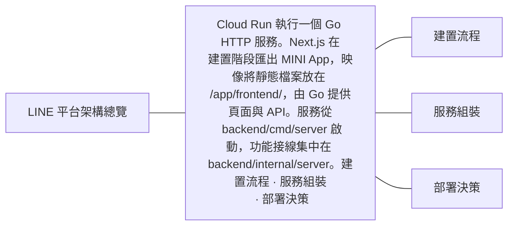
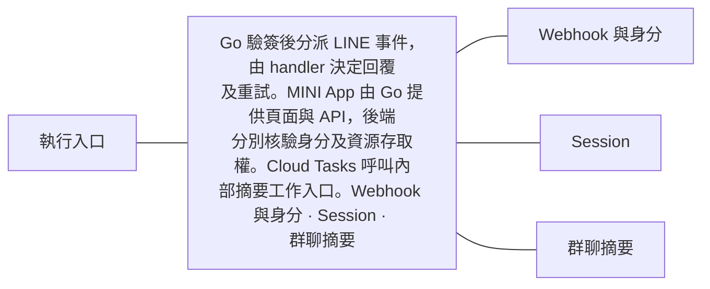
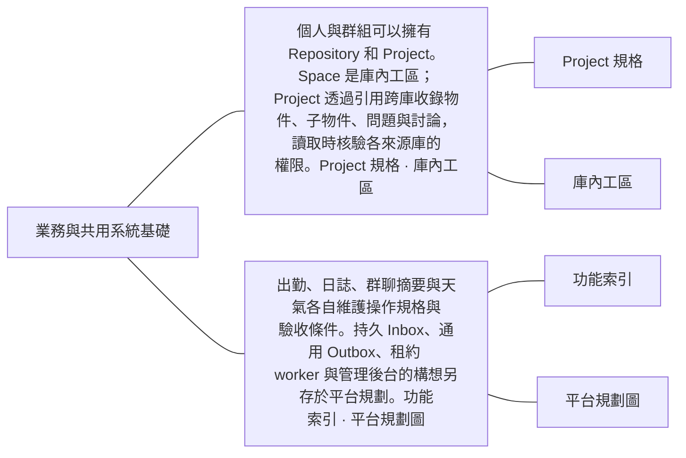
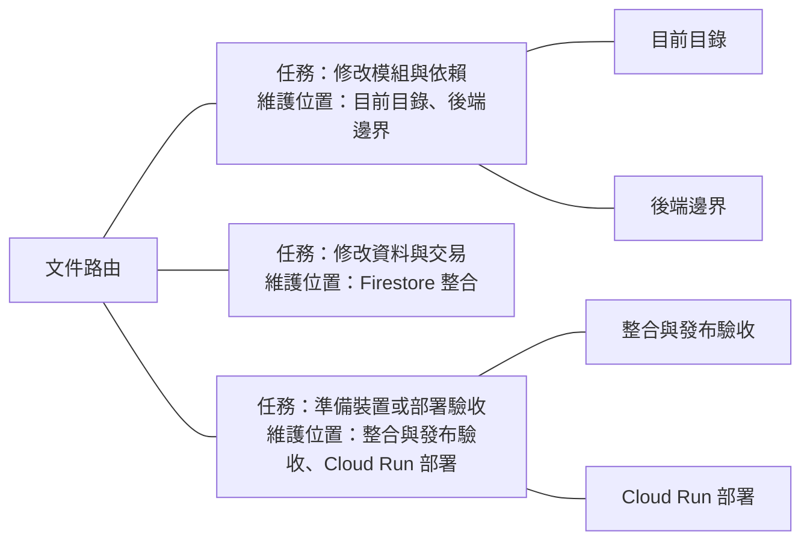

# line-平台架構總覽

```mermaid
flowchart LR
  h["LINE 平台架構總覽"]
  h --- n0["Cloud Run 執行一個 Go HTTP 服務。Next.js 在<br/>建置階段匯出 MINI App，映像將靜態檔案放在 <br/>/app/frontend/，由 Go 提供頁面與 API。服務從<br/> backend/cmd/server 啟動，功能接線集中在 <br/>backend/internal/server。建置流程 · 服務組裝<br/> · 部署決策"]
  n0 --- n0l0["建置流程"]
  click n0l0 "../../../Dockerfile"
  n0 --- n0l1["服務組裝"]
  click n0l1 "../../../backend/internal/server/server.go"
  n0 --- n0l2["部署決策"]
  click n0l2 "../../decisions/0003-cloud-run-primary.md"
```

## 執行入口

現行實作

```mermaid
architecture-beta
  group run(cloud)[Cloud Run]
  service line(internet)[LINE Webhook]
  service mini(internet)[MINI App Browser]
  service tasks(server)[Cloud Tasks]
  service api(server)[Go HTTP Service] in run
  service assets(disk)[Next.js Static Export] in run
  line:R --> L:api
  mini:B --> T:api
  tasks:R --> L:api
  api:R -- L:assets
```

```mermaid
flowchart LR
  h["執行入口"]
  h --- n0["Go 驗簽後分派 LINE 事件，由 handler 決定回覆<br/>及重試。MINI App 由 Go 提供頁面與 API，後端<br/>分別核驗身分及資源存取權。Cloud Tasks 呼叫內<br/>部摘要工作入口。Webhook 與身分 · Session · <br/>群聊摘要"]
  n0 --- n0l0["Webhook 與身分"]
  click n0l0 "../contracts/http.md"
  n0 --- n0l1["Session"]
  click n0l1 "../identity/browser-session.md"
  n0 --- n0l2["群聊摘要"]
  click n0l2 "../../domains/summary/summary.md"
```

```mermaid
flowchart LR
  h["業務與共用系統基礎"]
  h --- n0["個人與群組可以擁有 Repository 和 Project。<br/>Space 是庫內工區；Project 透過引用跨庫收錄物<br/>件、子物件、問題與討論，讀取時核驗各來源庫的<br/>權限。Project 規格 · 庫內工區"]
  n0 --- n0l0["Project 規格"]
  click n0l0 "../../domains/project/project.md"
  n0 --- n0l1["庫內工區"]
  click n0l1 "../../domains/repository/spaces.md"
  h --- n1["出勤、日誌、群聊摘要與天氣各自維護操作規格與<br/>驗收條件。持久 Inbox、通用 Outbox、租約 <br/>worker 與管理後台的構想另存於平台規劃。功能<br/>索引 · 平台規劃圖"]
  n1 --- n1l0["功能索引"]
  click n1l0 "../../domains/README.md"
  n1 --- n1l1["平台規劃圖"]
  click n1l1 "../../proposals/platform/package-layout.md#後續平台擴充參考流程"
```

```mermaid
flowchart LR
  h["文件路由"]
  h --- n0["任務：修改模組與依賴<br/>維護位置：目前目錄、後端邊界"]
  n0 --- n0l0["目前目錄"]
  click n0l0 "code-layout.md"
  n0 --- n0l1["後端邊界"]
  click n0l1 "backend-boundaries.md"
  h --- n1["任務：修改資料與交易<br/>維護位置：Firestore 整合"]
  click n1 "../storage/firestore.md"
  h --- n2["任務：準備裝置或部署驗收<br/>維護位置：整合與發布驗收、Cloud Run 部署"]
  n2 --- n2l0["整合與發布驗收"]
  click n2l0 "../../guides/release/release-acceptance.md"
  n2 --- n2l1["Cloud Run 部署"]
  click n2l1 "../../guides/release/cloud-run.md"
```

## 文件路由

[與現況比較時可對照工程平台目標架構。](../../proposals/line-engineering/README.md#一完整系統總架構)
