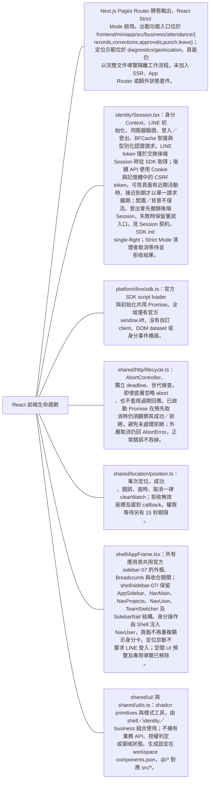
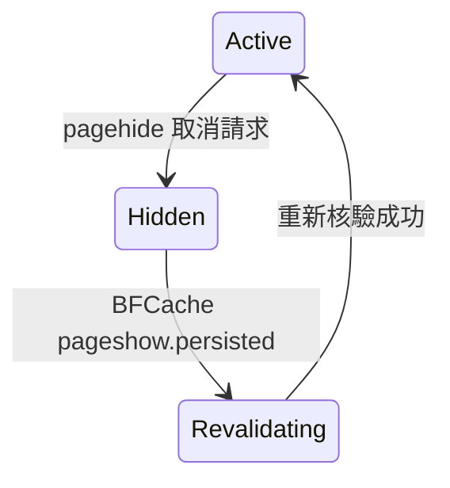
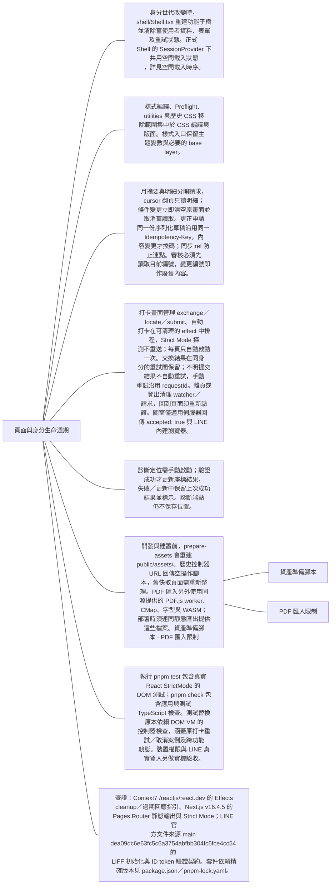

# react-前端生命週期

```mermaid
flowchart LR
  h["React 前端生命週期"]
  h --- n0["Next.js Pages Router 靜態輸出，React Strict <br/>Mode 啟用。出勤功能入口位於 <br/>frontend/miniapp/src/business/attendance/{<br/>records,corrections,approvals,punch,leave}；<br/>定位示範位於 diagnostics/geolocation。頁面仍<br/>以完整文件導覽隔離工作流程，未加入 SSR、App <br/>Router 或額外狀態套件。"]
  h --- n1["identity/Session.tsx：身分 Context、LINE 初<br/>始化、伺服器驗證、登入／登出、BFCache 恢復與<br/>型別化認證請求。LINE token 僅於交換後端 <br/>Session 時從 SDK 取得；後續 API 使用 Cookie <br/>與記憶體中的 CSRF token。可見頁面有近期活動<br/>時，接近到期才以單一請求續期；閒置／背景不保<br/>活。登出會先撤銷後端 Session，失敗時保留重試<br/>入口。見 Session 契約。SDK init <br/>single-flight；Strict Mode 清理會取消等待並<br/>拒收結果。"]
  click n1 "../identity/browser-session.md"
  h --- n2["platform/line/sdk.ts：官方 SDK script loader<br/> 與初始化共用 Promise。全域僅有官方 <br/>window.liff，沒有自訂 client、DOM dataset 或<br/>身分事件橋接。"]
  h --- n3["shared/http/lifecycle.ts：AbortController、<br/>獨立 deadline、世代檢查。即使底層忽略 abort<br/>，也不套用過期回應。已啟動 Promise 在預先取<br/>消時仍須觀察其成功／拒絕，避免未處理拒絕；外<br/>層取消仍回 AbortError，正常錯誤不吞掉。"]
  h --- n4["shared/location/position.ts：單次定位，成功<br/>、錯誤、逾時、取消一律 clearWatch；拒收無效<br/>座標及遲到 callback。權限等待另有 15 秒期限<br/>。"]
  h --- n5["shell/AppFrame.tsx：所有應用頁共用官方 <br/>sidebar-07 的外框、Breadcrumb 與收合開關；<br/>shell/sidebar-07/ 保留 AppSidebar、NavMain、<br/>NavProjects、NavUser、TeamSwitcher 及 <br/>SidebarRail 結構。身分操作由 Shell 注入 <br/>NavUser，頁面不再重複顯示身分卡。定位診斷不<br/>要求 LINE 登入；空間 UI 預覽及專用導覽已移除<br/>。"]
  h --- n6["shared/ui/ 與 shared/utils.ts：shadcn <br/>primitives 與樣式工具，由 shell／identity／<br/>business 組合使用；不擁有業務 API、授權判定<br/>或領域狀態。生成設定在 workspace <br/>components.json，@/* 對應 src/*。"]
```

## 頁面與身分生命週期

現行實作

```mermaid
stateDiagram-v2
  Active --> Hidden: pagehide 取消請求
  Hidden --> Revalidating: BFCache pageshow.persisted
  Revalidating --> Active: 重新核驗成功
```

```mermaid
flowchart LR
  h["頁面與身分生命週期"]
  h --- n0["身分世代改變時，shell/Shell.tsx 重建功能子樹<br/>並清除舊使用者資料、表單及重試狀態。正式 <br/>Shell 的 SessionProvider 下共用空間載入狀態<br/>，詳見空間載入時序。"]
  click n0 "../../domains/repository/README.md#空間載入時序"
  h --- n1["樣式編譯、Preflight、utilities 與歷史 CSS 移<br/>除範圍集中於 CSS 編譯與版面。樣式入口保留主<br/>題變數與必要的 base layer。"]
  click n1 "../../tooling/mcp/shadcn.md#css-編譯與版面"
  h --- n2["月摘要與明細分開請求，cursor 翻頁只讀明細；<br/>條件變更立即清空原畫面並取消舊讀取。更正申請<br/>同一份序列化草稿沿用同一 Idempotency-Key，內<br/>容變更才換碼；同步 ref 防止連點。審核必須先<br/>讀取目前編號，變更編號即作廢舊內容。"]
  h --- n3["打卡畫面管理 exchange／locate／submit。自動<br/>打卡在可清理的 effect 中排程，Strict Mode 探<br/>測不重送；每頁只自動啟動一次。交換結果在同身<br/>分的重試間保留；不明提交結果不自動重試，手動<br/>重試沿用 requestId。離頁或登出清理 watcher／<br/>請求，回到頁面須重新驗證。關窗僅適用伺服器回<br/>傳 accepted: true 與 LINE 內建瀏覽器。"]
  h --- n4["診斷定位需手動啟動；驗證成功才更新座標結果，<br/>失敗／更新中保留上次成功結果並標示。診斷端點<br/>仍不保存位置。"]
  h --- n5["開發與建置前，prepare-assets 會重建 <br/>public/assets/。歷史控制器 URL 回傳空操作腳<br/>本，舊快取頁面需重新整理。PDF 匯入另外使用同<br/>源提供的 PDF.js worker、CMap、字型與 WASM；<br/>部署時須連同靜態匯出提供這些檔案。資產準備腳<br/>本 · PDF 匯入限制"]
  n5 --- n5l0["資產準備腳本"]
  click n5l0 "../../../scripts/tooling/prepare-miniapp-assets.mts"
  n5 --- n5l1["PDF 匯入限制"]
  click n5l1 "../../domains/repository/object-imports.md"
  h --- n6["執行 pnpm test 包含真實 React StrictMode 的 <br/>DOM 測試；pnpm check 包含應用與測試 <br/>TypeScript 檢查。測試替換原本依賴 DOM VM 的<br/>控制器檢查，涵蓋原打卡重試／取消案例及跨功能<br/>競態。裝置權限與 LINE 真實登入另做實機驗收。"]
  h --- n7["查證：Context7 /reactjs/react.dev 的 Effects<br/> cleanup／過期回應指引、Next.js v16.4.5 的 <br/>Pages Router 靜態輸出與 Strict Mode；LINE 官<br/>方文件來源 main <br/>dea09dc6e63fc5c6a3754abfbb304fc6fce4cc54 的 <br/>LIFF 初始化與 ID token 驗證契約。套件依賴精<br/>確版本見 package.json／pnpm-lock.yaml。"]
```
