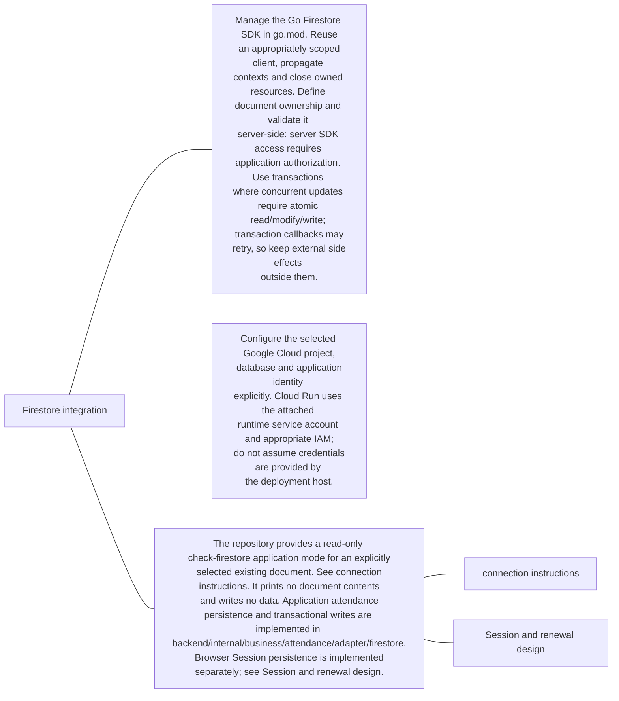
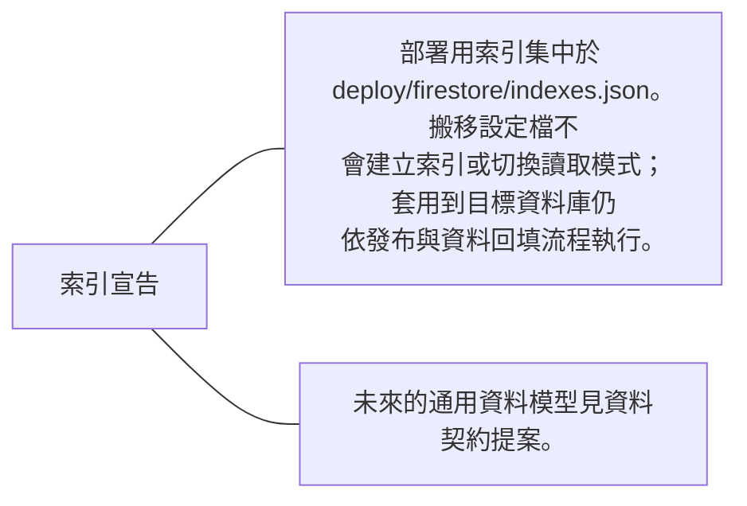

# firestore-integration

```mermaid
flowchart LR
  h["Firestore integration"]
  h --- n0["Manage the Go Firestore SDK in go.mod. Reuse<br/> an appropriately scoped client, propagate <br/>contexts and close owned resources. Define <br/>document ownership and validate it <br/>server-side: server SDK access requires <br/>application authorization. Use transactions <br/>where concurrent updates require atomic <br/>read/modify/write; transaction callbacks may<br/> retry, so keep external side effects <br/>outside them."]
  h --- n1["Configure the selected Google Cloud project,<br/> database and application identity <br/>explicitly. Cloud Run uses the attached <br/>runtime service account and appropriate IAM;<br/> do not assume credentials are provided by <br/>the deployment host."]
  h --- n2["The repository provides a read-only <br/>check-firestore application mode for an explicitly<br/> selected existing document. See connection <br/>instructions. It prints no document contents<br/> and writes no data. Application attendance <br/>persistence and transactional writes are <br/>implemented in <br/>backend/internal/business/attendance/adapter/firestore.<br/> Browser Session persistence is implemented <br/>separately; see Session and renewal design."]
  n2 --- n2l0["connection instructions"]
  click n2l0 "../../guides/line-setup/README.md#firestore-唯讀連線"
  n2 --- n2l1["Session and renewal design"]
  click n2l1 "../identity/browser-session.md"
```

```mermaid
flowchart LR
  h["索引宣告"]
  h --- n0["部署用索引集中於 <br/>deploy/firestore/indexes.json。搬移設定檔不<br/>會建立索引或切換讀取模式；套用到目標資料庫仍<br/>依發布與資料回填流程執行。"]
  click n0 "../../../deploy/firestore/indexes.json"
  h --- n1["未來的通用資料模型見資料契約提案。"]
  click n1 "../../proposals/firestore-data-contracts.md#邏輯關係非資料庫外鍵"
```
