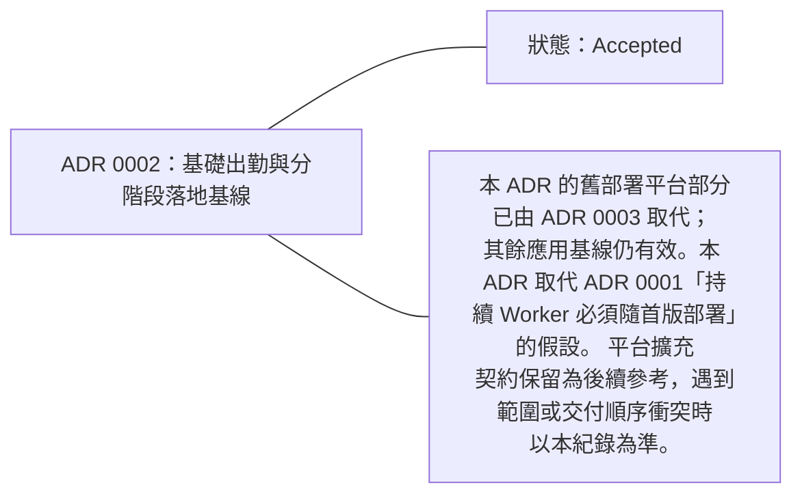
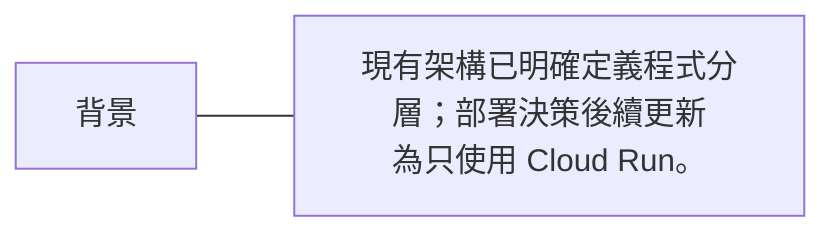
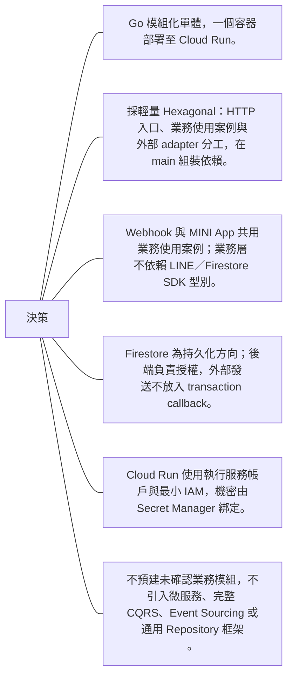
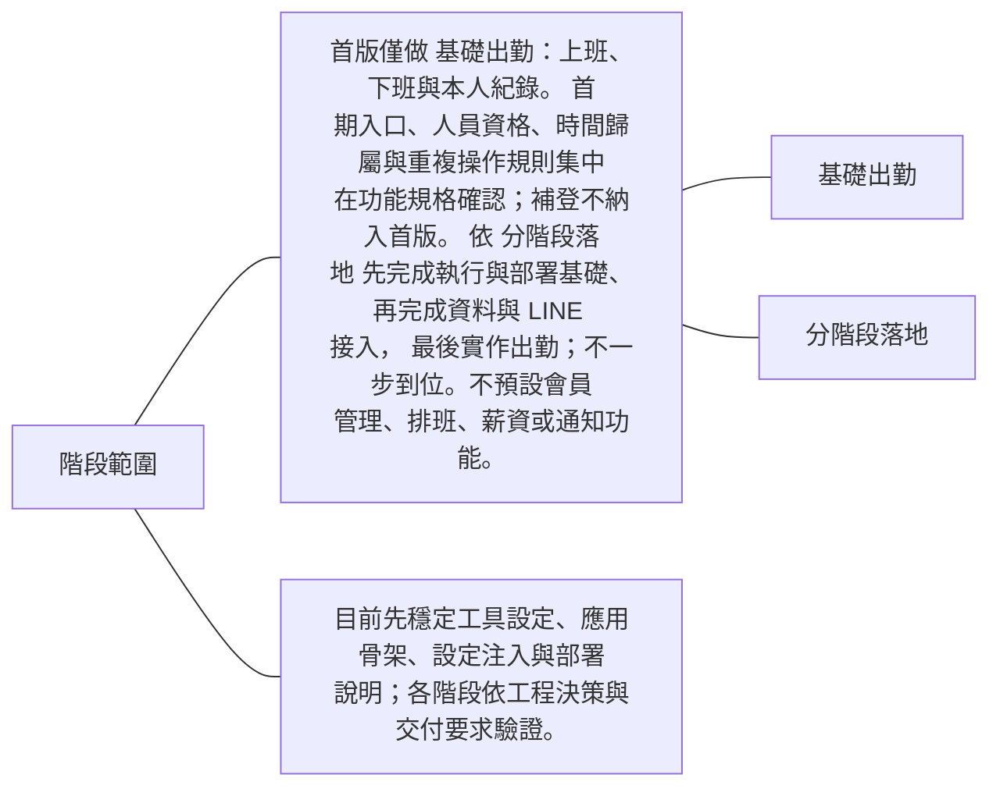
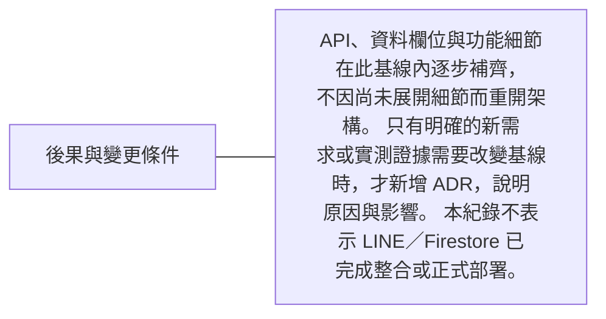
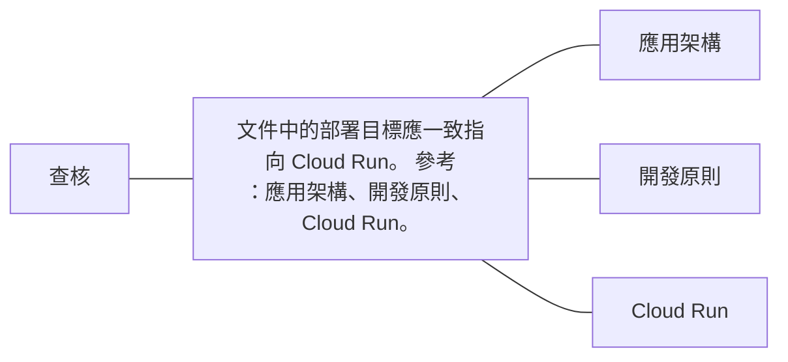

# adr-0002基礎出勤與分階段落地基線

```mermaid
flowchart LR
  h["ADR 0002：基礎出勤與分階段落地基線"]
  h --- n0["狀態：Accepted"]
  h --- n1["本 ADR 的舊部署平台部分已由 ADR 0003 取代； <br/>其餘應用基線仍有效。本 ADR 取代 ADR 0001「持<br/>續 Worker 必須隨首版部署」的假設。 平台擴充<br/>契約保留為後續參考，遇到範圍或交付順序衝突時<br/>以本紀錄為準。"]
  click n1 "0003-cloud-run-primary.md"
```

驗證政策以[工程決策與交付要求](../../AGENTS.md#工程決策與交付要求)為準。

```mermaid
flowchart LR
  h["背景"]
  h --- n0["現有架構已明確定義程式分層；部署決策後續更新<br/>為只使用 Cloud Run。"]
```

```mermaid
flowchart LR
  h["決策"]
  h --- n0["Go 模組化單體，一個容器部署至 Cloud Run。"]
  h --- n1["採輕量 Hexagonal：HTTP 入口、業務使用案例與<br/>外部 adapter 分工，在 main 組裝依賴。"]
  h --- n2["Webhook 與 MINI App 共用業務使用案例；業務層<br/>不依賴 LINE／Firestore SDK 型別。"]
  h --- n3["Firestore 為持久化方向；後端負責授權，外部發<br/>送不放入 transaction callback。"]
  h --- n4["Cloud Run 使用執行服務帳戶與最小 IAM，機密由<br/> Secret Manager 綁定。"]
  h --- n5["不預建未確認業務模組，不引入微服務、完整 <br/>CQRS、Event Sourcing 或通用 Repository 框架<br/>。"]
```

```mermaid
flowchart LR
  h["階段範圍"]
  h --- n0["首版僅做 基礎出勤：上班、下班與本人紀錄。 首<br/>期入口、人員資格、時間歸屬與重複操作規則集中<br/>在功能規格確認；補登不納入首版。 依 分階段落<br/>地 先完成執行與部署基礎、再完成資料與 LINE <br/>接入， 最後實作出勤；不一步到位。不預設會員<br/>管理、排班、薪資或通知功能。"]
  n0 --- n0l0["基礎出勤"]
  click n0l0 "../domains/attendance/README.md"
  n0 --- n0l1["分階段落地"]
  click n0l1 "../development/environment/verification.md"
  h --- n1["目前先穩定工具設定、應用骨架、設定注入與部署<br/>說明；各階段依工程決策與交付要求驗證。"]
```

```mermaid
flowchart LR
  h["後果與變更條件"]
  h --- n0["API、資料欄位與功能細節在此基線內逐步補齊，<br/>不因尚未展開細節而重開架構。 只有明確的新需<br/>求或實測證據需要改變基線時，才新增 ADR，說明<br/>原因與影響。 本紀錄不表示 LINE／Firestore 已<br/>完成整合或正式部署。"]
```

```mermaid
flowchart LR
  h["查核"]
  h --- n0["文件中的部署目標應一致指向 Cloud Run。 參考<br/>：應用架構、開發原則、 Cloud Run。"]
  n0 --- n0l0["應用架構"]
  click n0l0 "../architecture/runtime/overview.md"
  n0 --- n0l1["開發原則"]
  click n0l1 "../standards/engineering.md"
  n0 --- n0l2["Cloud Run"]
  click n0l2 "../operations/cloud-run.md"
```
