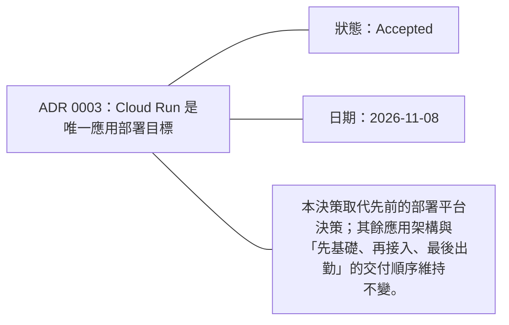
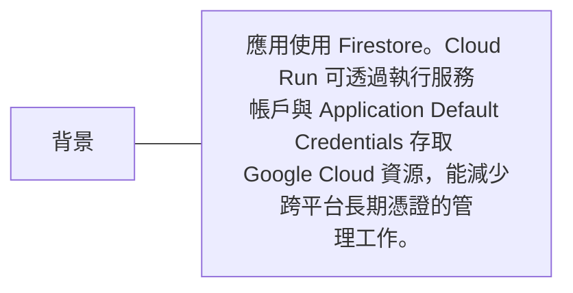
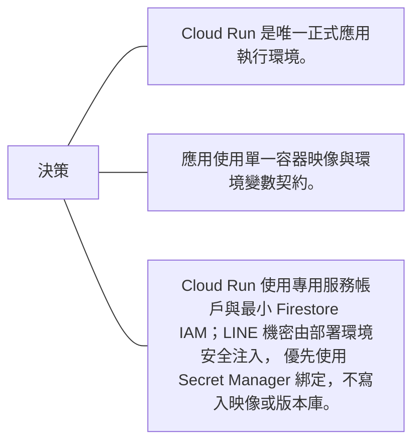
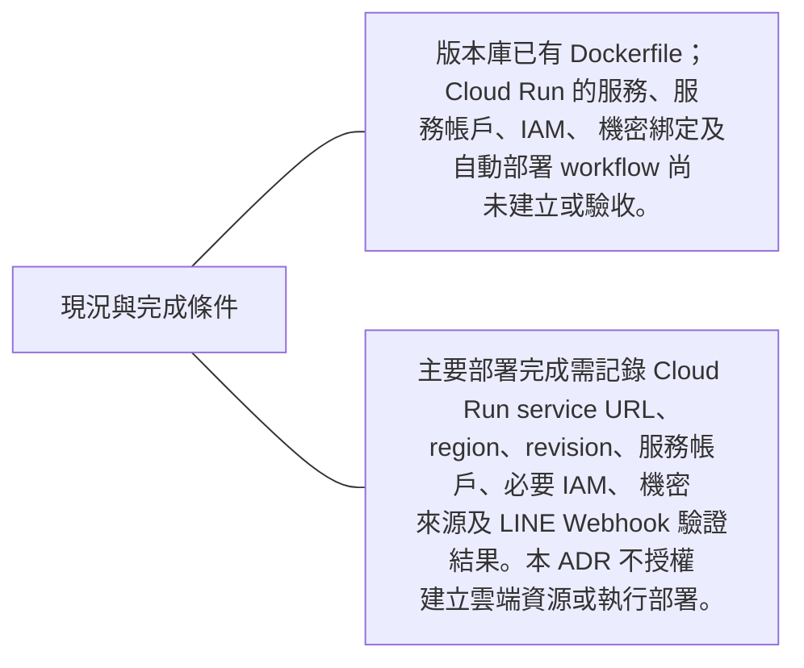

# adr-0003cloud-run-是唯一應用部署目標

```mermaid
flowchart LR
  h["ADR 0003：Cloud Run 是唯一應用部署目標"]
  h --- n0["狀態：Accepted"]
  h --- n1["日期：2026-11-08"]
  h --- n2["本決策取代先前的部署平台決策；其餘應用架構與<br/> 「先基礎、再接入、最後出勤」的交付順序維持<br/>不變。"]
```

```mermaid
flowchart LR
  h["背景"]
  h --- n0["應用使用 Firestore。Cloud Run 可透過執行服務<br/>帳戶與 Application Default Credentials 存取 <br/>Google Cloud 資源，能減少跨平台長期憑證的管<br/>理工作。"]
```

```mermaid
flowchart LR
  h["決策"]
  h --- n0["Cloud Run 是唯一正式應用執行環境。"]
  h --- n1["應用使用單一容器映像與環境變數契約。"]
  h --- n2["Cloud Run 使用專用服務帳戶與最小 Firestore <br/>IAM；LINE 機密由部署環境安全注入， 優先使用 <br/>Secret Manager 綁定，不寫入映像或版本庫。"]
```

```mermaid
flowchart LR
  h["現況與完成條件"]
  h --- n0["版本庫已有 Dockerfile；Cloud Run 的服務、服<br/>務帳戶、IAM、 機密綁定及自動部署 workflow 尚<br/>未建立或驗收。"]
  h --- n1["主要部署完成需記錄 Cloud Run service URL、<br/>region、revision、服務帳戶、必要 IAM、 機密<br/>來源及 LINE Webhook 驗證結果。本 ADR 不授權<br/>建立雲端資源或執行部署。"]
```
