# adr-0004前後端與-api-契約分離的-monorepo

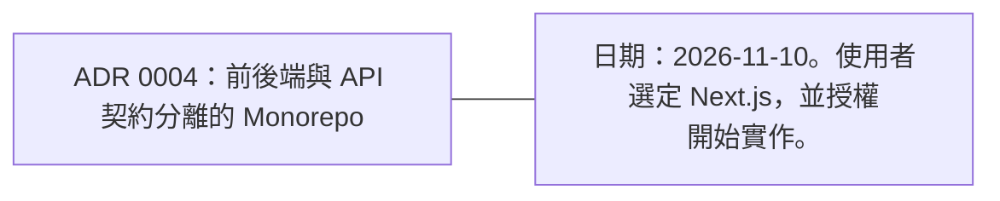
```mermaid
flowchart LR
  h["ADR 0004：前後端與 API 契約分離的 Monorepo"]
  h --- n0["日期：2026-11-10。使用者選定 Next.js，並授權<br/>開始實作。"]
```

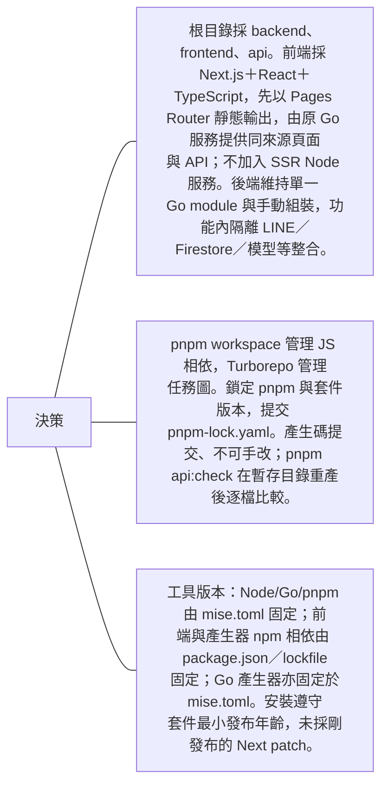
```mermaid
flowchart LR
  h["決策"]
  h --- n0["根目錄採 backend、frontend、api。前端採 <br/>Next.js＋React＋TypeScript，先以 Pages <br/>Router 靜態輸出，由原 Go 服務提供同來源頁面<br/>與 API；不加入 SSR Node 服務。後端維持單一 <br/>Go module 與手動組裝，功能內隔離 LINE／<br/>Firestore／模型等整合。"]
  h --- n1["pnpm workspace 管理 JS 相依，Turborepo 管理<br/>任務圖。鎖定 pnpm 與套件版本，提交 <br/>pnpm-lock.yaml。產生碼提交、不可手改；pnpm <br/>api:check 在暫存目錄重產後逐檔比較。"]
  h --- n2["工具版本：Node/Go/pnpm 由 mise.toml 固定；前<br/>端與產生器 npm 相依由 package.json／lockfile<br/> 固定；Go 產生器亦固定於 mise.toml。安裝遵守<br/>套件最小發布年齡，未採剛發布的 Next patch。"]
```

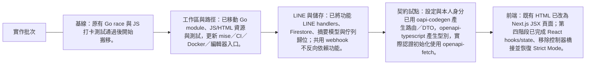
```mermaid
flowchart LR
  h["實作批次"]
  h --- n0["基線：原有 Go race 與 JS 打卡測試通過後開始<br/>搬移。"]
  n0 --> n1["工作區與路徑：已移動 Go module、JS/HTML 資源<br/>與測試，更新 mise／CI／Docker／編輯器入口。"]
  n1 --> n2["LINE 與儲存：已將功能 LINE handlers、<br/>Firestore、摘要模型與佇列歸位；共用 webhook <br/>不反向依賴功能。"]
  n2 --> n3["契約試點：設定與本人身分已用 oapi-codegen 產<br/>生路由／DTO，openapi-typescript 產生型別，實<br/>際認證初始化使用 openapi-fetch。"]
  n3 --> n4["前端：既有 HTML 已改為 Next.js JSX 頁面；第<br/>四階段已完成 React hooks/state、移除控制器橋<br/>接並恢復 Strict Mode。"]
```

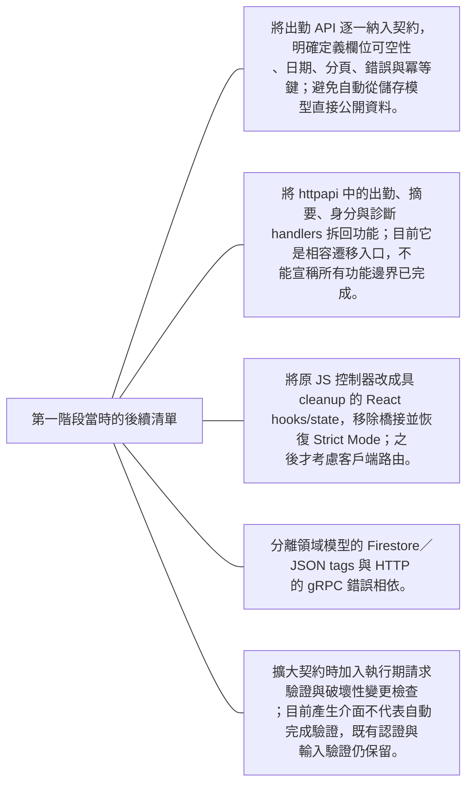
```mermaid
flowchart LR
  h["第一階段當時的後續清單"]
  h --- n0["將出勤 API 逐一納入契約，明確定義欄位可空性<br/>、日期、分頁、錯誤與冪等鍵；避免自動從儲存模<br/>型直接公開資料。"]
  h --- n1["將 httpapi 中的出勤、摘要、身分與診斷 <br/>handlers 拆回功能；目前它是相容遷移入口，不<br/>能宣稱所有功能邊界已完成。"]
  h --- n2["將原 JS 控制器改成具 cleanup 的 React <br/>hooks/state，移除橋接並恢復 Strict Mode；之<br/>後才考慮客戶端路由。"]
  h --- n3["分離領域模型的 Firestore／JSON tags 與 HTTP <br/>的 gRPC 錯誤相依。"]
  h --- n4["擴大契約時加入執行期請求驗證與破壞性變更檢查<br/>；目前產生介面不代表自動完成驗證，既有認證與<br/>輸入驗證仍保留。"]
```

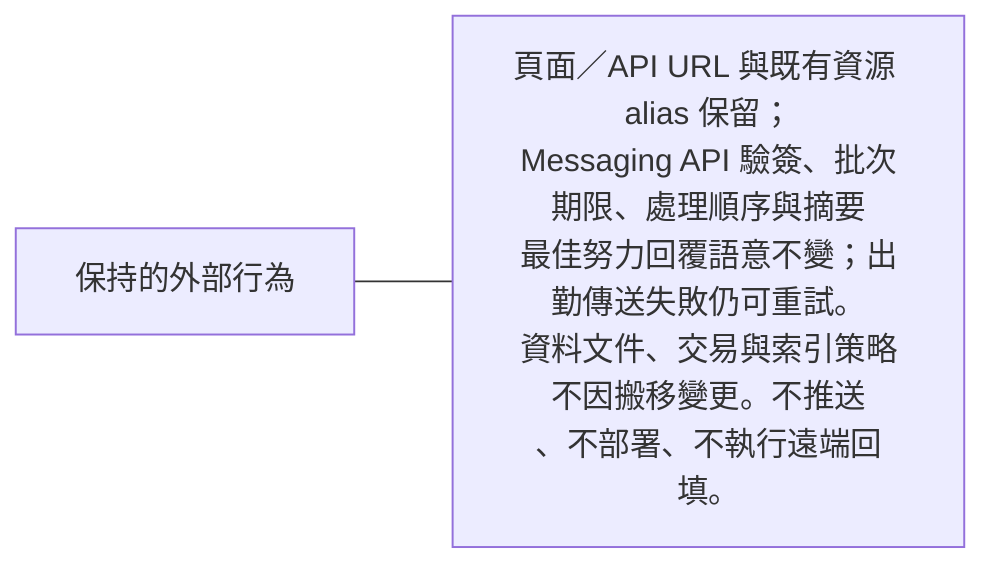
```mermaid
flowchart LR
  h["保持的外部行為"]
  h --- n0["頁面／API URL 與既有資源 alias 保留；<br/>Messaging API 驗簽、批次期限、處理順序與摘要<br/>最佳努力回覆語意不變；出勤傳送失敗仍可重試。<br/>資料文件、交易與索引策略不因搬移變更。不推送<br/>、不部署、不執行遠端回填。"]
```

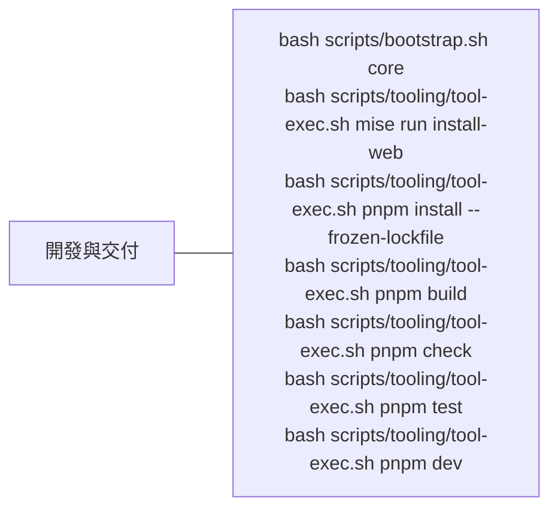
```mermaid
flowchart LR
  h["開發與交付"]
  h --- n0["bash scripts/bootstrap.sh core<br/>bash scripts/tooling/tool-exec.sh mise run install-web<br/>bash scripts/tooling/tool-exec.sh pnpm install --frozen-lockfile<br/>bash scripts/tooling/tool-exec.sh pnpm build<br/>bash scripts/tooling/tool-exec.sh pnpm check<br/>bash scripts/tooling/tool-exec.sh pnpm test<br/>bash scripts/tooling/tool-exec.sh pnpm dev"]
```

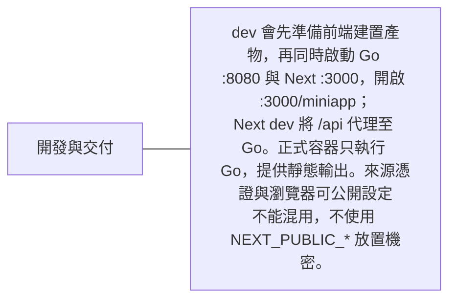
```mermaid
flowchart LR
  h["開發與交付"]
  h --- n0["dev 會先準備前端建置產物，再同時啟動 Go <br/>:8080 與 Next :3000，開啟 :3000/miniapp；<br/>Next dev 將 /api 代理至 Go。正式容器只執行 <br/>Go，提供靜態輸出。來源憑證與瀏覽器可公開設定<br/>不能混用，不使用 NEXT_PUBLIC_* 放置機密。"]
```

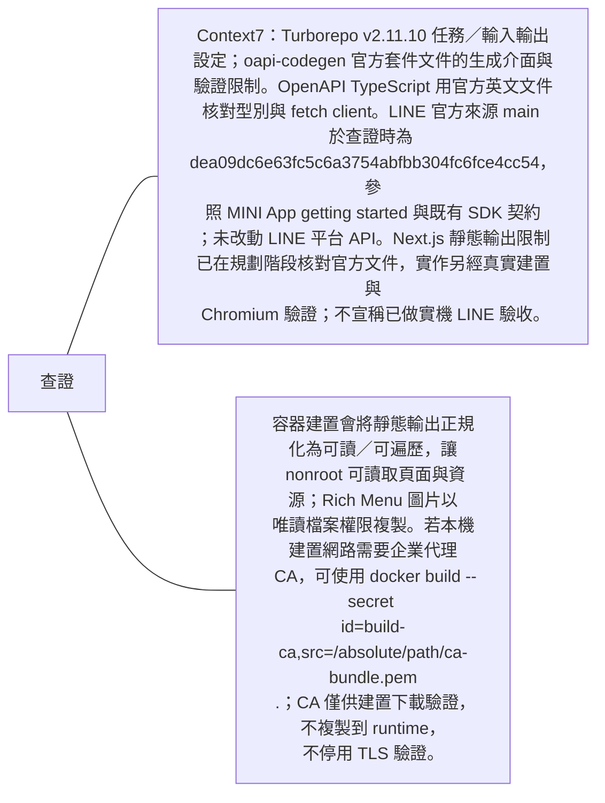
```mermaid
flowchart LR
  h["查證"]
  h --- n0["Context7：Turborepo v2.11.10 任務／輸入輸出<br/>設定；oapi-codegen 官方套件文件的生成介面與<br/>驗證限制。OpenAPI TypeScript 用官方英文文件<br/>核對型別與 fetch client。LINE 官方來源 main <br/>於查證時為 <br/>dea09dc6e63fc5c6a3754abfbb304fc6fce4cc54，參<br/>照 MINI App getting started 與既有 SDK 契約<br/>；未改動 LINE 平台 API。Next.js 靜態輸出限制<br/>已在規劃階段核對官方文件，實作另經真實建置與<br/> Chromium 驗證；不宣稱已做實機 LINE 驗收。"]
  h --- n1["容器建置會將靜態輸出正規化為可讀／可遍歷，讓<br/> nonroot 可讀取頁面與資源；Rich Menu 圖片以<br/>唯讀檔案權限複製。若本機建置網路需要企業代理<br/> CA，可使用 docker build --secret <br/>id=build-ca,src=/absolute/path/ca-bundle.pem<br/> .；CA 僅供建置下載驗證，不複製到 runtime，<br/>不停用 TLS 驗證。"]
```

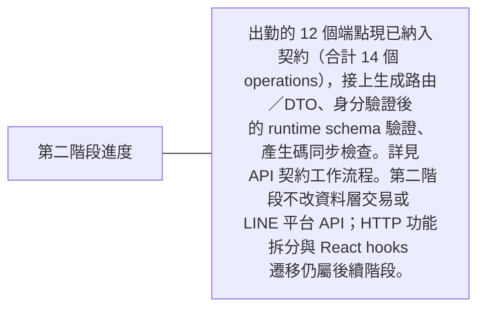
```mermaid
flowchart LR
  h["第二階段進度"]
  h --- n0["出勤的 12 個端點現已納入契約（合計 14 個 <br/>operations），接上生成路由／DTO、身分驗證後<br/>的 runtime schema 驗證、產生碼同步檢查。詳見<br/> API 契約工作流程。第二階段不改資料層交易或 <br/>LINE 平台 API；HTTP 功能拆分與 React hooks <br/>遷移仍屬後續階段。"]
  click n0 "../../api/README.md"
```

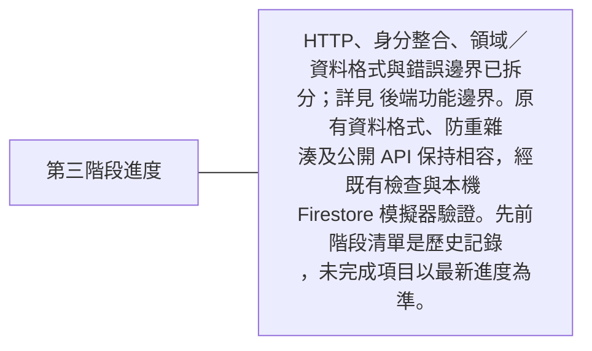
```mermaid
flowchart LR
  h["第三階段進度"]
  h --- n0["HTTP、身分整合、領域／資料格式與錯誤邊界已拆<br/>分；詳見 後端功能邊界。原有資料格式、防重雜<br/>湊及公開 API 保持相容，經既有檢查與本機 <br/>Firestore 模擬器驗證。先前階段清單是歷史記錄<br/>，未完成項目以最新進度為準。"]
  click n0 "../architecture/runtime/backend-boundaries.md"
```

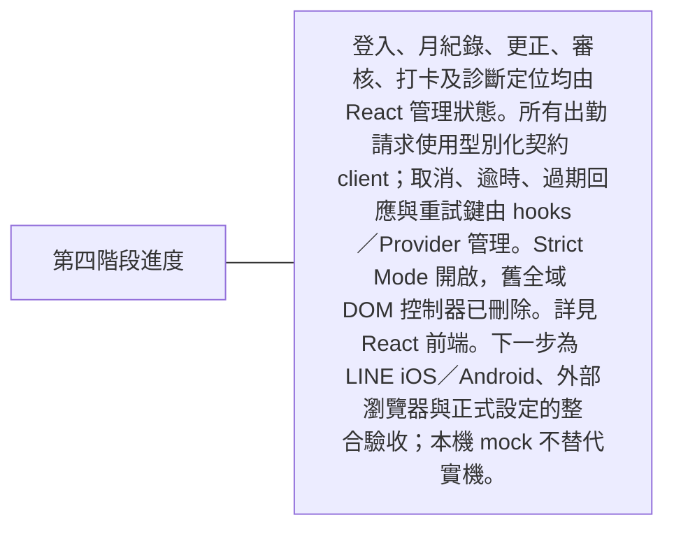
```mermaid
flowchart LR
  h["第四階段進度"]
  h --- n0["登入、月紀錄、更正、審核、打卡及診斷定位均由<br/> React 管理狀態。所有出勤請求使用型別化契約 <br/>client；取消、逾時、過期回應與重試鍵由 hooks<br/>／Provider 管理。Strict Mode 開啟，舊全域 <br/>DOM 控制器已刪除。詳見 React 前端。下一步為 <br/>LINE iOS／Android、外部瀏覽器與正式設定的整<br/>合驗收；本機 mock 不替代實機。"]
  click n0 "../architecture/runtime/react-lifecycle.md"
```
