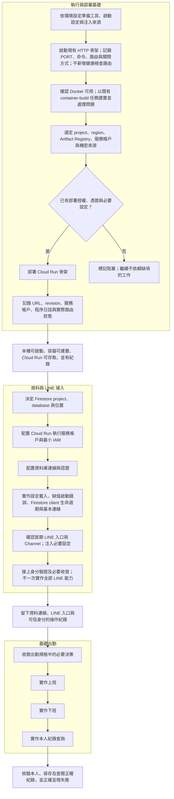
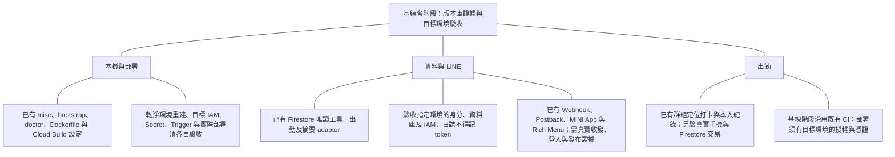

# 依環境設定準備工具、啟動設定與注入來源

```mermaid
flowchart TB
  subgraph phase0["執行與部署基礎"]
  ENV["依環境設定準備工具、啟動設定與注入來源"]
  ENV --> HTTP["啟動現有 HTTP 骨架；記錄 PORT、命令、路由與關閉方式；不新增健康檢查路由"]
  HTTP --> DOCKER["確認 Docker 可用；以既有 container-build 任務建置並處理問題"]
  DOCKER --> CONFIG["選定 project、region、Artifact Registry、服務帳戶與機密來源"]
  CONFIG --> READY{"已有部署授權、憑證與必要設定？"}
  READY -->|是| DEPLOY["部署 Cloud Run 骨架"]
  DEPLOY --> RECORD["記錄 URL、revision、服務帳戶、程序日誌與實際路由狀態"]
  READY -->|否| BLOCKED["標記阻塞；繼續不依賴缺項的工作"]
  end
  subgraph phase1["資料與 LINE 接入"]
  SCOPE["決定 Firestore project、database 與位置"]
  SCOPE --> IAM["配置 Cloud Run 執行服務帳戶與最小 IAM"]
  IAM --> CONNECT["配置資料庫連線與認證"]
  CONNECT --> APP["實作設定載入、缺值啟動錯誤、Firestore client 生命週期與基本連線"]
  APP --> LINE["確認首期 LINE 入口與 Channel；注入必要設定"]
  LINE --> AUTH["接上身分驗證及必要收發；不一次實作全部 LINE 能力"]
  end
  subgraph phase2["基礎出勤"]
  DECIDE["收斂出勤規格中的必要決策"] --> IN["實作上班"]
  IN --> OUT["實作下班"]
  OUT --> RECORDS["實作本人紀錄查詢"]
  end
  RECORD --> VERIFY1["本機可啟動、容器可建置、Cloud Run 可存取，並有紀錄"] --> SCOPE
  AUTH --> VERIFY2["留下資料連線、LINE 入口與可信身分的操作紀錄"] --> DECIDE
  RECORDS --> VERIFY3["核驗本人、保存及查閱正確紀錄，並正確呈現失敗"]
```

```mermaid
flowchart TB
  root["基線各階段：版本庫證據與目標環境驗收"]
  root --- b0["本機與部署"]
  b0 --- n0_0["已有 mise、bootstrap、doctor、Dockerfile 與 Cloud Build 設定"]
  b0 --- n0_1["乾淨環境重建、目標 IAM、Secret、Trigger 與實際部署須各自驗收"]
  root --- b1["資料與 LINE"]
  b1 --- n1_0["已有 Firestore 唯讀工具、出勤及摘要 adapter"]
  b1 --- n1_1["驗收指定環境的身分、資料庫及 IAM，日誌不得記 token"]
  b1 --- n1_2["已有 Webhook、Postback、MINI App 與 Rich Menu；需真實收發、登入與發布證據"]
  root --- b2["出勤"]
  b2 --- n2_0["已有群組定位打卡與本人紀錄；另驗真實手機與 Firestore 交易"]
  b2 --- n2_1["基線階段沿用既有 CI；部署須有目標環境的授權與憑證"]
```
