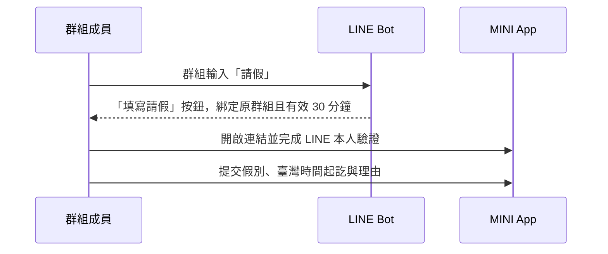
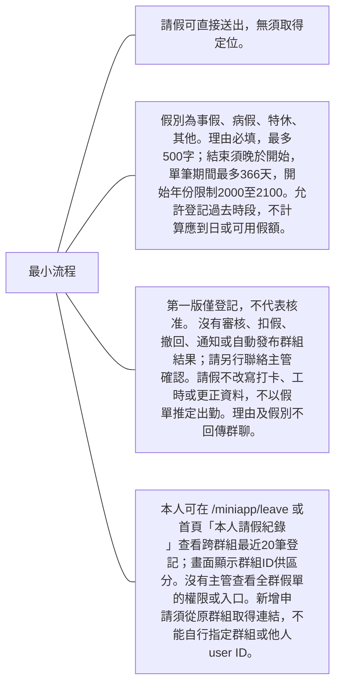
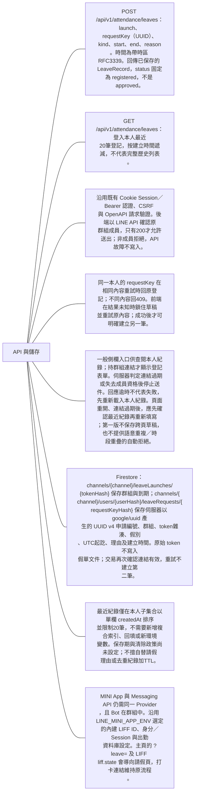
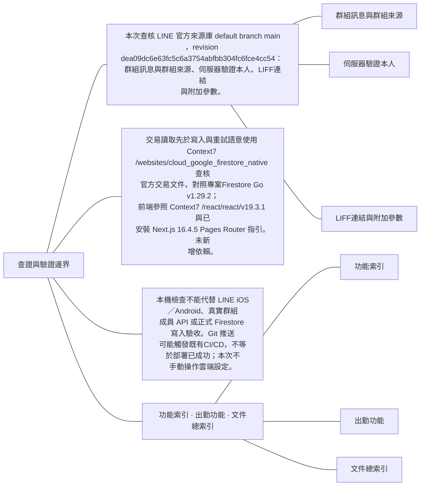
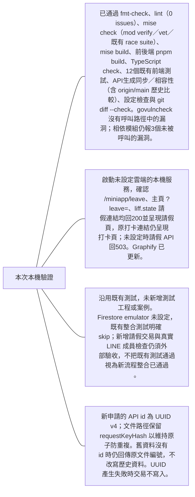

# 群組請假登記

## 最小流程

現行實作

```mermaid
sequenceDiagram
  participant U as 群組成員
  participant B as LINE Bot
  participant M as MINI App
  U->>B: 群組輸入「請假」
  B-->>U: 「填寫請假」按鈕，綁定原群組且有效 30 分鐘
  U->>M: 開啟連結並完成 LINE 本人驗證
  U->>M: 提交假別、臺灣時間起訖與理由
```

```mermaid
flowchart LR
  h["最小流程"]
  h --- n0["請假可直接送出，無須取得定位。"]
  h --- n1["假別為事假、病假、特休、其他。理由必填，最多<br/>500字；結束須晚於開始，單筆期間最多366天，開<br/>始年份限制2000至2100。允許登記過去時段，不計<br/>算應到日或可用假額。"]
  h --- n2["第一版僅登記，不代表核准。 沒有審核、扣假、<br/>撤回、通知或自動發布群組結果；請另行聯絡主管<br/>確認。請假不改寫打卡、工時或更正資料，不以假<br/>單推定出勤。理由及假別不回傳群聊。"]
  h --- n3["本人可在 /miniapp/leave 或首頁「本人請假紀錄<br/>」查看跨群組最近20筆登記；畫面顯示群組ID供區<br/>分。沒有主管查看全群假單的權限或入口。新增申<br/>請須從原群組取得連結，不能自行指定群組或他人<br/> user ID。"]
```

```mermaid
flowchart LR
  h["API 與儲存"]
  h --- n0["POST /api/v1/attendance/leaves：launch、<br/>requestKey（UUID）、kind、start、end、reason<br/>。時間為帶時區 RFC3339。回傳已保存的 <br/>LeaveRecord，status 固定為 registered，不是 <br/>approved。"]
  h --- n1["GET /api/v1/attendance/leaves：登入本人最近<br/>20筆登記，按建立時間遞減，不代表完整歷史列表<br/>。"]
  h --- n2["沿用既有 Cookie Session／Bearer 認證、CSRF <br/>與 OpenAPI 請求驗證。後端以 LINE API 確認原<br/>群組成員，只有200才允許送出；非成員拒絕，API<br/>故障不寫入。"]
  h --- n3["同一本人的 requestKey 在相同內容重試時回原登<br/>記；不同內容回409。前端在結果未知時鎖住草稿<br/>並重試原內容；成功後才可明確建立另一筆。"]
  h --- n4["一般側欄入口供查閱本人紀錄；持群組連結才顯示登記表單。伺服器判定連結過期或失去成員資格後停止送件。回應逾時不代表失敗，先重新載入本人紀錄。頁面<br/>重開、連結過期後，應先確認最近紀錄再重新填寫<br/>；第一版不保存跨頁草稿，也不提供語意重複／時<br/>段重疊的自動拒絕。"]
  h --- n5["Firestore：channels/{channel}/leaveLaunches/<br/>{tokenHash} 保存群組與到期；channels/{<br/>channel}/users/{userHash}/leaveRequests/{<br/>requestKeyHash} 保存伺服器以 google/uuid 產<br/>生的 UUID v4 申請編號、群組、token雜湊、假別<br/>、UTC起訖、理由及建立時間。原始 token 不寫入<br/>假單文件；交易再次確認連結有效，重試不建立第<br/>二筆。"]
  h --- n6["最近紀錄僅在本人子集合以單欄 createdAt 排序<br/>並限制20筆，不需要新增複合索引、回填或新環境<br/>變數。保存期與清除政策尚未設定；不擅自替請假<br/>理由或去重紀錄加TTL。"]
  h --- n7["MINI App 與 Messaging API 仍需同一 Provider<br/>，且 Bot 在群組中。沿用 LINE_MINI_APP_ENV 選定的內建 LIFF ID、身分／Session 與出勤<br/>資料庫設定。主頁的 ?leave= 及 LIFF <br/>liff.state 會導向請假頁，打卡連結維持原流程<br/>。"]
```

```mermaid
flowchart LR
  h["查證與驗證邊界"]
  h --- n0["本次查核 LINE 官方來源庫 default branch main<br/>，revision <br/>dea09dc6e63fc5c6a3754abfbb304fc6fce4cc54： <br/>群組訊息與群組來源、伺服器驗證本人、LIFF連結<br/>與附加參數。"]
  n0 --- n0l0["群組訊息與群組來源"]
  click n0l0 "https://developers.line.biz/en/docs/messaging-api/group-chats/"
  n0 --- n0l1["伺服器驗證本人"]
  click n0l1 "https://developers.line.biz/en/docs/liff/using-user-profile/"
  n0 --- n0l2["LIFF連結與附加參數"]
  click n0l2 "https://developers.line.biz/en/docs/liff/opening-liff-app/"
  h --- n1["交易讀取先於寫入與重試語意使用 Context7 <br/>/websites/cloud_google_firestore_native 查核<br/>官方交易文件，對照專案Firestore Go v1.29.2；<br/>前端參照 Context7 /react/react/v19.3.1 與已<br/>安裝 Next.js 16.4.5 Pages Router 指引。未新<br/>增依賴。"]
  click n1 "https://docs.cloud.google.com/firestore/native/docs/manage-data/transactions"
  h --- n2["本機檢查不能代替 LINE iOS／Android、真實群組<br/>成員 API 或正式 Firestore 寫入驗收。Git 推送<br/>可能觸發既有CI/CD，不等於部署已成功；本次不<br/>手動操作雲端設定。"]
  h --- n3["功能索引 · 出勤功能 · 文件總索引"]
  n3 --- n3l0["功能索引"]
  click n3l0 "../README.md"
  n3 --- n3l1["出勤功能"]
  click n3l1 "README.md"
  n3 --- n3l2["文件總索引"]
  click n3l2 "../../README.md"
```

```mermaid
flowchart LR
  h["本次本機驗證"]
  h --- n0["已通過 fmt-check、lint（0 issues）、mise <br/>check（mod verify／vet／既有 race suite）、<br/>mise build、前後端 pnpm build、TypeScript <br/>check、12個既有前端測試、API生成同步／相容性<br/>（含 origin/main 歷史比較）、設定檢查與 git <br/>diff --check。govulncheck 沒有呼叫路徑中的漏<br/>洞；相依模組仍報3個未被呼叫的漏洞。"]
  h --- n1["啟動未設定雲端的本機服務，確認 <br/>/miniapp/leave、主頁 ?leave=、liff.state 請<br/>假連結均回200並呈現請假頁，原打卡連結仍呈現<br/>打卡頁；未設定時請假 API 回503。Graphify 已<br/>更新。"]
  h --- n2["沿用既有測試，未新增測試工程或案例。<br/>Firestore emulator 未設定，既有整合測試明確 <br/>skip；新增請假交易與真實 LINE 成員檢查仍須外<br/>部驗收，不把既有測試通過視為新流程整合已通過<br/>。"]
  h --- n3["新申請的 API id 為 UUID v4；文件路徑保留 <br/>requestKeyHash 以維持原子防重複。舊資料沒有 <br/>id 時仍回傳原文件編號，不改寫歷史資料。UUID <br/>產生失敗時交易不寫入。"]
```
