# 出勤查詢與更正

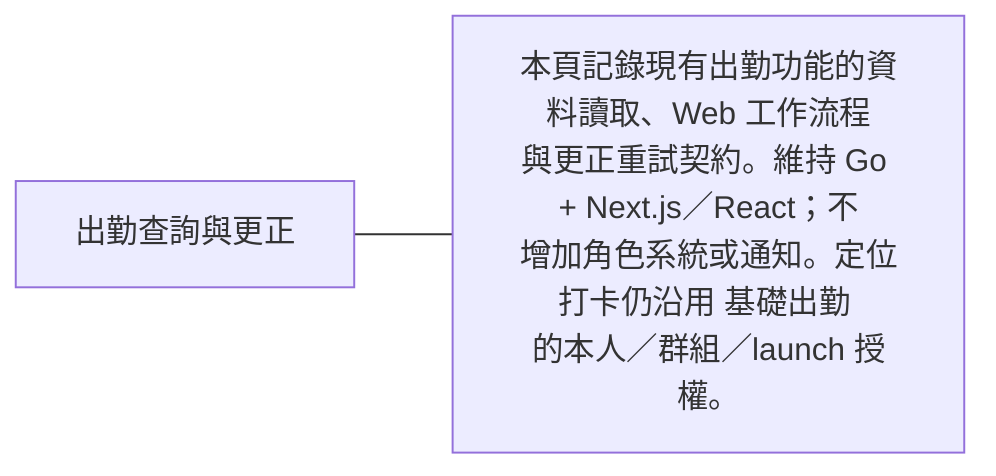
```mermaid
flowchart LR
  h["出勤查詢與更正"]
  h --- n0["本頁記錄現有出勤功能的資料讀取、Web 工作流程<br/>與更正重試契約。維持 Go + Next.js／React；不<br/>增加角色系統或通知。定位打卡仍沿用 基礎出勤 <br/>的本人／群組／launch 授權。"]
  click n0 "README.md"
```

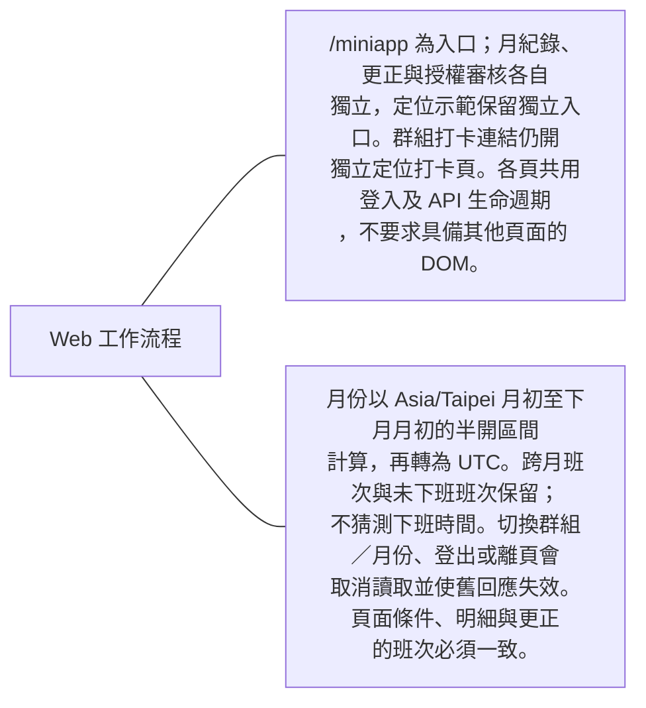
```mermaid
flowchart LR
  h["Web 工作流程"]
  h --- n0["/miniapp 為入口；月紀錄、更正與授權審核各自<br/>獨立，定位示範保留獨立入口。群組打卡連結仍開<br/>獨立定位打卡頁。各頁共用登入及 API 生命週期<br/>，不要求具備其他頁面的 DOM。"]
  h --- n1["月份以 Asia/Taipei 月初至下月月初的半開區間<br/>計算，再轉為 UTC。跨月班次與未下班班次保留；<br/>不猜測下班時間。切換群組／月份、登出或離頁會<br/>取消讀取並使舊回應失效。頁面條件、明細與更正<br/>的班次必須一致。"]
```

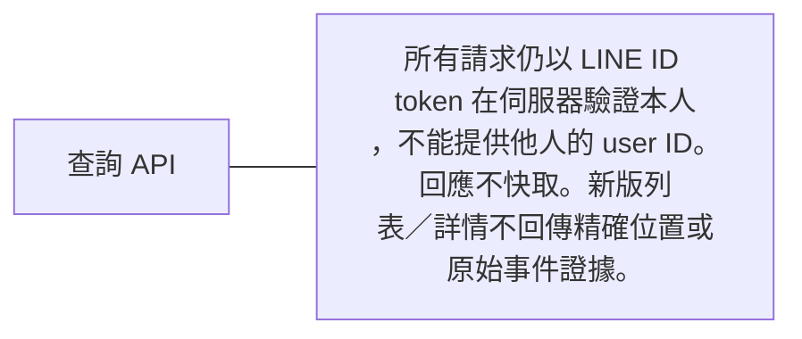
```mermaid
flowchart LR
  h["查詢 API"]
  h --- n0["所有請求仍以 LINE ID token 在伺服器驗證本人<br/>，不能提供他人的 user ID。回應不快取。新版列<br/>表／詳情不回傳精確位置或原始事件證據。"]
```

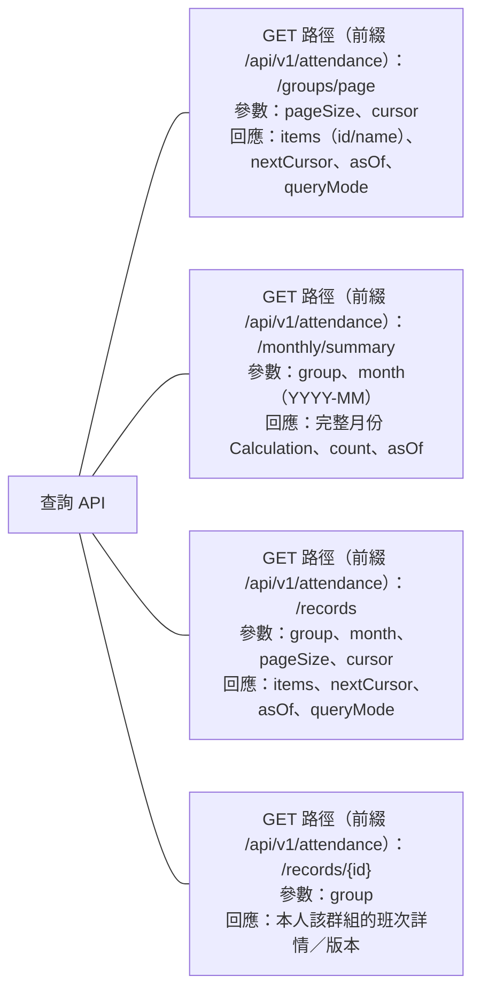
```mermaid
flowchart LR
  h["查詢 API"]
  h --- n0["GET 路徑（前綴 /api/v1/attendance）：<br/>/groups/page<br/>參數：pageSize、cursor<br/>回應：items（id/name）、nextCursor、asOf、<br/>queryMode"]
  h --- n1["GET 路徑（前綴 /api/v1/attendance）：<br/>/monthly/summary<br/>參數：group、month（YYYY-MM）<br/>回應：完整月份 Calculation、count、asOf"]
  h --- n2["GET 路徑（前綴 /api/v1/attendance）：<br/>/records<br/>參數：group、month、pageSize、cursor<br/>回應：items、nextCursor、asOf、queryMode"]
  h --- n3["GET 路徑（前綴 /api/v1/attendance）：<br/>/records/{id}<br/>參數：group<br/>回應：本人該群組的班次詳情／版本"]
```

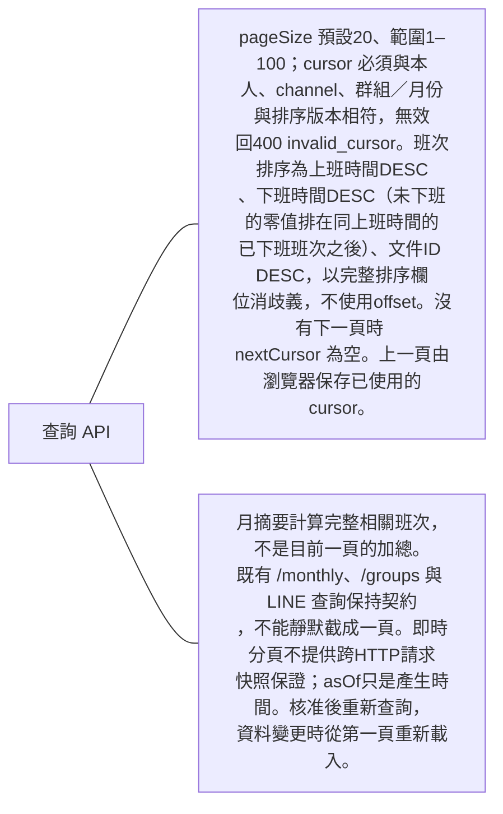
```mermaid
flowchart LR
  h["查詢 API"]
  h --- n0["pageSize 預設20、範圍1–100；cursor 必須與本<br/>人、channel、群組／月份與排序版本相符，無效<br/>回400 invalid_cursor。班次排序為上班時間DESC<br/>、下班時間DESC（未下班的零值排在同上班時間的<br/>已下班班次之後）、文件ID DESC，以完整排序欄<br/>位消歧義，不使用offset。沒有下一頁時 <br/>nextCursor 為空。上一頁由瀏覽器保存已使用的<br/>cursor。"]
  h --- n1["月摘要計算完整相關班次，不是目前一頁的加總。<br/>既有 /monthly、/groups 與 LINE 查詢保持契約<br/>，不能靜默截成一頁。即時分頁不提供跨HTTP請求<br/>快照保證；asOf只是產生時間。核准後重新查詢，<br/>資料變更時從第一頁重新載入。"]
```

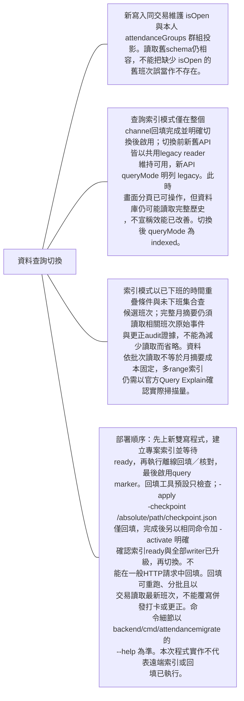
```mermaid
flowchart LR
  h["資料查詢切換"]
  h --- n0["新寫入同交易維護 isOpen 與本人 <br/>attendanceGroups 群組投影。讀取舊schema仍相<br/>容，不能把缺少 isOpen 的舊班次誤當作不存在。"]
  h --- n1["查詢索引模式僅在整個channel回填完成並明確切<br/>換後啟用；切換前新舊API皆以共用legacy reader<br/>維持可用，新API queryMode 明列 legacy。此時<br/>畫面分頁已可操作，但資料庫仍可能讀取完整歷史<br/>，不宣稱效能已改善。切換後 queryMode 為 <br/>indexed。"]
  h --- n2["索引模式以已下班的時間重疊條件與未下班集合查<br/>候選班次；完整月摘要仍須讀取相關班次原始事件<br/>與更正audit證據，不能為減少讀取而省略。資料<br/>依批次讀取不等於月摘要成本固定，多range索引<br/>仍需以官方Query Explain確認實際掃描量。"]
  h --- n3["部署順序：先上新雙寫程式，建立專案索引並等待<br/>ready，再執行離線回填／核對，最後啟用query <br/>marker。回填工具預設只檢查；-apply <br/>-checkpoint /absolute/path/checkpoint.json <br/>僅回填，完成後另以相同命令加 -activate 明確<br/>確認索引ready與全部writer已升級，再切換。不<br/>能在一般HTTP請求中回填。回填可重跑、分批且以<br/>交易讀取最新班次，不能覆寫併發打卡或更正。命<br/>令細節以 backend/cmd/attendancemigrate 的 <br/>--help 為準。本次程式實作不代表遠端索引或回<br/>填已執行。"]
```

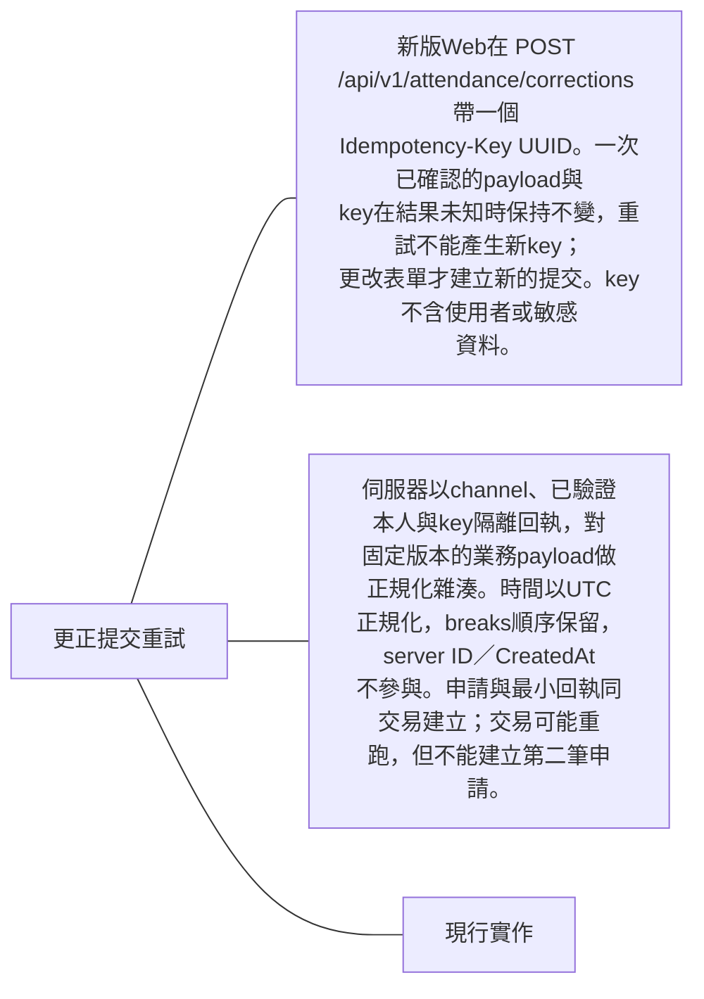
```mermaid
flowchart LR
  h["更正提交重試"]
  h --- n0["新版Web在 POST <br/>/api/v1/attendance/corrections 帶一個 <br/>Idempotency-Key UUID。一次已確認的payload與<br/>key在結果未知時保持不變，重試不能產生新key；<br/>更改表單才建立新的提交。key不含使用者或敏感<br/>資料。"]
  h --- n1["伺服器以channel、已驗證本人與key隔離回執，對<br/>固定版本的業務payload做正規化雜湊。時間以UTC<br/>正規化，breaks順序保留，server ID／CreatedAt<br/>不參與。申請與最小回執同交易建立；交易可能重<br/>跑，但不能建立第二筆申請。"]
  h --- n2["現行實作"]
```

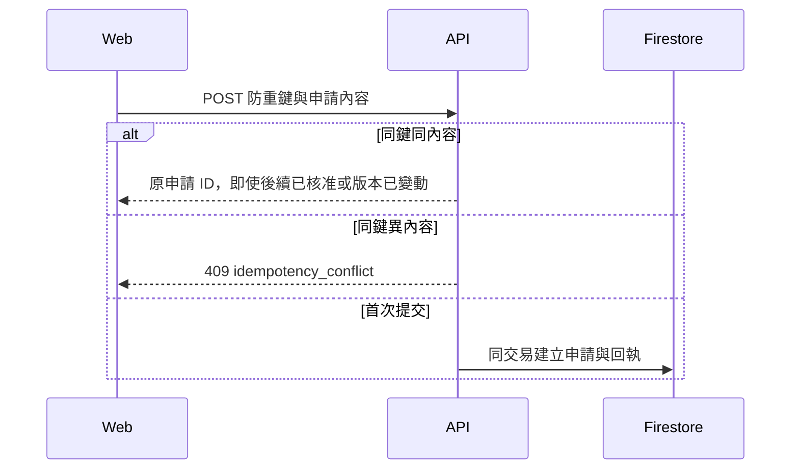
```mermaid
sequenceDiagram
  Web->>API: POST 防重鍵與申請內容
  alt 同鍵同內容
    API-->>Web: 原申請 ID，即使後續已核准或版本已變動
  else 同鍵異內容
    API-->>Web: 409 idempotency_conflict
  else 首次提交
    API->>Firestore: 同交易建立申請與回執
  end
```

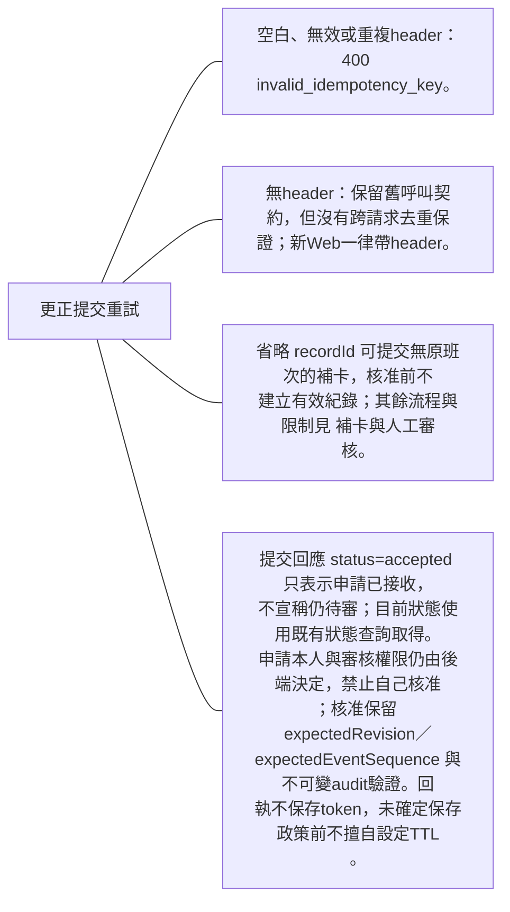
```mermaid
flowchart LR
  h["更正提交重試"]
  h --- n0["空白、無效或重複header：400 <br/>invalid_idempotency_key。"]
  h --- n1["無header：保留舊呼叫契約，但沒有跨請求去重保<br/>證；新Web一律帶header。"]
  h --- n2["省略 recordId 可提交無原班次的補卡，核准前不<br/>建立有效紀錄；其餘流程與限制見 補卡與人工審<br/>核。"]
  click n2 "worktime.md#補卡與人工審核"
  h --- n3["提交回應 status=accepted 只表示申請已接收，<br/>不宣稱仍待審；目前狀態使用既有狀態查詢取得。<br/>申請本人與審核權限仍由後端決定，禁止自己核准<br/>；核准保留 expectedRevision／<br/>expectedEventSequence 與不可變audit驗證。回<br/>執不保存token，未確定保存政策前不擅自設定TTL<br/>。"]
```

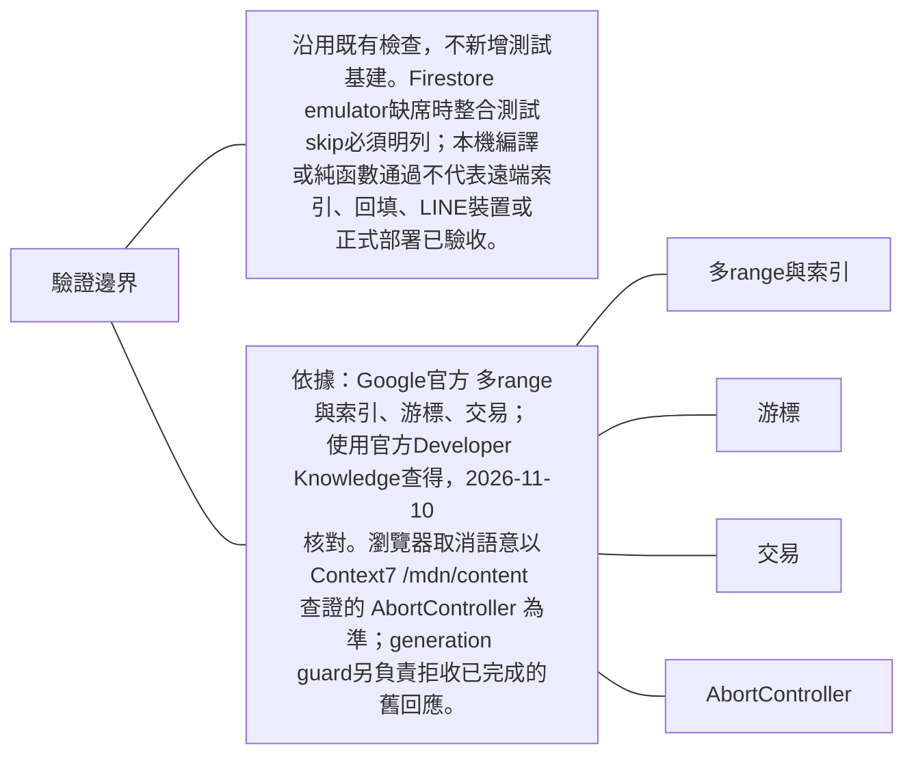
```mermaid
flowchart LR
  h["驗證邊界"]
  h --- n0["沿用既有檢查，不新增測試基建。Firestore <br/>emulator缺席時整合測試skip必須明列；本機編譯<br/>或純函數通過不代表遠端索引、回填、LINE裝置或<br/>正式部署已驗收。"]
  h --- n1["依據：Google官方 多range與索引、游標、交易；<br/>使用官方Developer Knowledge查得，2026-11-10<br/>核對。瀏覽器取消語意以Context7 /mdn/content <br/>查證的 AbortController 為準；generation <br/>guard另負責拒收已完成的舊回應。"]
  n1 --- n1l0["多range與索引"]
  click n1l0 "https://firebase.google.com/docs/firestore/query-data/multiple-range-fields"
  n1 --- n1l1["游標"]
  click n1l1 "https://firebase.google.com/docs/firestore/query-data/query-cursors"
  n1 --- n1l2["交易"]
  click n1l2 "https://firebase.google.com/docs/firestore/manage-data/transactions"
  n1 --- n1l3["AbortController"]
  click n1l3 "https://developer.mozilla.org/en-US/docs/Web/API/AbortController/abort"
```

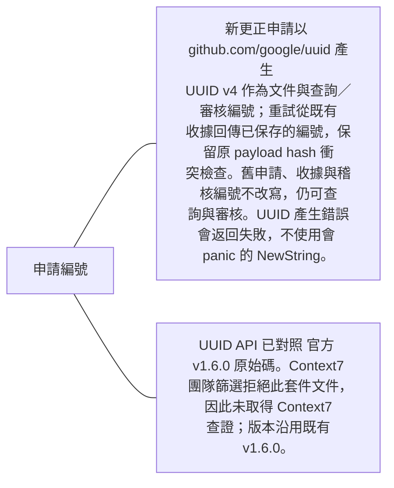
```mermaid
flowchart LR
  h["申請編號"]
  h --- n0["新更正申請以 github.com/google/uuid 產生 <br/>UUID v4 作為文件與查詢／審核編號；重試從既有<br/>收據回傳已保存的編號，保留原 payload hash 衝<br/>突檢查。舊申請、收據與稽核編號不改寫，仍可查<br/>詢與審核。UUID 產生錯誤會返回失敗，不使用會 <br/>panic 的 NewString。"]
  h --- n1["UUID API 已對照 官方 v1.6.0 原始碼。Context7<br/> 團隊篩選拒絕此套件文件，因此未取得 Context7<br/> 查證；版本沿用既有 v1.6.0。"]
  click n1 "https://github.com/google/uuid/blob/v1.6.0/version4.go"
```

## 審核畫面狀態同步

現行實作

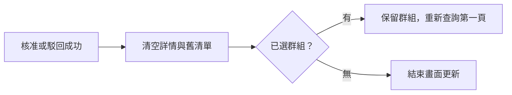
```mermaid
flowchart LR
  S["核准或駁回成功"] --> C["清空詳情與舊清單"]
  C --> G{"已選群組？"}
  G -->|有| Q["保留群組，重新查詢第一頁"]
  G -->|無| E["結束畫面更新"]
```

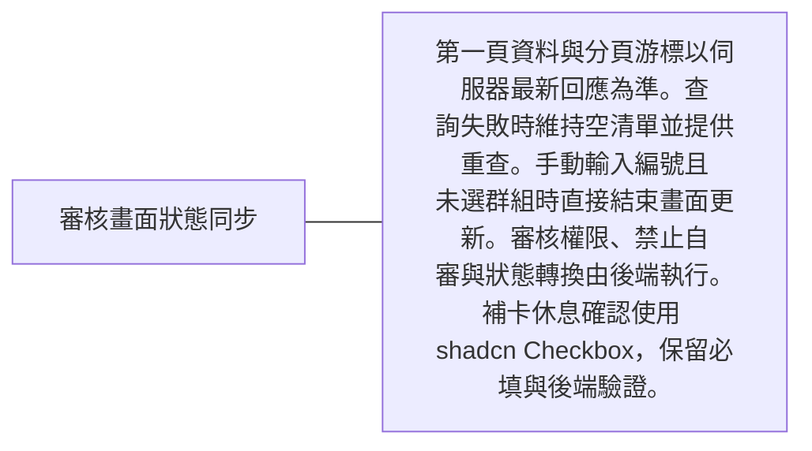
```mermaid
flowchart LR
  h["審核畫面狀態同步"]
  h --- n0["第一頁資料與分頁游標以伺服器最新回應為準。查<br/>詢失敗時維持空清單並提供重查。手動輸入編號且<br/>未選群組時直接結束畫面更新。審核權限、禁止自<br/>審與狀態轉換由後端執行。補卡休息確認使用 <br/>shadcn Checkbox，保留必填與後端驗證。"]
```
