# 工時計算第一階段

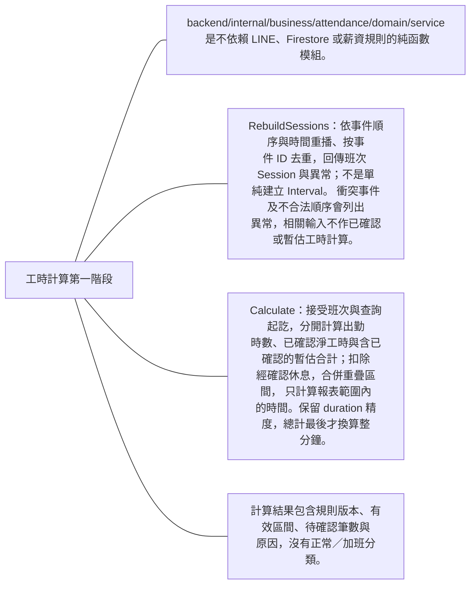
```mermaid
flowchart LR
  h["工時計算第一階段"]
  h --- n0["backend/internal/business/attendance/domain/service<br/> 是不依賴 LINE、Firestore 或薪資規則的純函數<br/>模組。"]
  h --- n1["RebuildSessions：依事件順序與時間重播、按事<br/>件 ID 去重，回傳班次 Session 與異常；不是單<br/>純建立 Interval。 衝突事件及不合法順序會列出<br/>異常，相關輸入不作已確認或暫估工時計算。"]
  h --- n2["Calculate：接受班次與查詢起訖，分開計算出勤<br/>時數、已確認淨工時與含已確認的暫估合計；扣除<br/>經確認休息，合併重疊區間， 只計算報表範圍內<br/>的時間。保留 duration 精度，總計最後才換算整<br/>分鐘。"]
  h --- n3["計算結果包含規則版本、有效區間、待確認筆數與<br/>原因，沒有正常／加班分類。"]
```

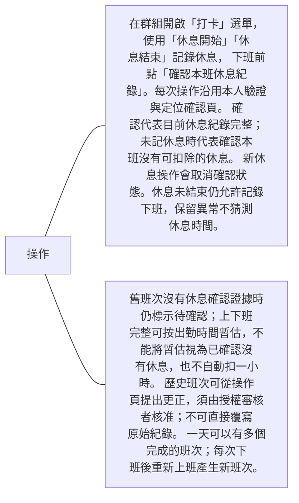
```mermaid
flowchart LR
  h["操作"]
  h --- n0["在群組開啟「打卡」選單，使用「休息開始」「休<br/>息結束」記錄休息， 下班前點「確認本班休息紀<br/>錄」。每次操作沿用本人驗證與定位確認頁。 確<br/>認代表目前休息紀錄完整；未記休息時代表確認本<br/>班沒有可扣除的休息。 新休息操作會取消確認狀<br/>態。休息未結束仍允許記錄下班，保留異常不猜測<br/>休息時間。"]
  h --- n1["舊班次沒有休息確認證據時仍標示待確認；上下班<br/>完整可按出勤時間暫估，不能將暫估視為已確認沒<br/>有休息，也不自動扣一小時。 歷史班次可從操作<br/>頁提出更正，須由授權審核者核准；不可直接覆寫<br/>原始紀錄。 一天可以有多個完成的班次；每次下<br/>班後重新上班產生新班次。"]
```

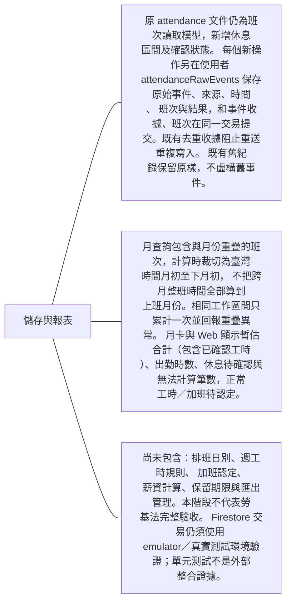
```mermaid
flowchart LR
  h["儲存與報表"]
  h --- n0["原 attendance 文件仍為班次讀取模型，新增休息<br/>區間及確認狀態。 每個新操作另在使用者 <br/>attendanceRawEvents 保存原始事件、來源、時間<br/>、 班次與結果，和事件收據、班次在同一交易提<br/>交。既有去重收據阻止重送重複寫入。 既有舊紀<br/>錄保留原樣，不虛構舊事件。"]
  h --- n1["月查詢包含與月份重疊的班次，計算時裁切為臺灣<br/>時間月初至下月初， 不把跨月整班時間全部算到<br/>上班月份。相同工作區間只累計一次並回報重疊異<br/>常。 月卡與 Web 顯示暫估合計（包含已確認工時<br/>）、出勤時數、休息待確認與無法計算筆數，正常<br/>工時／加班待認定。"]
  h --- n2["尚未包含：排班日別、週工時規則、 加班認定、<br/>薪資計算、保留期限與匯出管理。本階段不代表勞<br/>基法完整驗收。 Firestore 交易仍須使用 <br/>emulator／真實測試環境驗證；單元測試不是外部<br/>整合證據。"]
```

## 共用狀態規則與事件重建

現行實作

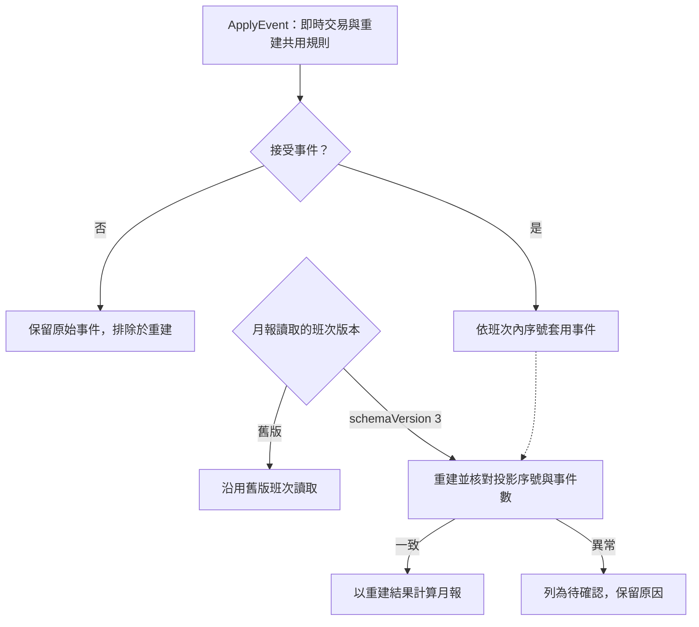
```mermaid
flowchart TB
  EVENT["ApplyEvent：即時交易與重建共用規則"] --> OK{"接受事件？"}
  OK -->|否| AUDIT["保留原始事件，排除於重建"]
  OK -->|是| ORDER["依班次內序號套用事件"]
  READ{"月報讀取的班次版本"} -->|舊版| OLD["沿用舊版班次讀取"]
  READ -->|schemaVersion 3| REBUILD["重建並核對投影序號與事件數"]
  ORDER -.-> REBUILD
  REBUILD -->|一致| REPORT["以重建結果計算月報"]
  REBUILD -->|異常| PENDING["列為待確認，保留原因"]
```

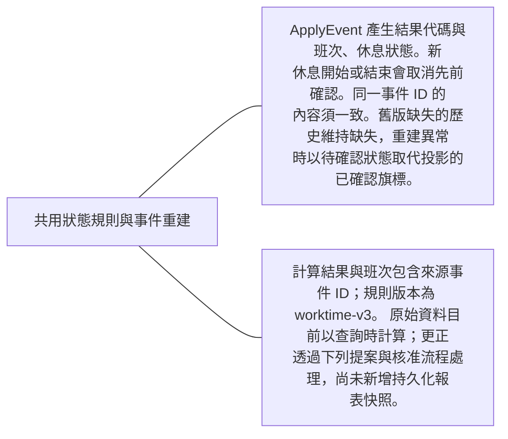
```mermaid
flowchart LR
  h["共用狀態規則與事件重建"]
  h --- n0["ApplyEvent 產生結果代碼與班次、休息狀態。新<br/>休息開始或結束會取消先前確認。同一事件 ID 的<br/>內容須一致。舊版缺失的歷史維持缺失，重建異常<br/>時以待確認狀態取代投影的已確認旗標。"]
  h --- n1["計算結果與班次包含來源事件 ID；規則版本為 <br/>worktime-v3。 原始資料目前以查詢時計算；更正<br/>透過下列提案與核准流程處理，尚未新增持久化報<br/>表快照。"]
```

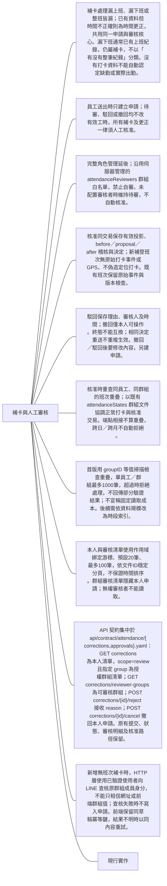
```mermaid
flowchart LR
  h["補卡與人工審核"]
  h --- n0["補卡處理漏上班、漏下班或整班皆漏；已有資料但<br/>時間不正確則為時間更正，共用同一申請與審核核<br/>心。漏下班通常已有上班紀錄，仍屬補卡，不以「<br/>有沒有整筆紀錄」分類。沒有打卡資料不能自動認<br/>定缺勤或實際出勤。"]
  h --- n1["員工送出時只建立申請；待審、駁回或撤回均不改<br/>有效工時。所有補卡及更正一律須人工核准。"]
  h --- n2["完整角色管理延後；沿用伺服器管理的 <br/>attendanceReviewers 群組白名單，禁止自審。未<br/>配置審核者時維持待審，不自動核准。"]
  h --- n3["核准同交易保存有效投影、before／proposal／<br/>after 稽核與決定；新補登班次無原始打卡事件或<br/>GPS，不偽造定位打卡。既有班次保留原始事件與<br/>版本檢查。"]
  h --- n4["駁回保存理由、審核人及時間；撤回僅本人可操作<br/>。終態不能互換；相同決定重送不重複生效。撤回<br/>／駁回後要修改內容，另建申請。"]
  h --- n5["核准時重查同員工、同群組的班次重疊；以既有 <br/>attendanceStates 群組文件協調正常打卡與核准<br/>交易。端點相接不算重疊，跨日／跨月不自動拒絕<br/>。"]
  h --- n6["首版用 groupID 等值掃描檢查重疊，單員工／群<br/>組最多1000筆，超過時拒絕處理，不回傳部分驗證<br/>結果；不宣稱固定讀取成本。後續需依資料規模改<br/>為時段索引。"]
  h --- n7["本人與審核清單使用作用域綁定游標、預設20筆、<br/>最多100筆，依文件ID穩定分頁，不保證時間排序<br/>。群組審核清單隱藏本人申請；無權審核者不能讀<br/>取。"]
  h --- n8["API 契約集中於 api/contract/attendance/{<br/>corrections,approvals}.yaml：GET corrections<br/> 為本人清單，scope=review 且指定 group 為授<br/>權群組清單；GET corrections/reviewer-groups <br/>為可審核群組；POST corrections/{id}/reject <br/>接收 reason；POST corrections/{id}/cancel 撤<br/>回本人申請。原有提交、狀態、審核明細及核准路<br/>徑保留。"]
  h --- n9["新增無班次補卡時，HTTP 層使用已驗證使用者向 <br/>LINE 查核原群組成員身分，不能只相信網址或前<br/>端群組值；查核失敗時不寫入申請。前端保留同草<br/>稿冪等鍵，結果不明時以同內容重試。"]
  h --- n10["現行實作"]
```

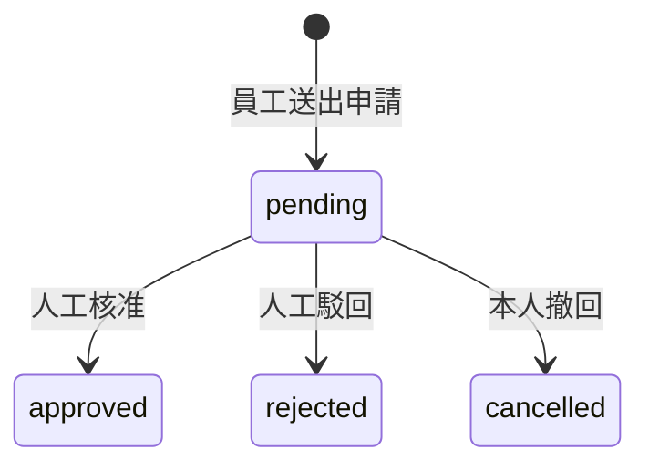
```mermaid
stateDiagram-v2
  [*] --> pending: 員工送出申請
  pending --> approved: 人工核准
  pending --> rejected: 人工駁回
  pending --> cancelled: 本人撤回
```

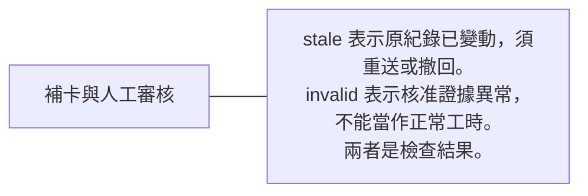
```mermaid
flowchart LR
  h["補卡與人工審核"]
  h --- n0["stale 表示原紀錄已變動，須重送或撤回。<br/>invalid 表示核准證據異常，不能當作正常工時。<br/>兩者是檢查結果。"]
```

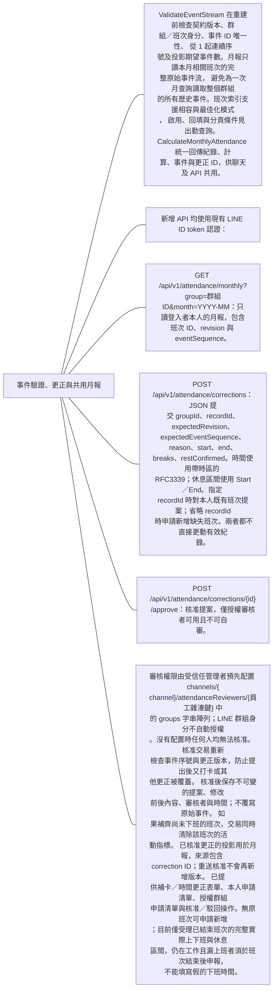
```mermaid
flowchart LR
  h["事件驗證、更正與共用月報"]
  h --- n0["ValidateEventStream 在重建前檢查契約版本、群<br/>組／班次身分、事件 ID 唯一性、 從 1 起連續序<br/>號及投影期望事件數。月報只讀本月相關班次的完<br/>整原始事件流， 避免為一次月查詢讀取整個群組<br/>的所有歷史事件。班次索引支援相容與最佳化模式<br/>， 啟用、回填與分頁條件見 出勤查詢。 <br/>CalculateMonthlyAttendance 統一回傳紀錄、計<br/>算、事件與更正 ID，供聊天及 API 共用。"]
  click n0 "queries.md"
  h --- n1["新增 API 均使用現有 LINE ID token 認證："]
  h --- n2["GET /api/v1/attendance/monthly?group=群組<br/>ID&amp;month=YYYY-MM：只讀登入者本人的月報，包含<br/>班次 ID、revision 與 eventSequence。"]
  h --- n3["POST /api/v1/attendance/corrections：JSON 提<br/>交 groupId、recordId、expectedRevision、<br/>expectedEventSequence、reason、start、end、<br/>breaks、restConfirmed。時間使用帶時區的 <br/>RFC3339；休息區間使用 Start／End。指定 <br/>recordId 時對本人既有班次提案；省略 recordId<br/> 時申請新增缺失班次。兩者都不直接更動有效紀<br/>錄。"]
  h --- n4["POST /api/v1/attendance/corrections/{id}<br/>/approve：核准提案，僅授權審核者可用且不可自<br/>審。"]
  h --- n5["審核權限由受信任管理者預先配置 channels/{<br/>channel}/attendanceReviewers/{員工雜湊鍵} 中<br/>的 groups 字串陣列；LINE 群組身分不自動授權<br/>。沒有配置時任何人均無法核准。 核准交易重新<br/>檢查事件序號與更正版本，防止提出後又打卡或其<br/>他更正被覆蓋。 核准後保存不可變的提案、修改<br/>前後內容、審核者與時間；不覆寫原始事件。 如<br/>果補齊尚未下班的班次，交易同時清除該班次的活<br/>動指標。 已核准更正的投影用於月報，來源包含 <br/>correction ID；重送核准不會再新增版本。 已提<br/>供補卡／時間更正表單、本人申請清單、授權群組<br/>申請清單與核准／駁回操作。無原班次可申請新增<br/>；目前僅受理已結束班次的完整實際上下班與休息<br/>區間，仍在工作且漏上班者須於班次結束後申報，<br/>不能填寫假的下班時間。"]
```

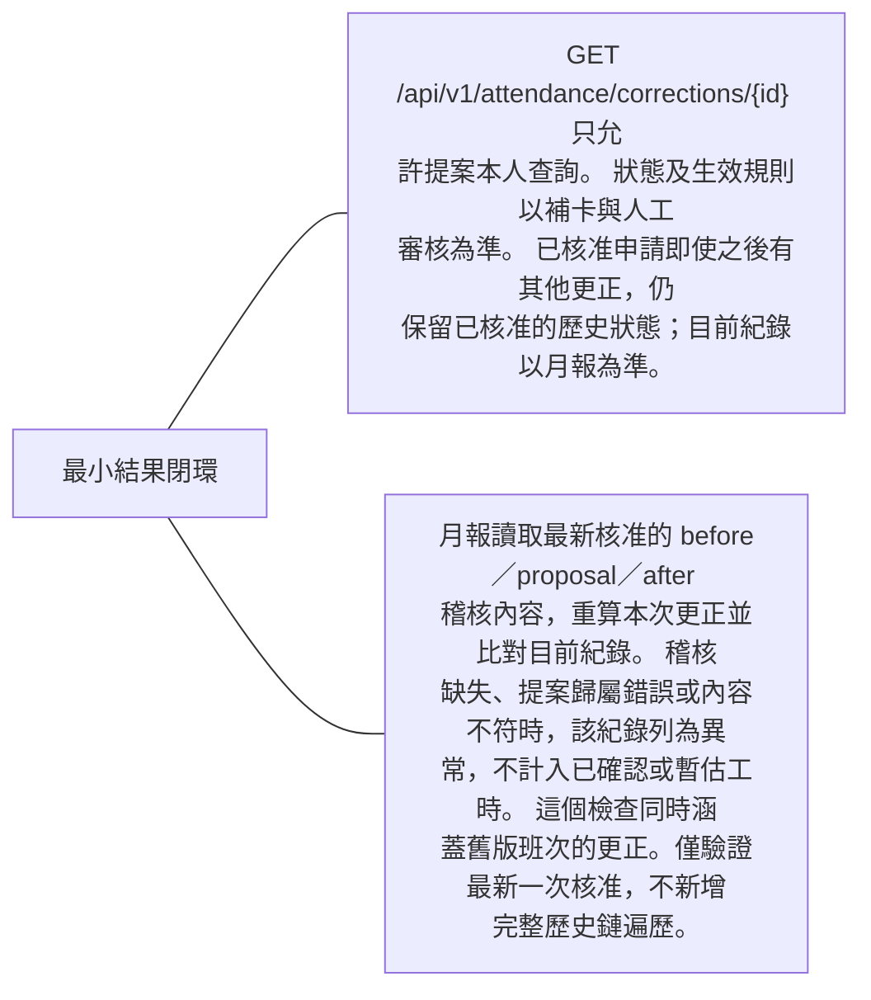
```mermaid
flowchart LR
  h["最小結果閉環"]
  h --- n0["GET /api/v1/attendance/corrections/{id} 只允<br/>許提案本人查詢。 狀態及生效規則以補卡與人工<br/>審核為準。 已核准申請即使之後有其他更正，仍<br/>保留已核准的歷史狀態；目前紀錄以月報為準。"]
  click n0 "#補卡與人工審核"
  h --- n1["月報讀取最新核准的 before／proposal／after <br/>稽核內容，重算本次更正並比對目前紀錄。 稽核<br/>缺失、提案歸屬錯誤或內容不符時，該紀錄列為異<br/>常，不計入已確認或暫估工時。 這個檢查同時涵<br/>蓋舊版班次的更正。僅驗證最新一次核准，不新增<br/>完整歷史鏈遍歷。"]
```

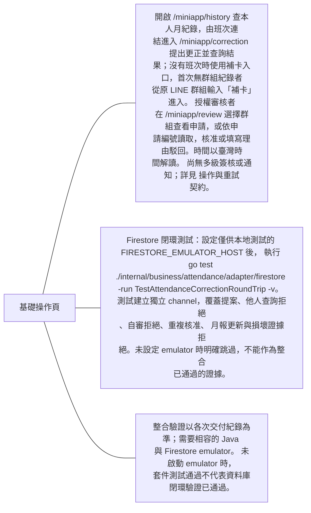
```mermaid
flowchart LR
  h["基礎操作頁"]
  h --- n0["開啟 /miniapp/history 查本人月紀錄，由班次連<br/>結進入 /miniapp/correction 提出更正並查詢結<br/>果；沒有班次時使用補卡入口，首次無群組紀錄者<br/>從原 LINE 群組輸入「補卡」進入。 授權審核者<br/>在 /miniapp/review 選擇群組查看申請，或依申<br/>請編號讀取，核准或填寫理由駁回。時間以臺灣時<br/>間解讀。 尚無多級簽核或通知；詳見 操作與重試<br/>契約。"]
  click n0 "queries.md"
  h --- n1["Firestore 閉環測試：設定僅供本地測試的 <br/>FIRESTORE_EMULATOR_HOST 後， 執行 go test <br/>./internal/business/attendance/adapter/firestore <br/>-run TestAttendanceCorrectionRoundTrip -v。 <br/>測試建立獨立 channel，覆蓋提案、他人查詢拒絕<br/>、自審拒絕、重複核准、 月報更新與損壞證據拒<br/>絕。未設定 emulator 時明確跳過，不能作為整合<br/>已通過的證據。"]
  h --- n2["整合驗證以各次交付紀錄為準；需要相容的 Java <br/>與 Firestore emulator。 未啟動 emulator 時，<br/>套件測試通過不代表資料庫閉環驗證已通過。"]
```

## 休息未確認與暫估工時

現行實作

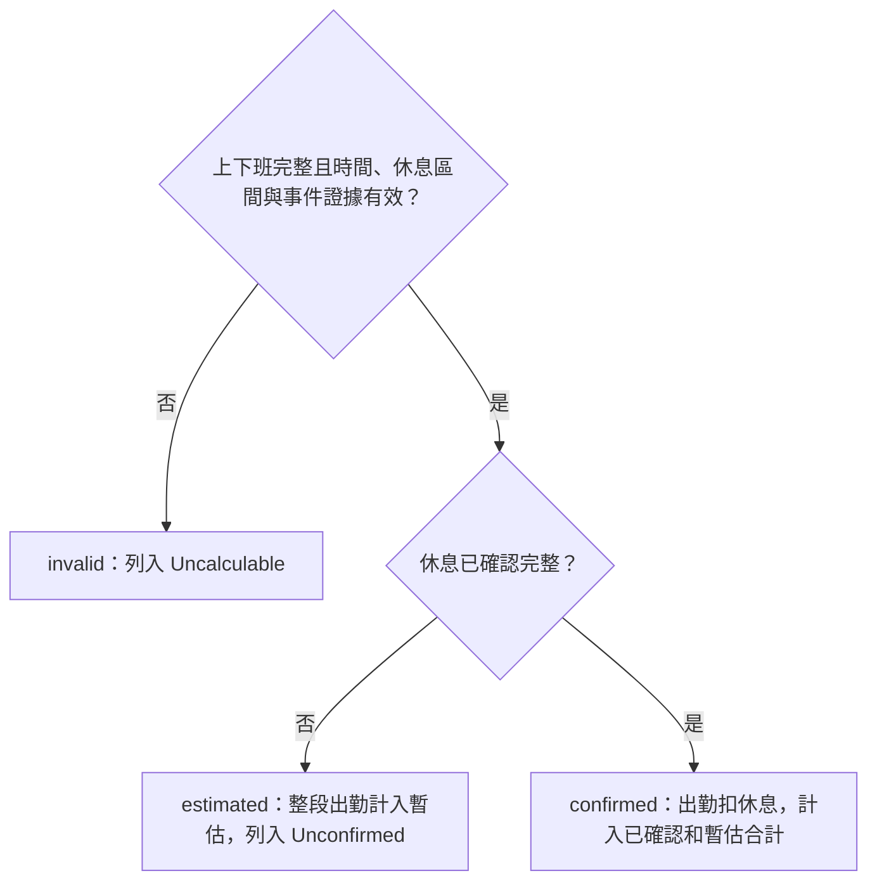
```mermaid
flowchart TB
  A{"上下班完整且時間、休息區間與事件證據有效？"} -->|否| I["invalid：列入 Uncalculable"]
  A -->|是| R{"休息已確認完整？"}
  R -->|否| E["estimated：整段出勤計入暫估，列入 Unconfirmed"]
  R -->|是| C["confirmed：出勤扣休息，計入已確認和暫估合計"]
```

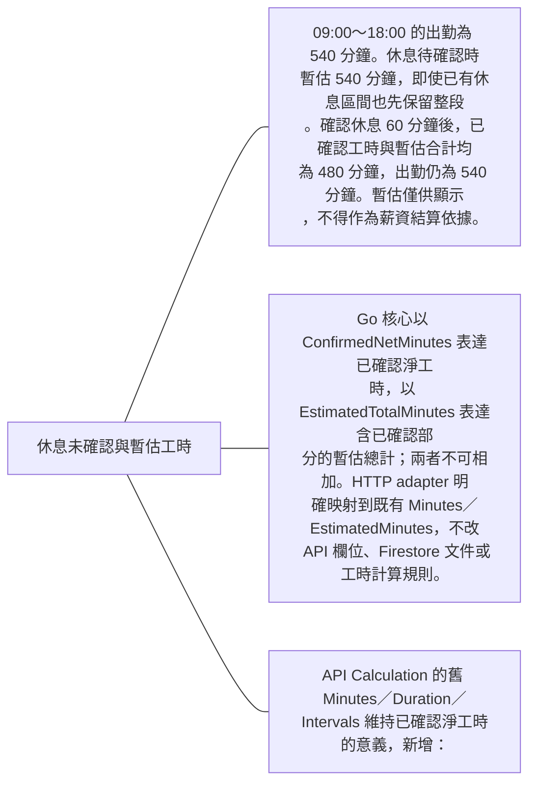
```mermaid
flowchart LR
  h["休息未確認與暫估工時"]
  h --- n0["09:00～18:00 的出勤為 540 分鐘。休息待確認時<br/>暫估 540 分鐘，即使已有休息區間也先保留整段<br/>。確認休息 60 分鐘後，已確認工時與暫估合計均<br/>為 480 分鐘，出勤仍為 540 分鐘。暫估僅供顯示<br/>，不得作為薪資結算依據。"]
  h --- n1["Go 核心以 ConfirmedNetMinutes 表達已確認淨工<br/>時，以 EstimatedTotalMinutes 表達含已確認部<br/>分的暫估總計；兩者不可相加。HTTP adapter 明<br/>確映射到既有 Minutes／EstimatedMinutes，不改<br/> API 欄位、Firestore 文件或工時計算規則。"]
  h --- n2["API Calculation 的舊 Minutes／Duration／<br/>Intervals 維持已確認淨工時的意義，新增："]
```

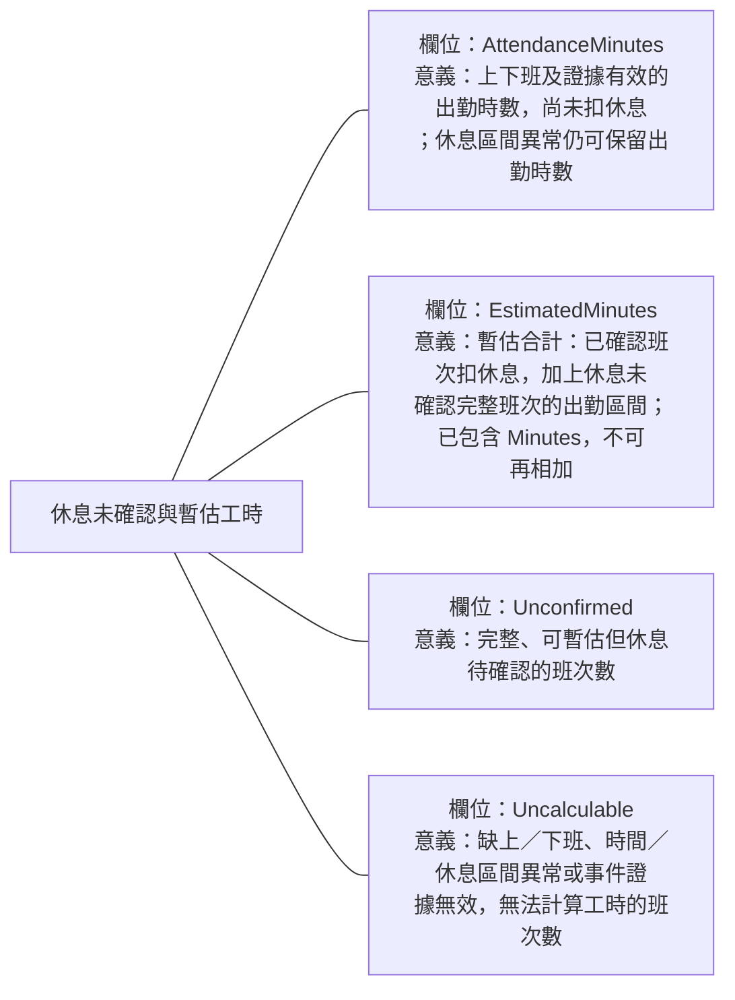
```mermaid
flowchart LR
  h["休息未確認與暫估工時"]
  h --- n0["欄位：AttendanceMinutes<br/>意義：上下班及證據有效的出勤時數，尚未扣休息<br/>；休息區間異常仍可保留出勤時數"]
  h --- n1["欄位：EstimatedMinutes<br/>意義：暫估合計：已確認班次扣休息，加上休息未<br/>確認完整班次的出勤區間；已包含 Minutes，不可<br/>再相加"]
  h --- n2["欄位：Unconfirmed<br/>意義：完整、可暫估但休息待確認的班次數"]
  h --- n3["欄位：Uncalculable<br/>意義：缺上／下班、時間／休息區間異常或事件證<br/>據無效，無法計算工時的班次數"]
```

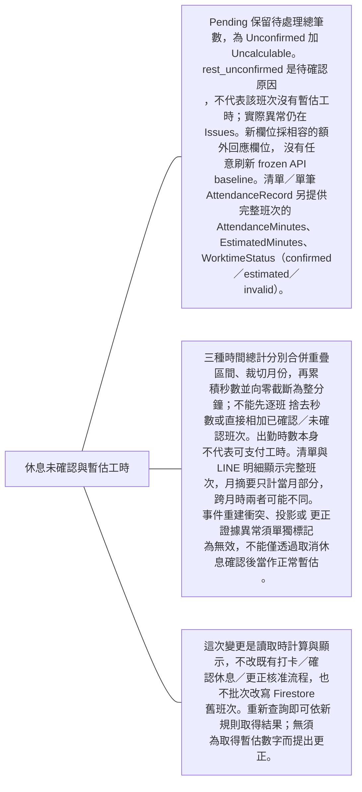
```mermaid
flowchart LR
  h["休息未確認與暫估工時"]
  h --- n0["Pending 保留待處理總筆數，為 Unconfirmed 加 <br/>Uncalculable。rest_unconfirmed 是待確認 原因<br/>，不代表該班次沒有暫估工時；實際異常仍在 <br/>Issues。新欄位採相容的額外回應欄位， 沒有任<br/>意刷新 frozen API baseline。清單／單筆 <br/>AttendanceRecord 另提供完整班次的 <br/>AttendanceMinutes、EstimatedMinutes、<br/>WorktimeStatus（confirmed／estimated／<br/>invalid）。"]
  h --- n1["三種時間總計分別合併重疊區間、裁切月份，再累<br/>積秒數並向零截斷為整分鐘；不能先逐班 捨去秒<br/>數或直接相加已確認／未確認班次。出勤時數本身<br/>不代表可支付工時。清單與 LINE 明細顯示完整班<br/>次，月摘要只計當月部分，跨月時兩者可能不同。<br/>事件重建衝突、投影或 更正證據異常須單獨標記<br/>為無效，不能僅透過取消休息確認後當作正常暫估<br/>。"]
  h --- n2["這次變更是讀取時計算與顯示，不改既有打卡／確<br/>認休息／更正核准流程，也不批次改寫 Firestore<br/> 舊班次。重新查詢即可依新規則取得結果；無須<br/>為取得暫估數字而提出更正。"]
```
