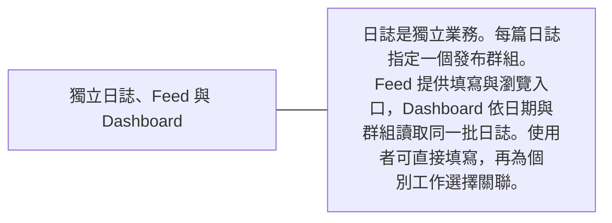
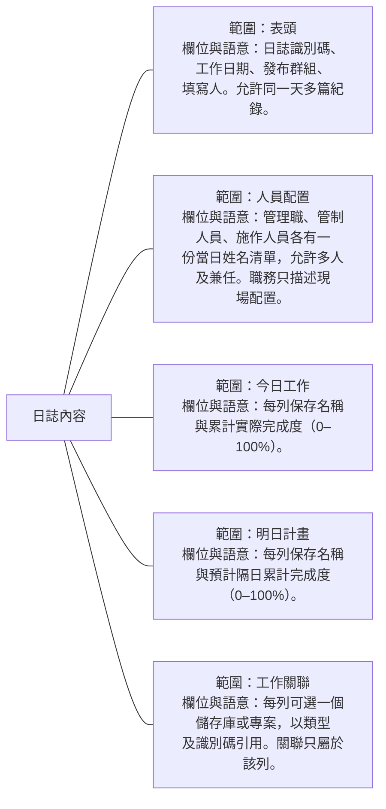
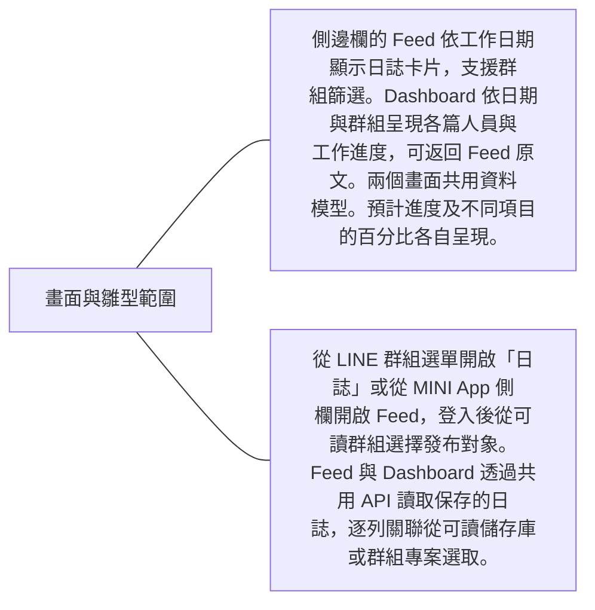
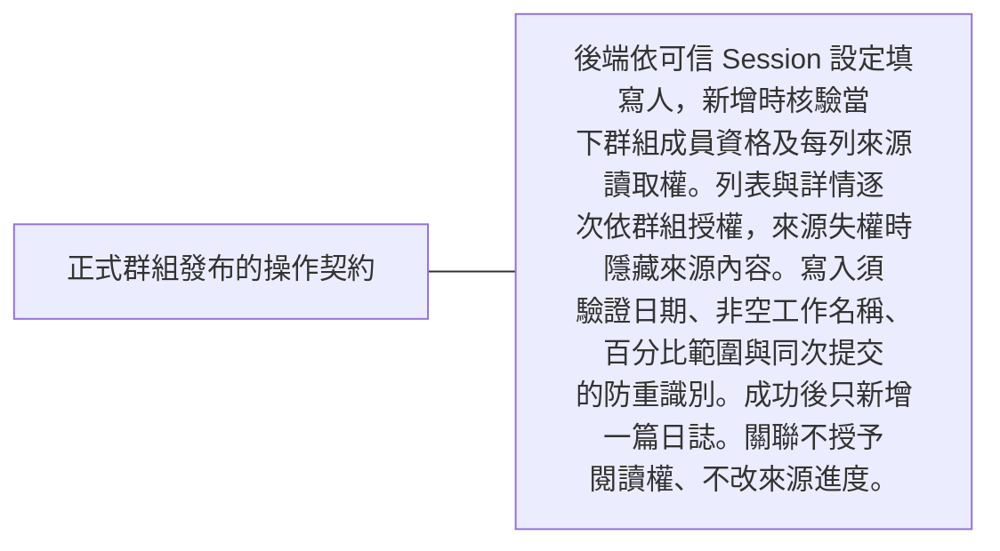
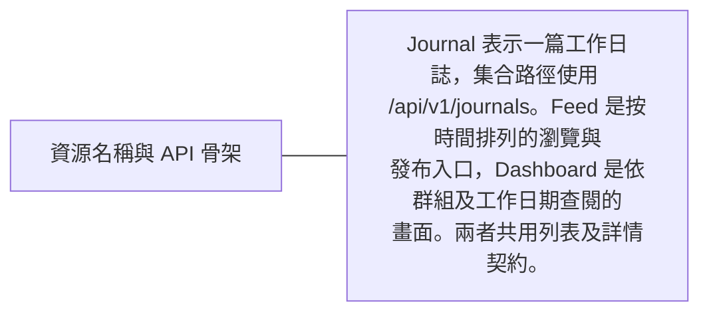
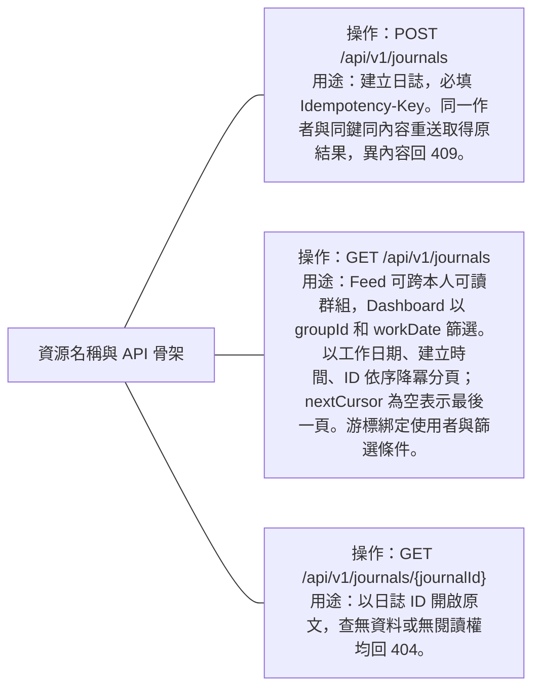
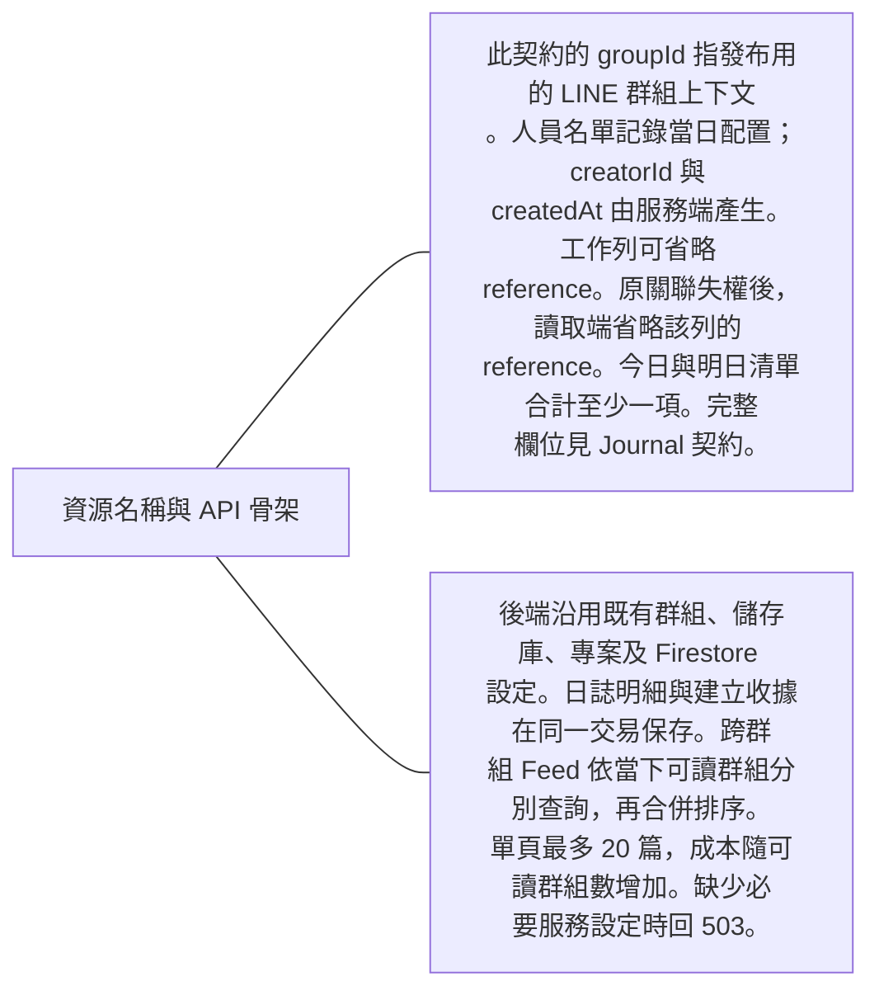

# 獨立日誌feed-與-dashboard

```mermaid
flowchart LR
  h["獨立日誌、Feed 與 Dashboard"]
  h --- n0["日誌是獨立業務。每篇日誌指定一個發布群組。<br/>Feed 提供填寫與瀏覽入口，Dashboard 依日期與<br/>群組讀取同一批日誌。使用者可直接填寫，再為個<br/>別工作選擇關聯。"]
```

```mermaid
flowchart LR
  h["日誌內容"]
  h --- n0["範圍：表頭<br/>欄位與語意：日誌識別碼、工作日期、發布群組、<br/>填寫人。允許同一天多篇紀錄。"]
  h --- n1["範圍：人員配置<br/>欄位與語意：管理職、管制人員、施作人員各有一<br/>份當日姓名清單，允許多人及兼任。職務只描述現<br/>場配置。"]
  h --- n2["範圍：今日工作<br/>欄位與語意：每列保存名稱與累計實際完成度（0–<br/>100%）。"]
  h --- n3["範圍：明日計畫<br/>欄位與語意：每列保存名稱與預計隔日累計完成度<br/>（0–100%）。"]
  h --- n4["範圍：工作關聯<br/>欄位與語意：每列可選一個儲存庫或專案，以類型<br/>及識別碼引用。關聯只屬於該列。"]
```

```mermaid
flowchart LR
  h["畫面與雛型範圍"]
  h --- n0["側邊欄的 Feed 依工作日期顯示日誌卡片，支援群<br/>組篩選。Dashboard 依日期與群組呈現各篇人員與<br/>工作進度，可返回 Feed 原文。兩個畫面共用資料<br/>模型。預計進度及不同項目的百分比各自呈現。"]
  h --- n1["從 LINE 群組選單開啟「日誌」或從 MINI App 側<br/>欄開啟 Feed，登入後從可讀群組選擇發布對象。<br/>Feed 與 Dashboard 透過共用 API 讀取保存的日<br/>誌，逐列關聯從可讀儲存庫或群組專案選取。"]
```

```mermaid
flowchart LR
  h["正式群組發布的操作契約"]
  h --- n0["後端依可信 Session 設定填寫人，新增時核驗當<br/>下群組成員資格及每列來源讀取權。列表與詳情逐<br/>次依群組授權，來源失權時隱藏來源內容。寫入須<br/>驗證日期、非空工作名稱、百分比範圍與同次提交<br/>的防重識別。成功後只新增一篇日誌。關聯不授予<br/>閱讀權、不改來源進度。"]
```

```mermaid
flowchart LR
  h["資源名稱與 API 骨架"]
  h --- n0["Journal 表示一篇工作日誌，集合路徑使用 <br/>/api/v1/journals。Feed 是按時間排列的瀏覽與<br/>發布入口，Dashboard 是依群組及工作日期查閱的<br/>畫面。兩者共用列表及詳情契約。"]
```

```mermaid
flowchart LR
  h["資源名稱與 API 骨架"]
  h --- n0["操作：POST /api/v1/journals<br/>用途：建立日誌，必填 Idempotency-Key。同一作<br/>者與同鍵同內容重送取得原結果，異內容回 409。"]
  h --- n1["操作：GET /api/v1/journals<br/>用途：Feed 可跨本人可讀群組，Dashboard 以 <br/>groupId 和 workDate 篩選。以工作日期、建立時<br/>間、ID 依序降冪分頁；nextCursor 為空表示最後<br/>一頁。游標綁定使用者與篩選條件。"]
  h --- n2["操作：GET /api/v1/journals/{journalId}<br/>用途：以日誌 ID 開啟原文，查無資料或無閱讀權<br/>均回 404。"]
```

```mermaid
flowchart LR
  h["資源名稱與 API 骨架"]
  h --- n0["此契約的 groupId 指發布用的 LINE 群組上下文<br/>。人員名單記錄當日配置；creatorId 與 <br/>createdAt 由服務端產生。工作列可省略 <br/>reference。原關聯失權後，讀取端省略該列的 <br/>reference。今日與明日清單合計至少一項。完整<br/>欄位見 Journal 契約。"]
  click n0 "../../api/contract/journal/journals.yaml"
  h --- n1["後端沿用既有群組、儲存庫、專案及 Firestore <br/>設定。日誌明細與建立收據在同一交易保存。跨群<br/>組 Feed 依當下可讀群組分別查詢，再合併排序。<br/>單頁最多 20 篇，成本隨可讀群組數增加。缺少必<br/>要服務設定時回 503。"]
```
