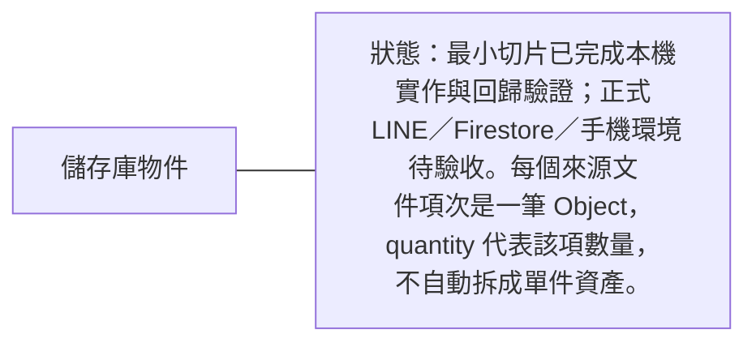
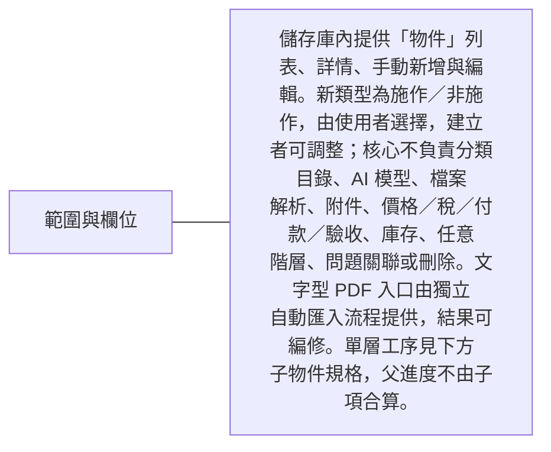
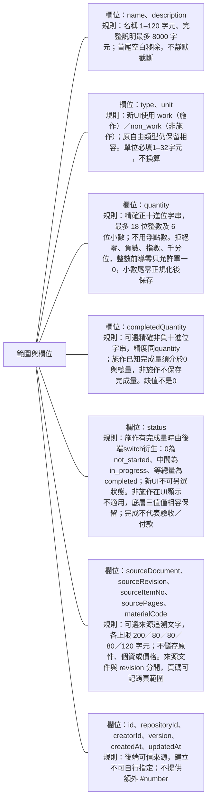
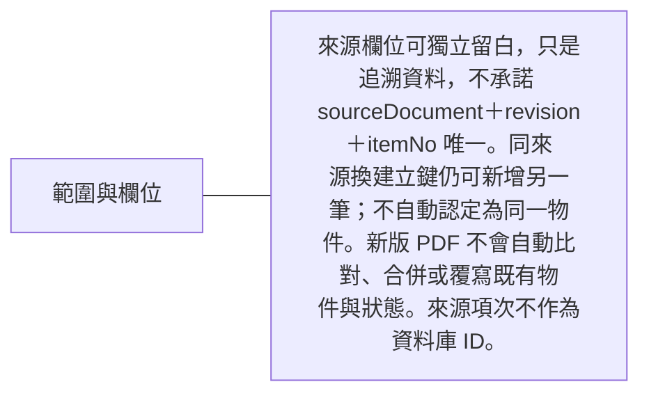
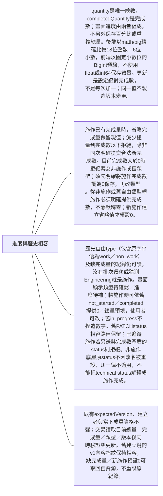
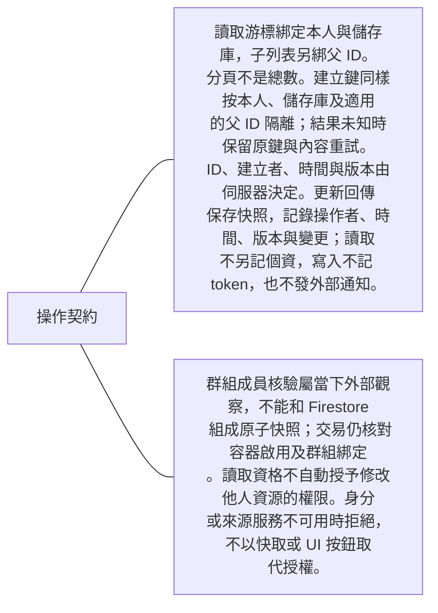
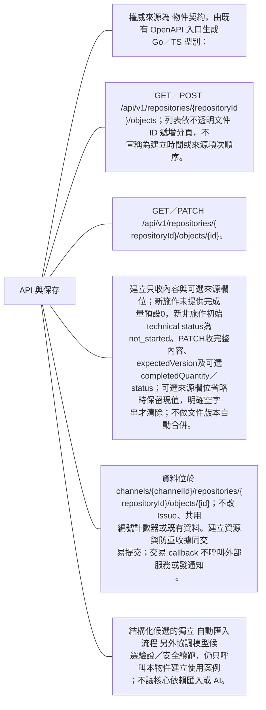
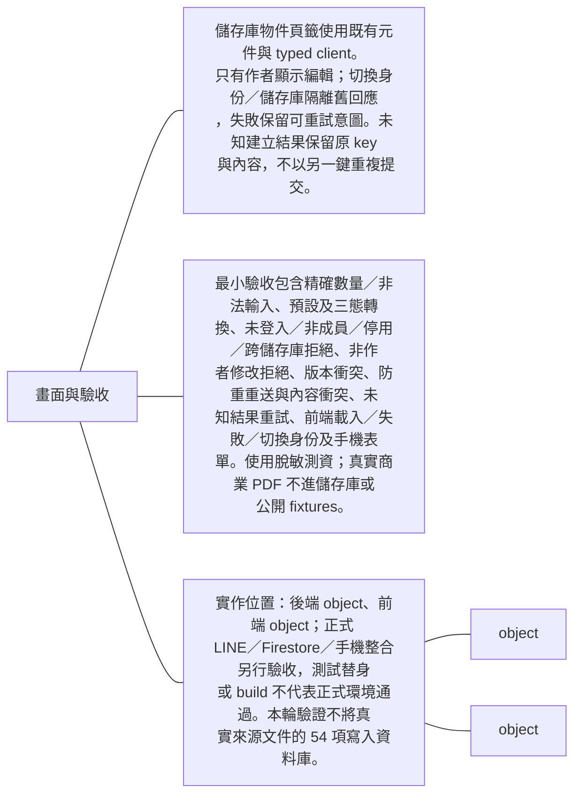

# 儲存庫物件

```mermaid
flowchart LR
  h["儲存庫物件"]
  h --- n0["狀態：最小切片已完成本機實作與回歸驗證；正式<br/> LINE／Firestore／手機環境待驗收。每個來源文<br/>件項次是一筆 Object，quantity 代表該項數量，<br/>不自動拆成單件資產。"]
```

```mermaid
flowchart LR
  h["範圍與欄位"]
  h --- n0["儲存庫內提供「物件」列表、詳情、手動新增與編<br/>輯。新類型為施作／非施作，由使用者選擇，建立<br/>者可調整；核心不負責分類目錄、AI 模型、檔案<br/>解析、附件、價格／稅／付款／驗收、庫存、任意<br/>階層、問題關聯或刪除。文字型 PDF 入口由獨立<br/>自動匯入流程提供，結果可編修。單層工序見下方<br/>子物件規格，父進度不由子項合算。"]
```

```mermaid
flowchart LR
  h["範圍與欄位"]
  h --- n0["欄位：name、description<br/>規則：名稱 1–120 字元、完整說明最多 8000 字<br/>元；首尾空白移除，不靜默截斷"]
  h --- n1["欄位：type、unit<br/>規則：新UI使用 work（施作）／non_work（非施<br/>作）；原自由類型仍保留相容。單位必填1–32字元<br/>，不換算"]
  h --- n2["欄位：quantity<br/>規則：精確正十進位字串，最多 18 位整數及 6 <br/>位小數；不用浮點數。拒絕零、負數、指數、千分<br/>位，整數前導零只允許單一 0，小數尾零正規化後<br/>保存"]
  h --- n3["欄位：completedQuantity<br/>規則：可選精確非負十進位字串，精度同quantity<br/>；施作已知完成量須介於0與總量，非施作不保存<br/>完成量。缺值不是0"]
  h --- n4["欄位：status<br/>規則：施作有完成量時由後端switch衍生：0為<br/>not_started、中間為in_progress、等總量為<br/>completed；新UI不可另選狀態。非施作在UI顯示<br/>不適用，底層三值僅相容保留；完成不代表驗收／<br/>付款"]
  h --- n5["欄位：sourceDocument、sourceRevision、<br/>sourceItemNo、sourcePages、materialCode<br/>規則：可選來源追溯文字，各上限 200／80／80／<br/>80／120 字元；不儲存原件、個資或價格。來源文<br/>件與 revision 分開，頁碼可記跨頁範圍"]
  h --- n6["欄位：id、repositoryId、creatorId、version、<br/>createdAt、updatedAt<br/>規則：後端可信來源，建立不可自行指定；不提供<br/>額外 #number"]
```

```mermaid
flowchart LR
  h["範圍與欄位"]
  h --- n0["來源欄位可獨立留白，只是追溯資料，不承諾 <br/>sourceDocument＋revision＋itemNo 唯一。同來<br/>源換建立鍵仍可新增另一筆；不自動認定為同一物<br/>件。新版 PDF 不會自動比對、合併或覆寫既有物<br/>件與狀態。來源項次不作為資料庫 ID。"]
```

```mermaid
flowchart LR
  h["進度與歷史相容"]
  h --- n0["quantity是唯一總數，completedQuantity是完成<br/>數；畫面進度由兩者組成，不另外保存百分比或重<br/>複總量。後端以math/big精確比較18位整數／6位<br/>小數，前端以固定小數位的BigInt預驗，不使用<br/>float或int64保存數量。更新是設定絕對完成數，<br/>不是每次加一；同一值不製造版本變更。"]
  h --- n1["施作已有完成量時，省略完成量保留現值；減少總<br/>量到完成數以下拒絕，除非同次明確提交合法新完<br/>成數。目前完成數大於0時拒絕轉為非施作或舊類<br/>型；須先明確將施作完成數調為0保存，再改類型<br/>。從非施作或舊自由類型轉施作必須明確提供完成<br/>數，不靜默歸零；新施作建立省略值才預設0。"]
  h --- n2["歷史自由type（包含原字串恰為work／non_work）<br/>及缺完成量的紀錄仍可讀，沒有批次遷移或猜測<br/>Engineering就是施作。畫面顯示類型待確認／進<br/>度待補；轉施作時可依舊not_started／completed<br/>提供0／總量預填，使用者可改；舊in_progress不<br/>捏造數字。舊PATCHstatus相容路徑保留；已追蹤<br/>施作若另送與完成數矛盾的status則拒絕。非施作<br/>底層原status不因改名被重設，UI一律不適用，不<br/>能把technical status解釋成施作完成。"]
  h --- n3["既有expectedVersion、建立者與當下成員資格不<br/>變；交易讀取目前總量／完成量／類型／版本後同<br/>時驗證與更新。舊建立鍵的v1內容指紋保持相容，<br/>缺完成量／新施作預設0可取回舊資源，不重設原<br/>紀錄。"]
```

```mermaid
flowchart LR
  h["操作契約"]
  h --- n0["讀取游標綁定本人與儲存庫，子列表另綁父 ID。<br/>分頁不是總數。建立鍵同樣按本人、儲存庫及適用<br/>的父 ID 隔離；結果未知時保留原鍵與內容重試。<br/>ID、建立者、時間與版本由伺服器決定。更新回傳<br/>保存快照，記錄操作者、時間、版本與變更；讀取<br/>不另記個資，寫入不記 token，也不發外部通知。"]
  h --- n1["群組成員核驗屬當下外部觀察，不能和 Firestore<br/> 組成原子快照；交易仍核對容器啟用及群組綁定<br/>。讀取資格不自動授予修改他人資源的權限。身分<br/>或來源服務不可用時拒絕，不以快取或 UI 按鈕取<br/>代授權。"]
```

```mermaid
flowchart LR
  h["API 與保存"]
  h --- n0["權威來源為 物件契約，由既有 OpenAPI 入口生成<br/> Go／TS 型別："]
  click n0 "../../../api/contract/object/objects.yaml"
  h --- n1["GET／POST /api/v1/repositories/{repositoryId<br/>}/objects；列表依不透明文件 ID 遞增分頁，不<br/>宣稱為建立時間或來源項次順序。"]
  h --- n2["GET／PATCH /api/v1/repositories/{<br/>repositoryId}/objects/{id}。"]
  h --- n3["建立只收內容與可選來源欄位；新施作未提供完成<br/>量預設0，新非施作初始technical status為<br/>not_started。PATCH收完整內容、<br/>expectedVersion及可選completedQuantity／<br/>status；可選來源欄位省略時保留現值，明確空字<br/>串才清除；不做文件版本自動合併。"]
  h --- n4["資料位於 channels/{channelId}/repositories/{<br/>repositoryId}/objects/{id}；不改 Issue、共用<br/>編號計數器或既有資料。建立資源與防重收據同交<br/>易提交；交易 callback 不呼叫外部服務或發通知<br/>。"]
  h --- n5["結構化候選的獨立 自動匯入流程 另外協調模型候<br/>選驗證／安全續跑，仍只呼叫本物件建立使用案例<br/>；不讓核心依賴匯入或 AI。"]
  click n5 "../objectimport/design.md"
```

```mermaid
flowchart LR
  h["畫面與驗收"]
  h --- n0["儲存庫物件頁籤使用既有元件與 typed client。<br/>只有作者顯示編輯；切換身份／儲存庫隔離舊回應<br/>，失敗保留可重試意圖。未知建立結果保留原 key<br/> 與內容，不以另一鍵重複提交。"]
  h --- n1["最小驗收包含精確數量／非法輸入、預設及三態轉<br/>換、未登入／非成員／停用／跨儲存庫拒絕、非作<br/>者修改拒絕、版本衝突、防重重送與內容衝突、未<br/>知結果重試、前端載入／失敗／切換身份及手機表<br/>單。使用脫敏測資；真實商業 PDF 不進儲存庫或<br/>公開 fixtures。"]
  h --- n2["實作位置：後端 object、前端 object；正式 <br/>LINE／Firestore／手機整合另行驗收，測試替身<br/>或 build 不代表正式環境通過。本輪驗證不將真<br/>實來源文件的 54 項寫入資料庫。"]
  n2 --- n2l0["object"]
  click n2l0 "../../../backend/internal/business/object/README.md"
  n2 --- n2l1["object"]
  click n2l1 "../../../frontend/miniapp/src/business/object/README.md"
```

[跨領域歸屬契約](../../architecture/contracts/object-subobject-ownership.md) · [領域入口](README.md)
