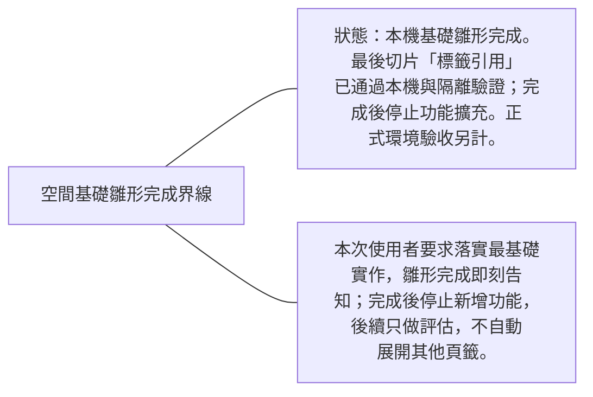
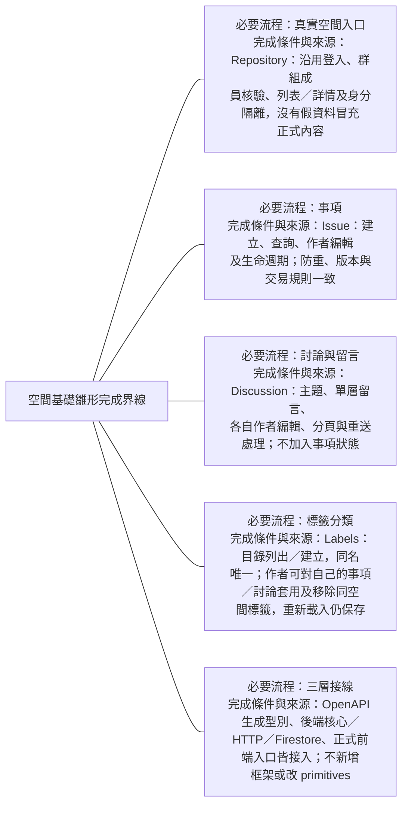
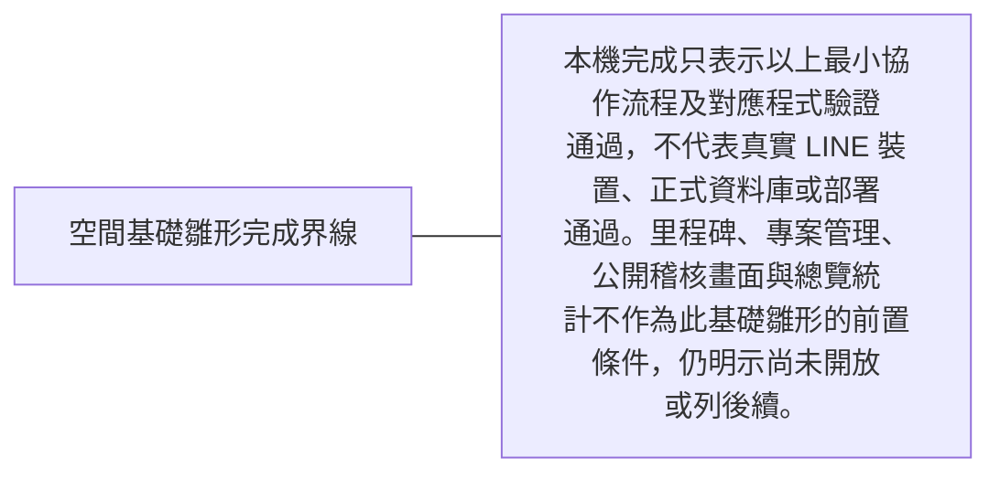
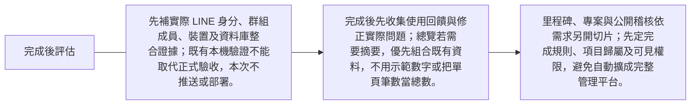
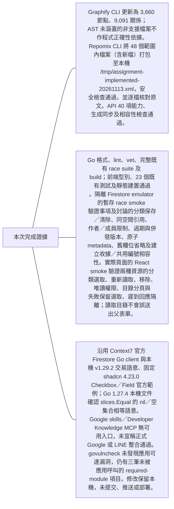
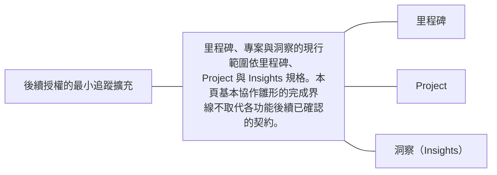

# 空間基礎雛形完成界線

```mermaid
flowchart LR
  h["空間基礎雛形完成界線"]
  h --- n0["狀態：本機基礎雛形完成。最後切片「標籤引用」<br/>已通過本機與隔離驗證；完成後停止功能擴充。正<br/>式環境驗收另計。"]
  h --- n1["本次使用者要求落實最基礎實作，雛形完成即刻告<br/>知；完成後停止新增功能，後續只做評估，不自動<br/>展開其他頁籤。"]
```

```mermaid
flowchart LR
  h["空間基礎雛形完成界線"]
  h --- n0["必要流程：真實空間入口<br/>完成條件與來源：Repository：沿用登入、群組成<br/>員核驗、列表／詳情及身分隔離，沒有假資料冒充<br/>正式內容"]
  click n0 "README.md"
  h --- n1["必要流程：事項<br/>完成條件與來源：Issue：建立、查詢、作者編輯<br/>及生命週期；防重、版本與交易規則一致"]
  click n1 "issue/design.md"
  h --- n2["必要流程：討論與留言<br/>完成條件與來源：Discussion：主題、單層留言、<br/>各自作者編輯、分頁與重送處理；不加入事項狀態"]
  click n2 "discussion/design.md"
  h --- n3["必要流程：標籤分類<br/>完成條件與來源：Labels：目錄列出／建立，同名<br/>唯一；作者可對自己的事項／討論套用及移除同空<br/>間標籤，重新載入仍保存"]
  click n3 "labels.md"
  h --- n4["必要流程：三層接線<br/>完成條件與來源：OpenAPI 生成型別、後端核心／<br/>HTTP／Firestore、正式前端入口皆接入；不新增<br/>框架或改 primitives"]
```

```mermaid
flowchart LR
  h["空間基礎雛形完成界線"]
  h --- n0["本機完成只表示以上最小協作流程及對應程式驗證<br/>通過，不代表真實 LINE 裝置、正式資料庫或部署<br/>通過。里程碑、專案管理、公開稽核畫面與總覽統<br/>計不作為此基礎雛形的前置條件，仍明示尚未開放<br/>或列後續。"]
```

```mermaid
flowchart LR
  h["完成後評估"]
  h --- n0["先補實際 LINE 身分、群組成員、裝置及資料庫整<br/>合證據；既有本機驗證不能取代正式驗收，本次不<br/>推送或部署。"]
  n0 --> n1["完成後先收集使用回饋與修正實際問題；總覽若需<br/>要摘要，優先組合既有資料，不用示範數字或把單<br/>頁筆數當總數。"]
  n1 --> n2["里程碑、專案與公開稽核依需求另開切片；先定完<br/>成規則、項目歸屬及可見權限，避免自動擴成完整<br/>管理平台。"]
```

```mermaid
flowchart LR
  h["本次完成證據"]
  h --- n0["Graphify CLI 更新為 3,660 節點、9,091 關係；<br/>AST 未涵蓋的非支援檔案不作程式正確性依據。<br/>Repomix CLI 將 48 個範圍內檔案（含新檔）打包<br/>至本機 <br/>/tmp/assignment-implemented-20261113.xml，安<br/>全檢查通過，並逐檔核對原文。API 40 項能力、<br/>生成同步及相容性檢查通過。"]
  h --- n1["Go 格式、lint、vet、完整既有 race suite 及 <br/>build；前端型別、23 個既有測試及靜態建置通過<br/>。隔離 Firestore emulator 的暫存 race smoke <br/>驗證事項及討論的分類保存／清除、同空間引用、<br/>作者／成員限制、過期與併發版本、原子 <br/>metadata、舊欄位省略及建立收據／共用編號相容<br/>性。實際頁面的 React smoke 驗證兩種資源的分<br/>類選取、重新讀取、移除、唯讀權限、目錄分頁與<br/>失敗保留選取、遲到回應隔離；讀取目錄不會誤送<br/>出父表單。"]
  h --- n2["沿用 Context7 官方 Firestore Go client 與本<br/>機 v1.29.2 交易語意、固定 shadcn 4.23.0 <br/>Checkbox／Field 官方範例；Go 1.27.4 本機文件<br/>確認 slices.Equal 的 nil／空集合相等語意。<br/>Google skills／Developer Knowledge MCP 無可<br/>用入口，未宣稱正式 Google 或 LINE 整合通過。<br/>govulncheck 未發現應用可達漏洞，仍有三筆未被<br/>應用呼叫的 required-module 項目。修改保留本<br/>機，未提交、推送或部署。"]
```

```mermaid
flowchart LR
  h["後續授權的最小追蹤擴充"]
  h --- n0["里程碑、專案與洞察的現行範圍依里程碑、<br/>Project 與 Insights 規格。本頁基本協作雛形的完成界<br/>線不取代各功能後續已確認的契約。"]
  n0 --- n0l0["里程碑"]
  click n0l0 "milestones.md"
  n0 --- n0l1["Project"]
  click n0l1 "../project/project.md"
  n0 --- n0l2["洞察（Insights）"]
  click n0l2 "insights.md"
```
