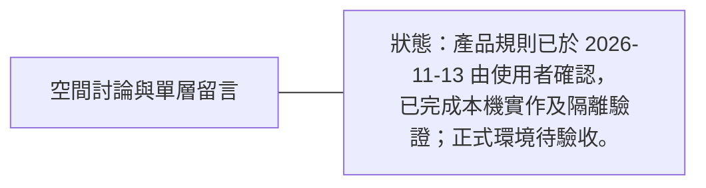
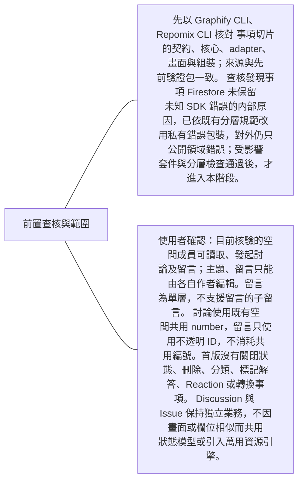
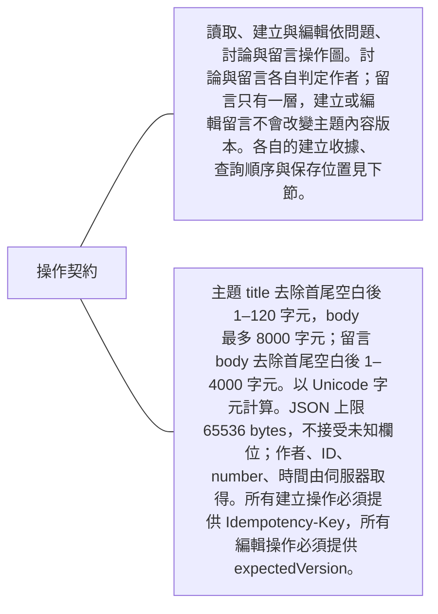
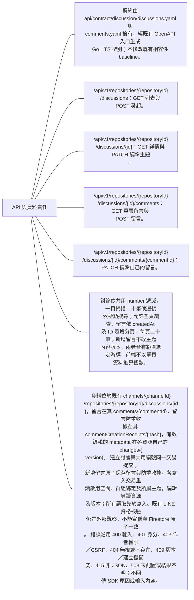
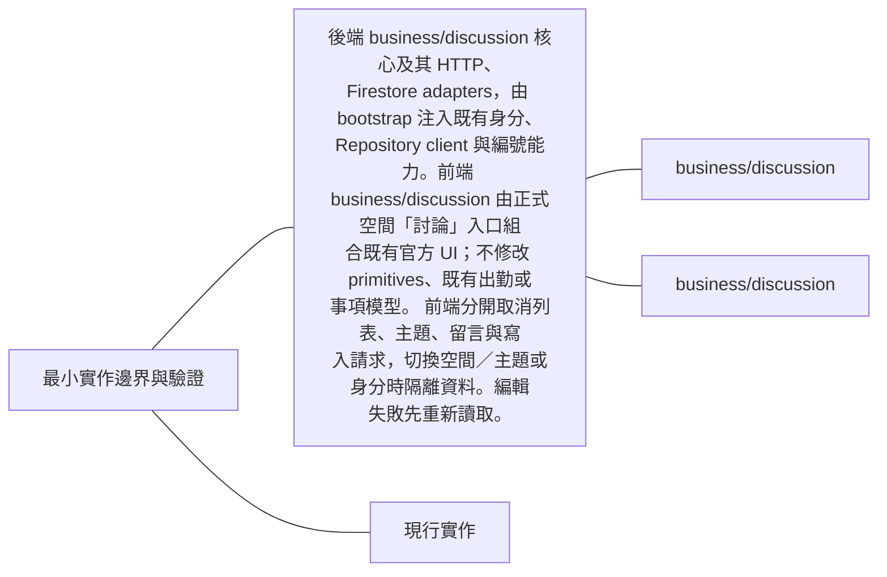
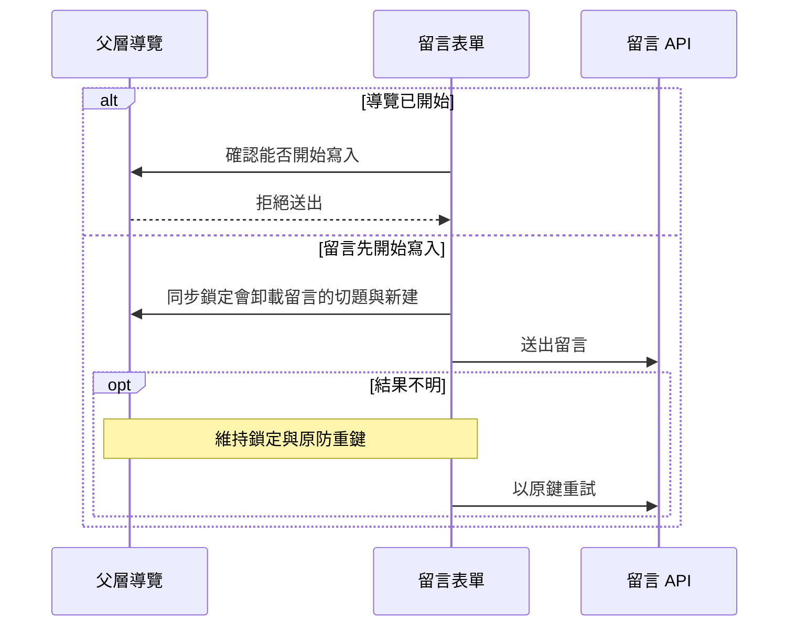
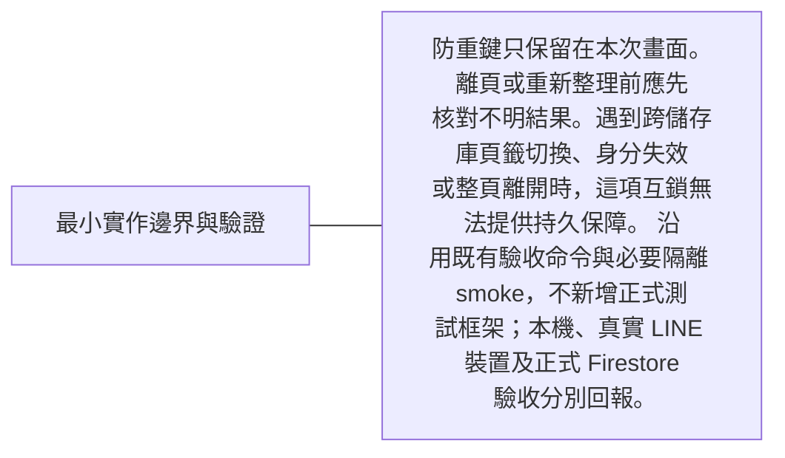
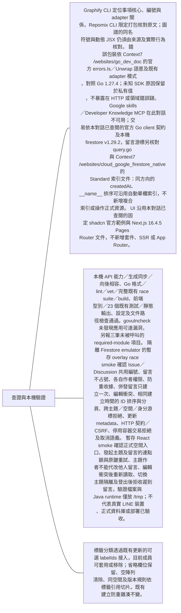

# 空間討論與單層留言

```mermaid
flowchart LR
  h["空間討論與單層留言"]
  h --- n0["狀態：產品規則已於 2026-11-13 由使用者確認，<br/>已完成本機實作及隔離驗證；正式環境待驗收。"]
```

```mermaid
flowchart LR
  h["前置查核與範圍"]
  h --- n0["先以 Graphify CLI、Repomix CLI 核對 事項切片<br/> 的契約、核心、adapter、畫面與組裝；來源與先<br/>前驗證包一致。 查核發現事項 Firestore 未保留<br/>未知 SDK 錯誤的內部原因，已依既有分層規範改<br/>用私有錯誤包裝，對外仍只公開領域錯誤；受影響<br/>套件與分層檢查通過後，才進入本階段。"]
  click n0 "../issue/design.md"
  h --- n1["使用者確認：目前核驗的空間成員可讀取、發起討<br/>論及留言；主題、留言只能由各自作者編輯。留言<br/>為單層，不支援留言的子留言。 討論使用既有空<br/>間共用 number，留言只使用不透明 ID，不消耗共<br/>用編號。首版沒有關閉狀態、刪除、分類、標記解<br/>答、Reaction 或轉換事項。 Discussion 與 <br/>Issue 保持獨立業務，不因畫面或欄位相似而共用<br/>狀態模型或引入萬用資源引擎。"]
```

```mermaid
flowchart LR
  h["操作契約"]
  h --- n0["讀取、建立與編輯依問題、討論與留言操作圖。討<br/>論與留言各自判定作者；留言只有一層，建立或編<br/>輯留言不會改變主題內容版本。各自的建立收據、<br/>查詢順序與保存位置見下節。"]
  click n0 "../issue/design.md#操作契約"
  h --- n1["主題 title 去除首尾空白後 1–120 字元，body <br/>最多 8000 字元；留言 body 去除首尾空白後 1–<br/>4000 字元。以 Unicode 字元計算。JSON 上限 <br/>65536 bytes，不接受未知欄位；作者、ID、<br/>number、時間由伺服器取得。所有建立操作必須提<br/>供 Idempotency-Key，所有編輯操作必須提供 <br/>expectedVersion。"]
```

```mermaid
flowchart LR
  h["API 與資料責任"]
  h --- n0["契約由 <br/>api/contract/discussion/discussions.yaml 與 <br/>comments.yaml 擁有，經既有 OpenAPI 入口生成 <br/>Go／TS 型別；不修改既有相容性 baseline。"]
  h --- n1["/api/v1/repositories/{repositoryId}<br/>/discussions：GET 列表與 POST 發起。"]
  h --- n2["/api/v1/repositories/{repositoryId}<br/>/discussions/{id}：GET 詳情與 PATCH 編輯主題<br/>。"]
  h --- n3["/api/v1/repositories/{repositoryId}<br/>/discussions/{id}/comments：GET 單層留言與 <br/>POST 留言。"]
  h --- n4["/api/v1/repositories/{repositoryId}<br/>/discussions/{id}/comments/{commentId}：<br/>PATCH 編輯自己的留言。"]
  h --- n5["討論依共用 number 遞減，一頁掃描二十筆候選後<br/>依標題搜尋；允許空頁續查。留言依 createdAt <br/>及 ID 遞增分頁，每頁二十筆；新增留言不改主題<br/>內容版本。兩者皆有範圍綁定游標，前端不以單頁<br/>資料推算總數。"]
  h --- n6["資料位於既有 channels/{channelId}<br/>/repositories/{repositoryId}/discussions/{id<br/>}，留言在其 comments/{commentId}，留言防重收<br/>據在其 commentCreationReceipts/{hash}，有效<br/>編輯的 metadata 在各資源自己的 changes/{<br/>version}。 建立討論與共用編號同一交易提交；<br/>新增留言原子保存留言與防重收據。各寫入交易重<br/>讀啟用空間、群組綁定及所屬主題，編輯另讀資源<br/>及版本；所有讀取先於寫入。既有 LINE 資格核驗<br/>仍是外部觀察，不能宣稱與 Firestore 原子一致<br/>。 錯誤沿用 400 輸入、401 身分、403 作者權限<br/>／CSRF、404 無權或不存在、409 版本／建立鍵衝<br/>突、415 非 JSON、503 未配置或結果不明；不回<br/>傳 SDK 原因或輸入內容。"]
```

```mermaid
flowchart LR
  h["最小實作邊界與驗證"]
  h --- n0["後端 business/discussion 核心及其 HTTP、<br/>Firestore adapters，由 bootstrap 注入既有身分、<br/>Repository client 與編號能力。前端 <br/>business/discussion 由正式空間「討論」入口組<br/>合既有官方 UI；不修改 primitives、既有出勤或<br/>事項模型。 前端分開取消列表、主題、留言與寫<br/>入請求，切換空間／主題或身分時隔離資料。編輯<br/>失敗先重新讀取。"]
  n0 --- n0l0["business/discussion"]
  click n0l0 "../../../../backend/internal/business/discussion/application/service.go"
  n0 --- n0l1["business/discussion"]
  click n0l1 "../../../../frontend/miniapp/src/business/discussion/View.tsx"
  h --- n1["現行實作"]
```

```mermaid
sequenceDiagram
  participant N as 父層導覽
  participant C as 留言表單
  participant A as 留言 API
  alt 導覽已開始
    C->>N: 確認能否開始寫入
    N-->>C: 拒絕送出
  else 留言先開始寫入
    C->>N: 同步鎖定會卸載留言的切題與新建
    C->>A: 送出留言
    opt 結果不明
      Note over N,C: 維持鎖定與原防重鍵
      C->>A: 以原鍵重試
    end
  end
```

```mermaid
flowchart LR
  h["最小實作邊界與驗證"]
  h --- n0["防重鍵只保留在本次畫面。離頁或重新整理前應先<br/>核對不明結果。遇到跨儲存庫頁籤切換、身分失效<br/>或整頁離開時，這項互鎖無法提供持久保障。 沿<br/>用既有驗收命令與必要隔離 smoke，不新增正式測<br/>試框架；本機、真實 LINE 裝置及正式 Firestore<br/> 驗收分別回報。"]
```

```mermaid
flowchart LR
  h["查證與本機驗證"]
  h --- n0["Graphify CLI 定位事項核心、編號與 adapter 關<br/>係，Repomix CLI 限定打包核對原文；圖譜的同名<br/>符號與動態 JSX 仍須由來源及實際行為核對。 錯<br/>誤包裝依 Context7 /websites/go_dev_doc 的官<br/>方 errors.Is／Unwrap 語意及既有 adapter 模式<br/>，對照 Go 1.27.4；未知 SDK 原因保留於私有值<br/>，不暴露在 HTTP 或領域錯誤鏈。 Google skills<br/>／Developer Knowledge MCP 在此對話不可用；交<br/>易依本對話已查閱的官方 Go client 契約及本機 <br/>firestore v1.29.2，留言游標另核對 query.go <br/>與 Context7 <br/>/websites/cloud_google_firestore_native 的 <br/>Standard 索引文件：同方向的 createdAt、<br/>__name__ 排序可沿用自動單欄索引，不新增複合<br/>索引或操作正式資源。 UI 沿用本對話已查閱的固<br/>定 shadcn 官方範例與 Next.js 16.4.5 Pages <br/>Router 文件，不新增套件、SSR 或 App Router。"]
  h --- n1["本機 API 能力／生成同步／向後相容、Go 格式／<br/>lint／vet／完整既有 race suite／build、前端<br/>型別／23 個既有測試／靜態輸出、設定及文件路<br/>徑檢查通過。govulncheck 未發現應用可達漏洞，<br/>另報三筆未被呼叫的 required-module 項目。 隔<br/>離 Firestore emulator 的暫存 overlay race <br/>smoke 確認 Issue／Discussion 共用編號、留言<br/>不占號、各自作者權限、防重收據、併發留言只建<br/>立一次、編輯衝突、相同建立時間的 ID 排序與分<br/>頁、跨主題／空間／身分游標拒絕、更新 <br/>metadata、HTTP 契約／CSRF、停用容器交易拒絕<br/>及取消語義。 暫存 React smoke 確認正式空間入<br/>口、發起主題及留言的連點鎖與原鍵重試、主題作<br/>者不能代改他人留言、編輯衝突後重新讀取、切換<br/>主題隔離及登出後拒收遲到留言。驗證檔案與 <br/>Java runtime 僅放 /tmp；不代表真實 LINE 裝置<br/>、正式資料庫或部署已驗收。"]
  h --- n2["標籤分類透過既有更新的可選 labelIds 接入，目前成員可套用或移除；省略欄位保留、空陣列<br/>清除、同空間及版本規則依 標籤引用切片。既有<br/>建立防重雜湊不變。"]
  click n2 "../labels.md#標籤引用切片"
```
