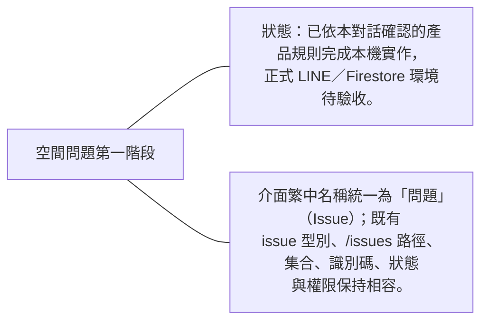
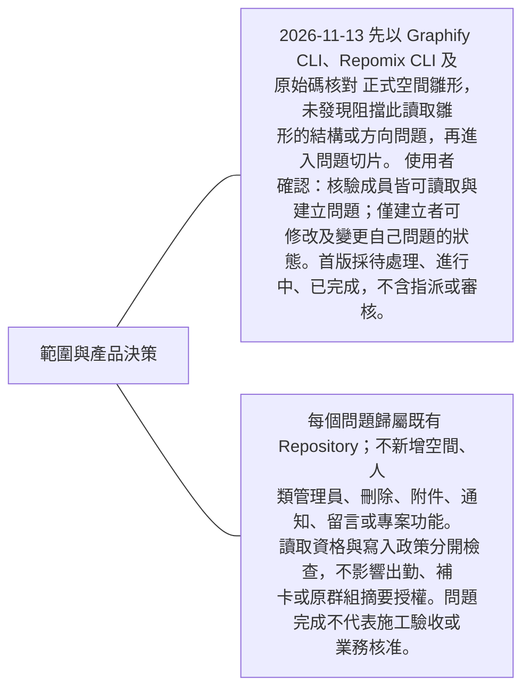
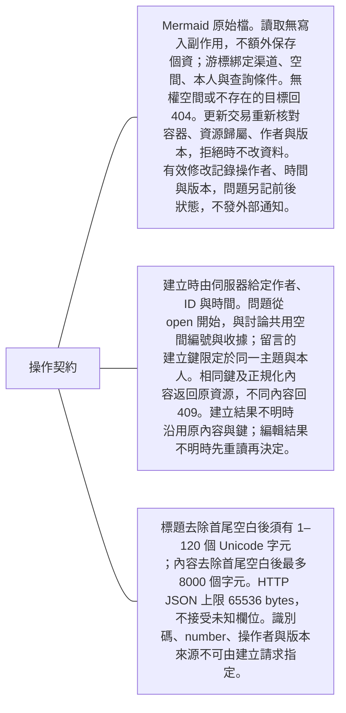
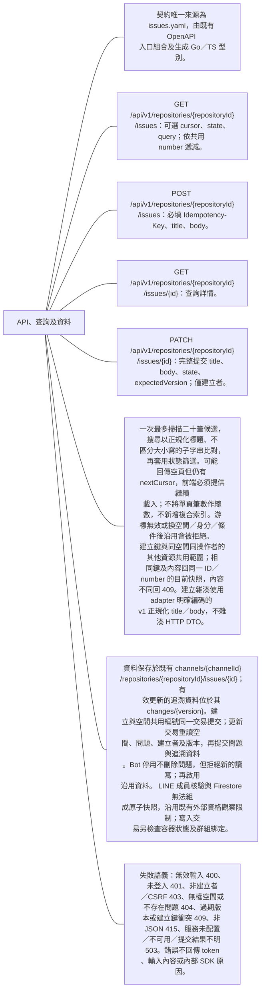
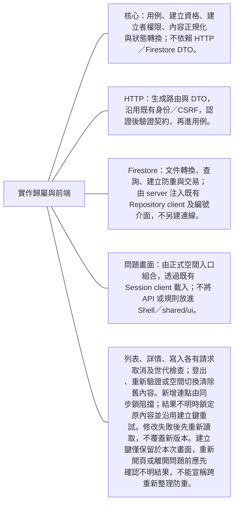
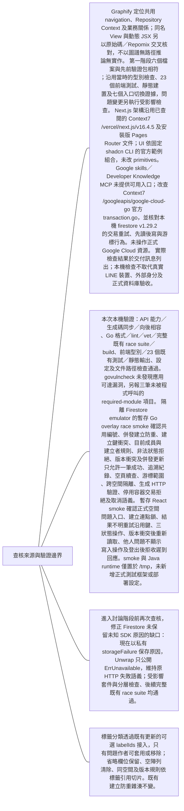

# 空間問題第一階段

```mermaid
flowchart LR
  h["空間問題第一階段"]
  h --- n0["狀態：已依本對話確認的產品規則完成本機實作，<br/>正式 LINE／Firestore 環境待驗收。"]
  h --- n1["介面繁中名稱統一為「問題」（Issue）；既有 <br/>issue 型別、/issues 路徑、集合、識別碼、狀態<br/>與權限保持相容。"]
```

```mermaid
flowchart LR
  h["範圍與產品決策"]
  h --- n0["2026-11-13 先以 Graphify CLI、Repomix CLI 及<br/>原始碼核對 正式空間雛形，未發現阻擋此讀取雛<br/>形的結構或方向問題，再進入問題切片。 使用者<br/>確認：核驗成員皆可讀取與建立問題；僅建立者可<br/>修改及變更自己問題的狀態。首版採待處理、進行<br/>中、已完成，不含指派或審核。"]
  click n0 "README.md#正式空間-ui-基礎雛形"
  h --- n1["每個問題歸屬既有 Repository；不新增空間、人<br/>類管理員、刪除、附件、通知、留言或專案功能。<br/> 讀取資格與寫入政策分開檢查，不影響出勤、補<br/>卡或原群組摘要授權。問題完成不代表施工驗收或<br/>業務核准。"]
```

## 操作契約

現行實作（問題、討論、留言）

[依目前成員身分、操作及資源作者判定讀寫結果（Mermaid 原始檔）](diagrams/repository-contributions.mermaid)

```mermaid
flowchart LR
  h["操作契約"]
  h --- n0["Mermaid 原始檔。讀取無寫入副作用，不額外保存<br/>個資；游標綁定渠道、空間、本人與查詢條件。無<br/>權空間或不存在的目標回 404。更新交易重新核對<br/>容器、資源歸屬、作者與版本，拒絕時不改資料。<br/>有效修改記錄操作者、時間與版本，問題另記前後<br/>狀態，不發外部通知。"]
  click n0 "diagrams/repository-contributions.mermaid"
  h --- n1["建立時由伺服器給定作者、ID 與時間。問題從 <br/>open 開始，與討論共用空間編號與收據；留言的<br/>建立鍵限定於同一主題與本人。相同鍵及正規化內<br/>容返回原資源，不同內容回 409。建立結果不明時<br/>沿用原內容與鍵；編輯結果不明時先重讀再決定。"]
  click n1 "numbering.md"
  h --- n2["標題去除首尾空白後須有 1–120 個 Unicode 字元<br/>；內容去除首尾空白後最多 8000 個字元。HTTP <br/>JSON 上限 65536 bytes，不接受未知欄位。識別<br/>碼、number、操作者與版本來源不可由建立請求指<br/>定。"]
```

```mermaid
flowchart LR
  h["API、查詢及資料"]
  h --- n0["契約唯一來源為 issues.yaml，由既有 OpenAPI <br/>入口組合及生成 Go／TS 型別。"]
  click n0 "../../../api/contract/issue/issues.yaml"
  h --- n1["GET /api/v1/repositories/{repositoryId}<br/>/issues：可選 cursor、state、query；依共用 <br/>number 遞減。"]
  h --- n2["POST /api/v1/repositories/{repositoryId}<br/>/issues：必填 Idempotency-Key、title、body。"]
  h --- n3["GET /api/v1/repositories/{repositoryId}<br/>/issues/{id}：查詢詳情。"]
  h --- n4["PATCH /api/v1/repositories/{repositoryId}<br/>/issues/{id}：完整提交 title、body、state、<br/>expectedVersion；僅建立者。"]
  h --- n5["一次最多掃描二十筆候選，搜尋以正規化標題、不<br/>區分大小寫的子字串比對，再套用狀態篩選。可能<br/>回傳空頁但仍有 nextCursor，前端必須提供繼續<br/>載入；不將單頁筆數作總數，不新增複合索引。游<br/>標無效或換空間／身分／條件後沿用會被拒絕。 <br/>建立鍵與同空間同操作者的其他資源共用範圍；相<br/>同鍵及內容回同一 ID／number 的目前快照，內容<br/>不同回 409。建立雜湊使用 adapter 明確編碼的 <br/>v1 正規化 title／body，不雜湊 HTTP DTO。"]
  h --- n6["資料保存於既有 channels/{channelId}<br/>/repositories/{repositoryId}/issues/{id}；有<br/>效更新的追溯資料位於其 changes/{version}。建<br/>立與空間共用編號同一交易提交；更新交易重讀空<br/>間、問題、建立者及版本，再提交問題與追溯資料<br/>。Bot 停用不刪除問題，但拒絕新的讀寫；再啟用<br/>沿用資料。 LINE 成員核驗與 Firestore 無法組<br/>成原子快照，沿用既有外部資格觀察限制；寫入交<br/>易另檢查容器狀態及群組綁定。"]
  h --- n7["失敗語義：無效輸入 400、未登入 401、非建立者<br/>／CSRF 403、無權空間或不存在問題 404、過期版<br/>本或建立鍵衝突 409、非 JSON 415、服務未配置<br/>／不可用／提交結果不明 503。錯誤不回傳 token<br/>、輸入內容或內部 SDK 原因。"]
```

```mermaid
flowchart LR
  h["實作歸屬與前端"]
  h --- n0["核心：用例、建立資格、建立者權限、內容正規化<br/>與狀態轉換；不依賴 HTTP／Firestore DTO。"]
  click n0 "../../../backend/internal/business/issue/issue.go"
  h --- n1["HTTP：生成路由與 DTO，沿用既有身份／CSRF，認<br/>證後驗證契約，再進用例。"]
  click n1 "../../../backend/internal/business/issue/http/routes.go"
  h --- n2["Firestore：文件轉換、查詢、建立防重與交易；<br/>由 server 注入既有 Repository client 及編號<br/>介面，不另建連線。"]
  click n2 "../../../backend/internal/business/issue/firestore/store.go"
  h --- n3["問題畫面：由正式空間入口組合，透過既有 <br/>Session client 載入；不將 API 或規則放進 <br/>Shell／shared/ui。"]
  click n3 "../../../frontend/miniapp/src/business/issue/View.tsx"
  h --- n4["列表、詳情、寫入各有請求取消及世代檢查；登出<br/>、重新驗證或空間切換清除舊內容。新增連點由同<br/>步鎖阻擋；結果不明時鎖定原內容並沿用建立鍵重<br/>試。修改失敗後先重新讀取，不覆蓋新版本。建立<br/>鍵僅保留於本次畫面，重新開頁或離開問題前應先<br/>確認不明結果，不能宣稱跨重新整理防重。"]
```

```mermaid
flowchart LR
  h["查核來源與驗證邊界"]
  h --- n0["Graphify 定位共用 navigation、Repository <br/>Context 及業務關係；同名 View 與動態 JSX 另<br/>以原始碼／Repomix 交叉核對，不以圖譜無路徑推<br/>論無實作。 第一階段六個檔案與先前驗證包相符<br/>；沿用當時的型別檢查、23 個前端測試、靜態建<br/>置及七個入口切換證據，問題變更另執行受影響檢<br/>查。 Next.js 架構沿用已查閱的 Context7 <br/>/vercel/next.js/v16.4.5 及安裝版 Pages <br/>Router 文件；UI 依固定 shadcn CLI 的官方範例<br/>組合，未改 primitives。 Google skills／<br/>Developer Knowledge MCP 未提供可用入口；改查<br/> Context7 /googleapis/google-cloud-go 官方 <br/>transaction.go，並核對本機 firestore v1.29.2<br/> 的交易重試、先讀後寫與游標行為。未操作正式 <br/>Google Cloud 資源。 實際檢查結果於交付訊息列<br/>出；本機檢查不取代真實 LINE 裝置、外部身分及<br/>正式資料庫驗收。"]
  h --- n1["本次本機驗證：API 能力／生成碼同步／向後相容<br/>、Go 格式／lint／vet／完整既有 race suite／<br/>build、前端型別／23 個既有測試／靜態輸出、設<br/>定及文件路徑檢查通過。govulncheck 未發現應用<br/>可達漏洞，另報三筆未被程式呼叫的 <br/>required-module 項目。 隔離 Firestore <br/>emulator 的暫存 Go overlay race smoke 確認共<br/>用編號、併發建立防重、建立鍵衝突、目前成員與<br/>建立者規則、非法狀態拒絕、版本衝突及併發更新<br/>只允許一筆成功、追溯紀錄、空頁續查、游標範圍<br/>、跨空間隔離、生成 HTTP 驗證、停用容器交易拒<br/>絕及取消語義。 暫存 React smoke 確認正式空間<br/>問題入口、建立連點鎖、結果不明重試沿用鍵、三<br/>狀態操作、版本衝突後重新讀取、他人問題不顯示<br/>寫入操作及登出後拒收遲到回應。smoke 與 Java <br/>runtime 僅置於 /tmp，未新增正式測試框架或部<br/>署設定。"]
  h --- n2["進入討論階段前再次查核，修正 Firestore 未保<br/>留未知 SDK 原因的缺口：現在以私有 <br/>storageFailure 保存原因，Unwrap 只公開 <br/>ErrUnavailable，維持原 HTTP 失敗語義；受影響<br/>套件與分層檢查、後續完整既有 race suite 均通<br/>過。"]
  h --- n3["標籤分類透過既有更新的可選 labelIds 接入，只<br/>有問題作者可套用或移除；省略欄位保留、空陣列<br/>清除、同空間及版本規則依 標籤引用切片。既有<br/>建立防重雜湊不變。"]
  click n3 "labels.md#標籤引用切片"
```
