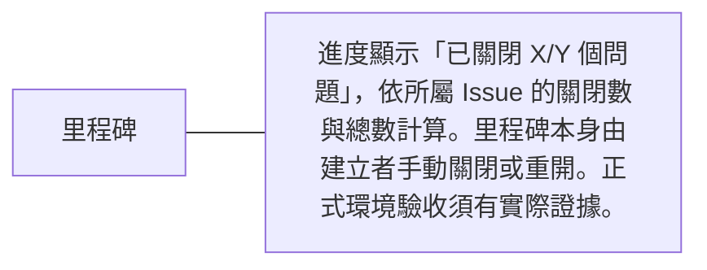
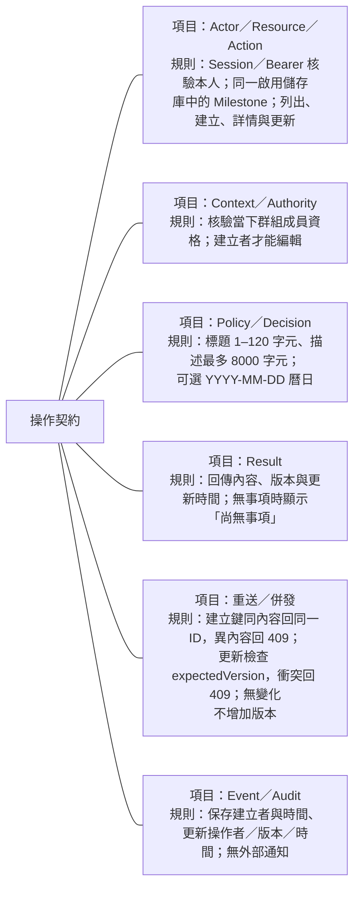
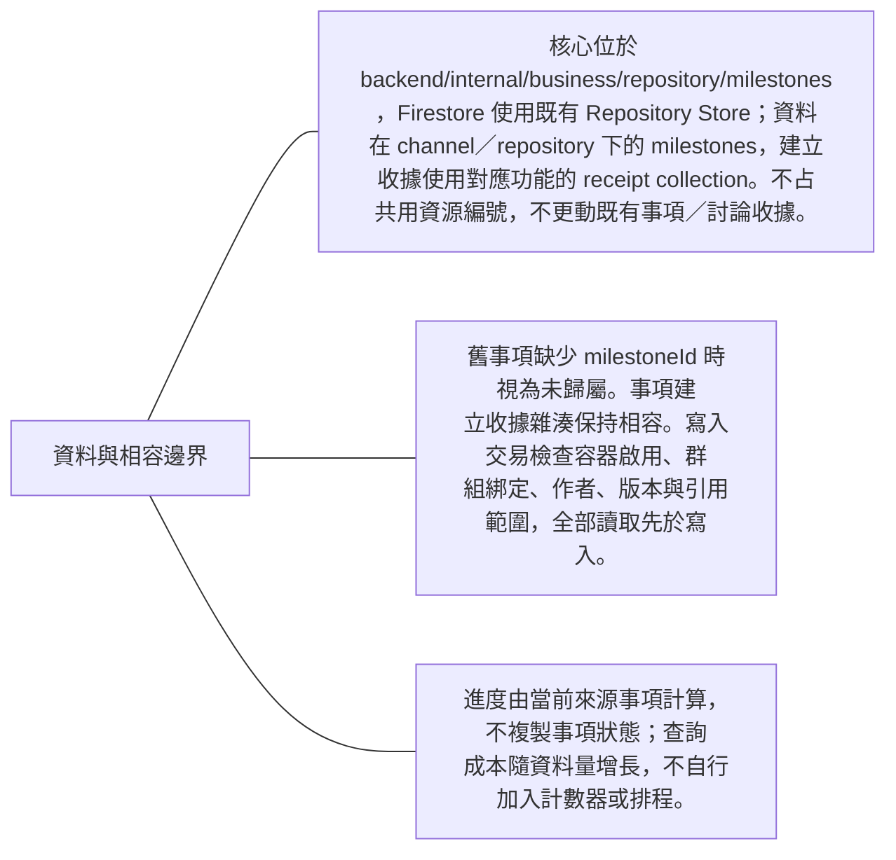
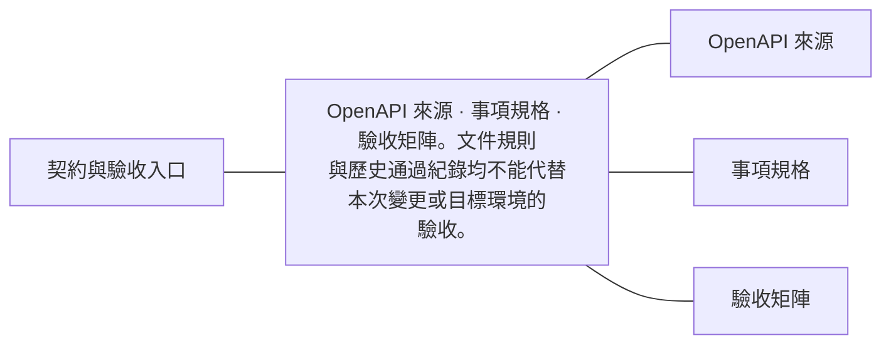

# 里程碑

```mermaid
flowchart LR
  h["里程碑"]
  h --- n0["進度顯示「已關閉 X/Y 個問題」，依所屬 Issue 的關閉數與總數計算。里程碑本身由建立者手動關閉或重開。正式環境驗收須有實際證據。"]
  click n0 "labels.md#標籤引用切片"
```

```mermaid
flowchart LR
  h["操作契約"]
  h --- n0["項目：Actor／Resource／Action<br/>規則：Session／Bearer 核驗本人；同一啟用儲存<br/>庫中的 Milestone；列出、建立、詳情與更新"]
  h --- n1["項目：Context／Authority<br/>規則：核驗當下群組成員資格；建立者才能編輯"]
  h --- n2["項目：Policy／Decision<br/>規則：標題 1–120 字元、描述最多 8000 字元；<br/>可選 YYYY-MM-DD 曆日"]
  h --- n3["項目：Result<br/>規則：回傳內容、版本與更新時間；無事項時顯示<br/>「尚無事項」"]
  h --- n4["項目：重送／併發<br/>規則：建立鍵同內容回同一 ID，異內容回 409；<br/>更新檢查 expectedVersion，衝突回 409；無變化<br/>不增加版本"]
  h --- n5["項目：Event／Audit<br/>規則：保存建立者與時間、更新操作者／版本／時<br/>間；無外部通知"]
```

```mermaid
flowchart LR
  h["資料與相容邊界"]
  h --- n0["核心位於 <br/>backend/internal/business/repository/milestones<br/>，Firestore 使用既有 Repository Store；資料<br/>在 channel／repository 下的 milestones，建立<br/>收據使用對應功能的 receipt collection。不占<br/>共用資源編號，不更動既有事項／討論收據。"]
  h --- n1["舊事項缺少 milestoneId 時視為未歸屬。事項建<br/>立收據雜湊保持相容。寫入交易檢查容器啟用、群<br/>組綁定、作者、版本與引用範圍，全部讀取先於寫<br/>入。"]
  h --- n2["進度由當前來源事項計算，不複製事項狀態；查詢<br/>成本隨資料量增長，不自行加入計數器或排程。"]
```

```mermaid
flowchart LR
  h["契約與驗收入口"]
  h --- n0["OpenAPI 來源 · 事項規格 · 驗收矩陣。文件規則<br/>與歷史通過紀錄均不能代替本次變更或目標環境的<br/>驗收。"]
  n0 --- n0l0["OpenAPI 來源"]
  click n0l0 "../../../api/contract/repository/milestones.yaml"
  n0 --- n0l1["事項規格"]
  click n0l1 "issue/design.md"
  n0 --- n0l2["驗收矩陣"]
  click n0l2 "../../development/acceptance.md"
```
