# repository-共用資源編號基礎

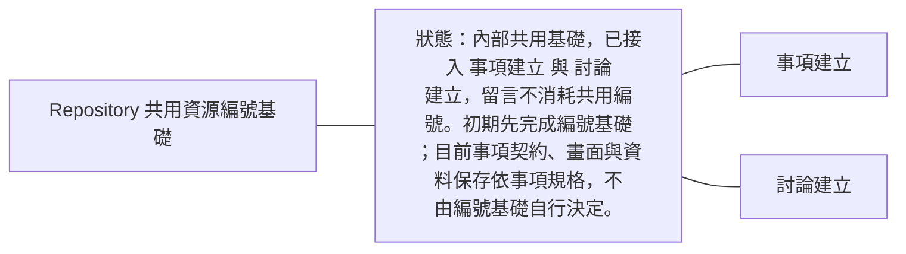
```mermaid
flowchart LR
  h["Repository 共用資源編號基礎"]
  h --- n0["狀態：內部共用基礎，已接入 事項建立 與 討論<br/>建立，留言不消耗共用編號。初期先完成編號基礎<br/>；目前事項契約、畫面與資料保存依事項規格，不<br/>由編號基礎自行決定。"]
  n0 --- n0l0["事項建立"]
  click n0l0 "issue/design.md"
  n0 --- n0l1["討論建立"]
  click n0l1 "discussion/design.md"
```

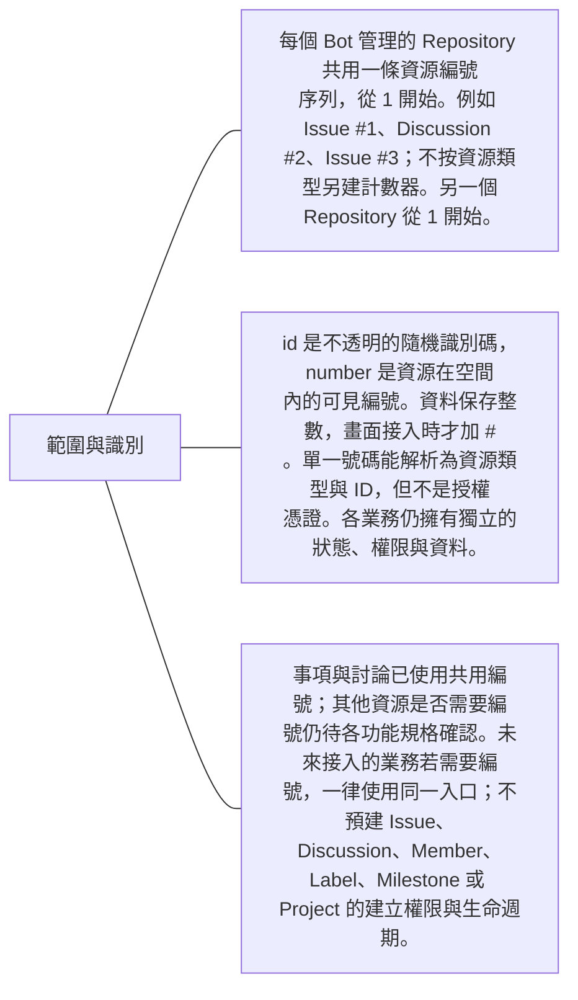
```mermaid
flowchart LR
  h["範圍與識別"]
  h --- n0["每個 Bot 管理的 Repository 共用一條資源編號<br/>序列，從 1 開始。例如 Issue #1、Discussion <br/>#2、Issue #3；不按資源類型另建計數器。另一個<br/> Repository 從 1 開始。"]
  h --- n1["id 是不透明的隨機識別碼，number 是資源在空間<br/>內的可見編號。資料保存整數，畫面接入時才加 #<br/>。單一號碼能解析為資源類型與 ID，但不是授權<br/>憑證。各業務仍擁有獨立的狀態、權限與資料。"]
  h --- n2["事項與討論已使用共用編號；其他資源是否需要編<br/>號仍待各功能規格確認。未來接入的業務若需要編<br/>號，一律使用同一入口；不預建 Issue、<br/>Discussion、Member、Label、Milestone 或 <br/>Project 的建立權限與生命週期。"]
```

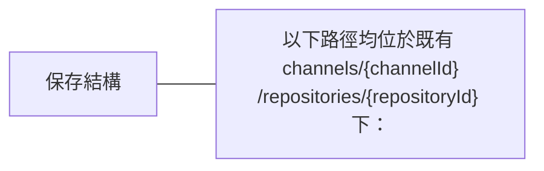
```mermaid
flowchart LR
  h["保存結構"]
  h --- n0["以下路徑均位於既有 channels/{channelId}<br/>/repositories/{repositoryId} 下："]
```

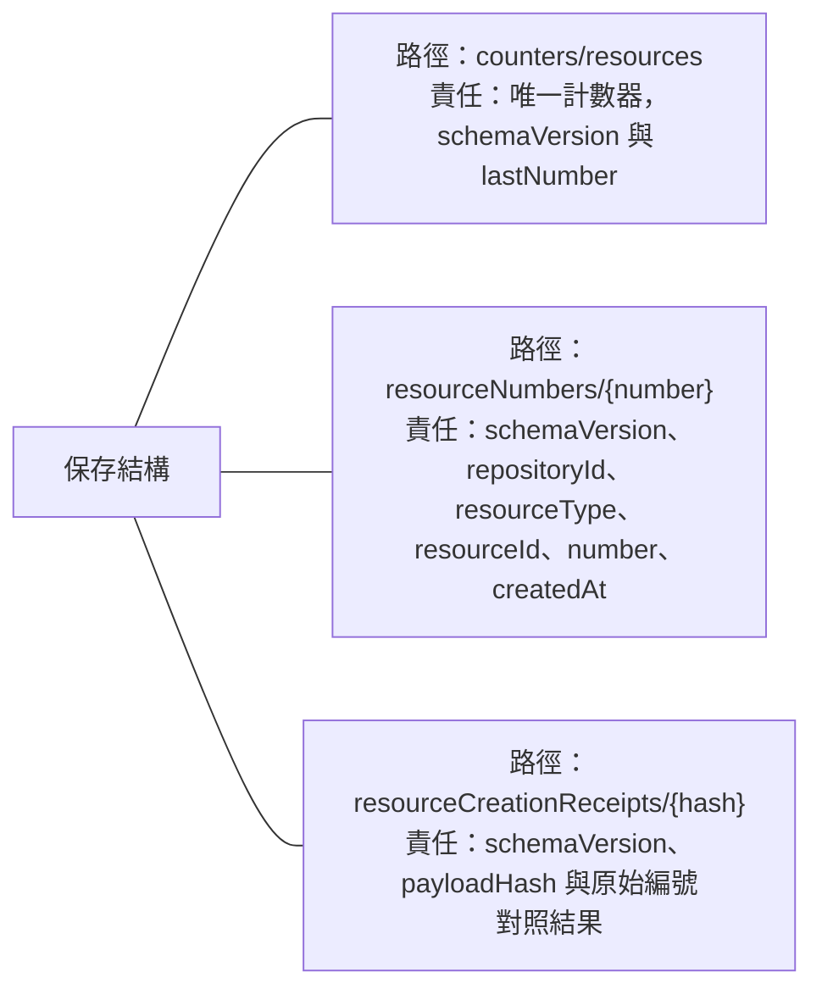
```mermaid
flowchart LR
  h["保存結構"]
  h --- n0["路徑：counters/resources<br/>責任：唯一計數器，schemaVersion 與 <br/>lastNumber"]
  h --- n1["路徑：resourceNumbers/{number}<br/>責任：schemaVersion、repositoryId、<br/>resourceType、resourceId、number、createdAt"]
  h --- n2["路徑：resourceCreationReceipts/{hash}<br/>責任：schemaVersion、payloadHash 與原始編號<br/>對照結果"]
```

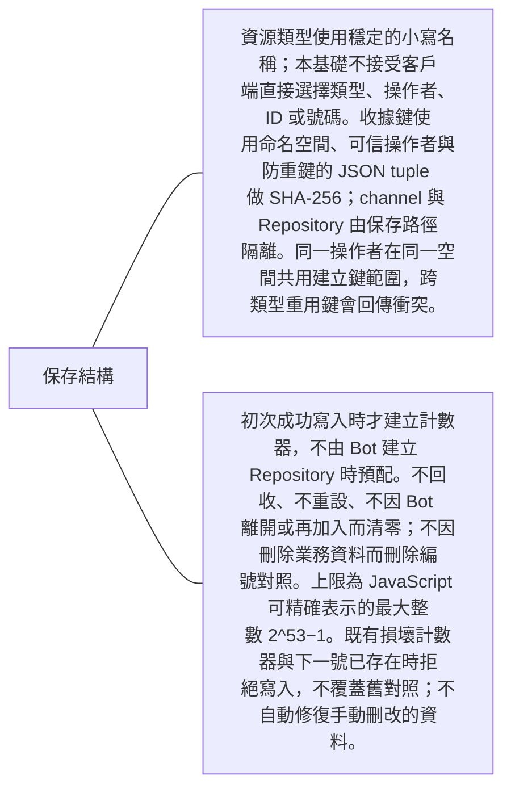
```mermaid
flowchart LR
  h["保存結構"]
  h --- n0["資源類型使用穩定的小寫名稱；本基礎不接受客戶<br/>端直接選擇類型、操作者、ID 或號碼。收據鍵使<br/>用命名空間、可信操作者與防重鍵的 JSON tuple <br/>做 SHA-256；channel 與 Repository 由保存路徑<br/>隔離。同一操作者在同一空間共用建立鍵範圍，跨<br/>類型重用鍵會回傳衝突。"]
  h --- n1["初次成功寫入時才建立計數器，不由 Bot 建立 <br/>Repository 時預配。不回收、不重設、不因 Bot <br/>離開或再加入而清零；不因刪除業務資料而刪除編<br/>號對照。上限為 JavaScript 可精確表示的最大整<br/>數 2^53−1。既有損壞計數器與下一號已存在時拒<br/>絕寫入，不覆蓋舊對照；不自動修復手動刪改的資<br/>料。"]
```

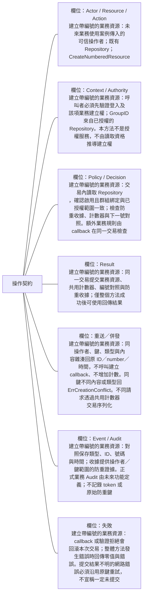
```mermaid
flowchart LR
  h["操作契約"]
  h --- n0["欄位：Actor / Resource / Action<br/>建立帶編號的業務資源：未來業務使用案例傳入的<br/>可信操作者；既有 Repository；<br/>CreateNumberedResource"]
  h --- n1["欄位：Context / Authority<br/>建立帶編號的業務資源：呼叫者必須先驗證登入及<br/>該項業務建立權；GroupID 來自已授權的 <br/>Repository。本方法不是授權服務，不由讀取資格<br/>推導建立權"]
  h --- n2["欄位：Policy / Decision<br/>建立帶編號的業務資源：交易內讀取 Repository<br/>，確認啟用且群組綁定與已授權範圍一致；檢查防<br/>重收據、計數器與下一號對照。額外業務規則由 <br/>callback 在同一交易檢查"]
  h --- n3["欄位：Result<br/>建立帶編號的業務資源：同一交易提交業務資源、<br/>共用計數器、編號對照與防重收據；僅整個方法成<br/>功後可使用回傳結果"]
  h --- n4["欄位：重送／併發<br/>建立帶編號的業務資源：同操作者、鍵、類型與內<br/>容雜湊回原 ID／number／時間，不呼叫建立 <br/>callback、不增加計數。同鍵不同內容或類型回 <br/>ErrCreationConflict。不同請求透過共用計數器<br/>交易序列化"]
  h --- n5["欄位：Event / Audit<br/>建立帶編號的業務資源：對照保存類型、ID、號碼<br/>與時間；收據提供操作者／鍵範圍的防重證據。正<br/>式業務 Audit 由未來功能定義；不記錄 token 或<br/>原始防重鍵"]
  h --- n6["欄位：失敗<br/>建立帶編號的業務資源：callback 或驗證拒絕會<br/>回滾本次交易；整體方法發生錯誤時回傳零值與錯<br/>誤。提交結果不明的網路錯誤必須沿用原鍵重試，<br/>不宣稱一定未提交"]
```

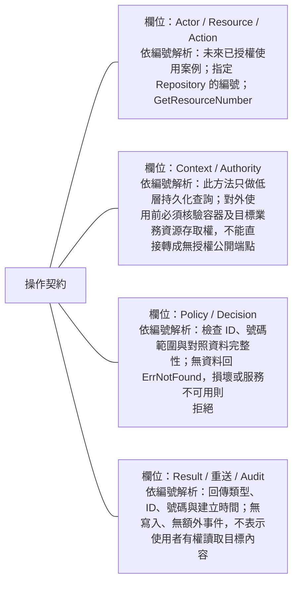
```mermaid
flowchart LR
  h["操作契約"]
  h --- n0["欄位：Actor / Resource / Action<br/>依編號解析：未來已授權使用案例；指定 <br/>Repository 的編號；GetResourceNumber"]
  h --- n1["欄位：Context / Authority<br/>依編號解析：此方法只做低層持久化查詢；對外使<br/>用前必須核驗容器及目標業務資源存取權，不能直<br/>接轉成無授權公開端點"]
  h --- n2["欄位：Policy / Decision<br/>依編號解析：檢查 ID、號碼範圍與對照資料完整<br/>性；無資料回 ErrNotFound，損壞或服務不可用則<br/>拒絕"]
  h --- n3["欄位：Result / 重送 / Audit<br/>依編號解析：回傳類型、ID、號碼與建立時間；無<br/>寫入、無額外事件，不表示使用者有權讀取目標內<br/>容"]
```

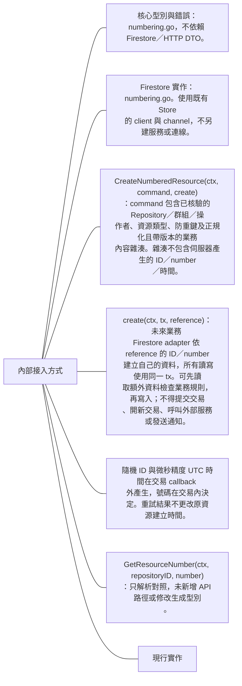
```mermaid
flowchart LR
  h["內部接入方式"]
  h --- n0["核心型別與錯誤：numbering.go，不依賴 <br/>Firestore／HTTP DTO。"]
  click n0 "../../../backend/internal/business/repository/domain/entity/numbering.go"
  h --- n1["Firestore 實作：numbering.go。使用既有 Store<br/> 的 client 與 channel，不另建服務或連線。"]
  click n1 "../../../backend/internal/business/repository/adapter/firestore/numbering.go"
  h --- n2["CreateNumberedResource(ctx, command, create)<br/>：command 包含已核驗的 Repository／群組／操<br/>作者、資源類型、防重鍵及正規化且帶版本的業務<br/>內容雜湊。雜湊不包含伺服器產生的 ID／number<br/>／時間。"]
  h --- n3["create(ctx, tx, reference)：未來業務 <br/>Firestore adapter 依 reference 的 ID／number<br/> 建立自己的資料，所有讀寫使用同一 tx。可先讀<br/>取額外資料檢查業務規則，再寫入；不得提交交易<br/>、開新交易、呼叫外部服務或發送通知。"]
  h --- n4["隨機 ID 與微秒精度 UTC 時間在交易 callback <br/>外產生，號碼在交易內決定。重試結果不更改原資<br/>源建立時間。"]
  h --- n5["GetResourceNumber(ctx, repositoryID, number)<br/>：只解析對照，未新增 API 路徑或修改生成型別<br/>。"]
  h --- n6["現行實作"]
```

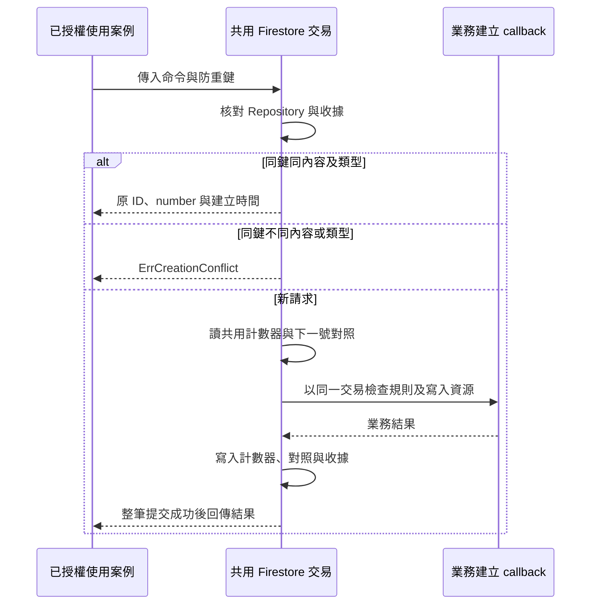
```mermaid
sequenceDiagram
  participant A as 已授權使用案例
  participant T as 共用 Firestore 交易
  participant C as 業務建立 callback
  A->>T: 傳入命令與防重鍵
  T->>T: 核對 Repository 與收據
  alt 同鍵同內容及類型
    T-->>A: 原 ID、number 與建立時間
  else 同鍵不同內容或類型
    T-->>A: ErrCreationConflict
  else 新請求
    T->>T: 讀共用計數器與下一號對照
    T->>C: 以同一交易檢查規則及寫入資源
    C-->>T: 業務結果
    T->>T: 寫入計數器、對照與收據
    T-->>A: 整筆提交成功後回傳結果
  end
```

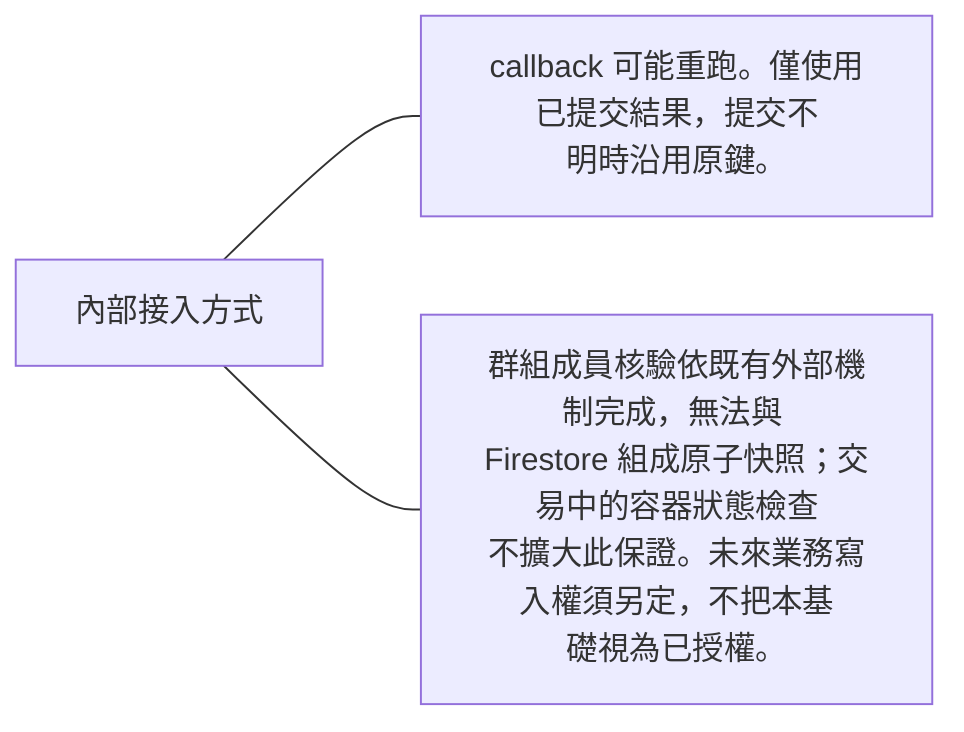
```mermaid
flowchart LR
  h["內部接入方式"]
  h --- n0["callback 可能重跑。僅使用已提交結果，提交不<br/>明時沿用原鍵。"]
  h --- n1["群組成員核驗依既有外部機制完成，無法與 <br/>Firestore 組成原子快照；交易中的容器狀態檢查<br/>不擴大此保證。未來業務寫入權須另定，不把本基<br/>礎視為已授權。"]
```

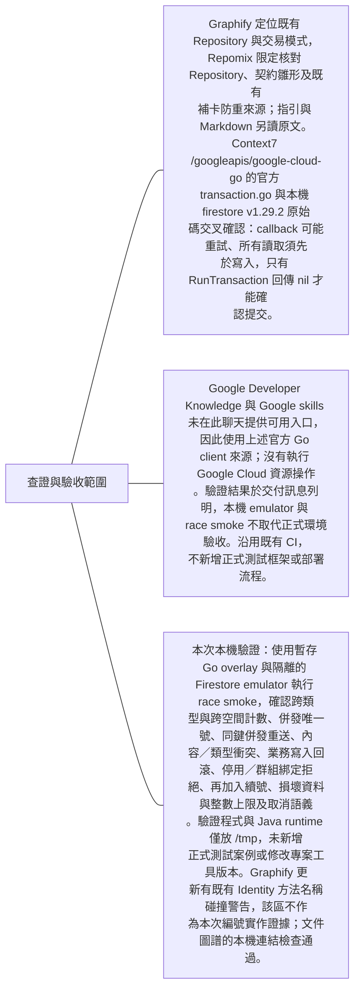
```mermaid
flowchart LR
  h["查證與驗收範圍"]
  h --- n0["Graphify 定位既有 Repository 與交易模式，<br/>Repomix 限定核對 Repository、契約雛形及既有<br/>補卡防重來源；指引與 Markdown 另讀原文。<br/>Context7 /googleapis/google-cloud-go 的官方 <br/>transaction.go 與本機 firestore v1.29.2 原始<br/>碼交叉確認：callback 可能重試、所有讀取須先<br/>於寫入，只有 RunTransaction 回傳 nil 才能確<br/>認提交。"]
  h --- n1["Google Developer Knowledge 與 Google skills <br/>未在此聊天提供可用入口，因此使用上述官方 Go <br/>client 來源；沒有執行 Google Cloud 資源操作<br/>。驗證結果於交付訊息列明，本機 emulator 與 <br/>race smoke 不取代正式環境驗收。沿用既有 CI，<br/>不新增正式測試框架或部署流程。"]
  h --- n2["本次本機驗證：使用暫存 Go overlay 與隔離的 <br/>Firestore emulator 執行 race smoke，確認跨類<br/>型與跨空間計數、併發唯一號、同鍵併發重送、內<br/>容／類型衝突、業務寫入回滾、停用／群組綁定拒<br/>絕、再加入續號、損壞資料與整數上限及取消語義<br/>。驗證程式與 Java runtime 僅放 /tmp，未新增<br/>正式測試案例或修改專案工具版本。Graphify 更<br/>新有既有 Identity 方法名稱碰撞警告，該區不作<br/>為本次編號實作證據；文件圖譜的本機連結檢查通<br/>過。"]
```
