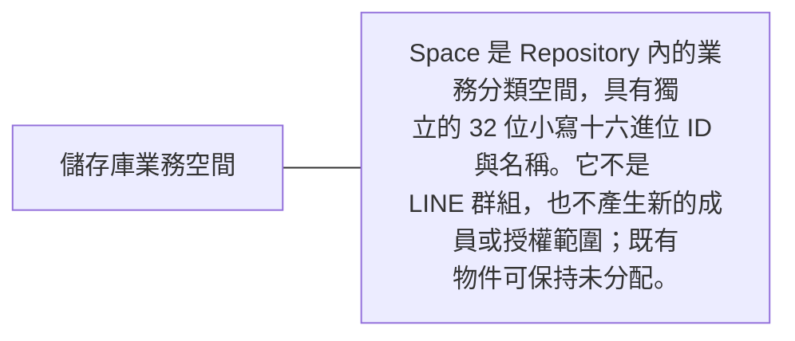
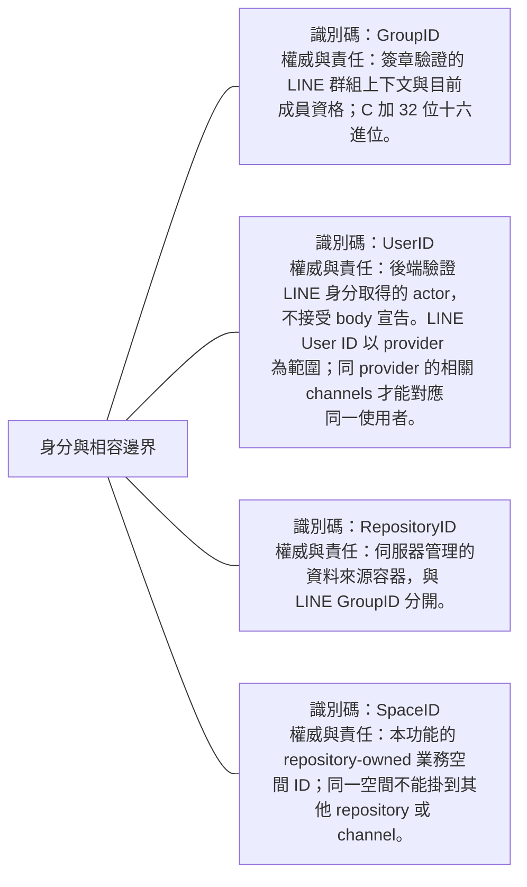
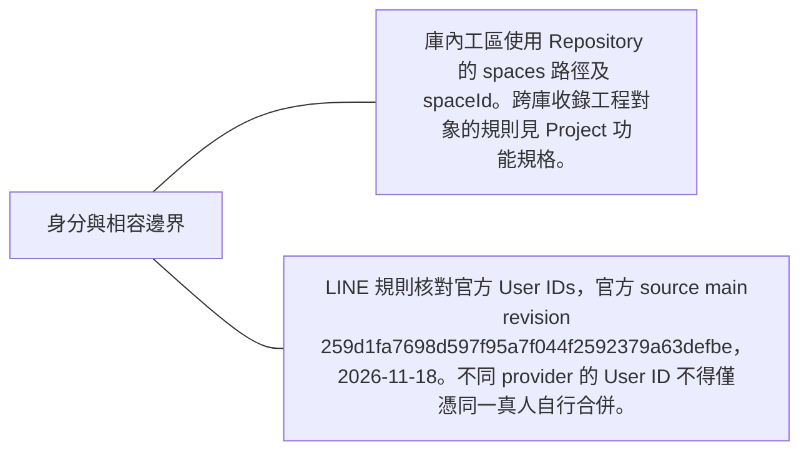
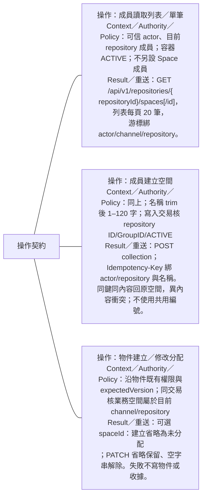
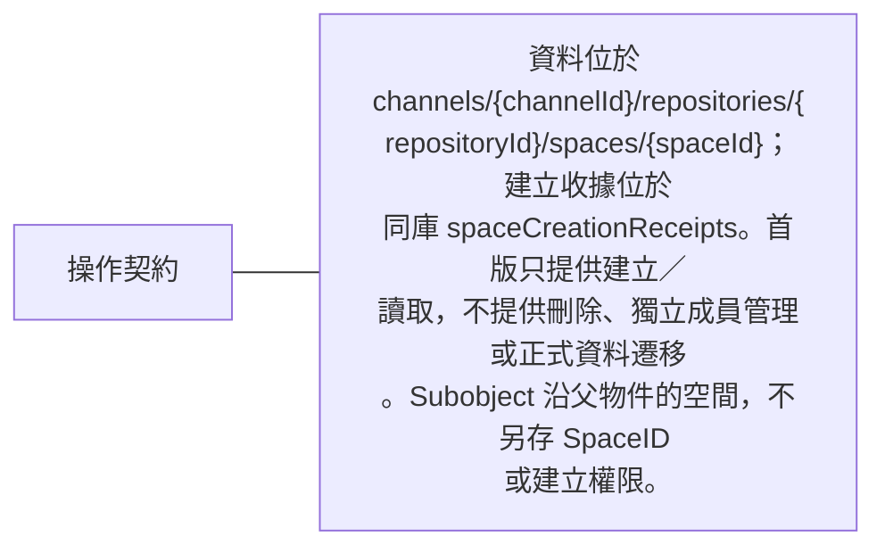
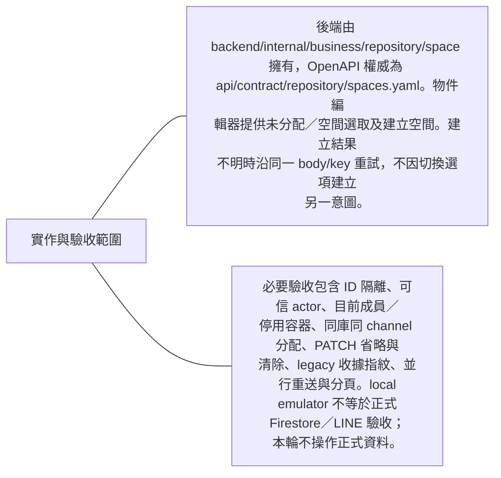

# 儲存庫業務空間

```mermaid
flowchart LR
  h["儲存庫業務空間"]
  h --- n0["Space 是 Repository 內的業務分類空間，具有獨<br/>立的 32 位小寫十六進位 ID 與名稱。它不是 <br/>LINE 群組，也不產生新的成員或授權範圍；既有<br/>物件可保持未分配。"]
```

```mermaid
flowchart LR
  h["身分與相容邊界"]
  h --- n0["識別碼：GroupID<br/>權威與責任：簽章驗證的 LINE 群組上下文與目前<br/>成員資格；C 加 32 位十六進位。"]
  h --- n1["識別碼：UserID<br/>權威與責任：後端驗證 LINE 身分取得的 actor，<br/>不接受 body 宣告。LINE User ID 以 provider <br/>為範圍；同 provider 的相關 channels 才能對應<br/>同一使用者。"]
  h --- n2["識別碼：RepositoryID<br/>權威與責任：伺服器管理的資料來源容器，與 <br/>LINE GroupID 分開。"]
  h --- n3["識別碼：SpaceID<br/>權威與責任：本功能的 repository-owned 業務空<br/>間 ID；同一空間不能掛到其他 repository 或 <br/>channel。"]
```

```mermaid
flowchart LR
  h["身分與相容邊界"]
  h --- n0["庫內工區使用 Repository 的 spaces 路徑及 <br/>spaceId。跨庫收錄工程對象的規則見 Project 功<br/>能規格。"]
  click n0 "../project.md"
  h --- n1["LINE 規則核對官方 User IDs，官方 source main<br/> revision <br/>259d1fa7698d597f95a7f044f2592379a63defbe，<br/>2026-11-18。不同 provider 的 User ID 不得僅<br/>憑同一真人自行合併。"]
  click n1 "https://developers.line.biz/en/docs/messaging-api/getting-user-ids/"
```

```mermaid
flowchart LR
  h["操作契約"]
  h --- n0["操作：成員讀取列表／單筆<br/>Context／Authority／Policy：可信 actor、目前<br/> repository 成員；容器 ACTIVE；不另設 Space <br/>成員<br/>Result／重送：GET /api/v1/repositories/{<br/>repositoryId}/spaces[/id]，列表每頁 20 筆，<br/>游標綁 actor/channel/repository。"]
  h --- n1["操作：成員建立空間<br/>Context／Authority／Policy：同上；名稱 trim <br/>後 1–120 字；寫入交易核 repository <br/>ID/GroupID/ACTIVE<br/>Result／重送：POST collection；<br/>Idempotency-Key 綁 actor/repository 與名稱。<br/>同鍵同內容回原空間，異內容衝突；不使用共用編<br/>號。"]
  h --- n2["操作：物件建立／修改分配<br/>Context／Authority／Policy：沿物件既有權限與<br/> expectedVersion；同交易核業務空間屬於目前 <br/>channel/repository<br/>Result／重送：可選 spaceId：建立省略為未分配<br/>；PATCH 省略保留、空字串解除。失敗不寫物件或<br/>收據。"]
```

```mermaid
flowchart LR
  h["操作契約"]
  h --- n0["資料位於 channels/{channelId}/repositories/{<br/>repositoryId}/spaces/{spaceId}；建立收據位於<br/>同庫 spaceCreationReceipts。首版只提供建立／<br/>讀取，不提供刪除、獨立成員管理或正式資料遷移<br/>。Subobject 沿父物件的空間，不另存 SpaceID <br/>或建立權限。"]
```

```mermaid
flowchart LR
  h["實作與驗收範圍"]
  h --- n0["後端由 <br/>backend/internal/business/repository/space <br/>擁有，OpenAPI 權威為 <br/>api/contract/repository/spaces.yaml。物件編<br/>輯器提供未分配／空間選取及建立空間。建立結果<br/>不明時沿同一 body/key 重試，不因切換選項建立<br/>另一意圖。"]
  h --- n1["必要驗收包含 ID 隔離、可信 actor、目前成員／<br/>停用容器、同庫同 channel 分配、PATCH 省略與<br/>清除、legacy 收據指紋、並行重送與分頁。local<br/> emulator 不等於正式 Firestore／LINE 驗收；<br/>本輪不操作正式資料。"]
```
