# 基礎群聊摘要

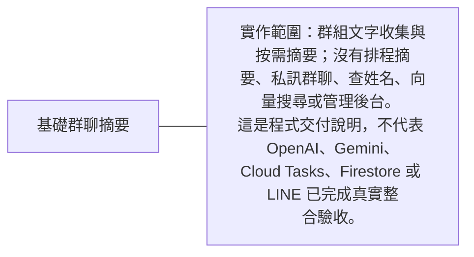
```mermaid
flowchart LR
  h["基礎群聊摘要"]
  h --- n0["實作範圍：群組文字收集與按需摘要；沒有排程摘<br/>要、私訊群聊、查姓名、向量搜尋或管理後台。 <br/>這是程式交付說明，不代表 OpenAI、Gemini、<br/>Cloud Tasks、Firestore 或 LINE 已完成真實整<br/>合驗收。"]
```

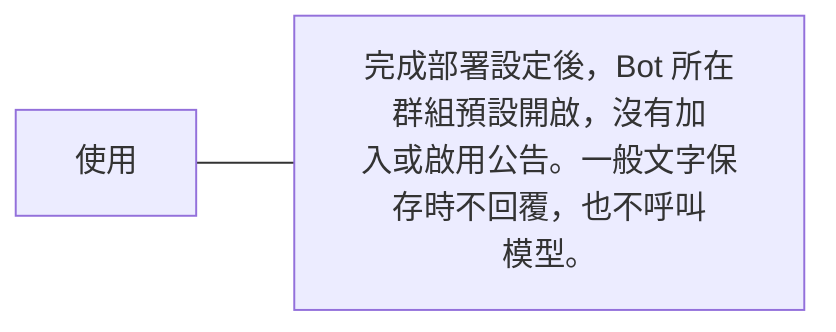
```mermaid
flowchart LR
  h["使用"]
  h --- n0["完成部署設定後，Bot 所在群組預設開啟，沒有加<br/>入或啟用公告。一般文字保存時不回覆，也不呼叫<br/>模型。"]
```

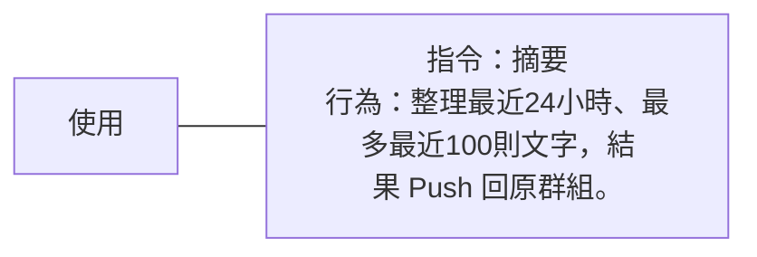
```mermaid
flowchart LR
  h["使用"]
  h --- n0["指令：摘要<br/>行為：整理最近24小時、最多最近100則文字，結<br/>果 Push 回原群組。"]
```

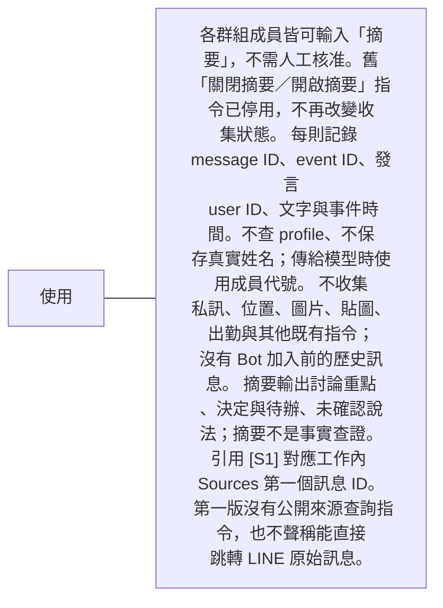
```mermaid
flowchart LR
  h["使用"]
  h --- n0["各群組成員皆可輸入「摘要」，不需人工核准。舊<br/>「關閉摘要／開啟摘要」指令已停用，不再改變收<br/>集狀態。 每則記錄 message ID、event ID、發言<br/> user ID、文字與事件時間。不查 profile、不保<br/>存真實姓名；傳給模型時使用成員代號。 不收集<br/>私訊、位置、圖片、貼圖、出勤與其他既有指令；<br/>沒有 Bot 加入前的歷史訊息。 摘要輸出討論重點<br/>、決定與待辦、未確認說法；摘要不是事實查證。<br/>引用 [S1] 對應工作內 Sources 第一個訊息 ID。<br/> 第一版沒有公開來源查詢指令，也不聲稱能直接<br/>跳轉 LINE 原始訊息。"]
```

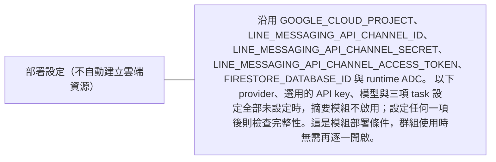
```mermaid
flowchart LR
  h["部署設定（不自動建立雲端資源）"]
  h --- n0["沿用 GOOGLE_CLOUD_PROJECT、<br/>LINE_MESSAGING_API_CHANNEL_ID、<br/>LINE_MESSAGING_API_CHANNEL_SECRET、<br/>LINE_MESSAGING_API_CHANNEL_ACCESS_TOKEN、<br/>FIRESTORE_DATABASE_ID 與 runtime ADC。 以下 <br/>provider、選用的 API key、模型與三項 task 設<br/>定全部未設定時，摘要模組不啟用；設定任何一項<br/>後則檢查完整性。這是模組部署條件，群組使用時<br/>無需再逐一開啟。"]
```

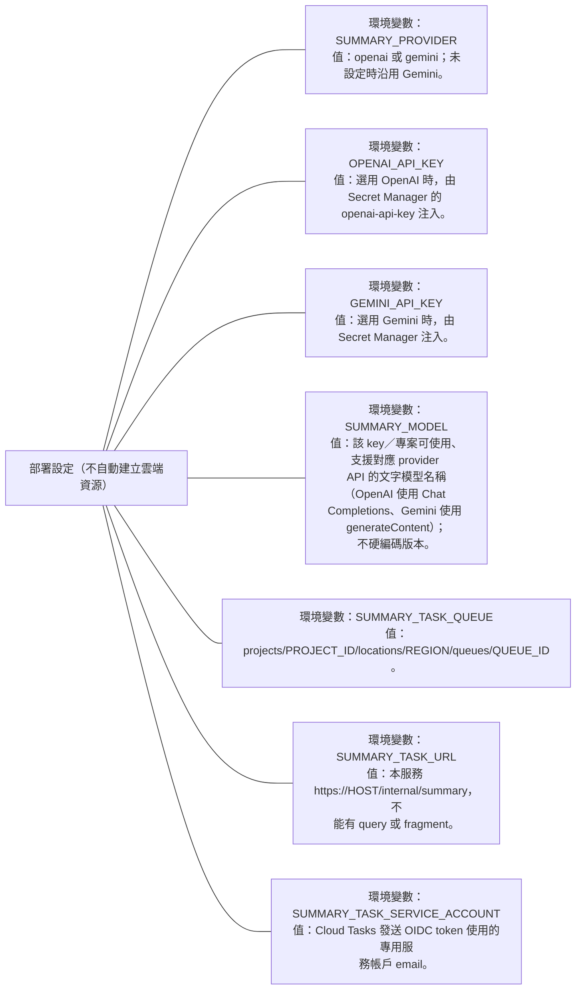
```mermaid
flowchart LR
  h["部署設定（不自動建立雲端資源）"]
  h --- n0["環境變數：SUMMARY_PROVIDER<br/>值：openai 或 gemini；未設定時沿用 Gemini。"]
  h --- n1["環境變數：OPENAI_API_KEY<br/>值：選用 OpenAI 時，由 Secret Manager 的 <br/>openai-api-key 注入。"]
  h --- n2["環境變數：GEMINI_API_KEY<br/>值：選用 Gemini 時，由 Secret Manager 注入。"]
  h --- n3["環境變數：SUMMARY_MODEL<br/>值：該 key／專案可使用、支援對應 provider <br/>API 的文字模型名稱（OpenAI 使用 Chat <br/>Completions、Gemini 使用 generateContent）；<br/>不硬編碼版本。"]
  h --- n4["環境變數：SUMMARY_TASK_QUEUE<br/>值：<br/>projects/PROJECT_ID/locations/REGION/queues/QUEUE_ID<br/>。"]
  h --- n5["環境變數：SUMMARY_TASK_URL<br/>值：本服務 https://HOST/internal/summary，不<br/>能有 query 或 fragment。"]
  h --- n6["環境變數：SUMMARY_TASK_SERVICE_ACCOUNT<br/>值：Cloud Tasks 發送 OIDC token 使用的專用服<br/>務帳戶 email。"]
```

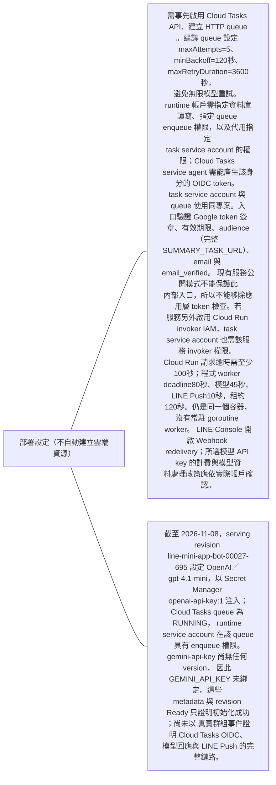
```mermaid
flowchart LR
  h["部署設定（不自動建立雲端資源）"]
  h --- n0["需事先啟用 Cloud Tasks API、建立 HTTP queue<br/>。建議 queue 設定 maxAttempts=5、<br/>minBackoff=120秒、maxRetryDuration=3600秒，<br/>避免無限模型重試。 runtime 帳戶需指定資料庫<br/>讀寫、指定 queue enqueue 權限，以及代用指定 <br/>task service account 的權限；Cloud Tasks <br/>service agent 需能產生該身分的 OIDC token。 <br/>task service account 與 queue 使用同專案。入<br/>口驗證 Google token 簽章、有效期限、audience<br/>（完整 SUMMARY_TASK_URL）、email 與 <br/>email_verified。 現有服務公開模式不能保護此<br/>內部入口，所以不能移除應用層 token 檢查。若<br/>服務另外啟用 Cloud Run invoker IAM，task <br/>service account 也需該服務 invoker 權限。 <br/>Cloud Run 請求逾時需至少100秒；程式 worker <br/>deadline80秒、模型45秒、LINE Push10秒，租約<br/>120秒。仍是同一個容器，沒有常駐 goroutine <br/>worker。 LINE Console 開啟 Webhook <br/>redelivery；所選模型 API key 的計費與模型資<br/>料處理政策應依實際帳戶確認。"]
  h --- n1["截至 2026-11-08，serving revision <br/>line-mini-app-bot-00027-695 設定 OpenAI／ <br/>gpt-4.1-mini，以 Secret Manager <br/>openai-api-key:1 注入；Cloud Tasks queue 為 <br/>RUNNING， runtime service account 在該 queue<br/> 具有 enqueue 權限。gemini-api-key 尚無任何 <br/>version， 因此 GEMINI_API_KEY 未綁定。這些 <br/>metadata 與 revision Ready 只證明初始化成功<br/>；尚未以 真實群組事件證明 Cloud Tasks OIDC、<br/>模型回應與 LINE Push 的完整鏈路。"]
```

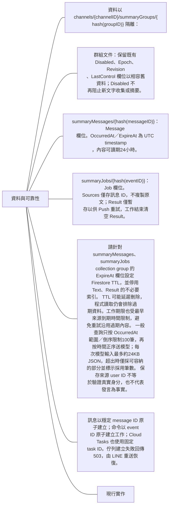
```mermaid
flowchart LR
  h["資料與可靠性"]
  h --- n0["資料以 channels/{channelID}/summaryGroups/{<br/>hash(groupID)} 隔離："]
  h --- n1["群組文件：保留既有 Disabled、Epoch、Revision<br/>、LastControl 欄位以相容舊資料；Disabled 不<br/>再阻止新文字收集或摘要。"]
  h --- n2["summaryMessages/{hash(messageID)}：Message <br/>欄位。OccurredAt／ExpireAt 為 UTC timestamp<br/>，內容可讀期24小時。"]
  h --- n3["summaryJobs/{hash(eventID)}：Job 欄位。<br/>Sources 僅存訊息 ID，不複製原文；Result 僅暫<br/>存以供 Push 重試，工作結束清空 Result。"]
  h --- n4["請針對 summaryMessages、summaryJobs <br/>collection group 的 ExpireAt 欄位設定 <br/>Firestore TTL，並停用 Text、Result 的不必要<br/>索引。 TTL 可能延遲刪除，程式讀取仍會排除過<br/>期資料。工作期限也受最早來源到期時間限制，避<br/>免重試沿用過期內容。 一般查詢只按 OccurredAt<br/> 範圍／倒序限制100筆，再按時間正序送模型；每<br/>次模型輸入最多約24KB JSON，超出時僅採可容納<br/>的部分並標示採用筆數。 保存來源 user ID 不等<br/>於驗證真實身分，也不代表發言為事實。"]
  h --- n5["訊息以穩定 message ID 原子建立；命令以 event<br/> ID 原子建立工作；Cloud Tasks 也使用固定 <br/>task ID。佇列建立失敗回傳503，由 LINE 重送恢<br/>復。"]
  h --- n6["現行實作"]
```

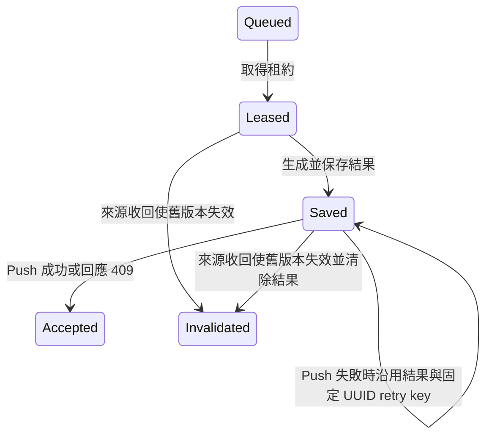
```mermaid
stateDiagram-v2
  Queued --> Leased: 取得租約
  Leased --> Saved: 生成並保存結果
  Saved --> Saved: Push 失敗時沿用結果與固定 UUID retry key
  Saved --> Accepted: Push 成功或回應 409
  Leased --> Invalidated: 來源收回使舊版本失效
  Saved --> Invalidated: 來源收回使舊版本失效並清除結果
```

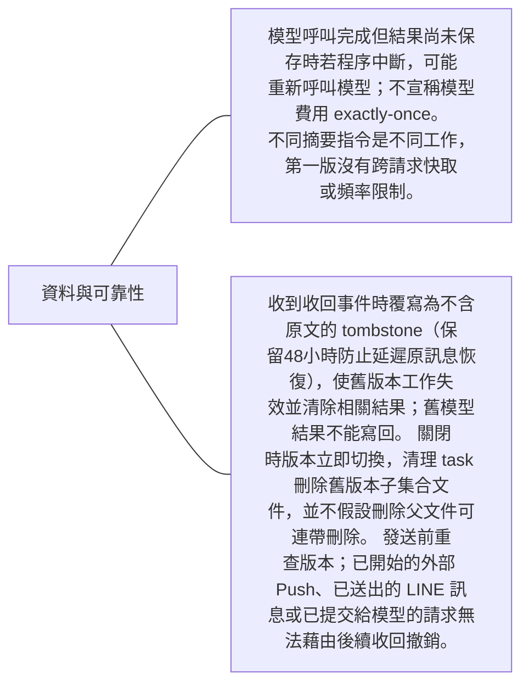
```mermaid
flowchart LR
  h["資料與可靠性"]
  h --- n0["模型呼叫完成但結果尚未保存時若程序中斷，可能<br/>重新呼叫模型；不宣稱模型費用 exactly-once。<br/>不同摘要指令是不同工作，第一版沒有跨請求快取<br/>或頻率限制。"]
  h --- n1["收到收回事件時覆寫為不含原文的 tombstone（保<br/>留48小時防止延遲原訊息恢復），使舊版本工作失<br/>效並清除相關結果；舊模型結果不能寫回。 關閉<br/>時版本立即切換，清理 task 刪除舊版本子集合文<br/>件，並不假設刪除父文件可連帶刪除。 發送前重<br/>查版本；已開始的外部 Push、已送出的 LINE 訊<br/>息或已提交給模型的請求無法藉由後續收回撤銷。"]
```

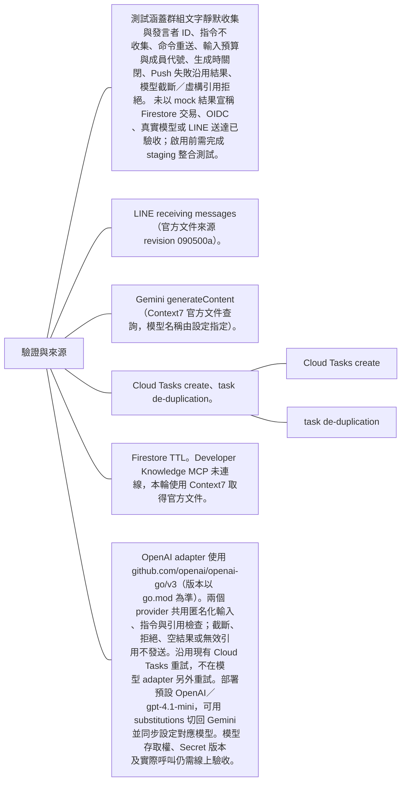
```mermaid
flowchart LR
  h["驗證與來源"]
  h --- n0["測試涵蓋群組文字靜默收集與發言者 ID、指令不<br/>收集、命令重送、輸入預算與成員代號、生成時關<br/>閉、Push 失敗沿用結果、模型截斷／虛構引用拒<br/>絕。 未以 mock 結果宣稱 Firestore 交易、OIDC<br/>、真實模型或 LINE 送達已驗收；啟用前需完成 <br/>staging 整合測試。"]
  h --- n1["LINE receiving messages（官方文件來源 <br/>revision 090500a）。"]
  click n1 "https://developers.line.biz/en/docs/messaging-api/receiving-messages/"
  h --- n2["Gemini generateContent（Context7 官方文件查<br/>詢，模型名稱由設定指定）。"]
  click n2 "https://ai.google.dev/gemini-api/docs/text-generation"
  h --- n3["Cloud Tasks create、task de-duplication。"]
  n3 --- n3l0["Cloud Tasks create"]
  click n3l0 "https://docs.cloud.google.com/tasks/docs/create-tasks"
  n3 --- n3l1["task de-duplication"]
  click n3l1 "https://docs.cloud.google.com/tasks/docs/reference/rest/v2/projects.locations.queues.tasks/create"
  h --- n4["Firestore TTL。Developer Knowledge MCP 未連<br/>線，本輪使用 Context7 取得官方文件。"]
  click n4 "https://docs.cloud.google.com/firestore/native/docs/ttl"
  h --- n5["OpenAI adapter 使用 <br/>github.com/openai/openai-go/v3（版本以 <br/>go.mod 為準）。兩個 provider 共用匿名化輸入<br/>、指令與引用檢查；截斷、拒絕、空結果或無效引<br/>用不發送。沿用現有 Cloud Tasks 重試，不在模<br/>型 adapter 另外重試。部署預設 OpenAI／<br/>gpt-4.1-mini，可用 substitutions 切回 Gemini<br/> 並同步設定對應模型。模型存取權、Secret 版本<br/>及實際呼叫仍需線上驗收。"]
```
