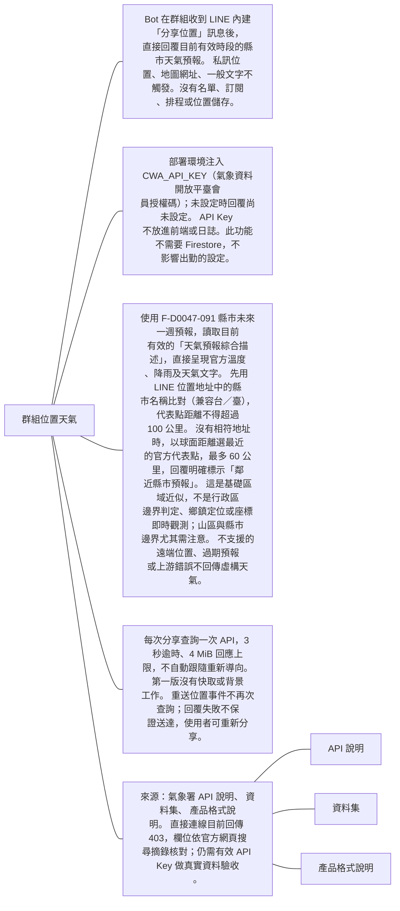

# 群組位置天氣

```mermaid
flowchart LR
  h["群組位置天氣"]
  h --- n0["Bot 在群組收到 LINE 內建「分享位置」訊息後，<br/>直接回覆目前有效時段的縣市天氣預報。 私訊位<br/>置、地圖網址、一般文字不觸發。沒有名單、訂閱<br/>、排程或位置儲存。"]
  h --- n1["部署環境注入 CWA_API_KEY（氣象資料開放平臺會<br/>員授權碼）；未設定時回覆尚未設定。 API Key <br/>不放進前端或日誌。此功能不需要 Firestore，不<br/>影響出勤的設定。"]
  h --- n2["使用 F-D0047-091 縣市未來一週預報，讀取目前<br/>有效的「天氣預報綜合描述」，直接呈現官方溫度<br/>、降雨及天氣文字。 先用 LINE 位置地址中的縣<br/>市名稱比對（兼容台／臺），代表點距離不得超過<br/> 100 公里。 沒有相符地址時，以球面距離選最近<br/>的官方代表點，最多 60 公里，回覆明確標示「鄰<br/>近縣市預報」。 這是基礎區域近似，不是行政區<br/>邊界判定、鄉鎮定位或座標即時觀測；山區與縣市<br/>邊界尤其需注意。 不支援的遠端位置、過期預報<br/>或上游錯誤不回傳虛構天氣。"]
  h --- n3["每次分享查詢一次 API，3 秒逾時、4 MiB 回應上<br/>限，不自動跟隨重新導向。第一版沒有快取或背景<br/>工作。 重送位置事件不再次查詢；回覆失敗不保<br/>證送達，使用者可重新分享。"]
  h --- n4["來源：氣象署 API 說明、 資料集、 產品格式說<br/>明。 直接連線目前回傳 403，欄位依官方網頁搜<br/>尋摘錄核對；仍需有效 API Key 做真實資料驗收<br/>。"]
  n4 --- n4l0["API 說明"]
  click n4l0 "https://opendata.cwa.gov.tw/dist/opendata-swagger.html"
  n4 --- n4l1["資料集"]
  click n4l1 "https://opendata.cwa.gov.tw/dataset/forecast/F-D0047-091"
  n4 --- n4l2["產品格式說明"]
  click n4l2 "https://www.cwa.gov.tw/Data/data_catalog/1-1-1.pdf"
```
