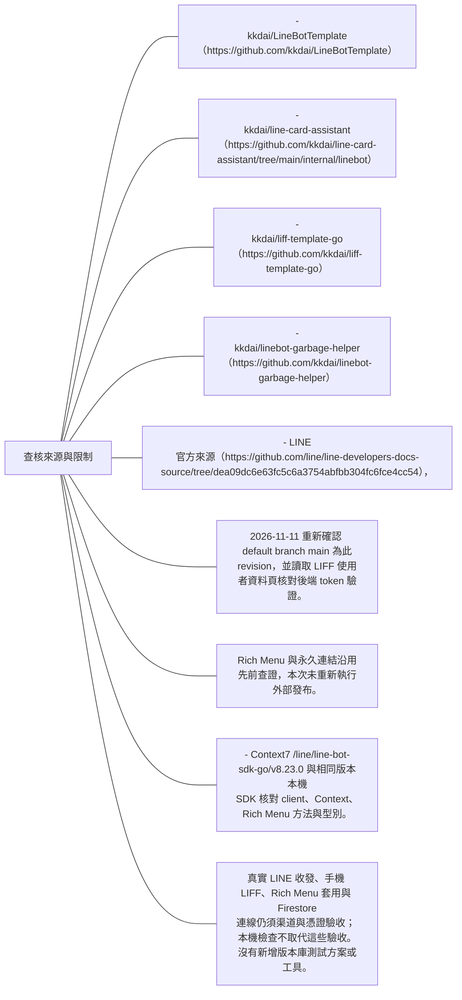

# 查核來源與限制

```mermaid
flowchart LR
  h["查核來源與限制"]
  h --- n0["-<br/>kkdai/LineBotTemplate（https://github.com/kkdai/LineBotTemplate）"]
  h --- n1["-<br/>kkdai/line-card-assistant（https://github.com/kkdai/line-card-assistant/tree/main/internal/linebot）"]
  h --- n2["-<br/>kkdai/liff-template-go（https://github.com/kkdai/liff-template-go）"]
  h --- n3["-<br/>kkdai/linebot-garbage-helper（https://github.com/kkdai/linebot-garbage-helper）"]
  h --- n4["- LINE<br/>官方來源（https://github.com/line/line-developers-docs-source/tree/dea09dc6e63fc5c6a3754abfbb304fc6fce4cc54），"]
  h --- n5["  2026-11-11 重新確認 default branch main 為此<br/>revision，並讀取 LIFF 使用者資料頁核對後端 token 驗證。"]
  h --- n6["  Rich Menu 與永久連結沿用先前查證，本次未重新執行外部發布。"]
  h --- n7["- Context7 /line/line-bot-sdk-go/v8.23.0 與相同版本本機<br/>SDK 核對 client、Context、Rich Menu 方法與型別。"]
  h --- n8["真實 LINE 收發、手機 LIFF、Rich Menu 套用與 Firestore<br/>連線仍須渠道與憑證驗收； 本機檢查不取代這些驗收。沒有新增版本庫測試方案或工具。"]
```
