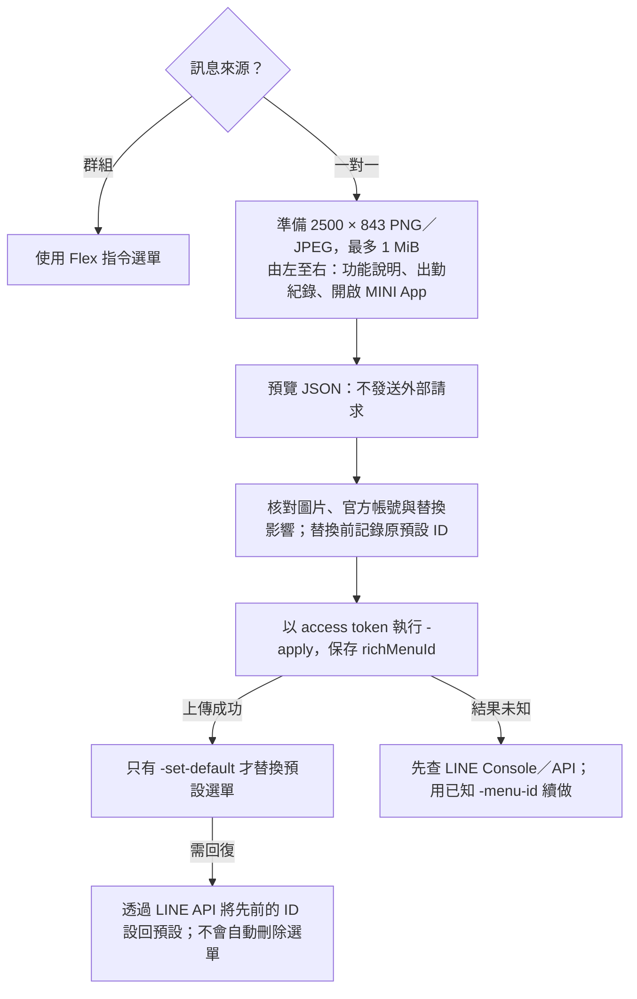
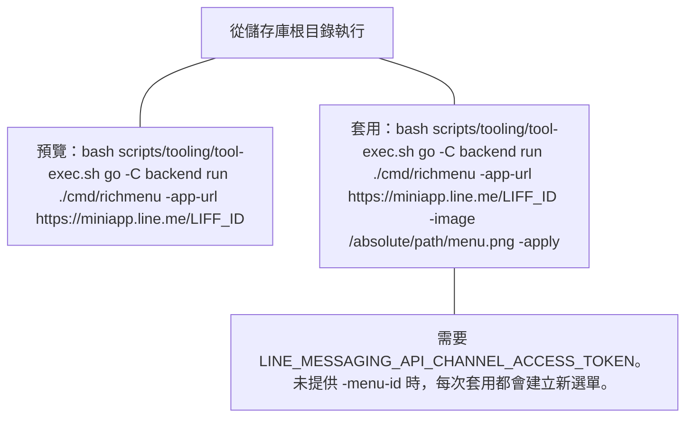

# 從儲存庫根目錄執行

```mermaid
flowchart TD
  menu{"訊息來源？"} -->|群組| flex["使用 Flex 指令選單"]
  menu -->|一對一| img["準備 2500 × 843 PNG／JPEG，最多 1 MiB<br/>由左至右：功能說明、出勤紀錄、開啟 MINI App"]
  img --> preview["預覽 JSON：不發送外部請求"]
  preview --> verify["核對圖片、官方帳號與替換影響；替換前記錄原預設 ID"]
  verify --> apply["以 access token 執行 -apply，保存 richMenuId"]
  apply -->|上傳成功| bind["只有 -set-default 才替換預設選單"]
  apply -->|結果未知| inspect["先查 LINE Console／API；用已知 -menu-id 續做"]
  bind -->|需回復| undo["透過 LINE API 將先前的 ID 設回預設；不會自動刪除選單"]
```

```mermaid
flowchart TB
  cmd["從儲存庫根目錄執行"] --- dry["預覽：bash scripts/tooling/tool-exec.sh go -C backend run ./cmd/richmenu -app-url https://miniapp.line.me/LIFF_ID"]
  cmd --- write["套用：bash scripts/tooling/tool-exec.sh go -C backend run ./cmd/richmenu -app-url https://miniapp.line.me/LIFF_ID -image /absolute/path/menu.png -apply"]
  write --- token["需要 LINE_MESSAGING_API_CHANNEL_ACCESS_TOKEN。未提供 -menu-id 時，每次套用都會建立新選單。"]
```
