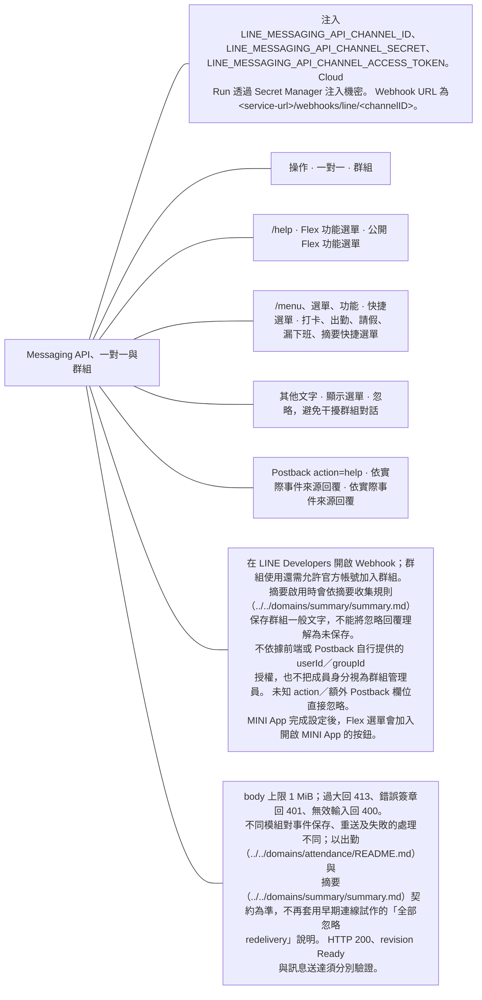

# Messaging API、一對一與群組

```mermaid
flowchart LR
  h["Messaging API、一對一與群組"]
  h --- n0["注入<br/>LINE_MESSAGING_API_CHANNEL_ID、LINE_MESSAGING_API_CHANNEL_SECRET、<br/>LINE_MESSAGING_API_CHANNEL_ACCESS_TOKEN。Cloud<br/>Run 透過 Secret Manager 注入機密。 Webhook URL 為<br/>&lt;service-url&gt;/webhooks/line/&lt;channelID&gt;。"]
  h --- n1["操作 · 一對一 · 群組"]
  h --- n2["/help · Flex 功能選單 · 公開 Flex 功能選單"]
  h --- n3["/menu、選單、功能 · 快捷選單 · 打卡、出勤、請假、漏下班、摘要快捷選單"]
  h --- n4["其他文字 · 顯示選單 · 忽略，避免干擾群組對話"]
  h --- n5["Postback action=help · 依實際事件來源回覆 · 依實際事件來源回覆"]
  h --- n6["在 LINE Developers 開啟 Webhook；群組使用還需允許官方帳號加入群組。<br/>摘要啟用時會依摘要收集規則（../../domains/summary/summary.md）保存群組一般文字，不能將忽略回覆理解為未保存。<br/>不依據前端或 Postback 自行提供的 userId／groupId<br/>授權，也不把成員身分視為群組管理員。 未知 action／額外 Postback 欄位直接忽略。<br/>MINI App 完成設定後，Flex 選單會加入開啟 MINI App 的按鈕。"]
  h --- n7["body 上限 1 MiB；過大回 413、錯誤簽章回 401、無效輸入回 400。<br/>不同模組對事件保存、重送及失敗的處理不同；以出勤（../../domains/attendance/README.md）與<br/>摘要（../../domains/summary/summary.md）契約為準，不再套用早期連線試作的「全部忽略<br/>redelivery」說明。 HTTP 200、revision Ready<br/>與訊息送達須分別驗證。"]
```
