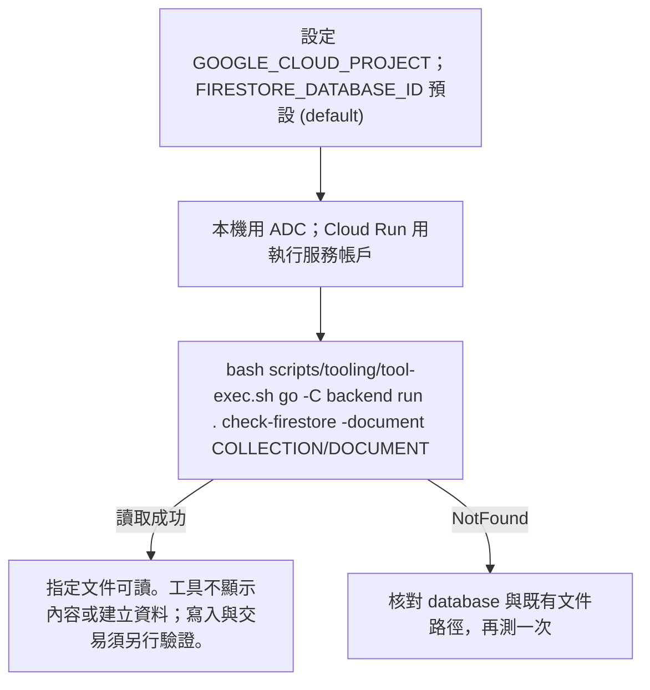

# 設定 GOOGLE_CLOUD_PROJECT；FIRESTORE_DATABASE_ID 預設 (default)

```mermaid
flowchart TD
  env["設定 GOOGLE_CLOUD_PROJECT；FIRESTORE_DATABASE_ID 預設 (default)"] --> id["本機用 ADC；Cloud Run 用執行服務帳戶"]
  id --> read["bash scripts/tooling/tool-exec.sh go -C backend run . check-firestore -document COLLECTION/DOCUMENT"]
  read -->|讀取成功| ok["指定文件可讀。工具不顯示內容或建立資料；寫入與交易須另行驗證。"]
  read -->|NotFound| check["核對 database 與既有文件路徑，再測一次"]
```
