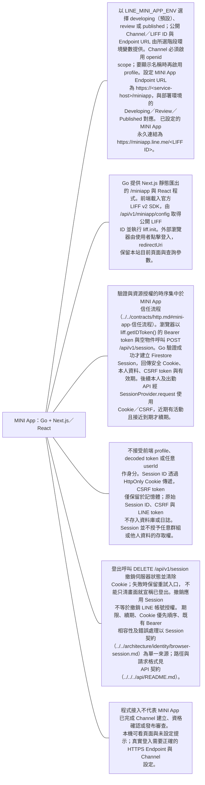

# MINI App：Go + Next.js／React

```mermaid
flowchart LR
  h["MINI App：Go + Next.js／React"]
  h --- n0["以 LINE_MINI_APP_ENV 選擇 developing（預設）、review 或 published；公開 Channel／LIFF ID 與 Endpoint URL 由所選階段環境變數提供。Channel 必須啟用 openid<br/>scope；要顯示名稱時再啟用 profile。設定 MINI App Endpoint URL<br/>為 https://&lt;service-host&gt;/miniapp，與部署環境的<br/>Developing／Review／Published 對應。 已設定的 MINI App<br/>永久連結為 https://miniapp.line.me/&lt;LIFF ID&gt;。"]
  h --- n1["Go 提供 Next.js 靜態匯出的 /miniapp 與 React 程式。前端載入官方<br/>LIFF v2 SDK，由 /api/v1/miniapp/config 取得公開 LIFF<br/>ID 並執行 liff.init。外部瀏覽器由使用者點擊登入，redirectUri<br/>保留本站目前頁面與查詢參數。"]
  h --- n2["驗證與資源授權的時序集中於MINI App<br/>信任流程（../../contracts/http.md#mini-app-信任流程）。瀏覽器以<br/>liff.getIDToken() 的 Bearer token 與空物件呼叫 POST<br/>/api/v1/session。Go 驗證成功才建立 Firestore<br/>Session，回傳安全 Cookie、本人資料、CSRF token 與有效期。後續本人及出勤<br/>API 經 SessionProvider.request 使用<br/>Cookie／CSRF，近期有活動且接近到期才續期。"]
  h --- n3["不接受前端 profile、decoded token 或任意 userId<br/>作身分。Session ID 透過 HttpOnly Cookie 傳遞，CSRF token<br/>僅保留於記憶體；原始 Session ID、CSRF 與 LINE token<br/>不存入資料庫或日誌。 Session 並不授予任意群組或他人資料的存取權。"]
  h --- n4["登出呼叫 DELETE /api/v1/session 撤銷伺服器狀態並清除<br/>Cookie；失敗時保留重試入口， 不能只清畫面就宣稱已登出。撤銷應用 Session<br/>不等於撤銷 LINE 帳號授權。 期限、續期、Cookie 優先順序、既有 Bearer<br/>相容性及錯誤處理以 Session<br/>契約（../../architecture/identity/browser-session.md）為單一來源；路徑與請求格式見<br/>API 契約（../../../api/README.md）。"]
  h --- n5["程式接入不代表 MINI App 已完成 Channel 建立、資格確認或發布審查。<br/>本機可看頁面與未設定提示；真實登入需要正確的 HTTPS Endpoint 與 Channel<br/>設定。"]
```
