# 發布驗收與復原

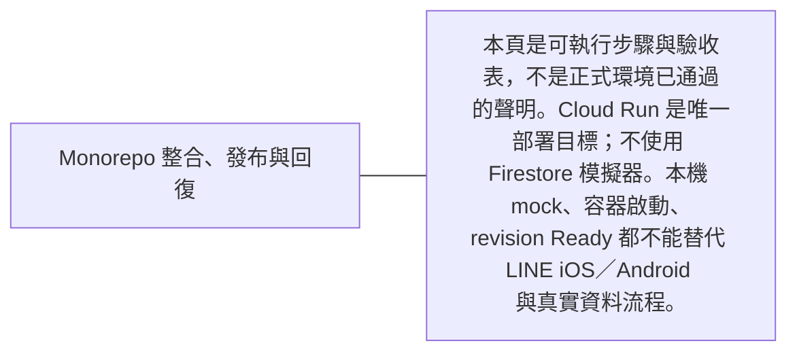
```mermaid
flowchart LR
  h["Monorepo 整合、發布與回復"]
  h --- n0["本頁是可執行步驟與驗收表，不是正式環境已通過<br/>的聲明。Cloud Run 是唯一部署目標；不使用 <br/>Firestore 模擬器。本機 mock、容器啟動、<br/>revision Ready 都不能替代 LINE iOS／Android <br/>與真實資料流程。"]
```

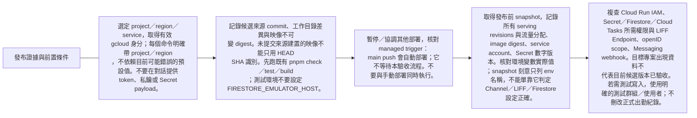
```mermaid
flowchart LR
  h["發布證據與前置條件"]
  h --- n0["選定 project／region／service，取得有效 <br/>gcloud 身分；每個命令明確帶 project／region<br/>，不依賴目前可能錯誤的預設值。不要在對話提供<br/> token、私鑰或 Secret payload。"]
  n0 --> n1["記錄候選來源 commit、工作目錄差異與映像不可<br/>變 digest。未提交來源建置的映像不能只用 HEAD<br/> SHA 識別。先跑既有 pnpm check／test／build<br/>；測試環境不要設定 FIRESTORE_EMULATOR_HOST。"]
  n1 --> n2["暫停／協調其他部署，核對 managed trigger：<br/>main push 會自動部署；它不等待本驗收流程。不<br/>要與手動部署同時執行。"]
  n2 --> n3["取得發布前 snapshot，記錄所有 serving <br/>revisions 與流量分配、image digest、service <br/>account、Secret 數字版本。核對環境變數實際值<br/>；snapshot 刻意只列 env 名稱，不能單靠它判定<br/> Channel／LIFF／Firestore 設定正確。"]
  n3 --> n4["複查 Cloud Run IAM、Secret／Firestore／Cloud<br/> Tasks 所需權限與 LIFF Endpoint、openID <br/>scope、Messaging webhook。目標專案出現資料不<br/>代表目前候選版本已驗收。若需測試寫入，使用明<br/>確的測試群組／使用者；不刪改正式出勤紀錄。"]
```

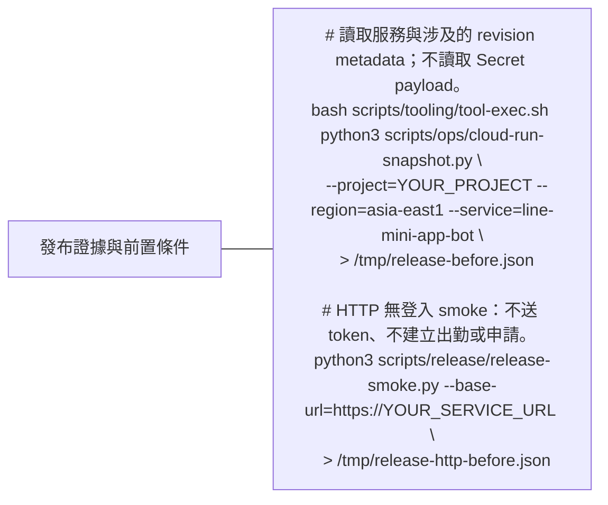
```mermaid
flowchart LR
  h["發布證據與前置條件"]
  h --- n0["# 讀取服務與涉及的 revision metadata；不讀取 Secret payload。<br/>bash scripts/tooling/tool-exec.sh python3 scripts/ops/cloud-run-snapshot.py #92;<br/>  --project=YOUR_PROJECT --region=asia-east1 --service=line-mini-app-bot #92;<br/>  &gt; /tmp/release-before.json<br/><br/># HTTP 無登入 smoke：不送 token、不建立出勤或申請。<br/>python3 scripts/release/release-smoke.py --base-url=https://YOUR_SERVICE_URL #92;<br/>  &gt; /tmp/release-http-before.json"]
```

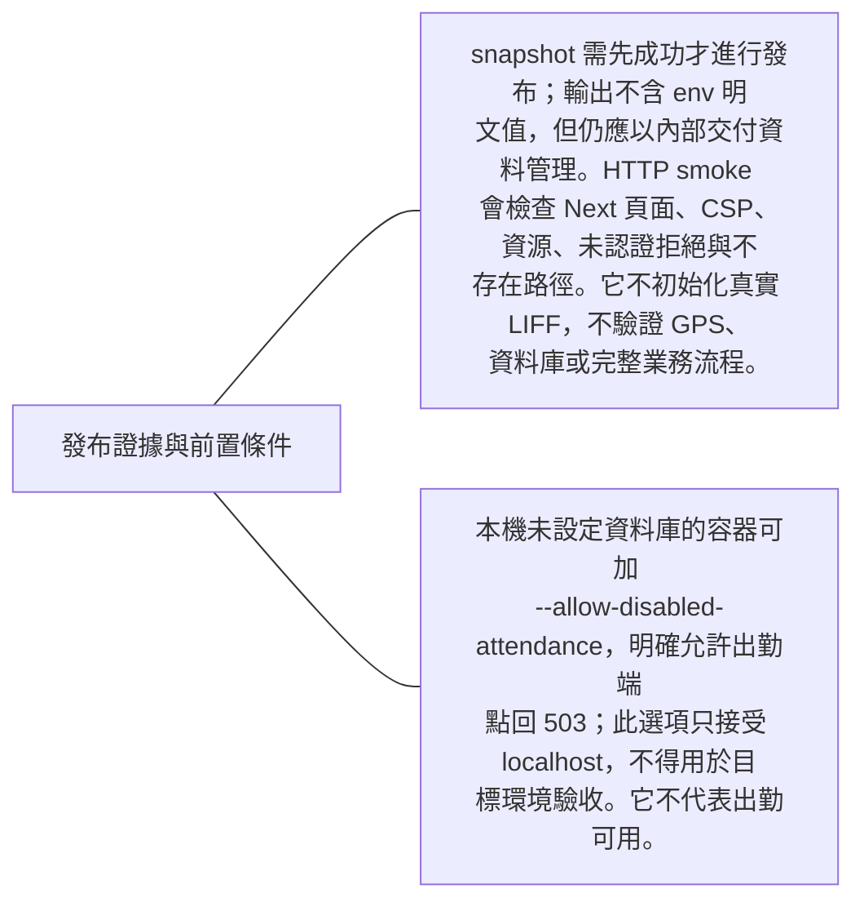
```mermaid
flowchart LR
  h["發布證據與前置條件"]
  h --- n0["snapshot 需先成功才進行發布；輸出不含 env 明<br/>文值，但仍應以內部交付資料管理。HTTP smoke <br/>會檢查 Next 頁面、CSP、資源、未認證拒絕與不<br/>存在路徑。它不初始化真實 LIFF，不驗證 GPS、<br/>資料庫或完整業務流程。"]
  h --- n1["本機未設定資料庫的容器可加 <br/>--allow-disabled-attendance，明確允許出勤端<br/>點回 503；此選項只接受 localhost，不得用於目<br/>標環境驗收。它不代表出勤可用。"]
```

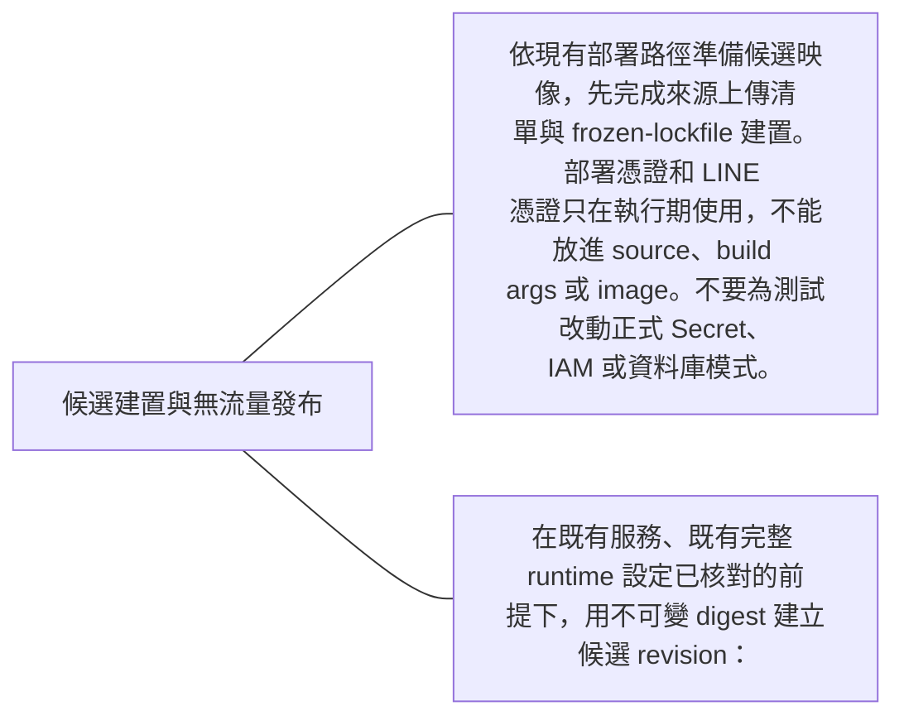
```mermaid
flowchart LR
  h["候選建置與無流量發布"]
  h --- n0["依現有部署路徑準備候選映像，先完成來源上傳清<br/>單與 frozen-lockfile 建置。部署憑證和 LINE <br/>憑證只在執行期使用，不能放進 source、build <br/>args 或 image。不要為測試改動正式 Secret、<br/>IAM 或資料庫模式。"]
  h --- n1["在既有服務、既有完整 runtime 設定已核對的前<br/>提下，用不可變 digest 建立候選 revision："]
```

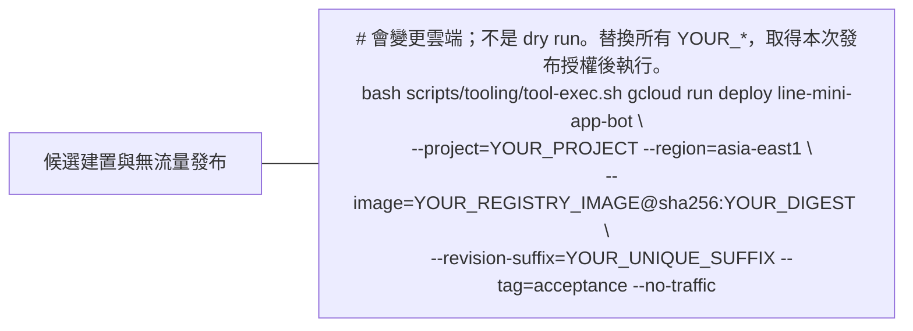
```mermaid
flowchart LR
  h["候選建置與無流量發布"]
  h --- n0["# 會變更雲端；不是 dry run。替換所有 YOUR_*，取得本次發布授權後執行。<br/>bash scripts/tooling/tool-exec.sh gcloud run deploy line-mini-app-bot #92;<br/>  --project=YOUR_PROJECT --region=asia-east1 #92;<br/>  --image=YOUR_REGISTRY_IMAGE@sha256:YOUR_DIGEST #92;<br/>  --revision-suffix=YOUR_UNIQUE_SUFFIX --tag=acceptance --no-traffic"]
```

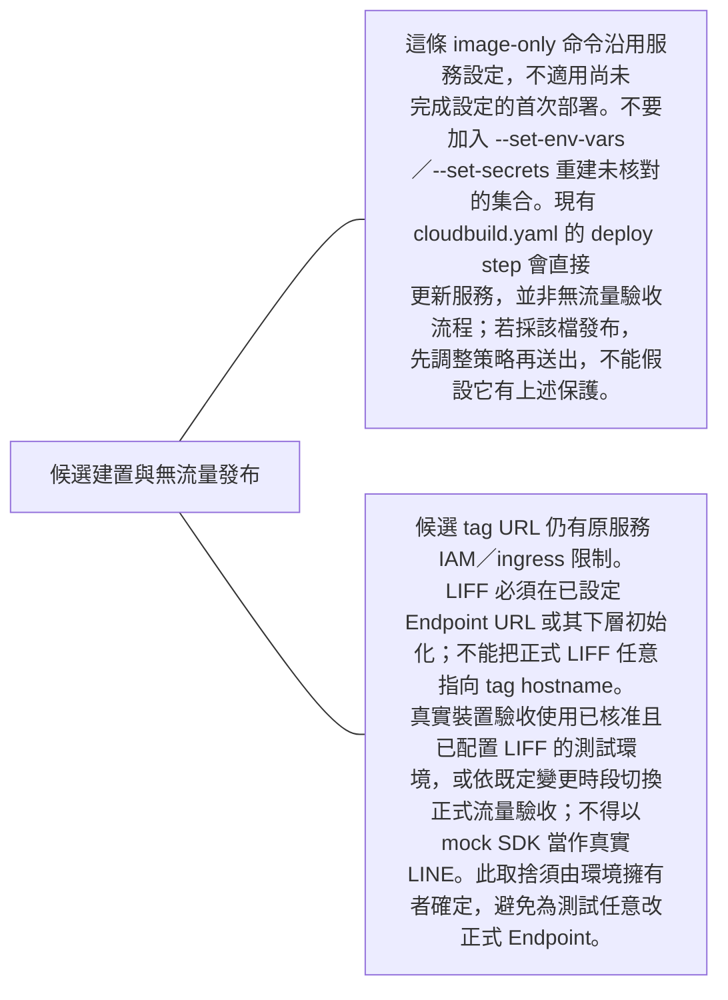
```mermaid
flowchart LR
  h["候選建置與無流量發布"]
  h --- n0["這條 image-only 命令沿用服務設定，不適用尚未<br/>完成設定的首次部署。不要加入 --set-env-vars<br/>／--set-secrets 重建未核對的集合。現有 <br/>cloudbuild.yaml 的 deploy step 會直接<br/>更新服務，並非無流量驗收流程；若採該檔發布，<br/>先調整策略再送出，不能假設它有上述保護。"]
  h --- n1["候選 tag URL 仍有原服務 IAM／ingress 限制。<br/>LIFF 必須在已設定 Endpoint URL 或其下層初始<br/>化；不能把正式 LIFF 任意指向 tag hostname。<br/>真實裝置驗收使用已核准且已配置 LIFF 的測試環<br/>境，或依既定變更時段切換正式流量驗收；不得以<br/> mock SDK 當作真實 LINE。此取捨須由環境擁有<br/>者確定，避免為測試任意改正式 Endpoint。"]
```

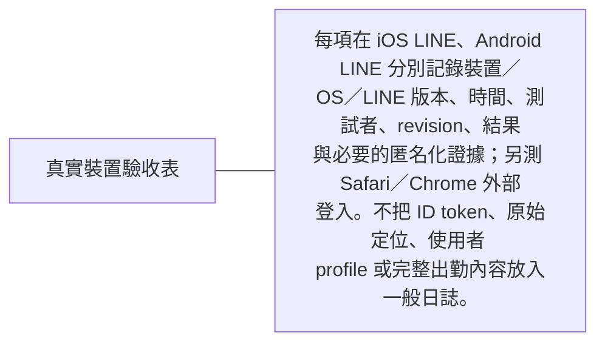
```mermaid
flowchart LR
  h["真實裝置驗收表"]
  h --- n0["每項在 iOS LINE、Android LINE 分別記錄裝置／<br/>OS／LINE 版本、時間、測試者、revision、結果<br/>與必要的匿名化證據；另測 Safari／Chrome 外部<br/>登入。不把 ID token、原始定位、使用者 <br/>profile 或完整出勤內容放入一般日誌。"]
```

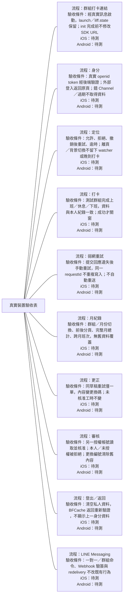
```mermaid
flowchart LR
  h["真實裝置驗收表"]
  h --- n0["流程：群組打卡連結<br/>驗收條件：經真實訊息啟動，launch／liff.state<br/> 保留；init 完成前不修改 SDK URL<br/>iOS：待測<br/>Android：待測"]
  h --- n1["流程：身分<br/>驗收條件：真實 openid token 經後端驗證；外部<br/>登入返回原頁；錯 Channel／過期不取得資料<br/>iOS：待測<br/>Android：待測"]
  h --- n2["流程：定位<br/>驗收條件：允許、拒絕、撤銷後重試、逾時；離頁<br/>／背景切換不留下 watcher 或晚到打卡<br/>iOS：待測<br/>Android：待測"]
  h --- n3["流程：打卡<br/>驗收條件：測試群組完成上班／休息／下班，資料<br/>與本人紀錄一致；成功才關窗<br/>iOS：待測<br/>Android：待測"]
  h --- n4["流程：弱網重試<br/>驗收條件：提交回應遺失後手動重試，同一 <br/>requestId 不重複寫入；不自動重送<br/>iOS：待測<br/>Android：待測"]
  h --- n5["流程：月紀錄<br/>驗收條件：群組／月份切換、前後分頁、完整月總<br/>計、跨月班次，無舊資料覆蓋<br/>iOS：待測<br/>Android：待測"]
  h --- n6["流程：更正<br/>驗收條件：同草稿重試僅一單，內容變更換碼；未<br/>核准工時不變<br/>iOS：待測<br/>Android：待測"]
  h --- n7["流程：審核<br/>驗收條件：另一授權帳號讀取並核准；本人／未授<br/>權被拒絕；更換編號清除舊內容<br/>iOS：待測<br/>Android：待測"]
  h --- n8["流程：登出／返回<br/>驗收條件：清空私人資料，BFCache 返回重新驗證<br/>，不顯示上一身分資料<br/>iOS：待測<br/>Android：待測"]
  h --- n9["流程：LINE Messaging<br/>驗收條件：一對一／群組命令、Webhook 驗簽與 <br/>redelivery 不改既有行為<br/>iOS：待測<br/>Android：待測"]
```

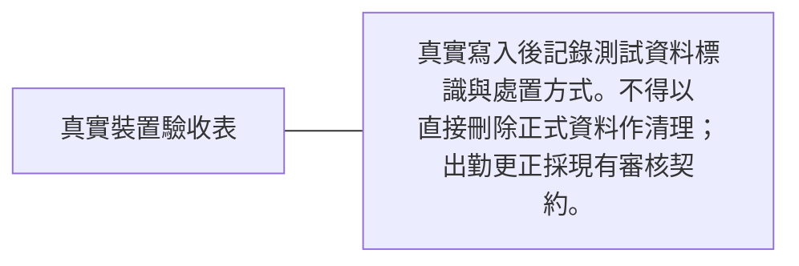
```mermaid
flowchart LR
  h["真實裝置驗收表"]
  h --- n0["真實寫入後記錄測試資料標識與處置方式。不得以<br/>直接刪除正式資料作清理；出勤更正採現有審核契<br/>約。"]
```

## 切換、觀察、回復

開發與維運指引

[從候選驗收到切流、觀察與回復（Mermaid 原始檔）](release-verification.mermaid)

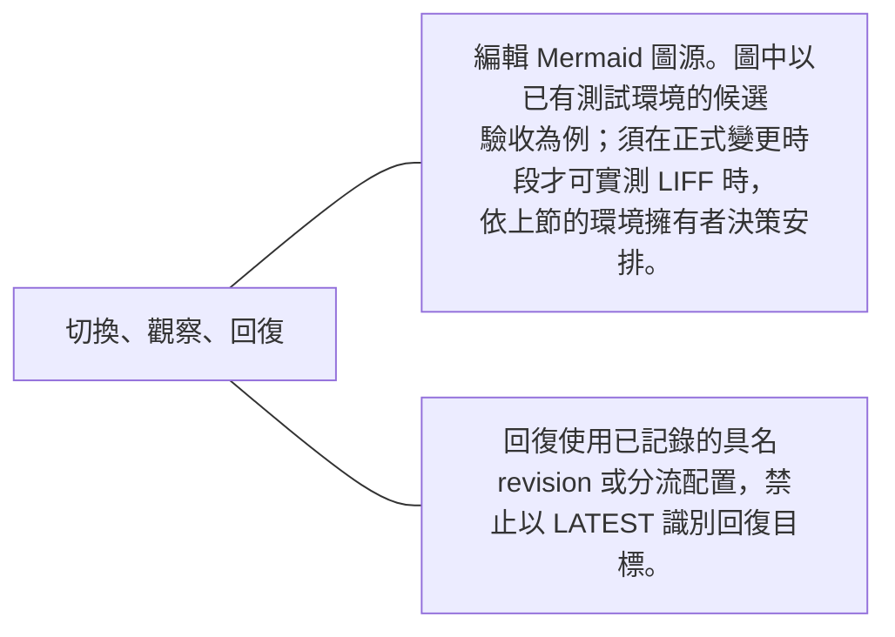
```mermaid
flowchart LR
  h["切換、觀察、回復"]
  h --- n0["編輯 Mermaid 圖源。圖中以已有測試環境的候選<br/>驗收為例；須在正式變更時段才可實測 LIFF 時，<br/>依上節的環境擁有者決策安排。"]
  click n0 "release-verification.mermaid"
  h --- n1["回復使用已記錄的具名 revision 或分流配置，禁<br/>止以 LATEST 識別回復目標。"]
```

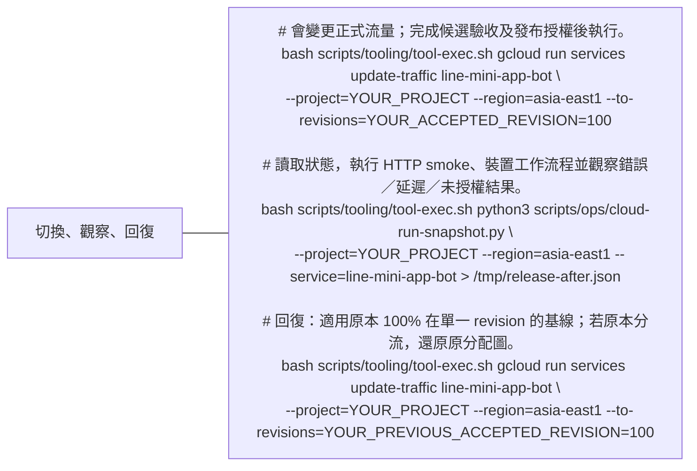
```mermaid
flowchart LR
  h["切換、觀察、回復"]
  h --- n0["# 會變更正式流量；完成候選驗收及發布授權後執行。<br/>bash scripts/tooling/tool-exec.sh gcloud run services update-traffic line-mini-app-bot #92;<br/>  --project=YOUR_PROJECT --region=asia-east1 --to-revisions=YOUR_ACCEPTED_REVISION=100<br/><br/># 讀取狀態，執行 HTTP smoke、裝置工作流程並觀察錯誤／延遲／未授權結果。<br/>bash scripts/tooling/tool-exec.sh python3 scripts/ops/cloud-run-snapshot.py #92;<br/>  --project=YOUR_PROJECT --region=asia-east1 --service=line-mini-app-bot &gt; /tmp/release-after.json<br/><br/># 回復：適用原本 100% 在單一 revision 的基線；若原本分流，還原原分配圖。<br/>bash scripts/tooling/tool-exec.sh gcloud run services update-traffic line-mini-app-bot #92;<br/>  --project=YOUR_PROJECT --region=asia-east1 --to-revisions=YOUR_PREVIOUS_ACCEPTED_REVISION=100"]
```

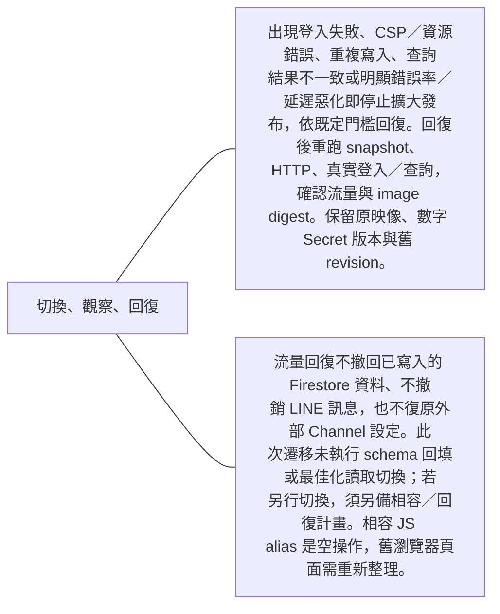
```mermaid
flowchart LR
  h["切換、觀察、回復"]
  h --- n0["出現登入失敗、CSP／資源錯誤、重複寫入、查詢<br/>結果不一致或明顯錯誤率／延遲惡化即停止擴大發<br/>布，依既定門檻回復。回復後重跑 snapshot、<br/>HTTP、真實登入／查詢，確認流量與 image <br/>digest。保留原映像、數字 Secret 版本與舊 <br/>revision。"]
  h --- n1["流量回復不撤回已寫入的 Firestore 資料、不撤<br/>銷 LINE 訊息，也不復原外部 Channel 設定。此<br/>次遷移未執行 schema 回填或最佳化讀取切換；若<br/>另行切換，須另備相容／回復計畫。相容 JS <br/>alias 是空操作，舊瀏覽器頁面需重新整理。"]
```

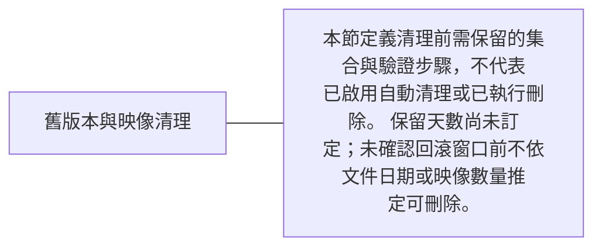
```mermaid
flowchart LR
  h["舊版本與映像清理"]
  h --- n0["本節定義清理前需保留的集合與驗證步驟，不代表<br/>已啟用自動清理或已執行刪除。 保留天數尚未訂<br/>定；未確認回滾窗口前不依文件日期或映像數量推<br/>定可刪除。"]
```

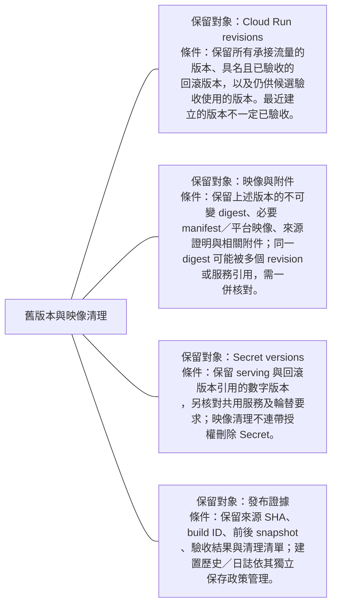
```mermaid
flowchart LR
  h["舊版本與映像清理"]
  h --- n0["保留對象：Cloud Run revisions<br/>條件：保留所有承接流量的版本、具名且已驗收的<br/>回滾版本，以及仍供候選驗收使用的版本。最近建<br/>立的版本不一定已驗收。"]
  h --- n1["保留對象：映像與附件<br/>條件：保留上述版本的不可變 digest、必要 <br/>manifest／平台映像、來源證明與相關附件；同一<br/> digest 可能被多個 revision 或服務引用，需一<br/>併核對。"]
  h --- n2["保留對象：Secret versions<br/>條件：保留 serving 與回滾版本引用的數字版本<br/>，另核對共用服務及輪替要求；映像清理不連帶授<br/>權刪除 Secret。"]
  h --- n3["保留對象：發布證據<br/>條件：保留來源 SHA、build ID、前後 snapshot<br/>、驗收結果與清理清單；建置歷史／日誌依其獨立<br/>保存政策管理。"]
```

## 舊版本與映像清理

開發與維運指引

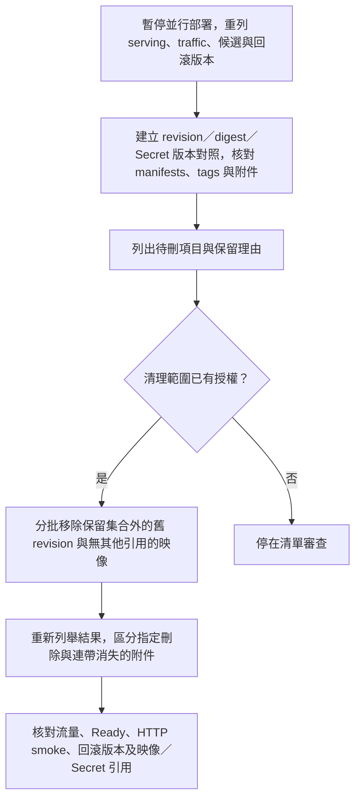
```mermaid
flowchart TB
  A["暫停並行部署，重列 serving、traffic、候選與回滾版本"] --> B["建立 revision／digest／Secret 版本對照，核對 manifests、tags 與附件"]
  B --> C["列出待刪項目與保留理由"]
  C --> D{"清理範圍已有授權？"}
  D -->|是| E["分批移除保留集合外的舊 revision 與無其他引用的映像"]
  D -->|否| H["停在清單審查"]
  E --> F["重新列舉結果，區分指定刪除與連帶消失的附件"]
  F --> G["核對流量、Ready、HTTP smoke、回滾版本及映像／Secret 引用"]
```

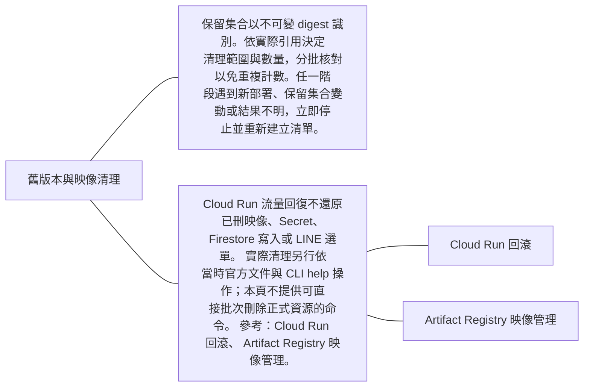
```mermaid
flowchart LR
  h["舊版本與映像清理"]
  h --- n0["保留集合以不可變 digest 識別。依實際引用決定<br/>清理範圍與數量，分批核對以免重複計數。任一階<br/>段遇到新部署、保留集合變動或結果不明，立即停<br/>止並重新建立清單。"]
  h --- n1["Cloud Run 流量回復不還原已刪映像、Secret、<br/>Firestore 寫入或 LINE 選單。 實際清理另行依<br/>當時官方文件與 CLI help 操作；本頁不提供可直<br/>接批次刪除正式資源的命令。 參考：Cloud Run <br/>回滾、 Artifact Registry 映像管理。"]
  n1 --- n1l0["Cloud Run 回滾"]
  click n1l0 "https://docs.cloud.google.com/run/docs/rollouts-rollbacks-traffic-migration"
  n1 --- n1l1["Artifact Registry 映像管理"]
  click n1l1 "https://docs.cloud.google.com/artifact-registry/docs/docker/manage-images"
```

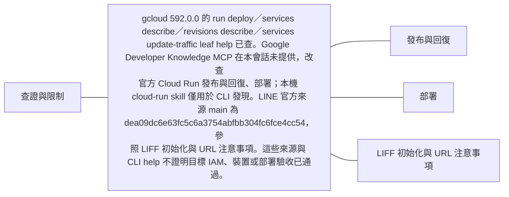
```mermaid
flowchart LR
  h["查證與限制"]
  h --- n0["gcloud 592.0.0 的 run deploy／services <br/>describe／revisions describe／services <br/>update-traffic leaf help 已查。Google <br/>Developer Knowledge MCP 在本會話未提供，改查<br/>官方 Cloud Run 發布與回復、部署；本機 <br/>cloud-run skill 僅用於 CLI 發現。LINE 官方來<br/>源 main 為 <br/>dea09dc6e63fc5c6a3754abfbb304fc6fce4cc54，參<br/>照 LIFF 初始化與 URL 注意事項。這些來源與 <br/>CLI help 不證明目標 IAM、裝置或部署驗收已通<br/>過。"]
  n0 --- n0l0["發布與回復"]
  click n0l0 "https://docs.cloud.google.com/run/docs/rollouts-rollbacks-traffic-migration"
  n0 --- n0l1["部署"]
  click n0l1 "https://docs.cloud.google.com/run/docs/deploying"
  n0 --- n0l2["LIFF 初始化與 URL 注意事項"]
  click n0l2 "https://developers.line.biz/en/docs/liff/developing-liff-apps/#initializing-liff-app"
```
