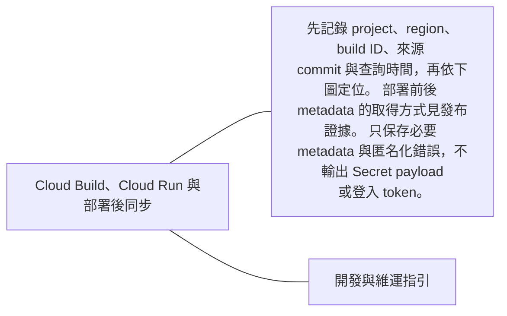
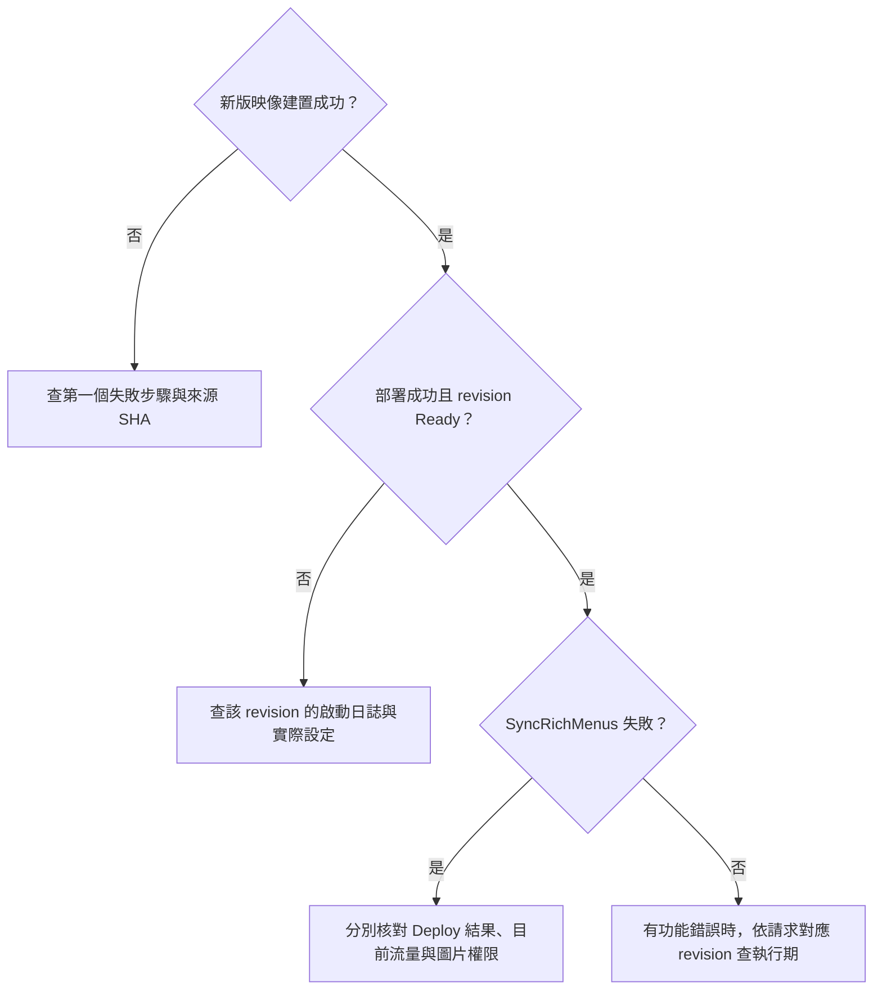
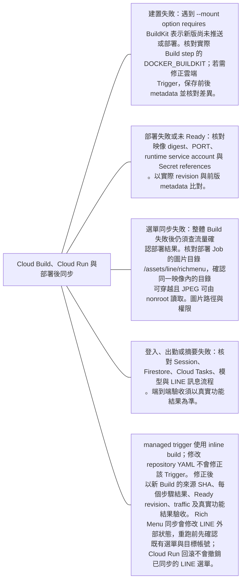
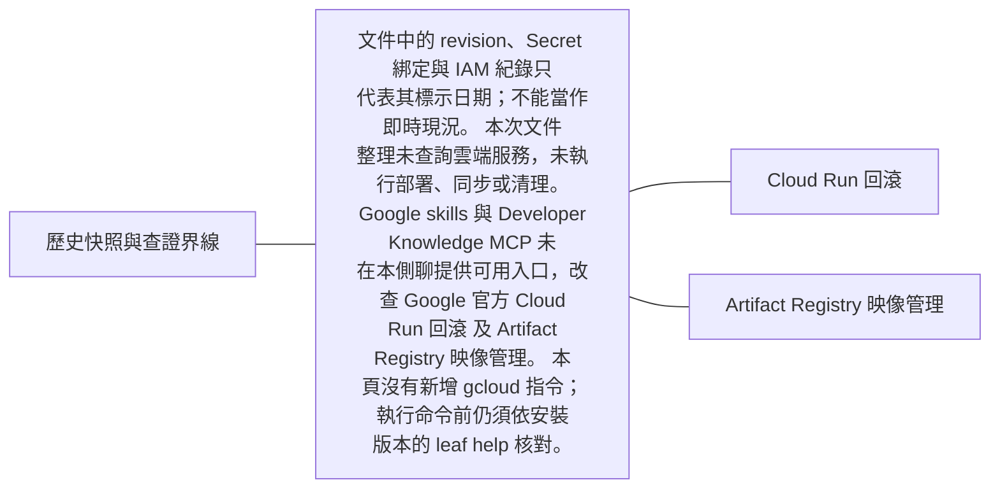

# 正式環境故障排查

依下列流程定位正式建置、部署與同步失敗。工具安裝、Go 及 MCP 問題見[開發環境排查](../development/environment/troubleshooting.md)。

```mermaid
flowchart LR
  h["Cloud Build、Cloud Run 與部署後同步"]
  h --- n0["先記錄 project、region、build ID、來源 <br/>commit 與查詢時間，再依下圖定位。 部署前後 <br/>metadata 的取得方式見發布證據。 只保存必要 <br/>metadata 與匿名化錯誤，不輸出 Secret payload<br/> 或登入 token。"]
  click n0 "release-acceptance.md#發布證據與前置條件"
  h --- n1["開發與維運指引"]
```

```mermaid
flowchart TB
  B{"新版映像建置成功？"} -->|否| F["查第一個失敗步驟與來源 SHA"]
  B -->|是| D{"部署成功且 revision Ready？"}
  D -->|否| L["查該 revision 的啟動日誌與實際設定"]
  D -->|是| M{"SyncRichMenus 失敗？"}
  M -->|是| S["分別核對 Deploy 結果、目前流量與圖片權限"]
  M -->|否| E["有功能錯誤時，依請求對應 revision 查執行期"]
```

```mermaid
flowchart LR
  h["Cloud Build、Cloud Run 與部署後同步"]
  h --- n0["建置失敗：遇到 --mount option requires <br/>BuildKit 表示新版尚未推送或部署。核對實際 <br/>Build step 的 DOCKER_BUILDKIT；若需修正雲端 <br/>Trigger，保存前後 metadata 並核對差異。"]
  click n0 "container-build.md#buildkit-與建置機密"
  h --- n1["部署失敗或未 Ready：核對映像 digest、PORT、<br/>runtime service account 與 Secret references<br/>。以實際 revision 與前版 metadata 比對。"]
  h --- n2["選單同步失敗：整體 Build 失敗後仍須查流量確<br/>認部署結果。核對部署 Job 的圖片目錄 <br/>/assets/line/richmenu，確認同一映像內的目錄<br/>可穿越且 JPEG 可由 nonroot 讀取。圖片路徑與<br/>權限"]
  click n2 "cloud-run.md#managed-trigger-的-rich-menu-圖片路徑"
  h --- n3["登入、出勤或摘要失敗：核對 Session、<br/>Firestore、Cloud Tasks、模型與 LINE 訊息流程<br/>。端到端驗收須以真實功能結果為準。"]
  h --- n4["managed trigger 使用 inline build；修改 <br/>repository YAML 不會修正該 Trigger。 修正後<br/>以新 Build 的來源 SHA、每個步驟結果、Ready <br/>revision、traffic 及真實功能結果驗收。 Rich <br/>Menu 同步會修改 LINE 外部狀態，重跑前先確認<br/>既有選單與目標帳號； Cloud Run 回滾不會撤銷<br/>已同步的 LINE 選單。"]
```

```mermaid
flowchart LR
  h["歷史快照與查證界線"]
  h --- n0["文件中的 revision、Secret 綁定與 IAM 紀錄只<br/>代表其標示日期；不能當作即時現況。 本次文件<br/>整理未查詢雲端服務，未執行部署、同步或清理。<br/> Google skills 與 Developer Knowledge MCP 未<br/>在本側聊提供可用入口，改查 Google 官方 Cloud<br/> Run 回滾 及 Artifact Registry 映像管理。 本<br/>頁沒有新增 gcloud 指令；執行命令前仍須依安裝<br/>版本的 leaf help 核對。"]
  n0 --- n0l0["Cloud Run 回滾"]
  click n0l0 "https://docs.cloud.google.com/run/docs/rollouts-rollbacks-traffic-migration"
  n0 --- n0l1["Artifact Registry 映像管理"]
  click n0l1 "https://docs.cloud.google.com/artifact-registry/docs/docker/manage-images"
```
