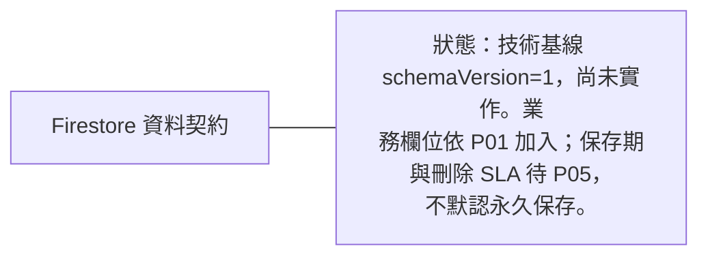
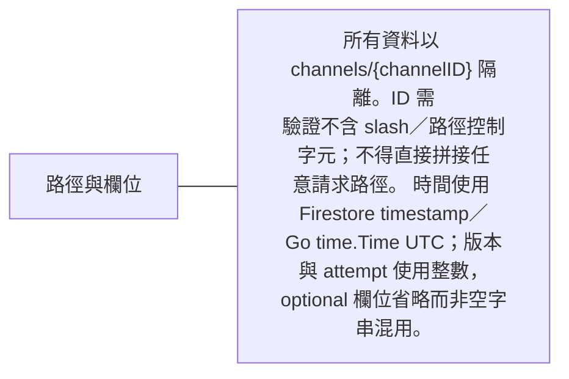
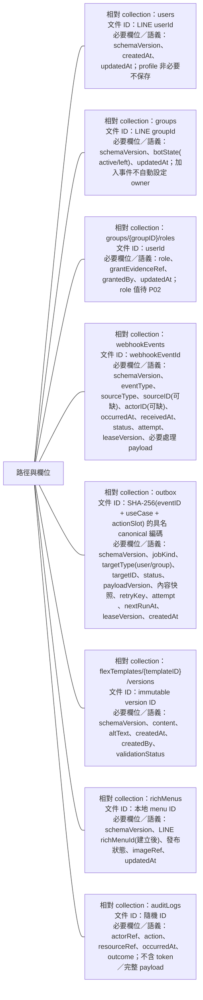
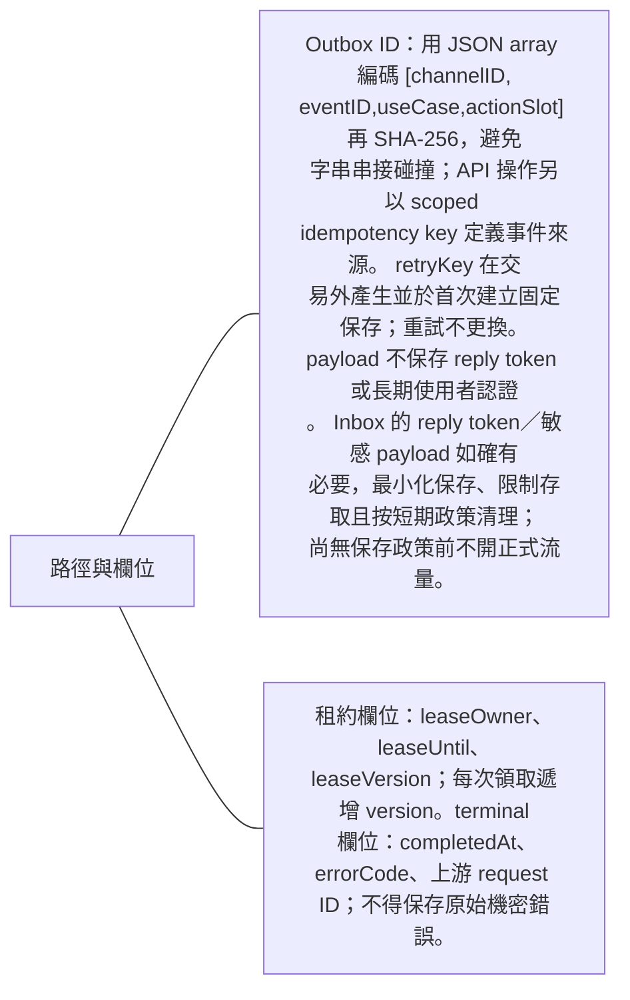
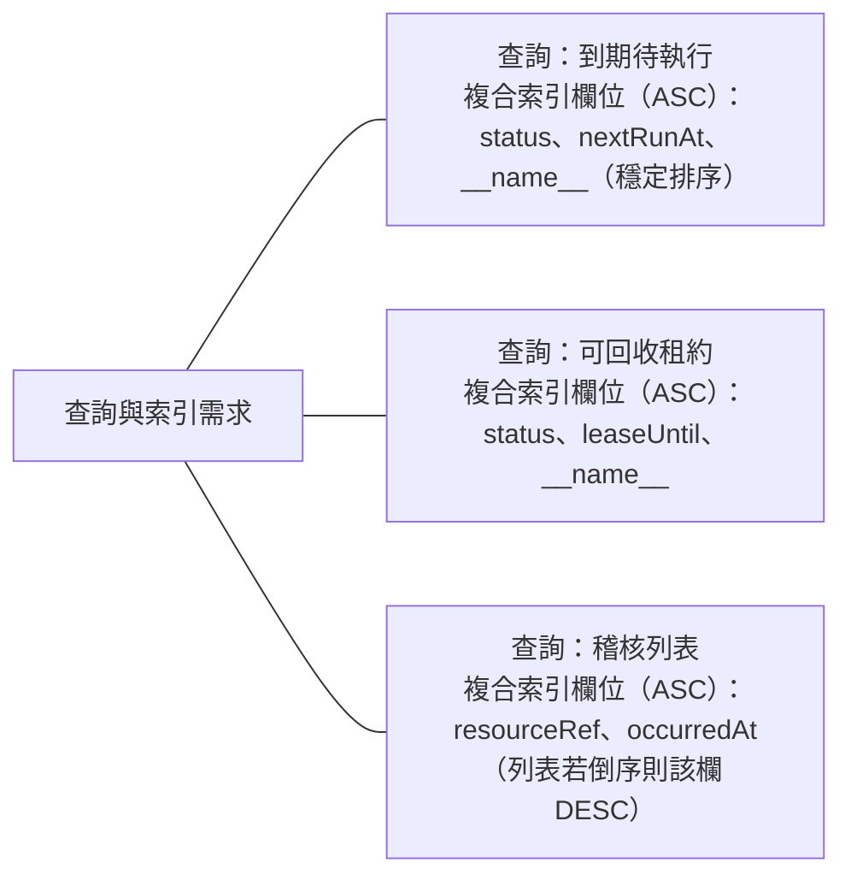
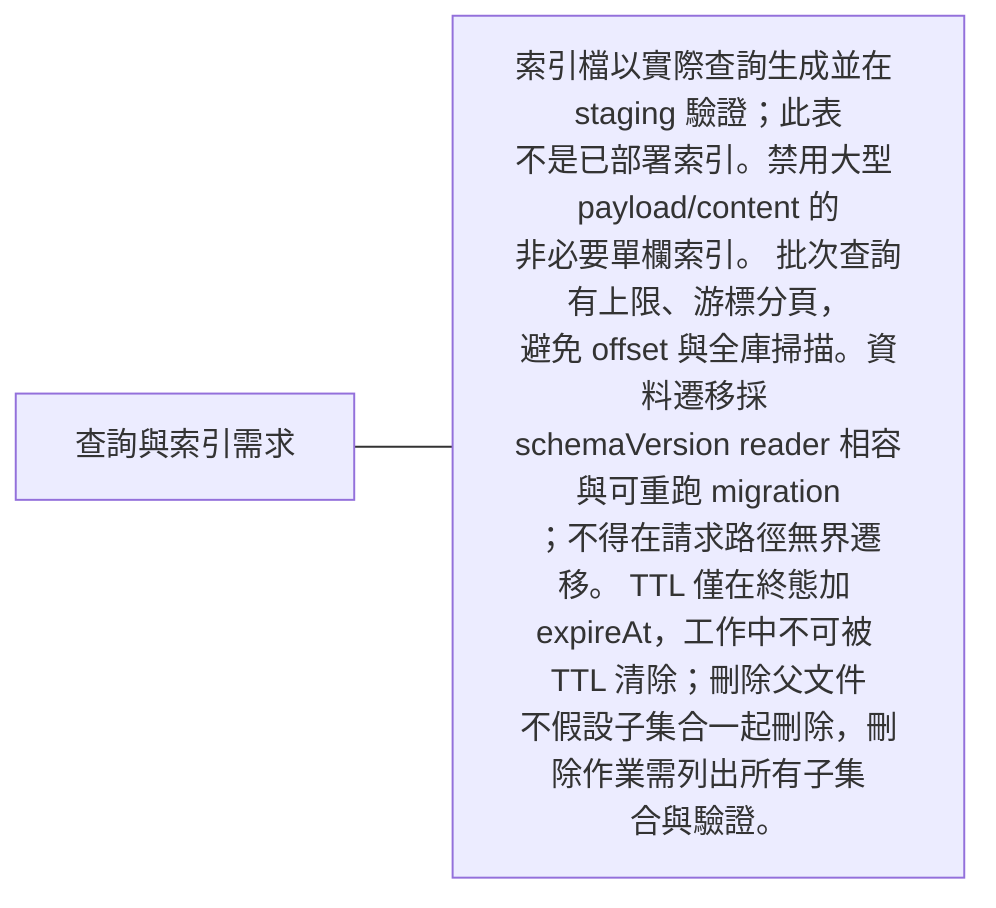
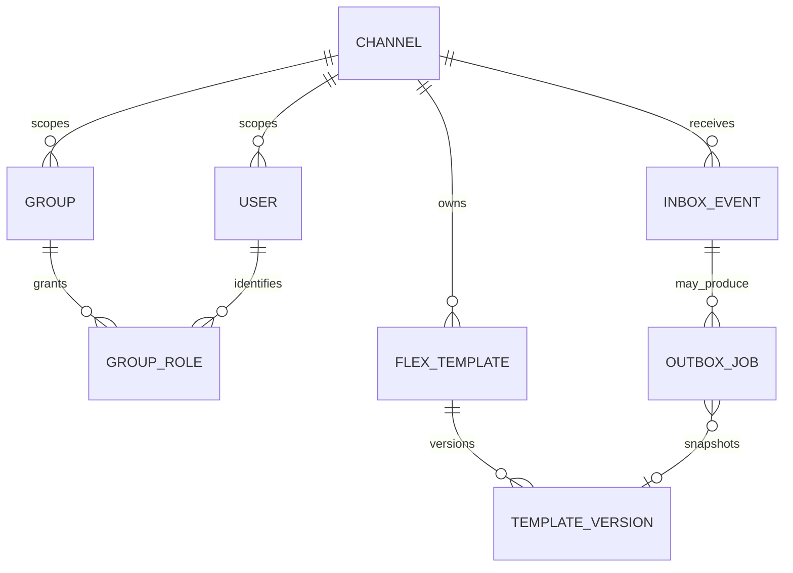
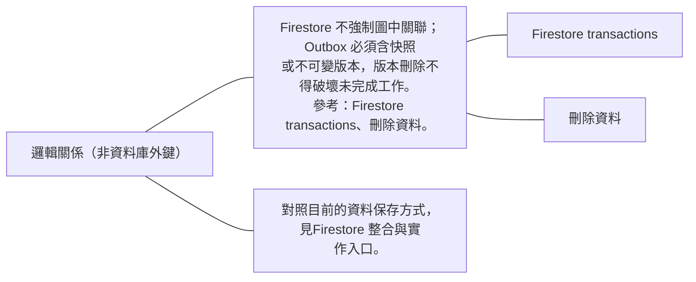

# firestore-資料契約

```mermaid
flowchart LR
  h["Firestore 資料契約"]
  h --- n0["狀態：技術基線 schemaVersion=1，尚未實作。業<br/>務欄位依 P01 加入；保存期與刪除 SLA 待 P05，<br/>不默認永久保存。"]
```

```mermaid
flowchart LR
  h["路徑與欄位"]
  h --- n0["所有資料以 channels/{channelID} 隔離。ID 需<br/>驗證不含 slash／路徑控制字元；不得直接拼接任<br/>意請求路徑。 時間使用 Firestore timestamp／<br/>Go time.Time UTC；版本與 attempt 使用整數，<br/>optional 欄位省略而非空字串混用。"]
```

```mermaid
flowchart LR
  h["路徑與欄位"]
  h --- n0["相對 collection：users<br/>文件 ID：LINE userId<br/>必要欄位／語義：schemaVersion、createdAt、<br/>updatedAt；profile 非必要不保存"]
  h --- n1["相對 collection：groups<br/>文件 ID：LINE groupId<br/>必要欄位／語義：schemaVersion、botState(<br/>active/left)、updatedAt；加入事件不自動設定 <br/>owner"]
  h --- n2["相對 collection：groups/{groupID}/roles<br/>文件 ID：userId<br/>必要欄位／語義：role、grantEvidenceRef、<br/>grantedBy、updatedAt；role 值待 P02"]
  h --- n3["相對 collection：webhookEvents<br/>文件 ID：webhookEventId<br/>必要欄位／語義：schemaVersion、eventType、<br/>sourceType、sourceID(可缺)、actorID(可缺)、<br/>occurredAt、receivedAt、status、attempt、<br/>leaseVersion、必要處理 payload"]
  h --- n4["相對 collection：outbox<br/>文件 ID：SHA-256(eventID + useCase + <br/>actionSlot) 的具名 canonical 編碼<br/>必要欄位／語義：schemaVersion、jobKind、<br/>targetType(user/group)、targetID、status、<br/>payloadVersion、內容快照、retryKey、attempt<br/>、nextRunAt、leaseVersion、createdAt"]
  h --- n5["相對 collection：flexTemplates/{templateID}<br/>/versions<br/>文件 ID：immutable version ID<br/>必要欄位／語義：schemaVersion、content、<br/>altText、createdAt、createdBy、<br/>validationStatus"]
  h --- n6["相對 collection：richMenus<br/>文件 ID：本地 menu ID<br/>必要欄位／語義：schemaVersion、LINE <br/>richMenuId(建立後)、發布狀態、imageRef、<br/>updatedAt"]
  h --- n7["相對 collection：auditLogs<br/>文件 ID：隨機 ID<br/>必要欄位／語義：actorRef、action、<br/>resourceRef、occurredAt、outcome；不含 token<br/>／完整 payload"]
```

```mermaid
flowchart LR
  h["路徑與欄位"]
  h --- n0["Outbox ID：用 JSON array 編碼 [channelID,<br/>eventID,useCase,actionSlot] 再 SHA-256，避免<br/>字串串接碰撞；API 操作另以 scoped <br/>idempotency key 定義事件來源。 retryKey 在交<br/>易外產生並於首次建立固定保存；重試不更換。<br/>payload 不保存 reply token 或長期使用者認證<br/>。 Inbox 的 reply token／敏感 payload 如確有<br/>必要，最小化保存、限制存取且按短期政策清理；<br/>尚無保存政策前不開正式流量。"]
  h --- n1["租約欄位：leaseOwner、leaseUntil、<br/>leaseVersion；每次領取遞增 version。terminal<br/> 欄位：completedAt、errorCode、上游 request <br/>ID；不得保存原始機密錯誤。"]
```

```mermaid
flowchart LR
  h["查詢與索引需求"]
  h --- n0["查詢：到期待執行<br/>複合索引欄位（ASC）：status、nextRunAt、<br/>__name__（穩定排序）"]
  h --- n1["查詢：可回收租約<br/>複合索引欄位（ASC）：status、leaseUntil、<br/>__name__"]
  h --- n2["查詢：稽核列表<br/>複合索引欄位（ASC）：resourceRef、occurredAt<br/>（列表若倒序則該欄 DESC）"]
```

```mermaid
flowchart LR
  h["查詢與索引需求"]
  h --- n0["索引檔以實際查詢生成並在 staging 驗證；此表<br/>不是已部署索引。禁用大型 payload/content 的<br/>非必要單欄索引。 批次查詢有上限、游標分頁，<br/>避免 offset 與全庫掃描。資料遷移採 <br/>schemaVersion reader 相容與可重跑 migration<br/>；不得在請求路徑無界遷移。 TTL 僅在終態加 <br/>expireAt，工作中不可被 TTL 清除；刪除父文件<br/>不假設子集合一起刪除，刪除作業需列出所有子集<br/>合與驗證。"]
```

## 邏輯關係（非資料庫外鍵）

未來設計

```mermaid
erDiagram
  CHANNEL ||--o{ USER : scopes
  CHANNEL ||--o{ GROUP : scopes
  GROUP ||--o{ GROUP_ROLE : grants
  USER ||--o{ GROUP_ROLE : identifies
  CHANNEL ||--o{ INBOX_EVENT : receives
  INBOX_EVENT ||--o{ OUTBOX_JOB : may_produce
  CHANNEL ||--o{ FLEX_TEMPLATE : owns
  FLEX_TEMPLATE ||--o{ TEMPLATE_VERSION : versions
  OUTBOX_JOB }o--o| TEMPLATE_VERSION : snapshots
```

```mermaid
flowchart LR
  h["邏輯關係（非資料庫外鍵）"]
  h --- n0["Firestore 不強制圖中關聯；Outbox 必須含快照<br/>或不可變版本，版本刪除不得破壞未完成工作。 <br/>參考：Firestore transactions、刪除資料。"]
  n0 --- n0l0["Firestore transactions"]
  click n0l0 "https://docs.cloud.google.com/firestore/native/docs/manage-data/transactions"
  n0 --- n0l1["刪除資料"]
  click n0l1 "https://docs.cloud.google.com/firestore/native/docs/manage-data/delete-data"
  h --- n1["對照目前的資料保存方式，見Firestore 整合與實<br/>作入口。"]
  click n1 "../integrations/firestore/connection.md"
```
