# LINE construction management platform architecture proposal

Design proposals for LINE construction workflows.

These are proposed flows; domains/contracts own adopted implementations.

## Reading and editing entry points

Start with .

## Related specifications

[Local specifications and guidance](../README.md)

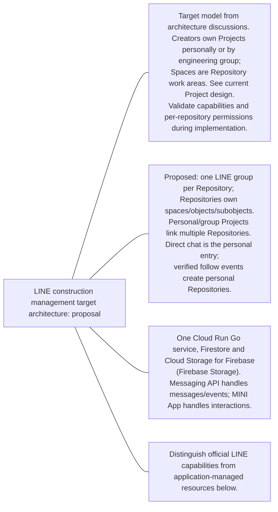
```mermaid
flowchart LR
  h["LINE construction management target architecture: proposal"]
  h --- n0["Target model from architecture discussions. Creators own Projects personally or by engineering group;<br/>Spaces are Repository work areas. See current Project design.<br/>Validate capabilities and per-repository permissions during implementation."]
  click n0 "../../domains/project/project.md"
  h --- n1["Proposed: one LINE group per Repository; Repositories own spaces/objects/subobjects.<br/>Personal/group Projects link multiple Repositories. Direct chat is the personal entry;<br/>verified follow events create personal Repositories."]
  h --- n2["One Cloud Run Go service, Firestore and Cloud Storage for Firebase<br/>(Firebase Storage). Messaging API handles messages/events; MINI App handles interactions."]
  h --- n3["Distinguish official LINE capabilities from application-managed resources below."]
```

## 1. Complete system architecture

Future design

[1. Complete system architecture: Mermaid source](diagrams/platform-overview.mermaid)

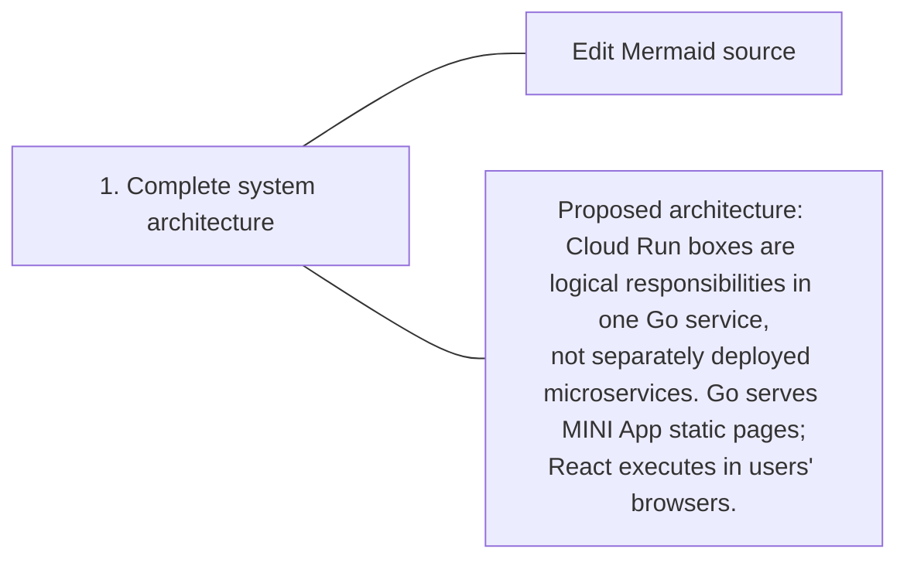
```mermaid
flowchart LR
  h["1. Complete system architecture"]
  h --- n0["Edit Mermaid source"]
  click n0 "diagrams/platform-overview.mermaid"
  h --- n1["Proposed architecture: Cloud Run boxes are logical responsibilities in one Go service,<br/>not separately deployed microservices. Go serves MINI App static pages;<br/>React executes in users' browsers."]
```

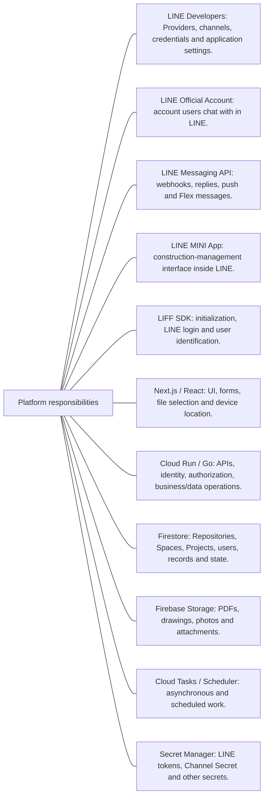
```mermaid
flowchart LR
  h["Platform responsibilities"]
  h --- n0["LINE Developers: Providers, channels, credentials and application settings."]
  h --- n1["LINE Official Account: account users chat with in LINE."]
  h --- n2["LINE Messaging API: webhooks, replies, push and Flex messages."]
  h --- n3["LINE MINI App: construction-management interface inside LINE."]
  h --- n4["LIFF SDK: initialization, LINE login and user identification."]
  h --- n5["Next.js / React: UI, forms, file selection and device location."]
  h --- n6["Cloud Run / Go: APIs, identity, authorization, business/data operations."]
  h --- n7["Firestore: Repositories, Spaces, Projects, users, records and state."]
  h --- n8["Firebase Storage: PDFs, drawings, photos and attachments."]
  h --- n9["Cloud Tasks / Scheduler: asynchronous and scheduled work."]
  h --- n10["Secret Manager: LINE tokens, Channel Secret and other secrets."]
```

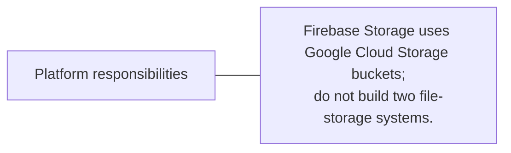
```mermaid
flowchart LR
  h["Platform responsibilities"]
  h --- n0["Firebase Storage uses Google Cloud Storage buckets;<br/>do not build two file-storage systems."]
```

## 2. Correct LINE Developers configuration

Future design

[2. LINE Developers configuration: Mermaid source](diagrams/line-channels.mermaid)

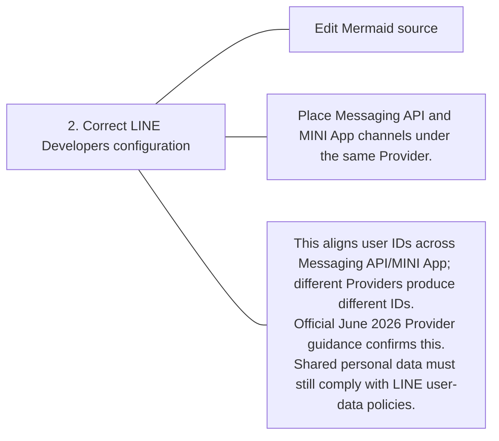
```mermaid
flowchart LR
  h["2. Correct LINE Developers configuration"]
  h --- n0["Edit Mermaid source"]
  click n0 "diagrams/line-channels.mermaid"
  h --- n1["Place Messaging API and MINI App channels under the same Provider."]
  h --- n2["This aligns user IDs across Messaging API/MINI App; different Providers produce different IDs.<br/>Official June 2026 Provider guidance confirms this.<br/>Shared personal data must still comply with LINE user-data policies."]
```

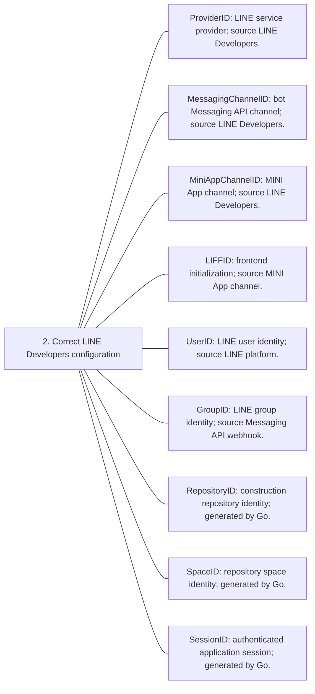
```mermaid
flowchart LR
  h["2. Correct LINE Developers configuration"]
  h --- n0["ProviderID: LINE service provider; source LINE Developers."]
  h --- n1["MessagingChannelID: bot Messaging API channel; source LINE Developers."]
  h --- n2["MiniAppChannelID: MINI App channel; source LINE Developers."]
  h --- n3["LIFFID: frontend initialization; source MINI App channel."]
  h --- n4["UserID: LINE user identity; source LINE platform."]
  h --- n5["GroupID: LINE group identity; source Messaging API webhook."]
  h --- n6["RepositoryID: construction repository identity; generated by Go."]
  h --- n7["SpaceID: repository space identity; generated by Go."]
  h --- n8["SessionID: authenticated application session; generated by Go."]
```

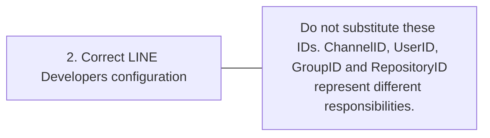
```mermaid
flowchart LR
  h["2. Correct LINE Developers configuration"]
  h --- n0["Do not substitute these IDs. ChannelID, UserID, GroupID and RepositoryID<br/>represent different responsibilities."]
```

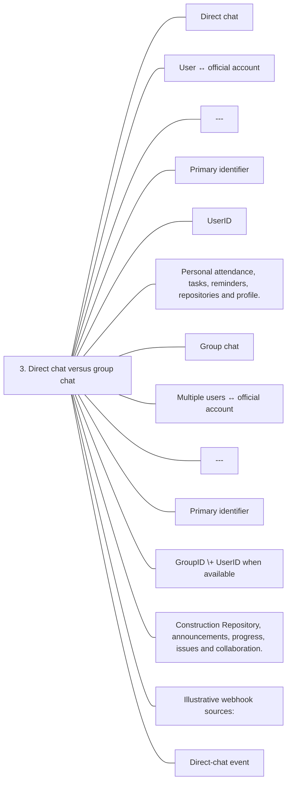
```mermaid
flowchart LR
  h["3. Direct chat versus group chat"]
  h --- n0["Direct chat"]
  h --- n1["User ↔ official account"]
  h --- n2["---"]
  h --- n3["Primary identifier"]
  h --- n4["UserID"]
  h --- n5["Personal attendance, tasks, reminders, repositories and profile."]
  h --- n6["Group chat"]
  h --- n7["Multiple users ↔ official account"]
  h --- n8["---"]
  h --- n9["Primary identifier"]
  h --- n10["GroupID #92;+ UserID when available"]
  h --- n11["Construction Repository, announcements, progress, issues and collaboration."]
  h --- n12["Illustrative webhook sources:"]
  h --- n13["Direct-chat event"]
```

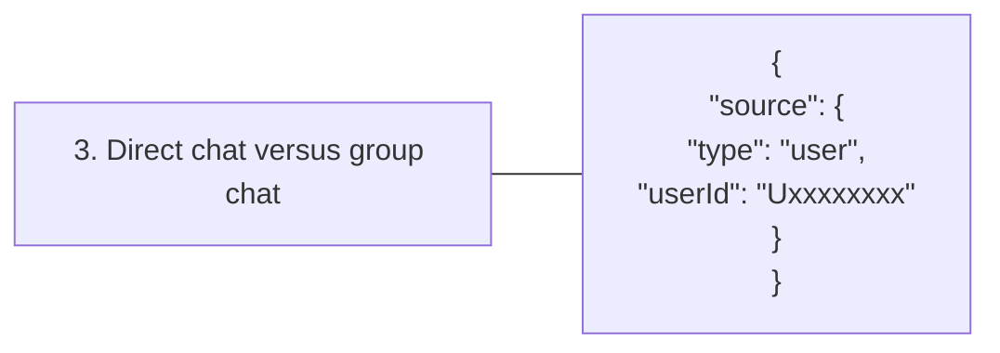
```mermaid
flowchart LR
  h["3. Direct chat versus group chat"]
  h --- n0["{<br/>  #quot;source#quot;: {<br/>    #quot;type#quot;: #quot;user#quot;,<br/>    #quot;userId#quot;: #quot;Uxxxxxxxx#quot;<br/>  }<br/>}"]
```

## 3. Direct chat versus group chat

LINE group message event

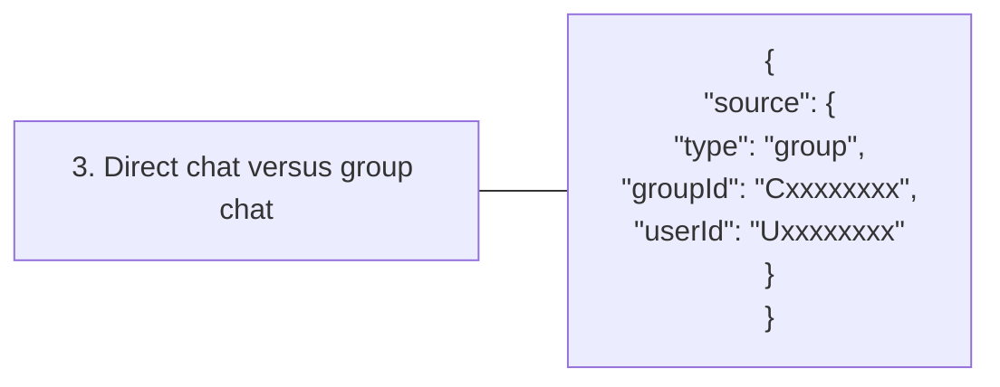
```mermaid
flowchart LR
  h["3. Direct chat versus group chat"]
  h --- n0["{<br/>  #quot;source#quot;: {<br/>    #quot;type#quot;: #quot;group#quot;,<br/>    #quot;groupId#quot;: #quot;Cxxxxxxxx#quot;,<br/>    #quot;userId#quot;: #quot;Uxxxxxxxx#quot;<br/>  }<br/>}"]
```

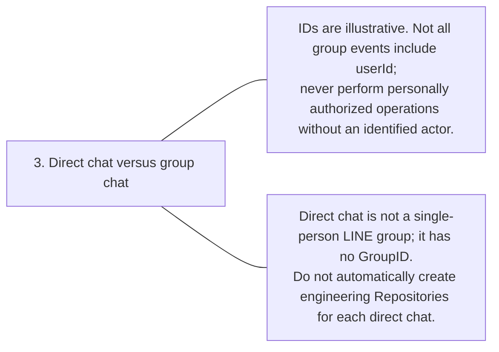
```mermaid
flowchart LR
  h["3. Direct chat versus group chat"]
  h --- n0["IDs are illustrative. Not all group events include userId;<br/>never perform personally authorized operations without an identified actor."]
  h --- n1["Direct chat is not a single-person LINE group; it has no GroupID.<br/>Do not automatically create engineering Repositories for each direct chat."]
```

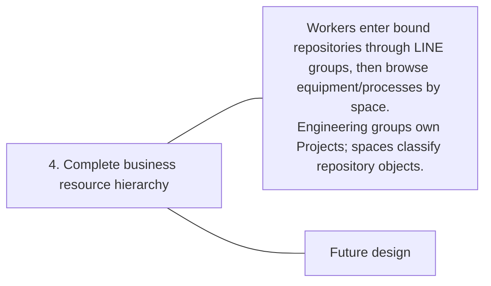
```mermaid
flowchart LR
  h["4. Complete business resource hierarchy"]
  h --- n0["Workers enter bound repositories through LINE groups, then browse equipment/processes by space.<br/>Engineering groups own Projects; spaces classify repository objects."]
  h --- n1["Future design"]
```

[4. Business resource hierarchy: Mermaid source](diagrams/resource-hierarchy.mermaid)

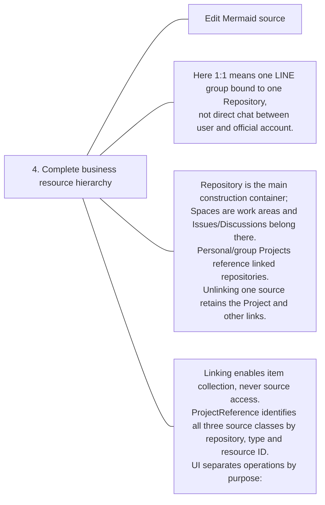
```mermaid
flowchart LR
  h["4. Complete business resource hierarchy"]
  h --- n0["Edit Mermaid source"]
  click n0 "diagrams/resource-hierarchy.mermaid"
  h --- n1["Here 1:1 means one LINE group bound to one Repository,<br/>not direct chat between user and official account."]
  h --- n2["Repository is the main construction container; Spaces are work areas and Issues/Discussions belong there.<br/>Personal/group Projects reference linked repositories.<br/>Unlinking one source retains the Project and other links."]
  h --- n3["Linking enables item collection, never source access.<br/>ProjectReference identifies all three source classes by repository, type and resource ID.<br/>UI separates operations by purpose:"]
```

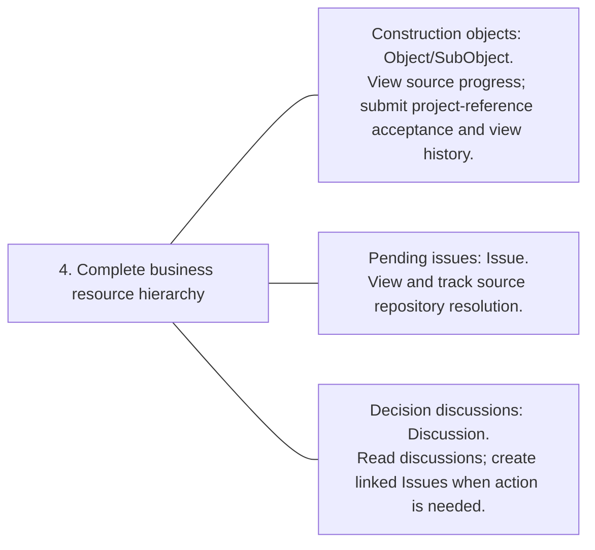
```mermaid
flowchart LR
  h["4. Complete business resource hierarchy"]
  h --- n0["Construction objects: Object/SubObject.<br/>View source progress; submit project-reference acceptance and view history."]
  h --- n1["Pending issues: Issue.<br/>View and track source repository resolution."]
  h --- n2["Decision discussions: Discussion.<br/>Read discussions; create linked Issues when action is needed."]
```

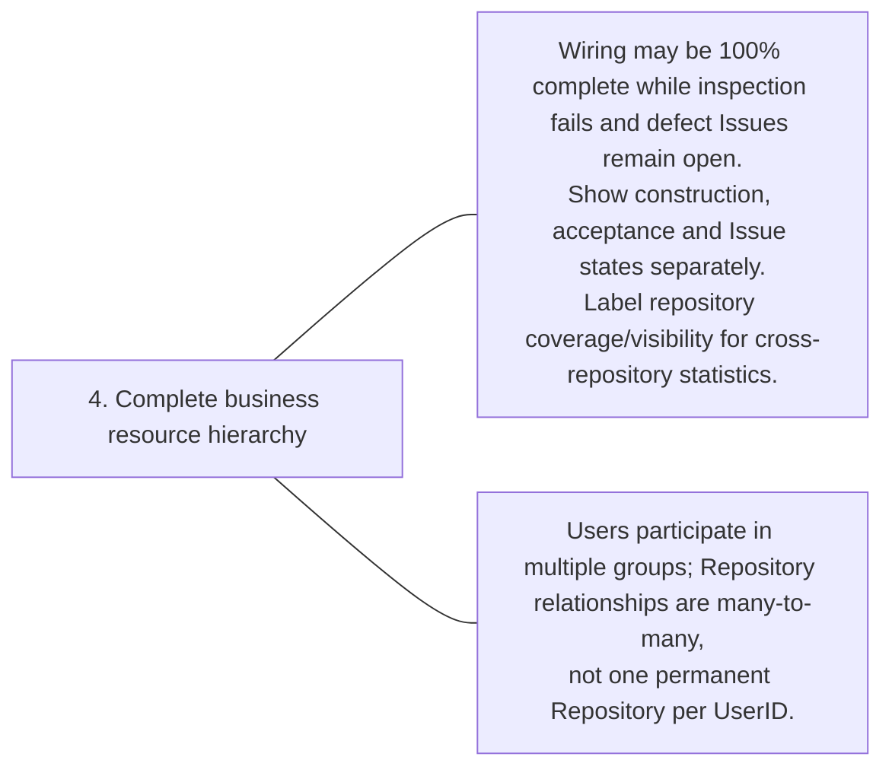
```mermaid
flowchart LR
  h["4. Complete business resource hierarchy"]
  h --- n0["Wiring may be 100% complete while inspection fails and defect Issues remain open.<br/>Show construction, acceptance and Issue states separately.<br/>Label repository coverage/visibility for cross-repository statistics."]
  h --- n1["Users participate in multiple groups; Repository relationships are many-to-many,<br/>not one permanent Repository per UserID."]
```

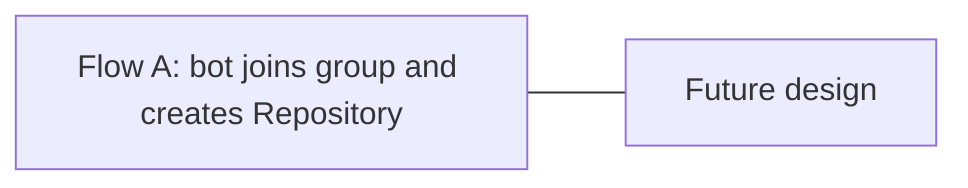
```mermaid
flowchart LR
  h["Flow A: bot joins group and creates Repository"]
  h --- n0["Future design"]
```

[Flow A: bot joins group and creates Repository: Mermaid source](diagrams/group-join.mermaid)

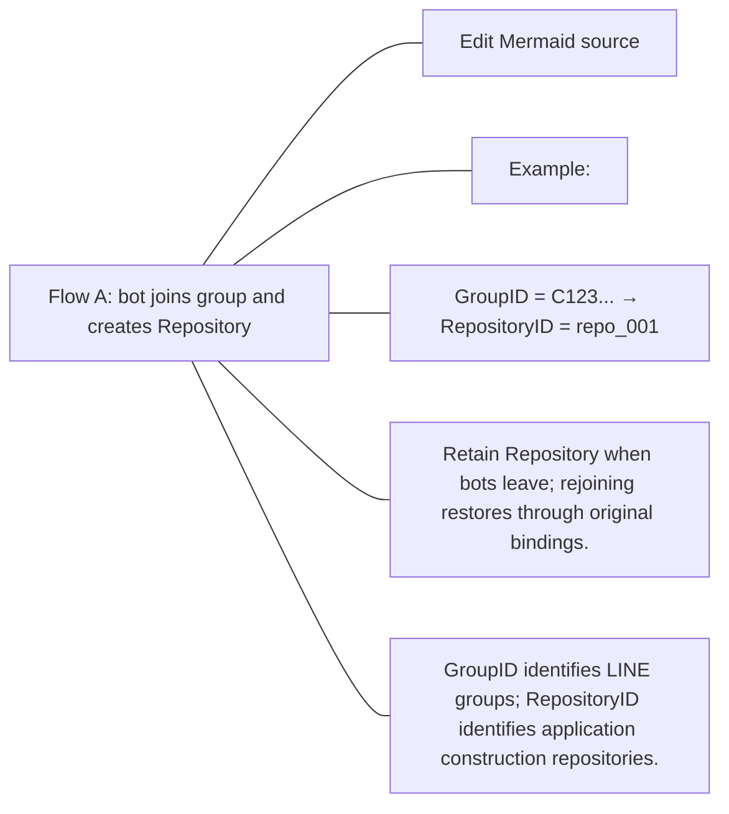
```mermaid
flowchart LR
  h["Flow A: bot joins group and creates Repository"]
  h --- n0["Edit Mermaid source"]
  click n0 "diagrams/group-join.mermaid"
  h --- n1["Example:"]
  h --- n2["GroupID = C123... → RepositoryID = repo_001"]
  h --- n3["Retain Repository when bots leave; rejoining restores through original bindings."]
  h --- n4["GroupID identifies LINE groups; RepositoryID identifies application construction repositories."]
```

## Flow B: open MINI App from a group

Future design

[Flow B: open MINI App from a group: Mermaid source](diagrams/mini-app-entry.mermaid)

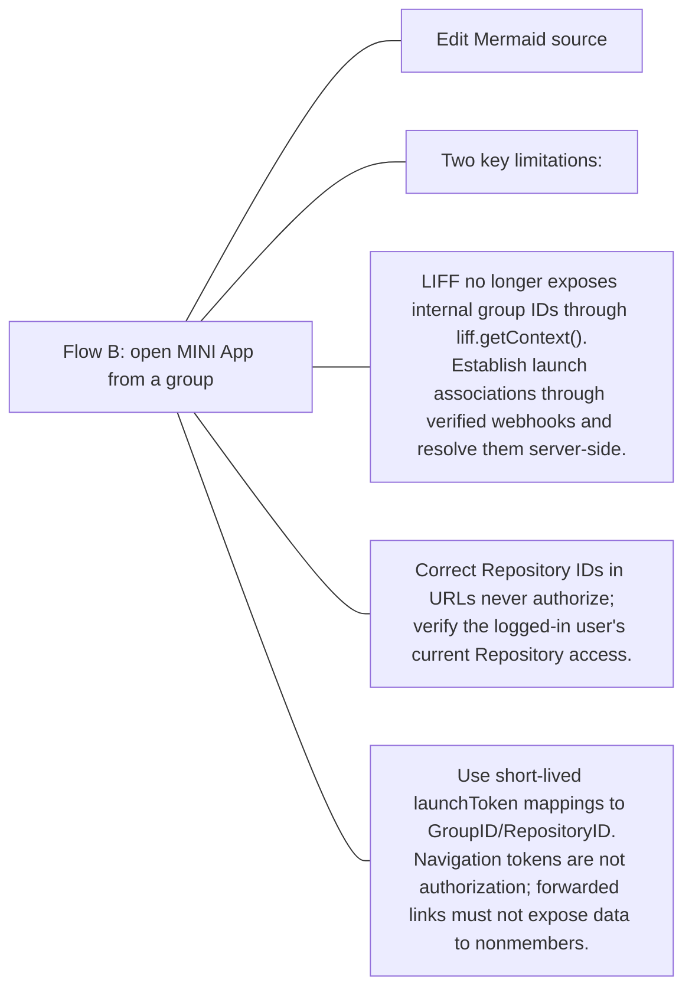
```mermaid
flowchart LR
  h["Flow B: open MINI App from a group"]
  h --- n0["Edit Mermaid source"]
  click n0 "diagrams/mini-app-entry.mermaid"
  h --- n1["Two key limitations:"]
  h --- n2["LIFF no longer exposes internal group IDs through liff.getContext().<br/>Establish launch associations through verified webhooks and resolve them server-side."]
  h --- n3["Correct Repository IDs in URLs never authorize;<br/>verify the logged-in user's current Repository access."]
  h --- n4["Use short-lived launchToken mappings to GroupID/RepositoryID.<br/>Navigation tokens are not authorization; forwarded links must not expose data to nonmembers."]
```

## Flow C: personal construction queries in direct chat

Direct chat has no GroupID, so uses a different flow.

Future design

[Flow C: personal construction queries: Mermaid source](diagrams/direct-query.mermaid)

[Edit Mermaid source](diagrams/direct-query.mermaid)

Example: one user participates in three groups:

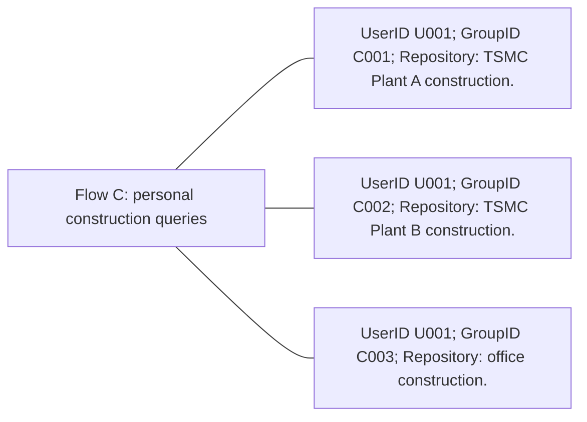
```mermaid
flowchart LR
  h["Flow C: personal construction queries"]
  h --- n0["UserID U001; GroupID C001; Repository: TSMC Plant A construction."]
  h --- n1["UserID U001; GroupID C002; Repository: TSMC Plant B construction."]
  h --- n2["UserID U001; GroupID C003; Repository: office construction."]
```

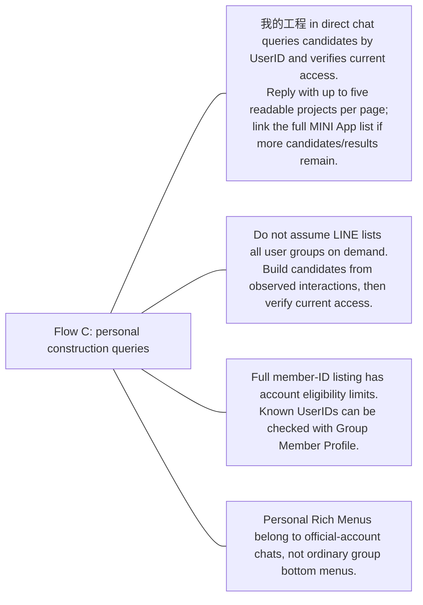
```mermaid
flowchart LR
  h["Flow C: personal construction queries"]
  h --- n0["我的工程 in direct chat queries candidates by UserID and verifies current access.<br/>Reply with up to five readable projects per page;<br/>link the full MINI App list if more candidates/results remain."]
  h --- n1["Do not assume LINE lists all user groups on demand.<br/>Build candidates from observed interactions, then verify current access."]
  h --- n2["Full member-ID listing has account eligibility limits.<br/>Known UserIDs can be checked with Group Member Profile."]
  h --- n3["Personal Rich Menus belong to official-account chats, not ordinary group bottom menus."]
```

```mermaid
flowchart LR
  h["Flow D: construction operations, uploads and notifications"]
  h --- n0["Example: complete Area A power-system tests, upload photos and submit inspection."]
  h --- n1["Future design"]
```

[Flow D: operations, uploads and notifications: Mermaid source](diagrams/engineering-notification.mermaid)

## Flow D: operations, uploads and notifications

[Edit Mermaid source](diagrams/engineering-notification.mermaid)

Choose one upload approach:

```mermaid
flowchart LR
  h["Flow D: construction operations, uploads and notifications"]
  h --- n0["MINI App → Go → Storage: small/few attachments.<br/>Simplest implementation; traffic passes through Go."]
  h --- n1["MINI App → restricted Storage upload: large PDFs/photos/batches.<br/>Less Go traffic; signing, expiry, completion checks and cleanup required."]
```

```mermaid
flowchart LR
  h["Flow D: construction operations, uploads and notifications"]
  h --- n0["Reuse Go sessions/authorization with short-lived signed URLs or restricted resumable uploads.<br/>Do not introduce separate Firebase Authentication solely for uploads."]
  h --- n1["Signed URLs grant short-lived access to holders. Keep buckets private<br/>and verify completed files through Go."]
```

## 6. Firestore and Firebase Storage responsibilities

Do not duplicate data across the two stores.

```mermaid
flowchart LR
  h["6. Firestore and Firebase Storage responsibilities"]
  h --- n0["UserID / GroupID: Firestore only."]
  h --- n1["Repository / Space: Firestore only."]
  h --- n2["Object / SubObject: Firestore only."]
  h --- n3["Project / Issue: Firestore only."]
  h --- n4["Permissions/state: Firestore only."]
  h --- n5["Construction PDF bytes: Firebase Storage only."]
  h --- n6["Photo bytes: Firebase Storage only."]
  h --- n7["Filename, size, MIME/uploader: Firestore;<br/>Storage may also retain necessary object metadata."]
  h --- n8["Attachment/business relationships: Firestore;<br/>Storage does not own business relationships."]
  h --- n9["Inspection records/version references: Firestore;<br/>Storage retains corresponding file versions."]
```

```mermaid
flowchart LR
  h["Proposed Firestore structure"]
  h --- n0["Target schema, not a claim that current databases use these paths."]
```

```mermaid
flowchart LR
  h["Proposed Firestore structure"]
  h --- n0["users/{userId}<br/>sessions/{sessionHash}<br/><br/>channels/{messagingChannelId}/<br/>  repositoryOwnerBindings/{ownerId}<br/>  users/{userId}/projects/{projectId}/<br/>  groups/{groupId}/projects/{projectId}/<br/>    linkedRepositories/{repositoryId}<br/>    items/{referenceId}  # ProjectReference: sourceRepositoryId, sourceType, sourceId<br/>      inspectionSubmissions/{submissionId}<br/>  repositories/{repositoryId}/<br/>    spaces/{spaceId}<br/>    objects/{objectId}  # spaceId points to work area; moving preserves object ID<br/>      subobjects/{subobjectId}<br/>    issues/{issueId}<br/>    discussions/{discussionId}<br/>    attachments/{attachmentId}<br/>    journals/{journalId}"]
```

```mermaid
flowchart LR
  h["Proposed Firestore structure"]
  h --- n0["repositoryOwnerBindings/{ownerId} uniquely binds groups/Repositories;<br/>Firestore transactions prevent redelivery duplicates."]
  h --- n1["attachments/{attachmentId} may store:"]
```

```mermaid
flowchart LR
  h["Proposed Firestore structure"]
  h --- n0["{<br/>  #quot;repositoryId#quot;: #quot;repo_001#quot;,<br/>  #quot;ownerType#quot;: #quot;inspectionSubmission#quot;,<br/>  #quot;ownerId#quot;: #quot;work_001#quot;,<br/>  #quot;storagePath#quot;: #quot;repositories/repo_001/attachments/file_001#quot;,<br/>  #quot;uploadedBy#quot;: #quot;U001#quot;,<br/>  #quot;contentType#quot;: #quot;image/jpeg#quot;,<br/>  #quot;status#quot;: #quot;ready#quot;,<br/>  #quot;generation#quot;: #quot;123456789#quot;<br/>}"]
```

```mermaid
flowchart LR
  h["Proposed Firestore structure"]
  h --- n0["generation references file versions. Preserve inspection evidence<br/>rather than overwriting original bytes."]
```

```mermaid
flowchart LR
  h["Firebase Storage organization"]
  h --- n0["bucket/<br/>  repositories/<br/>    repo_001/<br/>      attachments/<br/>        file_001<br/>        file_002<br/>        file_003<br/>    repo_002/<br/>      attachments/<br/>        file_004"]
```

```mermaid
flowchart LR
  h["Firebase Storage organization"]
  h --- n0["Storage keys need not mirror business hierarchy.<br/>Firestore ownerType/ownerId associates attachments with Objects, Projects or submissions,<br/>avoiding mass file moves when business objects move."]
  h --- n1["Group-uploaded LINE files/photos use a separate path:<br/>webhook messageId → Go LINE Content API → Storage → Firestore metadata.<br/>This differs from browser uploads."]
```

## 7. Permissions and state

LINE membership alone is insufficient authorization.

```mermaid
flowchart LR
  h["7. Permissions and state"]
  h --- n0["Open Repository: verify UserID, GroupID binding and current membership."]
  h --- n1["Read Object: verify Repository read access."]
  h --- n2["Create/update Object: verify Repository write access."]
  h --- n3["Create Issue: verify membership and creation rules."]
  h --- n4["Link source: verify Project management and source-link permissions."]
  h --- n5["Read cross-repository references: verify Project/source access;<br/>hide source names, content and attachments after revocation."]
  h --- n6["Submit work results: verify Project membership, source access and submission state."]
  h --- n7["Inspection decision: verify designated reviewer and valid transition."]
  h --- n8["Download attachment: verify Repository/target read access."]
  h --- n9["Send LINE notification: verify recipient scope, policy and API delivery eligibility."]
```

```mermaid
flowchart LR
  h["7. Permissions and state"]
  h --- n0["Membership is basic entry eligibility, never automatic delete, approve or manage authority."]
  h --- n1["Block ineligible access after bot/user departure or membership check failure.<br/>Past membership never grants permanent rights."]
```

```mermaid
flowchart LR
  h["8. Notifications and background work"]
  h --- n0["To prevent duplicate notifications or database success with failed delivery:"]
  h --- n1["Future design"]
```

[8. Notifications/background work: Mermaid source](diagrams/background-delivery.mermaid)

```mermaid
flowchart LR
  h["8. Notifications and background work"]
  h --- n0["Edit Mermaid source"]
  click n0 "diagrams/background-delivery.mermaid"
  h --- n1["One Go service can expose APIs, webhooks and job handlers;<br/>no independent microservice is required."]
  h --- n2["Deduplicate webhookEventId for redelivery/reordering.<br/>Never send LINE messages inside retryable Firestore callbacks.<br/>LINE also recommends asynchronous webhook processing."]
  h --- n3["Use Messaging API Reply/Push for ordinary notifications.<br/>MINI App Service Messages have separate eligibility, templates and use restrictions;<br/>they do not replace arbitrary group notifications."]
```

```mermaid
flowchart LR
  h["9. Current Repository versus target design"]
  h --- n0["Project specifications own current ownership, links and paths.<br/>Compare current/target designs below."]
  click n0 "../../domains/project/project.md"
```

```mermaid
flowchart LR
  h["9. Current Repository versus target design"]
  h --- n0["GroupID: current direct Repository binding; retain as construction entry."]
  h --- n1["Space: current Group means LINE group and Space means work area.<br/>Target: reserve Space for work areas and GroupID for groups."]
  h --- n2["Project: personal/group owners, multiple sources, ownerId lookup and purpose-based sections.<br/>Target: initial repository is only a default source; do not show one repository's numbers as total progress."]
  h --- n3["Inspection history stores submitted source versions; reads verify Project/link/source access.<br/>Target: submit checks active objects/versions; historical reads check membership/links/source rights.<br/>Removed objects retain saved submissions; unlinked/revoked sources block reads."]
  h --- n4["Repository: currently construction sources; target construction root container."]
  h --- n5["Attachments: complete implementation unconfirmed;<br/>target Firestore metadata plus Firebase Storage."]
  h --- n6["Direct chat: attendance/My projects exist;<br/>target opens MINI App with currently authorized projects."]
  h --- n7["MINI App: existing Go sessions/static frontend;<br/>target retains them and unifies resource authorization."]
```

## 9. Current Repository versus target design

End-to-end upload/group-notification acceptance remains pending.

```mermaid
flowchart LR
  h["10. Final architectural principles"]
  h --- n0["Three main paths: users, construction data and project management."]
  h --- n1["User path"]
  h --- n2["UserID → LINE direct/group chat → MINI App → Go Session → authorization → business operation"]
  h --- n3["Construction data path"]
  h --- n4["GroupID → RepositoryID → SpaceID → ObjectID <br/>→ SubObjectID"]
  h --- n5["Project management path"]
  h --- n6["Personal/engineering group → Project → ProjectReference → InspectionSubmission for construction objects"]
  h --- n7["Sources own Issues, Discussions, Journals and attachments.<br/>Personal/groups manage Projects; references identify repository/resource.<br/>Notifications include only recipient-visible data; opening cards rechecks user access."]
  h --- n8["All entries share Go business rules. Firestore stores state/relationships,<br/>Firebase Storage files and Messaging API LINE traffic."]
  h --- n9["Proposed acceptance: new group invites bot and gains Repository;<br/>member opens MINI App, creates Area A/Power Object, references it from Project,<br/>uploads photos/submits tests and notifies reviewers.<br/>Link a second repository/object and open the same Project via direct chat.<br/>Revoke second-source access: first remains visible, second content is unavailable<br/>through UI, notifications or attachment links."]
  h --- n10["Reliable completion plus verified UserID/GroupID/RepositoryID, permissions,<br/>Firestore and Storage consistency establishes the core platform chain."]
  h --- n11["See runtime architecture for current webhook/browser/Cloud Tasks entries."]
  click n11 "../../architecture/runtime/overview.md#執行入口"
```

[applicable guidance](../../AGENTS.md)
