# line-工程管理平台目標架構提案

## 用途與範圍

保存 LINE 工程流程相關設計提案。

## 架構與責任邊界

此處記錄擬議流程，進入實作後由對應領域與契約維護。

## 閱讀與修改入口

先查閱[diagrams](diagrams)。

## 相關規格

[本層規格與指引](../README.md)

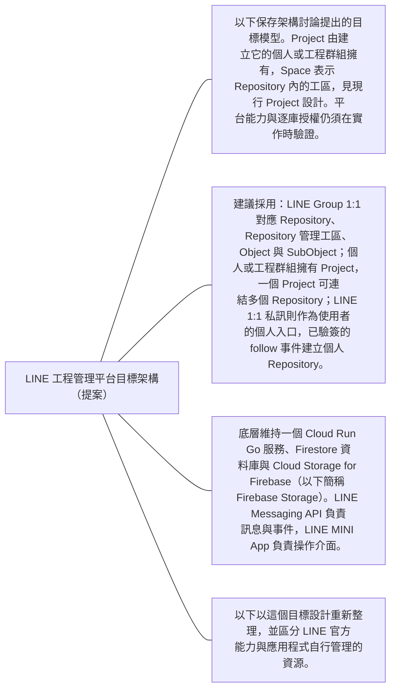
```mermaid
flowchart LR
  h["LINE 工程管理平台目標架構（提案）"]
  h --- n0["以下保存架構討論提出的目標模型。Project 由建<br/>立它的個人或工程群組擁有，Space 表示 <br/>Repository 內的工區，見現行 Project 設計。平<br/>台能力與逐庫授權仍須在實作時驗證。"]
  click n0 "../../domains/project.md"
  h --- n1["建議採用：LINE Group 1:1 對應 Repository、<br/>Repository 管理工區、Object 與 SubObject；個<br/>人或工程群組擁有 Project，一個 Project 可連<br/>結多個 Repository；LINE 1:1 私訊則作為使用者<br/>的個人入口，已驗簽的 follow 事件建立個人 <br/>Repository。"]
  h --- n2["底層維持一個 Cloud Run Go 服務、Firestore 資<br/>料庫與 Cloud Storage for Firebase（以下簡稱 <br/>Firebase Storage）。LINE Messaging API 負責<br/>訊息與事件，LINE MINI App 負責操作介面。"]
  h --- n3["以下以這個目標設計重新整理，並區分 LINE 官方<br/>能力與應用程式自行管理的資源。"]
```

## 一、完整系統總架構

未來設計

[一、完整系統總架構（Mermaid 原始檔）](diagrams/platform-overview.mermaid)

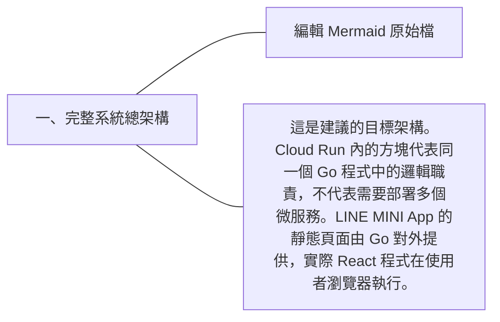
```mermaid
flowchart LR
  h["一、完整系統總架構"]
  h --- n0["編輯 Mermaid 原始檔"]
  click n0 "diagrams/platform-overview.mermaid"
  h --- n1["這是建議的目標架構。Cloud Run 內的方塊代表同<br/>一個 Go 程式中的邏輯職責，不代表需要部署多個<br/>微服務。LINE MINI App 的靜態頁面由 Go 對外提<br/>供，實際 React 程式在使用者瀏覽器執行。"]
```

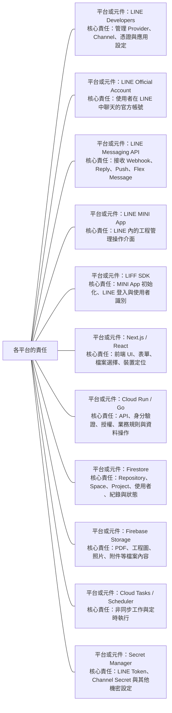
```mermaid
flowchart LR
  h["各平台的責任"]
  h --- n0["平台或元件：LINE Developers<br/>核心責任：管理 Provider、Channel、憑證與應用<br/>設定"]
  h --- n1["平台或元件：LINE Official Account<br/>核心責任：使用者在 LINE 中聊天的官方帳號"]
  h --- n2["平台或元件：LINE Messaging API<br/>核心責任：接收 Webhook、Reply、Push、Flex <br/>Message"]
  h --- n3["平台或元件：LINE MINI App<br/>核心責任：LINE 內的工程管理操作介面"]
  h --- n4["平台或元件：LIFF SDK<br/>核心責任：MINI App 初始化、LINE 登入與使用者<br/>識別"]
  h --- n5["平台或元件：Next.js / React<br/>核心責任：前端 UI、表單、檔案選擇、裝置定位"]
  h --- n6["平台或元件：Cloud Run / Go<br/>核心責任：API、身分驗證、授權、業務規則與資<br/>料操作"]
  h --- n7["平台或元件：Firestore<br/>核心責任：Repository、Space、Project、使用者<br/>、紀錄與狀態"]
  h --- n8["平台或元件：Firebase Storage<br/>核心責任：PDF、工程圖、照片、附件等檔案內容"]
  h --- n9["平台或元件：Cloud Tasks / Scheduler<br/>核心責任：非同步工作與定時執行"]
  h --- n10["平台或元件：Secret Manager<br/>核心責任：LINE Token、Channel Secret 與其他<br/>機密設定"]
```

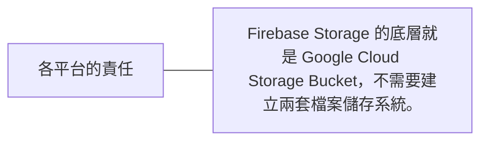
```mermaid
flowchart LR
  h["各平台的責任"]
  h --- n0["Firebase Storage 的底層就是 Google Cloud <br/>Storage Bucket，不需要建立兩套檔案儲存系統。"]
```

## 二、LINE Developers 的正確設定結構

未來設計

[二、LINE Developers 的正確設定結構（Mermaid 原始檔）](diagrams/line-channels.mermaid)

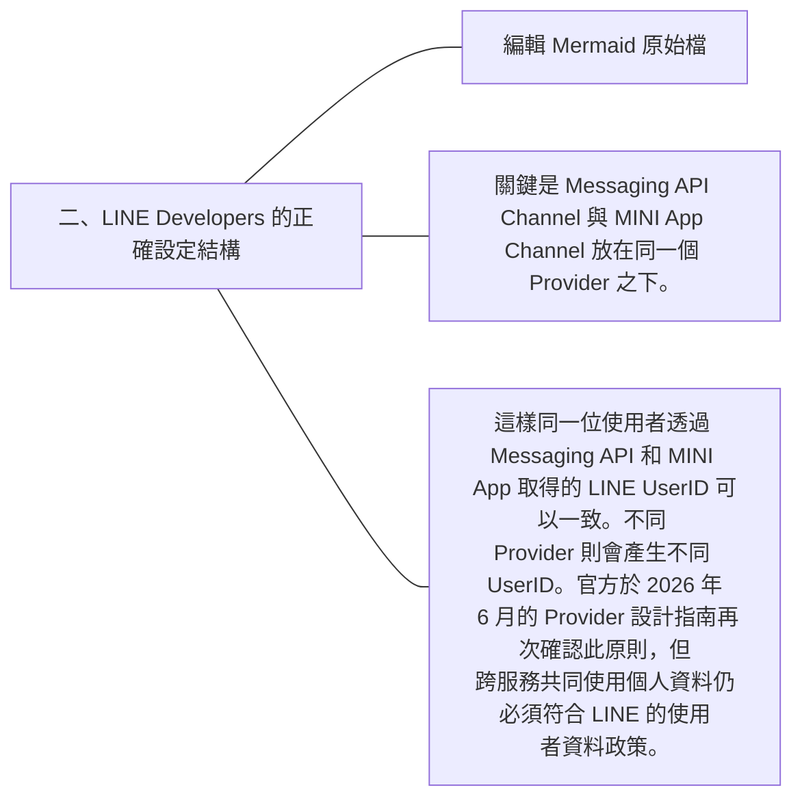
```mermaid
flowchart LR
  h["二、LINE Developers 的正確設定結構"]
  h --- n0["編輯 Mermaid 原始檔"]
  click n0 "diagrams/line-channels.mermaid"
  h --- n1["關鍵是 Messaging API Channel 與 MINI App <br/>Channel 放在同一個 Provider 之下。"]
  h --- n2["這樣同一位使用者透過 Messaging API 和 MINI <br/>App 取得的 LINE UserID 可以一致。不同 <br/>Provider 則會產生不同 UserID。官方於 2026 年<br/> 6 月的 Provider 設計指南再次確認此原則，但<br/>跨服務共同使用個人資料仍必須符合 LINE 的使用<br/>者資料政策。"]
```

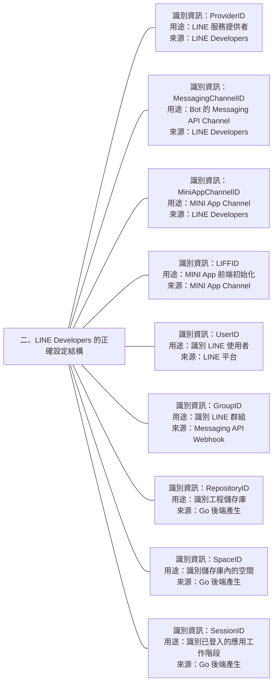
```mermaid
flowchart LR
  h["二、LINE Developers 的正確設定結構"]
  h --- n0["識別資訊：ProviderID<br/>用途：LINE 服務提供者<br/>來源：LINE Developers"]
  h --- n1["識別資訊：MessagingChannelID<br/>用途：Bot 的 Messaging API Channel<br/>來源：LINE Developers"]
  h --- n2["識別資訊：MiniAppChannelID<br/>用途：MINI App Channel<br/>來源：LINE Developers"]
  h --- n3["識別資訊：LIFFID<br/>用途：MINI App 前端初始化<br/>來源：MINI App Channel"]
  h --- n4["識別資訊：UserID<br/>用途：識別 LINE 使用者<br/>來源：LINE 平台"]
  h --- n5["識別資訊：GroupID<br/>用途：識別 LINE 群組<br/>來源：Messaging API Webhook"]
  h --- n6["識別資訊：RepositoryID<br/>用途：識別工程儲存庫<br/>來源：Go 後端產生"]
  h --- n7["識別資訊：SpaceID<br/>用途：識別儲存庫內的空間<br/>來源：Go 後端產生"]
  h --- n8["識別資訊：SessionID<br/>用途：識別已登入的應用工作階段<br/>來源：Go 後端產生"]
```

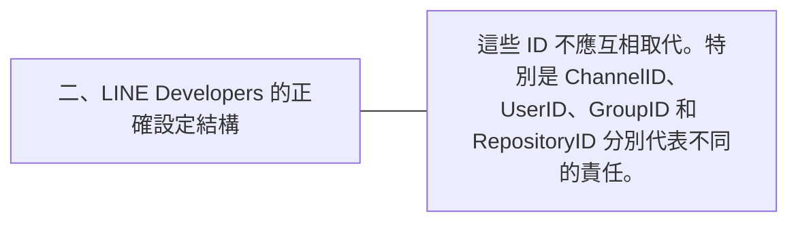
```mermaid
flowchart LR
  h["二、LINE Developers 的正確設定結構"]
  h --- n0["這些 ID 不應互相取代。特別是 ChannelID、<br/>UserID、GroupID 和 RepositoryID 分別代表不同<br/>的責任。"]
```

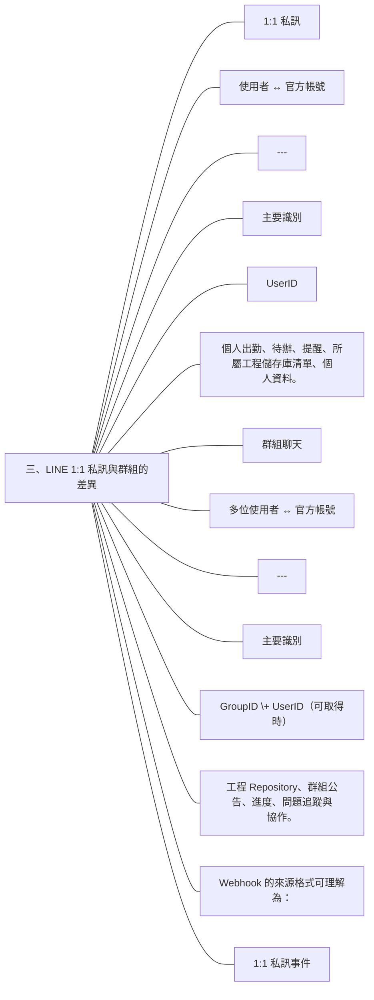
```mermaid
flowchart LR
  h["三、LINE 1:1 私訊與群組的差異"]
  h --- n0["1:1 私訊"]
  h --- n1["使用者 ↔ 官方帳號"]
  h --- n2["---"]
  h --- n3["主要識別"]
  h --- n4["UserID"]
  h --- n5["個人出勤、待辦、提醒、所屬工程儲存庫清單、個<br/>人資料。"]
  h --- n6["群組聊天"]
  h --- n7["多位使用者 ↔ 官方帳號"]
  h --- n8["---"]
  h --- n9["主要識別"]
  h --- n10["GroupID #92;+ UserID（可取得時）"]
  h --- n11["工程 Repository、群組公告、進度、問題追蹤與<br/>協作。"]
  h --- n12["Webhook 的來源格式可理解為："]
  h --- n13["1:1 私訊事件"]
```

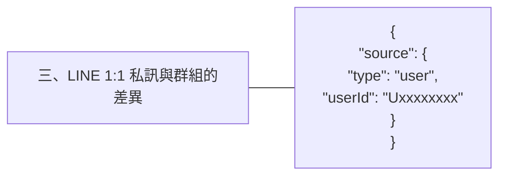
```mermaid
flowchart LR
  h["三、LINE 1:1 私訊與群組的差異"]
  h --- n0["{<br/>  #quot;source#quot;: {<br/>    #quot;type#quot;: #quot;user#quot;,<br/>    #quot;userId#quot;: #quot;Uxxxxxxxx#quot;<br/>  }<br/>}"]
```

## 三、LINE 1:1 私訊與群組的差異

LINE 群組訊息事件

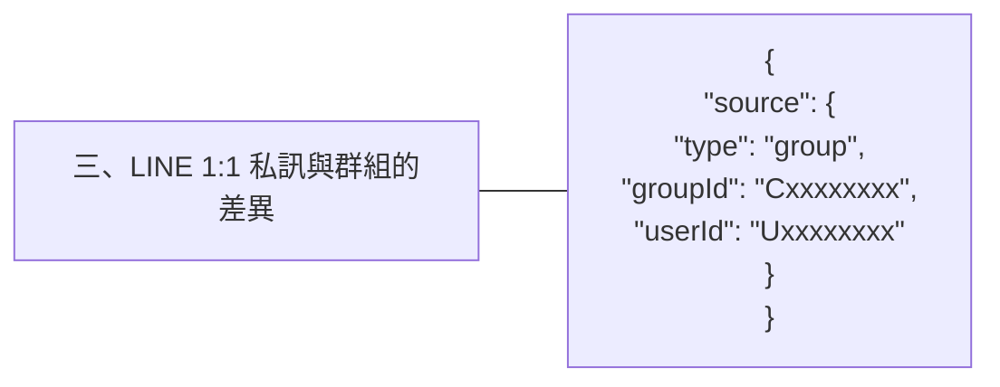
```mermaid
flowchart LR
  h["三、LINE 1:1 私訊與群組的差異"]
  h --- n0["{<br/>  #quot;source#quot;: {<br/>    #quot;type#quot;: #quot;group#quot;,<br/>    #quot;groupId#quot;: #quot;Cxxxxxxxx#quot;,<br/>    #quot;userId#quot;: #quot;Uxxxxxxxx#quot;<br/>  }<br/>}"]
```

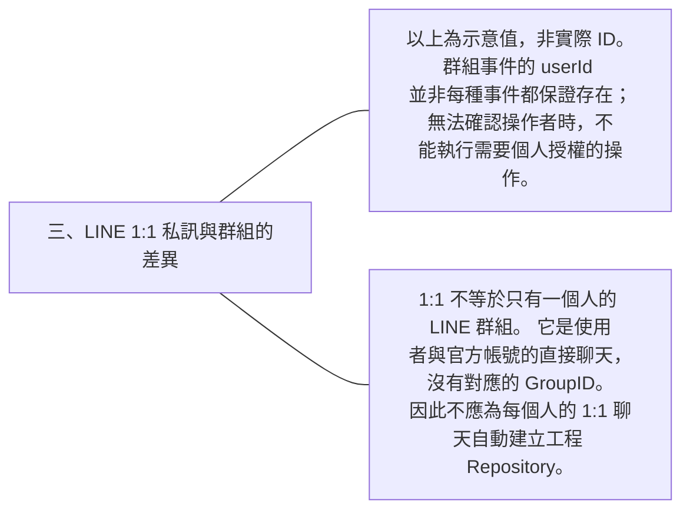
```mermaid
flowchart LR
  h["三、LINE 1:1 私訊與群組的差異"]
  h --- n0["以上為示意值，非實際 ID。群組事件的 userId <br/>並非每種事件都保證存在；無法確認操作者時，不<br/>能執行需要個人授權的操作。"]
  h --- n1["1:1 不等於只有一個人的 LINE 群組。 它是使用<br/>者與官方帳號的直接聊天，沒有對應的 GroupID。<br/>因此不應為每個人的 1:1 聊天自動建立工程 <br/>Repository。"]
```

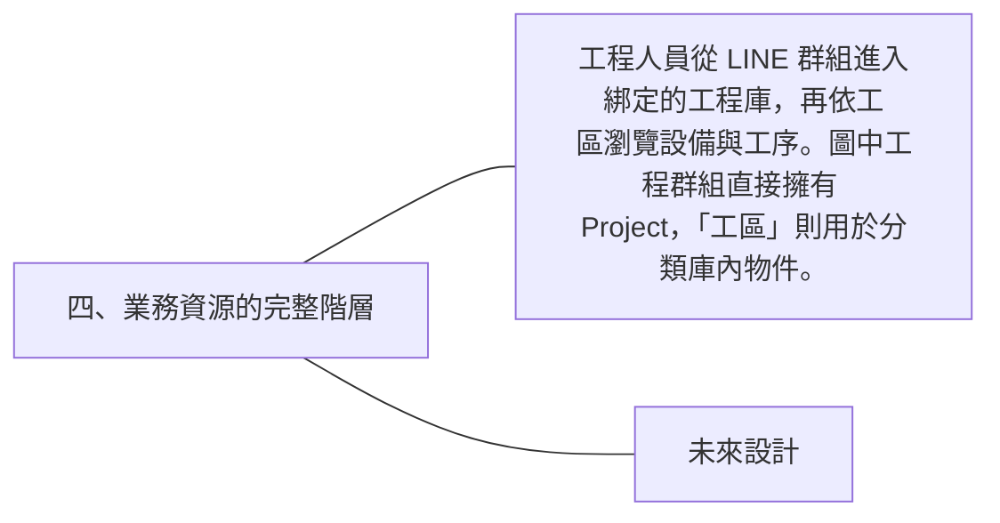
```mermaid
flowchart LR
  h["四、業務資源的完整階層"]
  h --- n0["工程人員從 LINE 群組進入綁定的工程庫，再依工<br/>區瀏覽設備與工序。圖中工程群組直接擁有 <br/>Project，「工區」則用於分類庫內物件。"]
  h --- n1["未來設計"]
```

[四、業務資源的完整階層（Mermaid 原始檔）](diagrams/resource-hierarchy.mermaid)

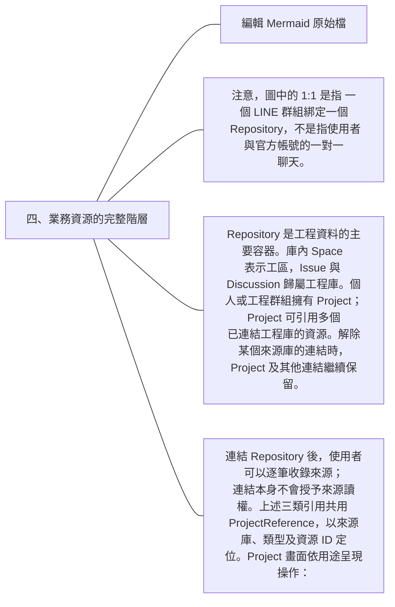
```mermaid
flowchart LR
  h["四、業務資源的完整階層"]
  h --- n0["編輯 Mermaid 原始檔"]
  click n0 "diagrams/resource-hierarchy.mermaid"
  h --- n1["注意，圖中的 1:1 是指 一個 LINE 群組綁定一個<br/> Repository，不是指使用者與官方帳號的一對一<br/>聊天。"]
  h --- n2["Repository 是工程資料的主要容器。庫內 Space <br/>表示工區，Issue 與 Discussion 歸屬工程庫。個<br/>人或工程群組擁有 Project；Project 可引用多個<br/>已連結工程庫的資源。解除某個來源庫的連結時，<br/>Project 及其他連結繼續保留。"]
  h --- n3["連結 Repository 後，使用者可以逐筆收錄來源；<br/>連結本身不會授予來源讀權。上述三類引用共用 <br/>ProjectReference，以來源庫、類型及資源 ID 定<br/>位。Project 畫面依用途呈現操作："]
```

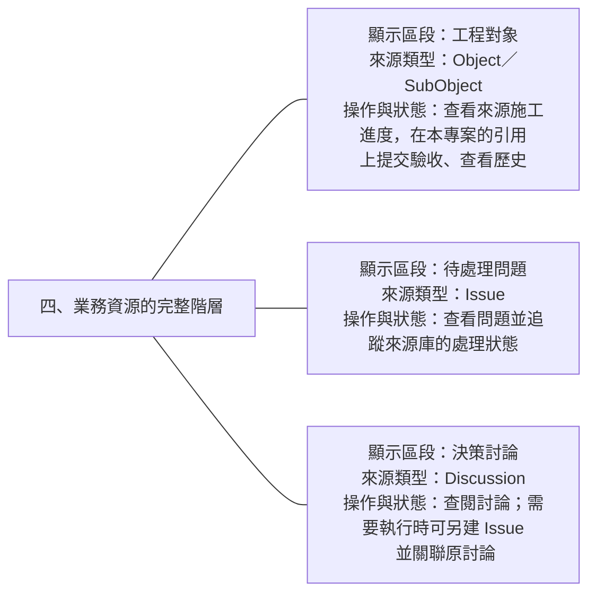
```mermaid
flowchart LR
  h["四、業務資源的完整階層"]
  h --- n0["顯示區段：工程對象<br/>來源類型：Object／SubObject<br/>操作與狀態：查看來源施工進度，在本專案的引用<br/>上提交驗收、查看歷史"]
  h --- n1["顯示區段：待處理問題<br/>來源類型：Issue<br/>操作與狀態：查看問題並追蹤來源庫的處理狀態"]
  h --- n2["顯示區段：決策討論<br/>來源類型：Discussion<br/>操作與狀態：查閱討論；需要執行時可另建 Issue<br/> 並關聯原討論"]
```

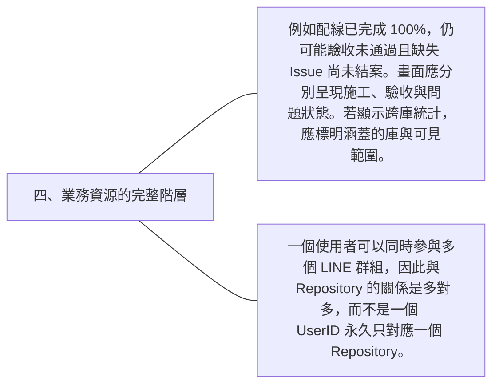
```mermaid
flowchart LR
  h["四、業務資源的完整階層"]
  h --- n0["例如配線已完成 100%，仍可能驗收未通過且缺失 <br/>Issue 尚未結案。畫面應分別呈現施工、驗收與問<br/>題狀態。若顯示跨庫統計，應標明涵蓋的庫與可見<br/>範圍。"]
  h --- n1["一個使用者可以同時參與多個 LINE 群組，因此與<br/> Repository 的關係是多對多，而不是一個 <br/>UserID 永久只對應一個 Repository。"]
```

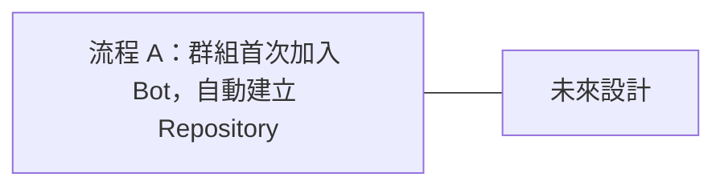
```mermaid
flowchart LR
  h["流程 A：群組首次加入 Bot，自動建立 <br/>Repository"]
  h --- n0["未來設計"]
```

[流程 A：群組首次加入 Bot，自動建立 Repository（Mermaid 原始檔）](diagrams/group-join.mermaid)

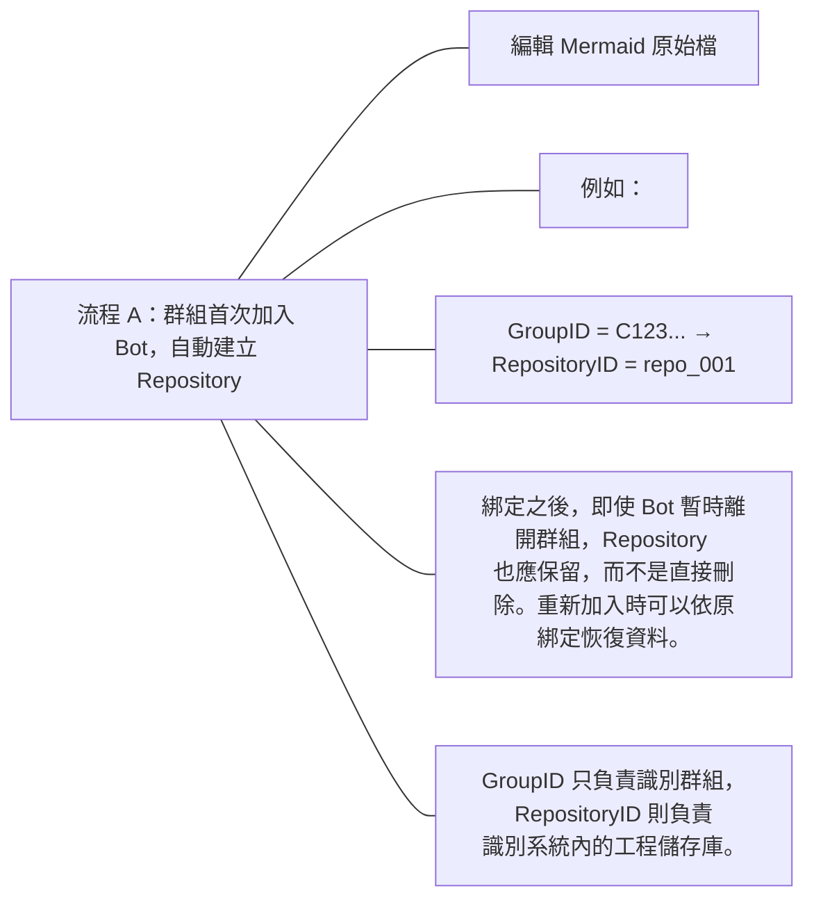
```mermaid
flowchart LR
  h["流程 A：群組首次加入 Bot，自動建立 <br/>Repository"]
  h --- n0["編輯 Mermaid 原始檔"]
  click n0 "diagrams/group-join.mermaid"
  h --- n1["例如："]
  h --- n2["GroupID = C123... → RepositoryID = repo_001"]
  h --- n3["綁定之後，即使 Bot 暫時離開群組，Repository <br/>也應保留，而不是直接刪除。重新加入時可以依原<br/>綁定恢復資料。"]
  h --- n4["GroupID 只負責識別群組，RepositoryID 則負責<br/>識別系統內的工程儲存庫。"]
```

## 流程 B：使用者從群組開啟 MINI App

未來設計

[流程 B：使用者從群組開啟 MINI App（Mermaid 原始檔）](diagrams/mini-app-entry.mermaid)

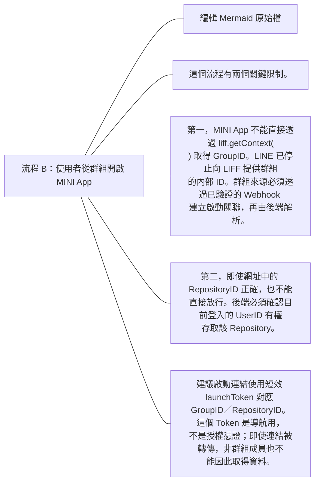
```mermaid
flowchart LR
  h["流程 B：使用者從群組開啟 MINI App"]
  h --- n0["編輯 Mermaid 原始檔"]
  click n0 "diagrams/mini-app-entry.mermaid"
  h --- n1["這個流程有兩個關鍵限制。"]
  h --- n2["第一，MINI App 不能直接透過 liff.getContext(<br/>) 取得 GroupID。LINE 已停止向 LIFF 提供群組<br/>的內部 ID。群組來源必須透過已驗證的 Webhook <br/>建立啟動關聯，再由後端解析。"]
  h --- n3["第二，即使網址中的 RepositoryID 正確，也不能<br/>直接放行。後端必須確認目前登入的 UserID 有權<br/>存取該 Repository。"]
  h --- n4["建議啟動連結使用短效 launchToken 對應 <br/>GroupID／RepositoryID。這個 Token 是導航用，<br/>不是授權憑證；即使連結被轉傳，非群組成員也不<br/>能因此取得資料。"]
```

## 流程 C：1:1 私訊查詢個人工程資訊

1:1 私訊沒有 GroupID，因此流程不同。

未來設計

[流程 C：1:1 私訊查詢個人工程資訊（Mermaid 原始檔）](diagrams/direct-query.mermaid)

[編輯 Mermaid 原始檔](diagrams/direct-query.mermaid)

例如同一位使用者參與三個群組：

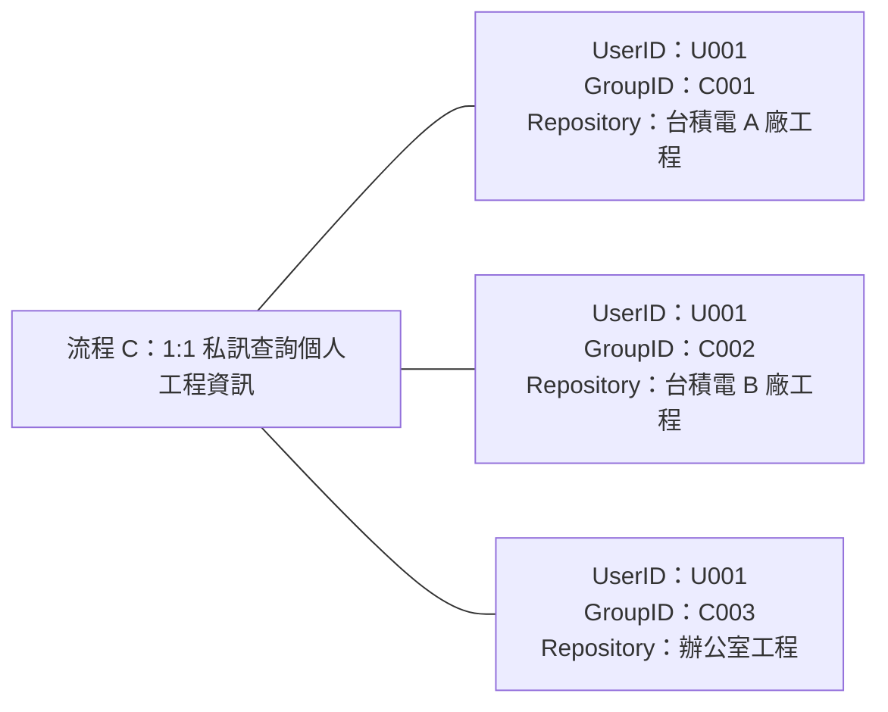
```mermaid
flowchart LR
  h["流程 C：1:1 私訊查詢個人工程資訊"]
  h --- n0["UserID：U001<br/>GroupID：C001<br/>Repository：台積電 A 廠工程"]
  h --- n1["UserID：U001<br/>GroupID：C002<br/>Repository：台積電 B 廠工程"]
  h --- n2["UserID：U001<br/>GroupID：C003<br/>Repository：辦公室工程"]
```

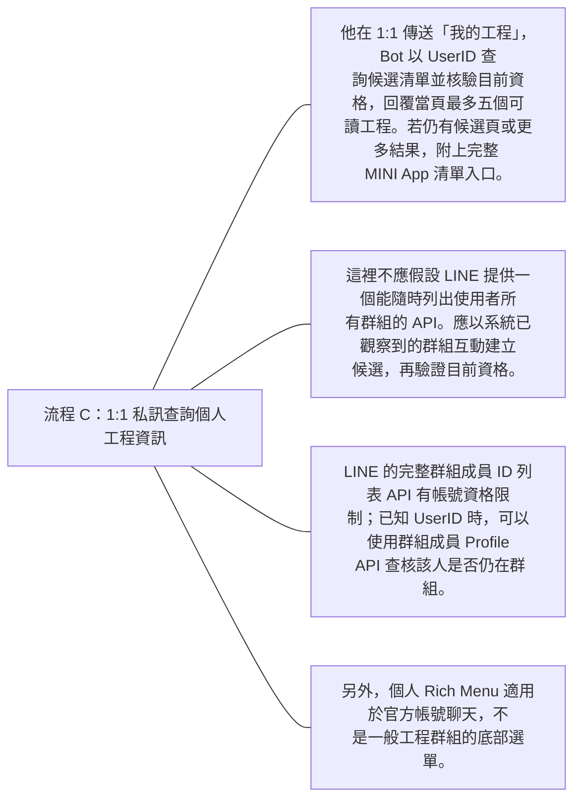
```mermaid
flowchart LR
  h["流程 C：1:1 私訊查詢個人工程資訊"]
  h --- n0["他在 1:1 傳送「我的工程」，Bot 以 UserID 查<br/>詢候選清單並核驗目前資格，回覆當頁最多五個可<br/>讀工程。若仍有候選頁或更多結果，附上完整 <br/>MINI App 清單入口。"]
  h --- n1["這裡不應假設 LINE 提供一個能隨時列出使用者所<br/>有群組的 API。應以系統已觀察到的群組互動建立<br/>候選，再驗證目前資格。"]
  h --- n2["LINE 的完整群組成員 ID 列表 API 有帳號資格限<br/>制；已知 UserID 時，可以使用群組成員 Profile<br/> API 查核該人是否仍在群組。"]
  h --- n3["另外，個人 Rich Menu 適用於官方帳號聊天，不<br/>是一般工程群組的底部選單。"]
```

```mermaid
flowchart LR
  h["流程 D：工程操作、附件上傳與 LINE 通知"]
  h --- n0["以「A 區第一套電力系統測試完成，上傳照片，送<br/>出驗收」為例："]
  h --- n1["未來設計"]
```

[流程 D：工程操作、附件上傳與 LINE 通知（Mermaid 原始檔）](diagrams/engineering-notification.mermaid)

## 流程 D：工程操作、附件上傳與 LINE 通知

[編輯 Mermaid 原始檔](diagrams/engineering-notification.mermaid)

這裡的檔案上傳建議採兩種方案之一：

```mermaid
flowchart LR
  h["流程 D：工程操作、附件上傳與 LINE 通知"]
  h --- n0["方案：MINI App → Go → Storage<br/>使用情境：少量、小型附件<br/>取捨：實作最簡單，但流量經過 Go"]
  h --- n1["方案：MINI App → Storage（受限直傳）<br/>使用情境：大型 PDF、照片、批次上傳<br/>取捨：減少 Go 資料傳輸，但須處理簽署、期限、<br/>上傳確認與清理"]
```

```mermaid
flowchart LR
  h["流程 D：工程操作、附件上傳與 LINE 通知"]
  h --- n0["由於你已有 Go Session，建議讓 Go 統一控制授<br/>權，再使用 Google Cloud Storage 的短效 <br/>Signed URL 或受限續傳機制，不必僅為檔案上傳<br/>引入第二套 Firebase Authentication。"]
  h --- n1["Signed URL 本身是短期存取能力，取得網址的人<br/>在有效期限內可能使用它，因此 Bucket 必須保持<br/>私有，且上傳完成後仍要由 Go 驗證檔案。"]
```

## 六、Firestore 與 Firebase Storage 如何分工

兩者的資料不應重複保存。

```mermaid
flowchart LR
  h["六、Firestore 與 Firebase Storage 如何分工"]
  h --- n0["資料：UserID / GroupID<br/>Firestore：儲存<br/>Firebase Storage：不儲存"]
  h --- n1["資料：Repository / Space<br/>Firestore：儲存<br/>Firebase Storage：不儲存"]
  h --- n2["資料：Object / SubObject<br/>Firestore：儲存<br/>Firebase Storage：不儲存"]
  h --- n3["資料：Project / Issue<br/>Firestore：儲存<br/>Firebase Storage：不儲存"]
  h --- n4["資料：權限與狀態<br/>Firestore：儲存<br/>Firebase Storage：不儲存"]
  h --- n5["資料：工程 PDF 檔案內容<br/>Firestore：不儲存<br/>Firebase Storage：儲存"]
  h --- n6["資料：工程照片內容<br/>Firestore：不儲存<br/>Firebase Storage：儲存"]
  h --- n7["資料：檔名、大小、MIME、上傳者<br/>Firestore：儲存<br/>Firebase Storage：亦可保留物件必要 metadata"]
  h --- n8["資料：附件與工程物件的關聯<br/>Firestore：儲存<br/>Firebase Storage：不作業務關聯"]
  h --- n9["資料：驗收紀錄與檔案版本參照<br/>Firestore：儲存<br/>Firebase Storage：保存對應檔案版本"]
```

```mermaid
flowchart LR
  h["建議的 Firestore 資料結構"]
  h --- n0["以下是新模型的目標 Schema，不是宣稱現有資料<br/>庫已經採用這些路徑。"]
```

```mermaid
flowchart LR
  h["建議的 Firestore 資料結構"]
  h --- n0["users/{userId}<br/>sessions/{sessionHash}<br/><br/>channels/{messagingChannelId}/<br/>  repositoryOwnerBindings/{ownerId}<br/>  users/{userId}/projects/{projectId}/<br/>  groups/{groupId}/projects/{projectId}/<br/>    linkedRepositories/{repositoryId}<br/>    items/{referenceId}  # ProjectReference： sourceRepositoryId、sourceType、sourceId<br/>      inspectionSubmissions/{submissionId}<br/>  repositories/{repositoryId}/<br/>    spaces/{spaceId}<br/>    objects/{objectId}  # spaceId 指向所屬工區；換區保留物件 ID<br/>      subobjects/{subobjectId}<br/>    issues/{issueId}<br/>    discussions/{discussionId}<br/>    attachments/{attachmentId}<br/>    journals/{journalId}"]
```

```mermaid
flowchart LR
  h["建議的 Firestore 資料結構"]
  h --- n0["repositoryOwnerBindings/{ownerId} 保存 LINE <br/>群組與 Repository 的唯一關聯，並以 Firestore<br/> Transaction 保證不會因重送事件產生多份 <br/>Repository。"]
  h --- n1["attachments/{attachmentId} 可保存："]
```

```mermaid
flowchart LR
  h["建議的 Firestore 資料結構"]
  h --- n0["{<br/>  #quot;repositoryId#quot;: #quot;repo_001#quot;,<br/>  #quot;ownerType#quot;: #quot;inspectionSubmission#quot;,<br/>  #quot;ownerId#quot;: #quot;work_001#quot;,<br/>  #quot;storagePath#quot;: #quot;repositories/repo_001/attachments/file_001#quot;,<br/>  #quot;uploadedBy#quot;: #quot;U001#quot;,<br/>  #quot;contentType#quot;: #quot;image/jpeg#quot;,<br/>  #quot;status#quot;: #quot;ready#quot;,<br/>  #quot;generation#quot;: #quot;123456789#quot;<br/>}"]
```

```mermaid
flowchart LR
  h["建議的 Firestore 資料結構"]
  h --- n0["其中 generation 是檔案版本參照。對於驗收證據<br/>，應避免覆寫原檔而失去當時的內容。"]
```

```mermaid
flowchart LR
  h["Firebase Storage 的目錄組織"]
  h --- n0["bucket/<br/>  repositories/<br/>    repo_001/<br/>      attachments/<br/>        file_001<br/>        file_002<br/>        file_003<br/>    repo_002/<br/>      attachments/<br/>        file_004"]
```

```mermaid
flowchart LR
  h["Firebase Storage 的目錄組織"]
  h --- n0["Storage 的路徑是檔案儲存鍵，不必完全複製 <br/>Firestore 的業務階層。利用 Firestore 的 <br/>ownerType、ownerId 關聯，便能知道附件屬於哪<br/>個 Object、Project 或驗收送件，避免移動工程<br/>物件時必須搬移大量檔案。"]
  h --- n1["LINE 使用者傳到群組的照片或檔案則走另一個入<br/>口：Webhook 收到 messageId，Go 再經由 LINE <br/>Content API 取得內容，存入 Storage，最後記錄<br/> Firestore metadata。這與 MINI App 的瀏覽器<br/>上傳是兩條不同輸入路徑。"]
```

## 七、權限與狀態如何運作

權限不可只依靠 LINE 群組身分。

```mermaid
flowchart LR
  h["七、權限與狀態如何運作"]
  h --- n0["操作：開啟 Repository<br/>必須確認：UserID、GroupID 綁定、目前群組成員<br/>資格"]
  h --- n1["操作：讀取 Object<br/>必須確認：Repository 讀取權限"]
  h --- n2["操作：建立或修改 Object<br/>必須確認：Repository 寫入權限"]
  h --- n3["操作：建立 Issue<br/>必須確認：群組資格及 Issue 建立規則"]
  h --- n4["操作：連結來源庫<br/>必須確認：Project 管理權及來源庫允許連結的權<br/>限"]
  h --- n5["操作：查看跨庫引用<br/>必須確認：Project 讀取權與該來源資源的當下讀<br/>取權；失去來源權限時隱藏其名稱、內容與附件"]
  h --- n6["操作：提交工程結果<br/>必須確認：Project 成員、工程引用的來源讀權及<br/>送件狀態"]
  h --- n7["操作：驗收決定<br/>必須確認：指定審核權限及合法狀態轉換"]
  h --- n8["操作：下載附件<br/>必須確認：所屬 Repository 及目標資源讀取權限"]
  h --- n9["操作：發送 LINE 通知<br/>必須確認：接收對象、通知政策與 Messaging API<br/> 可送達資格"]
```

```mermaid
flowchart LR
  h["七、權限與狀態如何運作"]
  h --- n0["群組成員資格只是最基礎的進入條件，不能自動賦<br/>予刪除、核准或管理權限。"]
  h --- n1["LINE Bot 離開群組、使用者退出群組或官方成員<br/>核驗失敗時，應阻止不符合條件的資源存取；不能<br/>以過去曾加入群組的紀錄當成永久權限。"]
```

```mermaid
flowchart LR
  h["八、通知與背景工作的完整閉環"]
  h --- n0["為了避免重複通知或 Firestore 成功但 LINE 發<br/>送失敗，建議："]
  h --- n1["未來設計"]
```

[八、通知與背景工作的完整閉環（Mermaid 原始檔）](diagrams/background-delivery.mermaid)

```mermaid
flowchart LR
  h["八、通知與背景工作的完整閉環"]
  h --- n0["編輯 Mermaid 原始檔"]
  click n0 "diagrams/background-delivery.mermaid"
  h --- n1["同一個 Go 程式可以同時提供業務 API、Webhook <br/>和非同步工作 Handler，不必新增獨立微服務。"]
  h --- n2["LINE Webhook 可能重送或亂序，應按 <br/>webhookEventId 處理防重，且不要在可能被 <br/>Firestore 重試的交易 Callback 中直接發送 <br/>LINE 訊息。LINE 也建議 Webhook 非同步處理。"]
  h --- n3["一般通知建議走 Messaging API 的 Reply 或 <br/>Push；MINI App Service Message 有獨立的資格<br/>、模板與使用情境限制，不能視為任意群組通知的<br/>替代品。"]
```

```mermaid
flowchart LR
  h["九、現有 Repository 與目標設計的差距"]
  h --- n0["現行 Project 的擁有者、來源庫連結與儲存路徑<br/>見 Project 功能規格。以下對照現況與目標。"]
  click n0 "../../domains/project.md"
```

```mermaid
flowchart LR
  h["九、現有 Repository 與目標設計的差距"]
  h --- n0["項目：GroupID<br/>現有設計：群組已直接綁定 Repository<br/>目標設計：沿用群組綁定作為工程入口"]
  h --- n1["項目：Space<br/>現有設計：Group 代表群組，Space 代表庫內工區<br/>目標設計：Space 專指庫內工區，群組使用 <br/>GroupID"]
  h --- n2["項目：Project<br/>現有設計：個人或群組擁有，已支援多庫；由 <br/>ownerId 定位，詳情按引用用途分區顯示<br/>目標設計：初始庫只作預設來源。以擁有者定位專<br/>案，避免把單庫數字顯示為全專案進度"]
  h --- n3["項目：驗收歷史<br/>現有設計：已保存送件時的來源版本，讀歷史只核<br/>驗 Project、庫連結與來源庫讀權<br/>目標設計：提交時查驗有效物件及版本；讀歷史時<br/>核對專案成員、庫連結及來源讀權。物件移除後仍<br/>可查看已保存的送件；解除連結或失去來源權限則<br/>禁止讀取"]
  h --- n4["項目：Repository<br/>現有設計：工程來源資料<br/>目標設計：工程管理根容器"]
  h --- n5["項目：附件檔案流程<br/>現有設計：尚未從查核文件確認完整實作<br/>目標設計：Firestore metadata + Firebase <br/>Storage"]
  h --- n6["項目：1:1 個人入口<br/>現有設計：已有出勤與「我的工程」私訊查詢<br/>目標設計：以目前授權的工程清單開啟 MINI App"]
  h --- n7["項目：MINI App<br/>現有設計：已有 Go Session 與靜態前端<br/>目標設計：延續並統一資源授權"]
```

## 九、現有 Repository 與目標設計的差距

附件上傳與群組通知的端到端流程仍待驗收。

```mermaid
flowchart LR
  h["十、最終架構原則"]
  h --- n0["系統依使用者入口、工程資料與專案管理三條主線<br/>運作。"]
  h --- n1["使用者主線"]
  h --- n2["UserID → LINE 1:1 / LINE 群組 → MINI App → <br/>Go Session → 授權 → 業務操作"]
  h --- n3["工程資料主線"]
  h --- n4["GroupID → RepositoryID → SpaceID → ObjectID <br/>→ SubObjectID"]
  h --- n5["專案管理主線"]
  h --- n6["個人或工程群組 → Project → ProjectReference <br/>→ InspectionSubmission（僅工程對象）"]
  h --- n7["Issue、Discussion、Journal 與工程附件由來源<br/>庫管理。Project 由個人或工程群組管理，每筆跨<br/>庫引用記錄來源庫和資源識別。群組通知只附收件<br/>範圍可見的資訊，開啟卡片後再按使用者權限載入<br/>來源內容。"]
  h --- n8["所有入口最後都進入同一套 Go 業務規則；<br/>Firestore 保存狀態與關係，Firebase Storage <br/>保存檔案，Messaging API 負責 LINE 訊息往返。"]
  h --- n9["建議下一個實作驗收案例： 一個新 LINE 群組加<br/>入 Bot，自動建立 Repository；使用者從群組開<br/>啟 MINI App，建立 A 區 Space 與電力系統 <br/>Object，建立 Project 引用該 Object，上傳照片<br/>並提交測試結果，最後由 LINE 群組通知審核者。<br/>再連結第二個 Repository，引用該庫的一個物件<br/>，從 1:1 私訊開啟同一 Project。撤銷使用者對<br/>第二庫的權限後，確認他仍能看到第一庫的引用，<br/>且無法從畫面、通知或附件連結取得第二庫的內容<br/>。"]
  h --- n10["只要這個流程能可靠完成，且可驗證 UserID、<br/>GroupID、RepositoryID、權限、Firestore 資料<br/>與 Storage 檔案的一致性，平台的核心運作鏈就<br/>真正成立。"]
  h --- n11["現行 Webhook、瀏覽器與 Cloud Tasks 的服務入<br/>口見執行架構。"]
  click n11 "../../architecture/runtime/overview.md#執行入口"
```
