# 實作契約與待決策清單

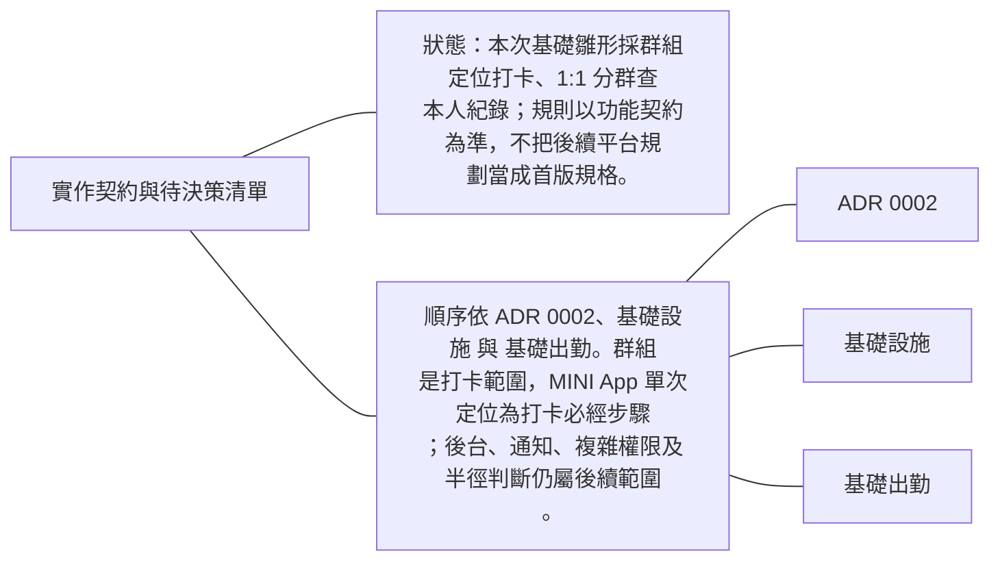
```mermaid
flowchart LR
  h["實作契約與待決策清單"]
  h --- n0["狀態：本次基礎雛形採群組定位打卡、1:1 分群查<br/>本人紀錄；規則以功能契約為準，不把後續平台規<br/>劃當成首版規格。"]
  h --- n1["順序依 ADR 0002、基礎設施 與 基礎出勤。群組<br/>是打卡範圍，MINI App 單次定位為打卡必經步驟<br/>；後台、通知、複雜權限及半徑判斷仍屬後續範圍<br/>。"]
  n1 --- n1l0["ADR 0002"]
  click n1l0 "../../decisions/0002-baseline.md"
  n1 --- n1l1["基礎設施"]
  click n1l1 "../../development/environment/verification.md"
  n1 --- n1l2["基礎出勤"]
  click n1l2 "../../domains/attendance/README.md"
```

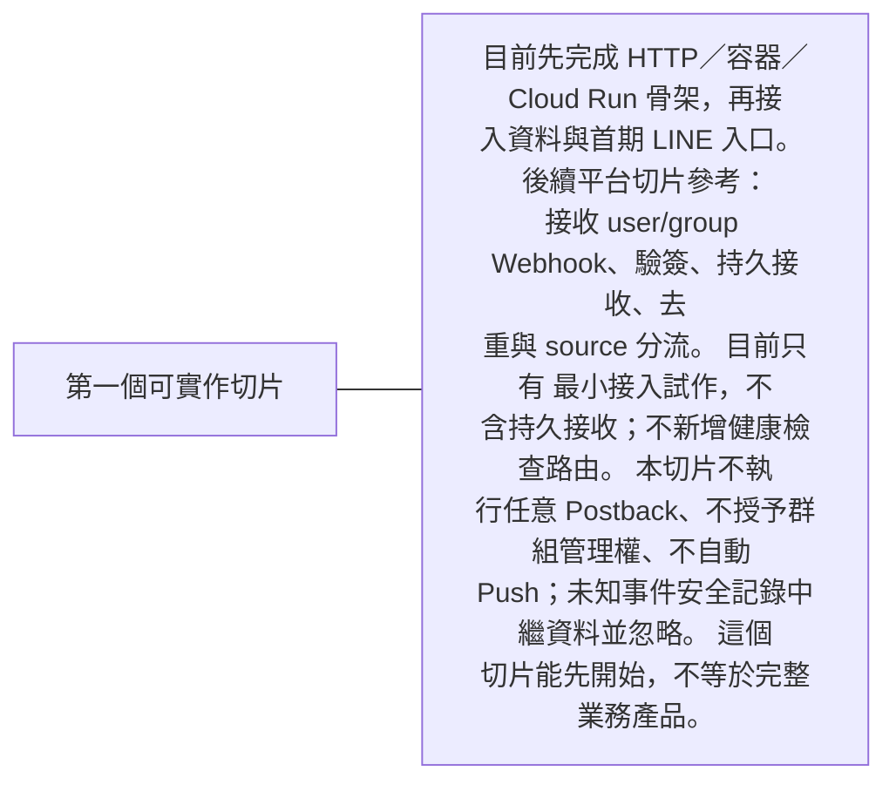
```mermaid
flowchart LR
  h["第一個可實作切片"]
  h --- n0["目前先完成 HTTP／容器／Cloud Run 骨架，再接<br/>入資料與首期 LINE 入口。 後續平台切片參考：<br/>接收 user/group Webhook、驗簽、持久接收、去<br/>重與 source 分流。 目前只有 最小接入試作，不<br/>含持久接收；不新增健康檢查路由。 本切片不執<br/>行任意 Postback、不授予群組管理權、不自動 <br/>Push；未知事件安全記錄中繼資料並忽略。 這個<br/>切片能先開始，不等於完整業務產品。"]
  click n0 "../../integrations/line/setup.md"
```

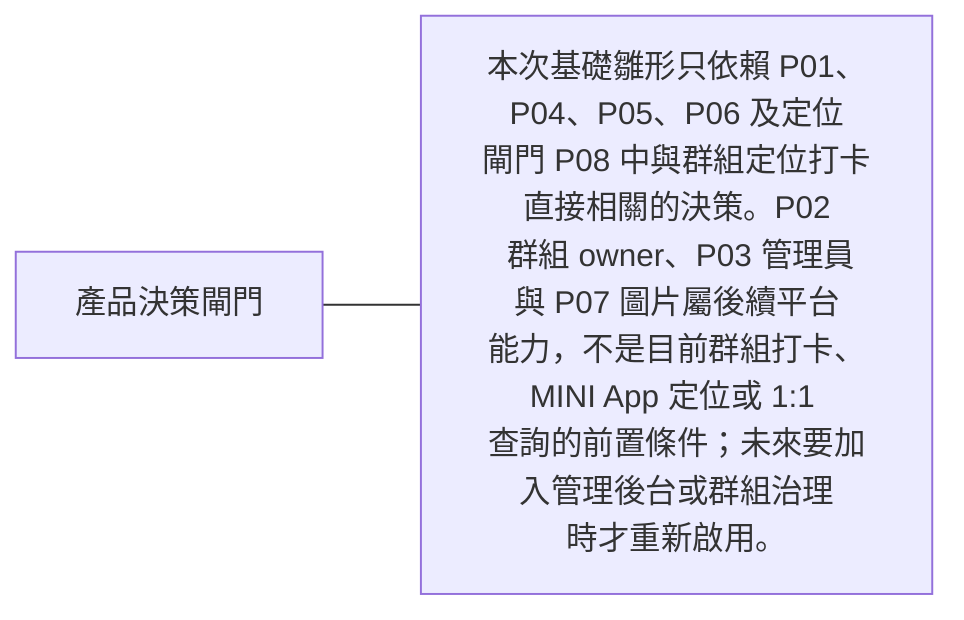
```mermaid
flowchart LR
  h["產品決策閘門"]
  h --- n0["本次基礎雛形只依賴 P01、P04、P05、P06 及定位<br/>閘門 P08 中與群組定位打卡直接相關的決策。P02<br/> 群組 owner、P03 管理員與 P07 圖片屬後續平台<br/>能力，不是目前群組打卡、MINI App 定位或 1:1 <br/>查詢的前置條件；未來要加入管理後台或群組治理<br/>時才重新啟用。"]
```

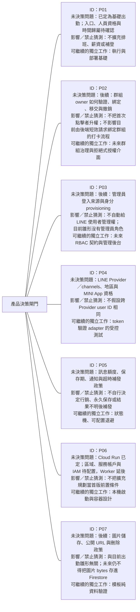
```mermaid
flowchart LR
  h["產品決策閘門"]
  h --- n0["ID：P01<br/>未決策問題：已定為基礎出勤；入口、人員資格與<br/>時間歸屬待確認<br/>影響／禁止猜測：不擴充排班、薪資或補登<br/>可繼續的獨立工作：執行與部署基礎"]
  h --- n1["ID：P02<br/>未決策問題：後續：群組 owner 如何驗證、綁定<br/>、移交與撤銷<br/>影響／禁止猜測：不把首次點擊者升權；不影響目<br/>前由後端短效請求綁定群組的打卡流程<br/>可繼續的獨立工作：未來群組治理與拒絕式授權介<br/>面"]
  h --- n2["ID：P03<br/>未決策問題：後續：管理員登入來源與身分 <br/>provisioning<br/>影響／禁止猜測：不自動給 LINE 使用者管理權；<br/>目前雛形沒有管理員角色<br/>可繼續的獨立工作：未來 RBAC 契約與管理後台"]
  h --- n3["ID：P04<br/>未決策問題：LINE Provider／channels、地區與 <br/>MINI App 資格<br/>影響／禁止猜測：不假設跨 Provider user ID 相<br/>同<br/>可繼續的獨立工作：token 驗證 adapter 的受控<br/>測試"]
  h --- n4["ID：P05<br/>未決策問題：訊息額度、保存期、通知與超時補發<br/>政策<br/>影響／禁止猜測：不自行決定行銷、永久保存或結<br/>果不明後補發<br/>可繼續的獨立工作：狀態機、可配置退避"]
  h --- n5["ID：P06<br/>未決策問題：Cloud Run 已定；區域、服務帳戶與<br/> IAM 待配置，Worker 延後<br/>影響／禁止猜測：不把擴充規劃當首版前置條件<br/>可繼續的獨立工作：本機啟動與容器設計"]
  h --- n6["ID：P07<br/>未決策問題：後續：圖片儲存、公開 URL 與刪除<br/>政策<br/>影響／禁止猜測：與目前出勤雛形無關；未來仍不<br/>得把圖片 bytes 存進 Firestore<br/>可繼續的獨立工作：模板純資料驗證"]
```

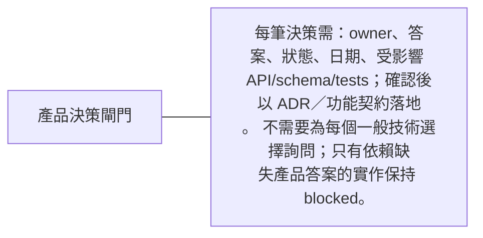
```mermaid
flowchart LR
  h["產品決策閘門"]
  h --- n0["每筆決策需：owner、答案、狀態、日期、受影響 <br/>API/schema/tests；確認後以 ADR／功能契約落地<br/>。 不需要為每個一般技術選擇詢問；只有依賴缺<br/>失產品答案的實作保持 blocked。"]
```

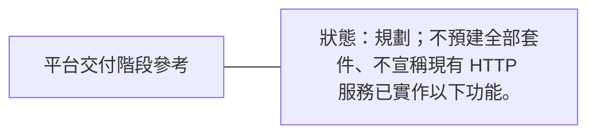
```mermaid
flowchart LR
  h["平台交付階段參考"]
  h --- n0["狀態：規劃；不預建全部套件、不宣稱現有 HTTP <br/>服務已實作以下功能。"]
```

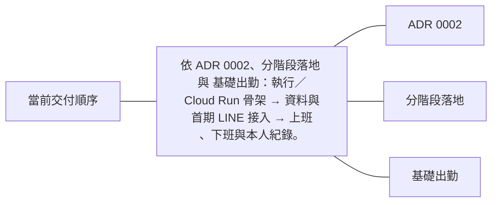
```mermaid
flowchart LR
  h["當前交付順序"]
  h --- n0["依 ADR 0002、分階段落地 與 基礎出勤：執行／<br/>Cloud Run 骨架 → 資料與首期 LINE 接入 → 上班<br/>、下班與本人紀錄。"]
  n0 --- n0l0["ADR 0002"]
  click n0l0 "../../decisions/0002-baseline.md"
  n0 --- n0l1["分階段落地"]
  click n0l1 "../../development/environment/verification.md"
  n0 --- n0l2["基礎出勤"]
  click n0l2 "../../domains/attendance/README.md"
```

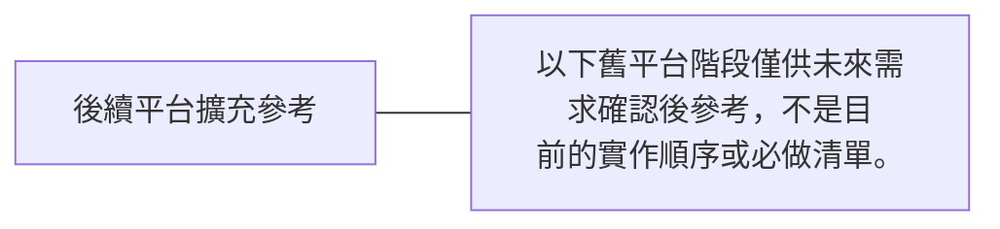
```mermaid
flowchart LR
  h["後續平台擴充參考"]
  h --- n0["以下舊平台階段僅供未來需求確認後參考，不是目<br/>前的實作順序或必做清單。"]
```

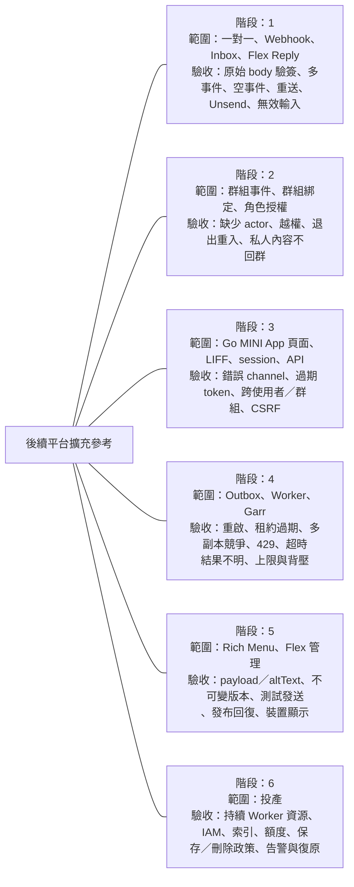
```mermaid
flowchart LR
  h["後續平台擴充參考"]
  h --- n0["階段：1<br/>範圍：一對一、Webhook、Inbox、Flex Reply<br/>驗收：原始 body 驗簽、多事件、空事件、重送、<br/>Unsend、無效輸入"]
  h --- n1["階段：2<br/>範圍：群組事件、群組綁定、角色授權<br/>驗收：缺少 actor、越權、退出重入、私人內容不<br/>回群"]
  h --- n2["階段：3<br/>範圍：Go MINI App 頁面、LIFF、session、API<br/>驗收：錯誤 channel、過期 token、跨使用者／群<br/>組、CSRF"]
  h --- n3["階段：4<br/>範圍：Outbox、Worker、Garr<br/>驗收：重啟、租約過期、多副本競爭、429、超時<br/>結果不明、上限與背壓"]
  h --- n4["階段：5<br/>範圍：Rich Menu、Flex 管理<br/>驗收：payload／altText、不可變版本、測試發送<br/>、發布回復、裝置顯示"]
  h --- n5["階段：6<br/>範圍：投產<br/>驗收：持續 Worker 資源、IAM、索引、額度、保<br/>存／刪除政策、告警與復原"]
```

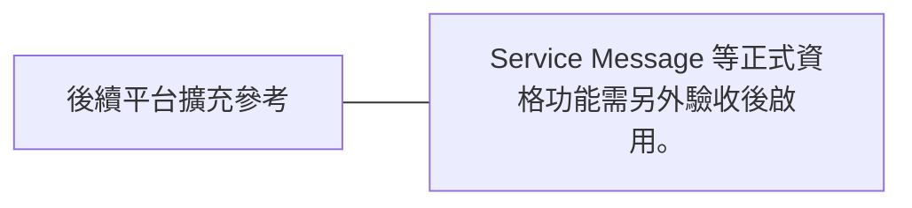
```mermaid
flowchart LR
  h["後續平台擴充參考"]
  h --- n0["Service Message 等正式資格功能需另外驗收後啟<br/>用。"]
```

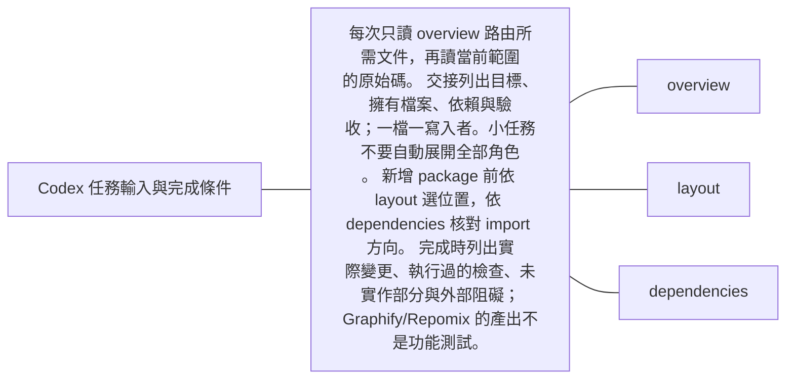
```mermaid
flowchart LR
  h["Codex 任務輸入與完成條件"]
  h --- n0["每次只讀 overview 路由所需文件，再讀當前範圍<br/>的原始碼。 交接列出目標、擁有檔案、依賴與驗<br/>收；一檔一寫入者。小任務不要自動展開全部角色<br/>。 新增 package 前依 layout 選位置，依 <br/>dependencies 核對 import 方向。 完成時列出實<br/>際變更、執行過的檢查、未實作部分與外部阻礙；<br/>Graphify/Repomix 的產出不是功能測試。"]
  n0 --- n0l0["overview"]
  click n0l0 "../../architecture/runtime/overview.md"
  n0 --- n0l1["layout"]
  click n0l1 "../../architecture/runtime/code-layout.md"
  n0 --- n0l2["dependencies"]
  click n0l2 "../../architecture/runtime/dependencies.md"
```
