# repositoryissue-與-discussion-業務模型設計

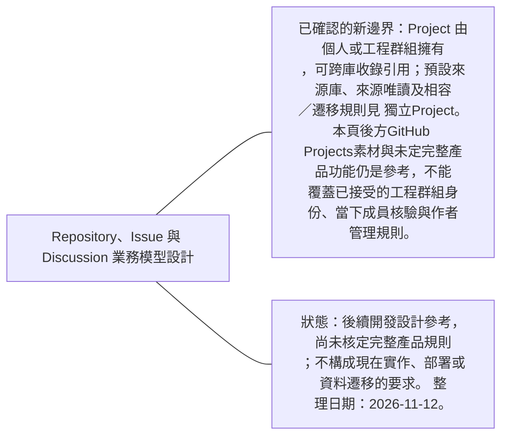
```mermaid
flowchart LR
  h["Repository、Issue 與 Discussion 業務模型設計"]
  h --- n0["已確認的新邊界：Project 由個人或工程群組擁有<br/>，可跨庫收錄引用；預設來源庫、來源唯讀及相容<br/>／遷移規則見 獨立Project。本頁後方GitHub <br/>Projects素材與未定完整產品功能仍是參考，不能<br/>覆蓋已接受的工程群組身份、當下成員核驗與作者<br/>管理規則。"]
  click n0 "../../domains/project/project.md"
  h --- n1["狀態：後續開發設計參考，尚未核定完整產品規則<br/>；不構成現在實作、部署或資料遷移的要求。 整<br/>理日期：2026-11-12。"]
```

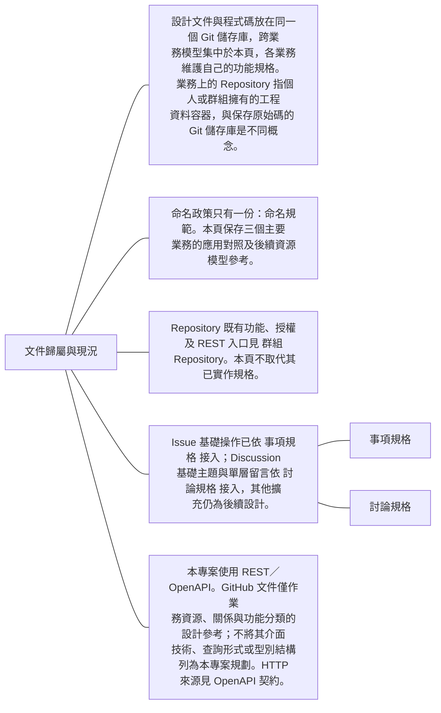
```mermaid
flowchart LR
  h["文件歸屬與現況"]
  h --- n0["設計文件與程式碼放在同一個 Git 儲存庫，跨業<br/>務模型集中於本頁，各業務維護自己的功能規格。<br/> 業務上的 Repository 指個人或群組擁有的工程<br/>資料容器，與保存原始碼的 Git 儲存庫是不同概<br/>念。"]
  h --- n1["命名政策只有一份：命名規範。本頁保存三個主要<br/>業務的應用對照及後續資源模型參考。"]
  click n1 "../../standards/naming.md#業務實體集合與-api-命名"
  h --- n2["Repository 既有功能、授權及 REST 入口見 群組<br/> Repository。本頁不取代其已實作規格。"]
  click n2 "../../domains/repository/README.md"
  h --- n3["Issue 基礎操作已依 事項規格 接入；Discussion<br/> 基礎主題與單層留言依 討論規格 接入，其他擴<br/>充仍為後續設計。"]
  n3 --- n3l0["事項規格"]
  click n3l0 "../../domains/repository/issues.md"
  n3 --- n3l1["討論規格"]
  click n3l1 "../../domains/repository/discussions.md"
  h --- n4["本專案使用 REST／OpenAPI。GitHub 文件僅作業<br/>務資源、關係與功能分類的設計參考；不將其介面<br/>技術、查詢形式或型別結構列為本專案規劃。HTTP<br/> 來源見 OpenAPI 契約。"]
  click n4 "../../../api/README.md"
```

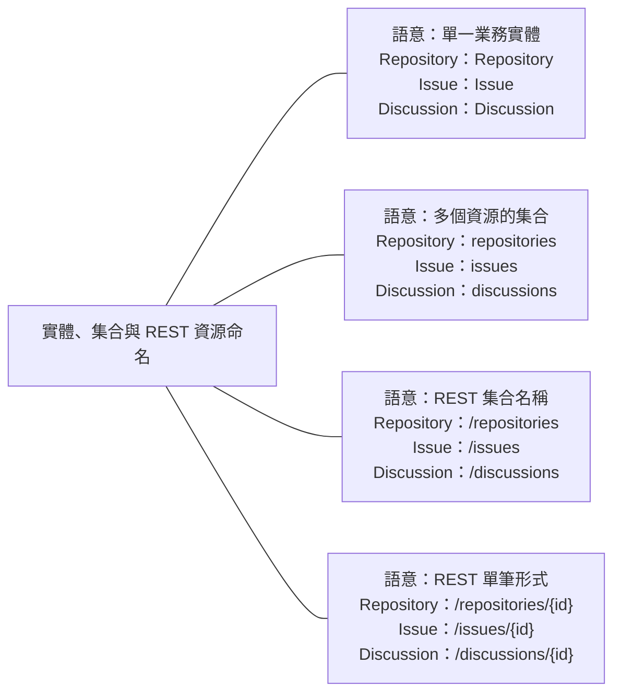
```mermaid
flowchart LR
  h["實體、集合與 REST 資源命名"]
  h --- n0["語意：單一業務實體<br/>Repository：Repository<br/>Issue：Issue<br/>Discussion：Discussion"]
  h --- n1["語意：多個資源的集合<br/>Repository：repositories<br/>Issue：issues<br/>Discussion：discussions"]
  h --- n2["語意：REST 集合名稱<br/>Repository：/repositories<br/>Issue：/issues<br/>Discussion：/discussions"]
  h --- n3["語意：REST 單筆形式<br/>Repository：/repositories/{id}<br/>Issue：/issues/{id}<br/>Discussion：/discussions/{id}"]
```

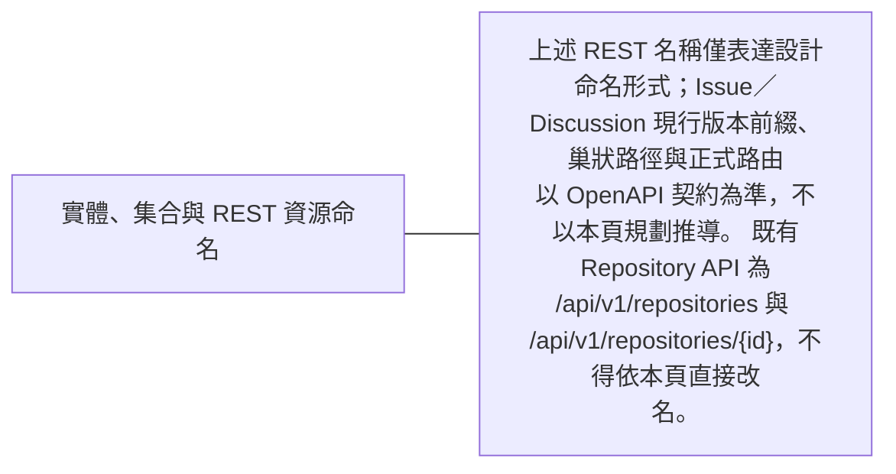
```mermaid
flowchart LR
  h["實體、集合與 REST 資源命名"]
  h --- n0["上述 REST 名稱僅表達設計命名形式；Issue／<br/>Discussion 現行版本前綴、巢狀路徑與正式路由<br/>以 OpenAPI 契約為準，不以本頁規劃推導。 既有<br/> Repository API 為 /api/v1/repositories 與 <br/>/api/v1/repositories/{id}，不得依本頁直接改<br/>名。"]
  click n0 "../../../api/contract/openapi.yaml"
```

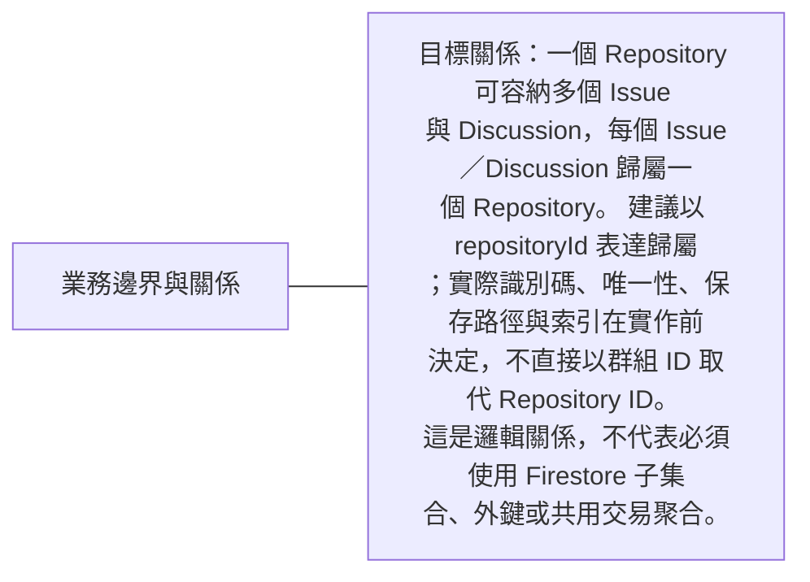
```mermaid
flowchart LR
  h["業務邊界與關係"]
  h --- n0["目標關係：一個 Repository 可容納多個 Issue <br/>與 Discussion，每個 Issue／Discussion 歸屬一<br/>個 Repository。 建議以 repositoryId 表達歸屬<br/>；實際識別碼、唯一性、保存路徑與索引在實作前<br/>決定，不直接以群組 ID 取代 Repository ID。 <br/>這是邏輯關係，不代表必須使用 Firestore 子集<br/>合、外鍵或共用交易聚合。"]
```

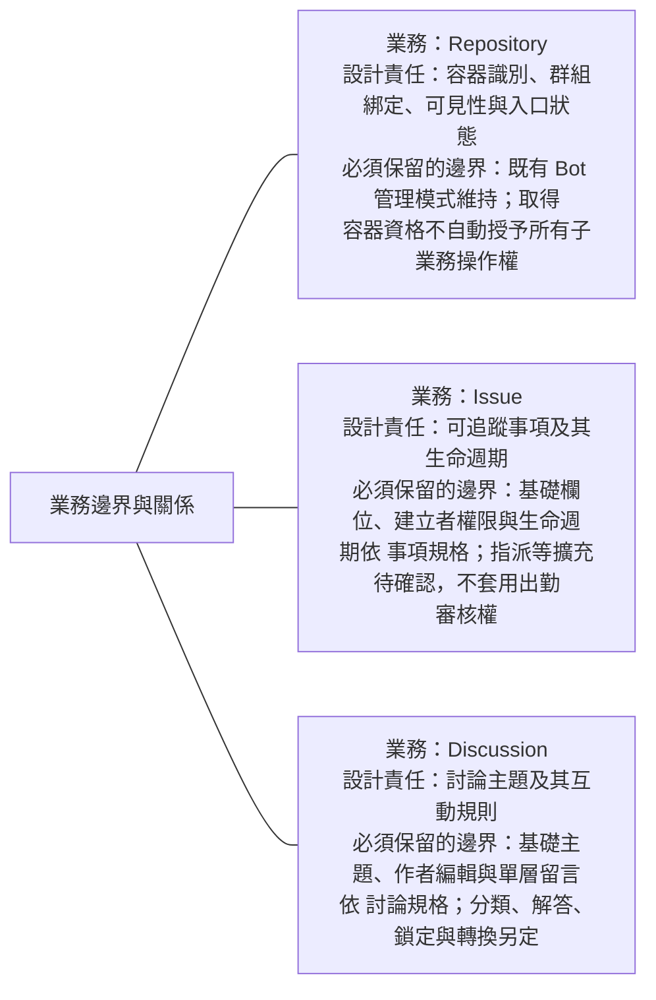
```mermaid
flowchart LR
  h["業務邊界與關係"]
  h --- n0["業務：Repository<br/>設計責任：容器識別、群組綁定、可見性與入口狀<br/>態<br/>必須保留的邊界：既有 Bot 管理模式維持；取得<br/>容器資格不自動授予所有子業務操作權"]
  h --- n1["業務：Issue<br/>設計責任：可追蹤事項及其生命週期<br/>必須保留的邊界：基礎欄位、建立者權限與生命週<br/>期依 事項規格；指派等擴充待確認，不套用出勤<br/>審核權"]
  click n1 "../../domains/repository/issues.md"
  h --- n2["業務：Discussion<br/>設計責任：討論主題及其互動規則<br/>必須保留的邊界：基礎主題、作者編輯與單層留言<br/>依 討論規格；分類、解答、鎖定與轉換另定"]
  click n2 "../../domains/repository/discussions.md"
```

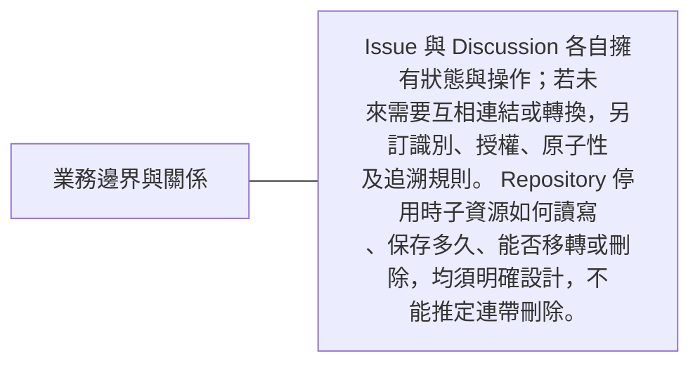
```mermaid
flowchart LR
  h["業務邊界與關係"]
  h --- n0["Issue 與 Discussion 各自擁有狀態與操作；若未<br/>來需要互相連結或轉換，另訂識別、授權、原子性<br/>及追溯規則。 Repository 停用時子資源如何讀寫<br/>、保存多久、能否移轉或刪除，均須明確設計，不<br/>能推定連帶刪除。"]
```

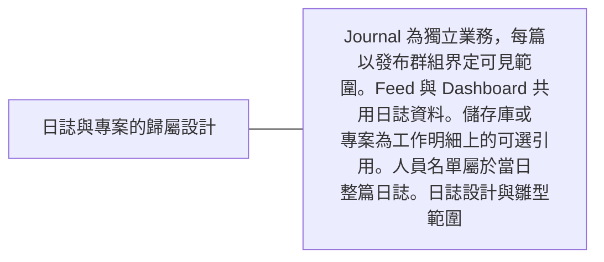
```mermaid
flowchart LR
  h["日誌與專案的歸屬設計"]
  h --- n0["Journal 為獨立業務，每篇以發布群組界定可見範<br/>圍。Feed 與 Dashboard 共用日誌資料。儲存庫或<br/>專案為工作明細上的可選引用。人員名單屬於當日<br/>整篇日誌。日誌設計與雛型範圍"]
  click n0 "../../domains/journal/journal.md"
```

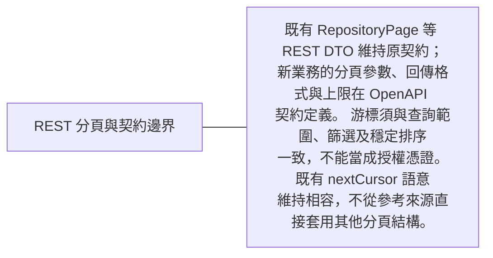
```mermaid
flowchart LR
  h["REST 分頁與契約邊界"]
  h --- n0["既有 RepositoryPage 等 REST DTO 維持原契約；<br/>新業務的分頁參數、回傳格式與上限在 OpenAPI <br/>契約定義。 游標須與查詢範圍、篩選及穩定排序<br/>一致，不能當成授權憑證。既有 nextCursor 語意<br/>維持相容，不從參考來源直接套用其他分頁結構。"]
```

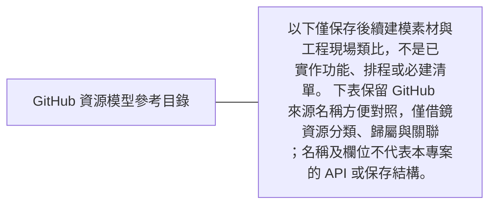
```mermaid
flowchart LR
  h["GitHub 資源模型參考目錄"]
  h --- n0["以下僅保存後續建模素材與工程現場類比，不是已<br/>實作功能、排程或必建清單。 下表保留 GitHub <br/>來源名稱方便對照，僅借鏡資源分類、歸屬與關聯<br/>；名稱及欄位不代表本專案的 API 或保存結構。"]
```

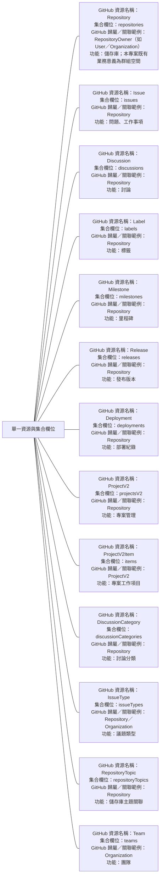
```mermaid
flowchart LR
  h["單一資源與集合欄位"]
  h --- n0["GitHub 資源名稱：Repository<br/>集合欄位：repositories<br/>GitHub 歸屬／關聯範例：RepositoryOwner（如 <br/>User／Organization）<br/>功能：儲存庫；本專案既有業務意義為群組空間"]
  h --- n1["GitHub 資源名稱：Issue<br/>集合欄位：issues<br/>GitHub 歸屬／關聯範例：Repository<br/>功能：問題、工作事項"]
  h --- n2["GitHub 資源名稱：Discussion<br/>集合欄位：discussions<br/>GitHub 歸屬／關聯範例：Repository<br/>功能：討論"]
  h --- n3["GitHub 資源名稱：Label<br/>集合欄位：labels<br/>GitHub 歸屬／關聯範例：Repository<br/>功能：標籤"]
  h --- n4["GitHub 資源名稱：Milestone<br/>集合欄位：milestones<br/>GitHub 歸屬／關聯範例：Repository<br/>功能：里程碑"]
  h --- n5["GitHub 資源名稱：Release<br/>集合欄位：releases<br/>GitHub 歸屬／關聯範例：Repository<br/>功能：發布版本"]
  h --- n6["GitHub 資源名稱：Deployment<br/>集合欄位：deployments<br/>GitHub 歸屬／關聯範例：Repository<br/>功能：部署紀錄"]
  h --- n7["GitHub 資源名稱：ProjectV2<br/>集合欄位：projectsV2<br/>GitHub 歸屬／關聯範例：Repository<br/>功能：專案管理"]
  h --- n8["GitHub 資源名稱：ProjectV2Item<br/>集合欄位：items<br/>GitHub 歸屬／關聯範例：ProjectV2<br/>功能：專案工作項目"]
  h --- n9["GitHub 資源名稱：DiscussionCategory<br/>集合欄位：discussionCategories<br/>GitHub 歸屬／關聯範例：Repository<br/>功能：討論分類"]
  h --- n10["GitHub 資源名稱：IssueType<br/>集合欄位：issueTypes<br/>GitHub 歸屬／關聯範例：Repository／<br/>Organization<br/>功能：議題類型"]
  h --- n11["GitHub 資源名稱：RepositoryTopic<br/>集合欄位：repositoryTopics<br/>GitHub 歸屬／關聯範例：Repository<br/>功能：儲存庫主題關聯"]
  h --- n12["GitHub 資源名稱：Team<br/>集合欄位：teams<br/>GitHub 歸屬／關聯範例：Organization<br/>功能：團隊"]
```

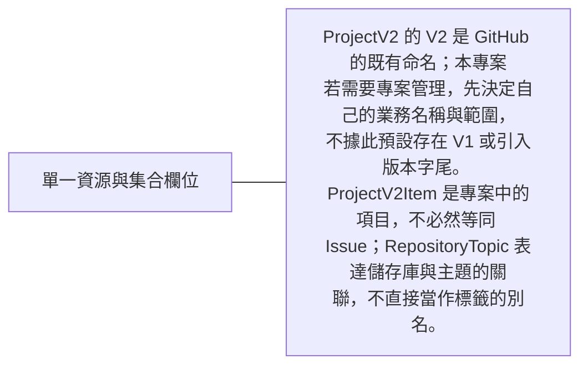
```mermaid
flowchart LR
  h["單一資源與集合欄位"]
  h --- n0["ProjectV2 的 V2 是 GitHub 的既有命名；本專案<br/>若需要專案管理，先決定自己的業務名稱與範圍，<br/>不據此預設存在 V1 或引入版本字尾。 <br/>ProjectV2Item 是專案中的項目，不必然等同 <br/>Issue；RepositoryTopic 表達儲存庫與主題的關<br/>聯，不直接當作標籤的別名。"]
```

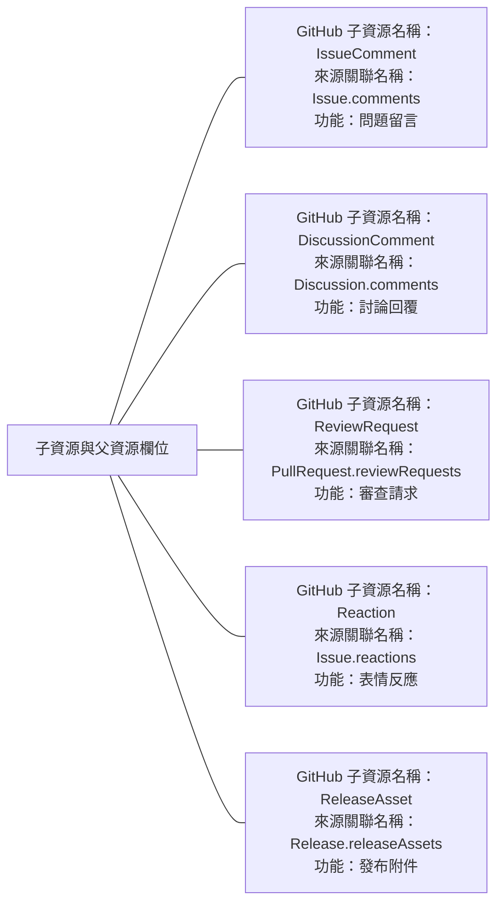
```mermaid
flowchart LR
  h["子資源與父資源欄位"]
  h --- n0["GitHub 子資源名稱：IssueComment<br/>來源關聯名稱：Issue.comments<br/>功能：問題留言"]
  h --- n1["GitHub 子資源名稱：DiscussionComment<br/>來源關聯名稱：Discussion.comments<br/>功能：討論回覆"]
  h --- n2["GitHub 子資源名稱：ReviewRequest<br/>來源關聯名稱：PullRequest.reviewRequests<br/>功能：審查請求"]
  h --- n3["GitHub 子資源名稱：Reaction<br/>來源關聯名稱：Issue.reactions<br/>功能：表情反應"]
  h --- n4["GitHub 子資源名稱：ReleaseAsset<br/>來源關聯名稱：Release.releaseAssets<br/>功能：發布附件"]
```

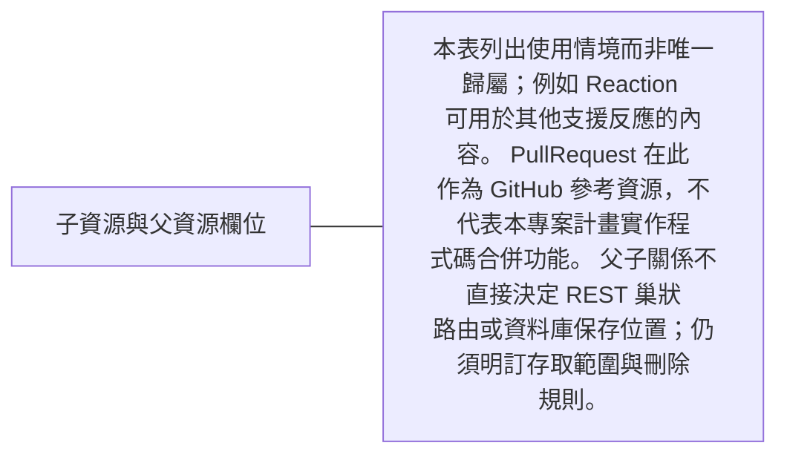
```mermaid
flowchart LR
  h["子資源與父資源欄位"]
  h --- n0["本表列出使用情境而非唯一歸屬；例如 Reaction <br/>可用於其他支援反應的內容。 PullRequest 在此<br/>作為 GitHub 參考資源，不代表本專案計畫實作程<br/>式碼合併功能。 父子關係不直接決定 REST 巢狀<br/>路由或資料庫保存位置；仍須明訂存取範圍與刪除<br/>規則。"]
```

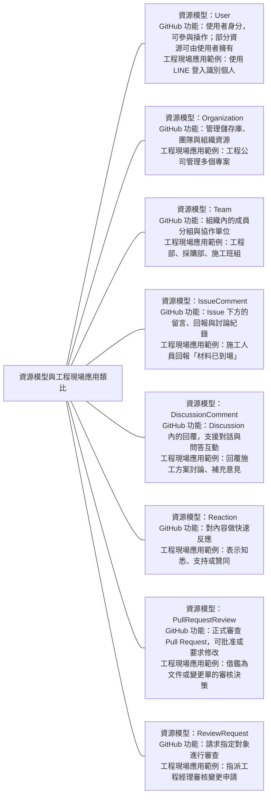
```mermaid
flowchart LR
  h["資源模型與工程現場應用類比"]
  h --- n0["資源模型：User<br/>GitHub 功能：使用者身分，可參與操作；部分資<br/>源可由使用者擁有<br/>工程現場應用範例：使用 LINE 登入識別個人"]
  h --- n1["資源模型：Organization<br/>GitHub 功能：管理儲存庫、團隊與組織資源<br/>工程現場應用範例：工程公司管理多個專案"]
  h --- n2["資源模型：Team<br/>GitHub 功能：組織內的成員分組與協作單位<br/>工程現場應用範例：工程部、採購部、施工班組"]
  h --- n3["資源模型：IssueComment<br/>GitHub 功能：Issue 下方的留言、回報與討論紀<br/>錄<br/>工程現場應用範例：施工人員回報「材料已到場」"]
  h --- n4["資源模型：DiscussionComment<br/>GitHub 功能：Discussion 內的回覆，支援對話與<br/>問答互動<br/>工程現場應用範例：回覆施工方案討論、補充意見"]
  h --- n5["資源模型：Reaction<br/>GitHub 功能：對內容做快速反應<br/>工程現場應用範例：表示知悉、支持或贊同"]
  h --- n6["資源模型：PullRequestReview<br/>GitHub 功能：正式審查 Pull Request，可批准或<br/>要求修改<br/>工程現場應用範例：借鑑為文件或變更單的審核決<br/>策"]
  h --- n7["資源模型：ReviewRequest<br/>GitHub 功能：請求指定對象進行審查<br/>工程現場應用範例：指派工程經理審核變更申請"]
```

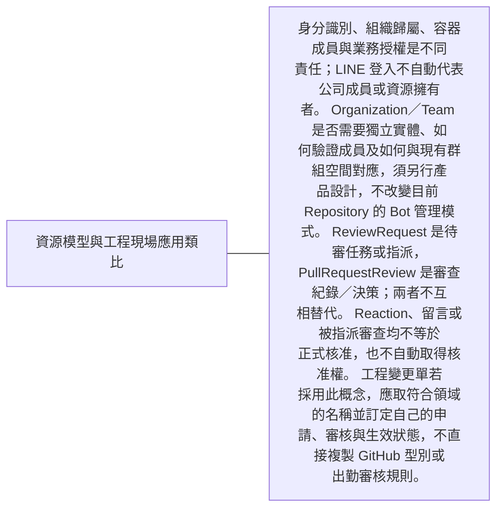
```mermaid
flowchart LR
  h["資源模型與工程現場應用類比"]
  h --- n0["身分識別、組織歸屬、容器成員與業務授權是不同<br/>責任；LINE 登入不自動代表公司成員或資源擁有<br/>者。 Organization／Team 是否需要獨立實體、如<br/>何驗證成員及如何與現有群組空間對應，須另行產<br/>品設計，不改變目前 Repository 的 Bot 管理模<br/>式。 ReviewRequest 是待審任務或指派，<br/>PullRequestReview 是審查紀錄／決策；兩者不互<br/>相替代。 Reaction、留言或被指派審查均不等於<br/>正式核准，也不自動取得核准權。 工程變更單若<br/>採用此概念，應取符合領域的名稱並訂定自己的申<br/>請、審核與生效狀態，不直接複製 GitHub 型別或<br/>出勤審核規則。"]
```

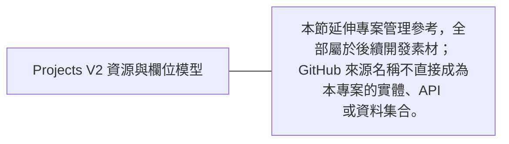
```mermaid
flowchart LR
  h["Projects V2 資源與欄位模型"]
  h --- n0["本節延伸專案管理參考，全部屬於後續開發素材；<br/>GitHub 來源名稱不直接成為本專案的實體、API <br/>或資料集合。"]
```

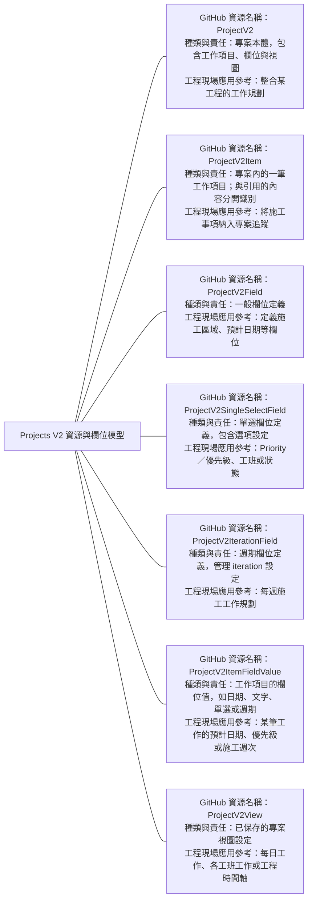
```mermaid
flowchart LR
  h["Projects V2 資源與欄位模型"]
  h --- n0["GitHub 資源名稱：ProjectV2<br/>種類與責任：專案本體，包含工作項目、欄位與視<br/>圖<br/>工程現場應用參考：整合某工程的工作規劃"]
  h --- n1["GitHub 資源名稱：ProjectV2Item<br/>種類與責任：專案內的一筆工作項目；與引用的內<br/>容分開識別<br/>工程現場應用參考：將施工事項納入專案追蹤"]
  h --- n2["GitHub 資源名稱：ProjectV2Field<br/>種類與責任：一般欄位定義<br/>工程現場應用參考：定義施工區域、預計日期等欄<br/>位"]
  h --- n3["GitHub 資源名稱：ProjectV2SingleSelectField<br/>種類與責任：單選欄位定義，包含選項設定<br/>工程現場應用參考：Priority／優先級、工班或狀<br/>態"]
  h --- n4["GitHub 資源名稱：ProjectV2IterationField<br/>種類與責任：週期欄位定義，管理 iteration 設<br/>定<br/>工程現場應用參考：每週施工工作規劃"]
  h --- n5["GitHub 資源名稱：ProjectV2ItemFieldValue<br/>種類與責任：工作項目的欄位值，如日期、文字、<br/>單選或週期<br/>工程現場應用參考：某筆工作的預計日期、優先級<br/>或施工週次"]
  h --- n6["GitHub 資源名稱：ProjectV2View<br/>種類與責任：已保存的專案視圖設定<br/>工程現場應用參考：每日工作、各工班工作或工程<br/>時間軸"]
```

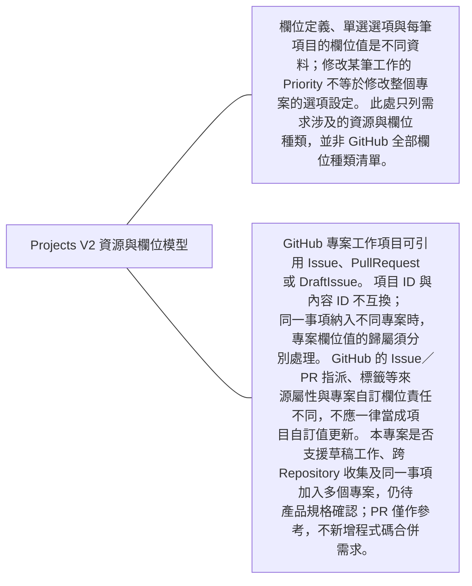
```mermaid
flowchart LR
  h["Projects V2 資源與欄位模型"]
  h --- n0["欄位定義、單選選項與每筆項目的欄位值是不同資<br/>料；修改某筆工作的 Priority 不等於修改整個專<br/>案的選項設定。 此處只列需求涉及的資源與欄位<br/>種類，並非 GitHub 全部欄位種類清單。"]
  h --- n1["GitHub 專案工作項目可引用 Issue、PullRequest<br/> 或 DraftIssue。 項目 ID 與內容 ID 不互換；<br/>同一事項納入不同專案時，專案欄位值的歸屬須分<br/>別處理。 GitHub 的 Issue／PR 指派、標籤等來<br/>源屬性與專案自訂欄位責任不同，不應一律當成項<br/>目自訂值更新。 本專案是否支援草稿工作、跨 <br/>Repository 收集及同一事項加入多個專案，仍待<br/>產品規格確認；PR 僅作參考，不新增程式碼合併<br/>需求。"]
```

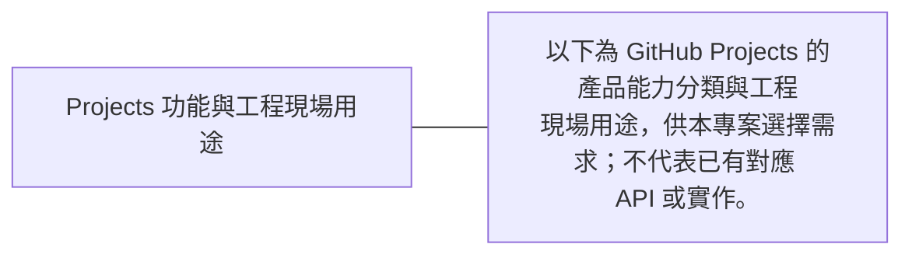
```mermaid
flowchart LR
  h["Projects 功能與工程現場用途"]
  h --- n0["以下為 GitHub Projects 的產品能力分類與工程<br/>現場用途，供本專案選擇需求；不代表已有對應 <br/>API 或實作。"]
```

```mermaid
flowchart LR
  h["Projects 功能與工程現場用途"]
  h --- n0["能力：Items<br/>功能：收集 Issue、PR 或 Draft Issue<br/>工程現場應用範例：整合各項施工工作"]
  h --- n1["能力：Table<br/>功能：表格模式管理項目與欄位<br/>工程現場應用範例：工作清單、負責人、進度"]
  h --- n2["能力：Board<br/>功能：Kanban 看板，依欄位值分欄<br/>工程現場應用範例：待辦、進行中、完成"]
  h --- n3["能力：Roadmap<br/>功能：依日期或週期呈現時間軸<br/>工程現場應用範例：工程排程、施工階段"]
  h --- n4["能力：Custom Fields<br/>功能：設定自訂欄位及其型別<br/>工程現場應用範例：施工區域、優先級、預計日期"]
  h --- n5["能力：Views<br/>功能：保存多組篩選與呈現設定<br/>工程現場應用範例：每日工作、各工班工作"]
  h --- n6["能力：Filtering<br/>功能：依欄位與內容屬性篩選<br/>工程現場應用範例：只看逾期、未完成事項"]
  h --- n7["能力：Grouping<br/>功能：依支援欄位分組<br/>工程現場應用範例：依工班、狀態或負責人分類"]
  h --- n8["能力：Iteration<br/>功能：以可配置長度與休息區間的週期規劃工作<br/>工程現場應用範例：每週施工工作規劃"]
  h --- n9["能力：Workflows<br/>功能：自動化項目新增、狀態更新或歸檔等管理<br/>工程現場應用範例：Issue 完成時更新專案狀態"]
  h --- n10["能力：Insights<br/>功能：圖表與進度分析<br/>工程現場應用範例：查看各階段完成情況"]
  h --- n11["能力：Permissions<br/>功能：專案存取與操作控制<br/>工程現場應用範例：管理誰可查看、編輯或管理專<br/>案"]
  h --- n12["能力：Templates<br/>功能：重複使用專案設定<br/>工程現場應用範例：建立標準工程工作看板"]
```

```mermaid
flowchart LR
  h["Projects 功能與工程現場用途"]
  h --- n0["Table、Board 與 Roadmap 是同一批專案項目的不<br/>同呈現方式，不各自複製一套工作資料。 Views <br/>保存布局、篩選、分組與排序等設定；Filtering<br/>／Grouping 是查詢與呈現能力，不因一個項目被<br/>多個視圖選中而複製它。 Roadmap 顯示日期或週<br/>期不代表具備工序相依、關鍵路徑或自動排程能力<br/>；這些需求須另訂規格。 Iteration 是規劃區間<br/>，不等同實際出勤、工時結算或施工完成證明。"]
```

```mermaid
flowchart LR
  h["Projects 採用邊界與待決策"]
  h --- n0["歸屬與引用：先決定專案由 Organization、<br/>Repository 或其他工程容器擁有，以及跨容器項<br/>目的引用與刪除規則；不能由 Repository 上可查<br/>詢 projectsV2 就推定專案只屬於單一 <br/>Repository。"]
  h --- n1["狀態：Issue 的生命週期與專案 Status 欄位分別<br/>建模；完成、取消、封存及移出專案的效果另訂，<br/>不能視為同一操作。"]
  h --- n2["權限：分開定義專案可見性、項目來源可見性、欄<br/>位編輯與管理權；專案存取不自動授予來源事項的<br/>讀寫或審核權，篩選與隱藏欄位也不能充當授權。"]
  h --- n3["自動化：Workflows 若會更新狀態，需明訂觸發條<br/>件、執行身分、授權、重送、失敗及 Audit；自動<br/>移至「完成」不代表已通過施工驗收或業務核准。"]
  h --- n4["分析：Insights 的完成率、分母、時區與歷史資<br/>料來源須先定義，不能只靠目前狀態推算過去進度<br/>。"]
  h --- n5["範本：決定 Templates 複製哪些欄位、選項、視<br/>圖、項目與自動化，以及建立時的權限；不預設連<br/>帶複製成員、正式工作或敏感內容。"]
  h --- n6["後續文件：確定採用後建立專案管理功能規格，按<br/>操作模型補齊六個問題、Context／Authority／<br/>Decision 與必要 Audit，再設計契約及驗收；本<br/>頁不新增資料保存路徑或正式 API。"]
```

```mermaid
flowchart LR
  h["採用前待確認"]
  h --- n0["先確認使用者需求，再選擇需要的模型；每個被採<br/>用的業務建立功能文件與操作契約。"]
  h --- n1["明訂擁有者、Repository／Organization 範圍、<br/>成員資格與每個操作的授權來源。"]
  h --- n2["確認識別碼、必填欄位、狀態、父子關係、跨容器<br/>引用及保存／刪除政策。"]
  h --- n3["審核另訂指派、決策權、本人迴避、撤回、重審、<br/>併發與稽核；附件另訂上傳、存取及保存規則。"]
  h --- n4["完成契約與驗收後才更新實作狀態；本參考目錄本<br/>身不新增 API、資料集合或操作權限。"]
```

```mermaid
flowchart LR
  h["後續開發文件與實作順序"]
  h --- n0["Repository 維持 既有功能文件；Issue 與 <br/>Discussion 開發時分別建立 <br/>docs/domains/repository/issues.md、<br/>docs/domains/repository/discussions.md，並<br/>加入功能索引。"]
  click n0 "../../domains/repository/README.md"
  n0 --> n1["功能文件先按 操作契約範本 補齊每個操作：誰操<br/>作、對象、行為、權限、業務條件及成功結果；<br/>Context、Authority、Decision 與必要 Audit 明<br/>確記錄。"]
  click n1 "../../architecture/contracts/business-operations.md#功能操作契約範本"
  n1 --> n2["開發前確認 Issue／Discussion 的建立、讀取、<br/>修改與生命週期操作，以及權限來源、可見範圍、<br/>併發版本、重送、失敗及稽核語意。不從 GitHub <br/>功能自行推定產品需求。"]
  n2 --> n3["HTTP 契約依業務放在 api/contract/&lt;業務&gt;/，由<br/>既有 OpenAPI 入口組合，沿用 REST 介面；不先<br/>建立空契約或生成碼。"]
  n3 --> n4["程式按業務維護，模組 README 連回功能規格；契<br/>約來源、設計說明與實作避免重複維護相同欄位定<br/>義。"]
  n4 --> n5["完成契約相容性、權限隔離、分頁及所選操作的驗<br/>收；文件狀態依實際證據更新，不能因本設計存在<br/>就標為已實作。"]
```

```mermaid
flowchart LR
  h["參考與適用範圍"]
  h --- n0["GitHub 資源設計參考目錄：使用者指定的設計參<br/>考，借鏡資源名稱、關係、描述與分類；網址中的<br/>技術目錄名稱不代表本專案採用該技術。先前資源<br/>名稱核對使用 revision <br/>528435f1d245ebc2a1c2a8d1c0254a5d4ad17b21，不<br/>宣稱是最新版本。"]
  click n0 "https://github.com/github/docs/tree/main/src/graphql/data/fpt"
  h --- n1["GitHub Projects 文件：先前於 2026-11-12 經 <br/>Context7 /github/docs 查閱 iteration、視圖、<br/>篩選及項目欄位責任，來源為 main，未固定 <br/>revision。僅作功能設計參考；未查證所有 <br/>Workflows、Insights、Permissions、Templates <br/>的方案限制或 API 覆蓋，採用時仍須核對。"]
  click n1 "https://docs.github.com/en/issues/planning-and-tracking-with-projects"
  h --- n2["本專案介面沿用 REST／OpenAPI；Issue 基礎操作<br/>與資料保存依 事項規格；Discussion 基礎操作依<br/> 討論規格；本參考頁未啟用其他分類／專案管理 <br/>API 或遷移。"]
  n2 --- n2l0["事項規格"]
  click n2l0 "../../domains/repository/issues.md"
  n2 --- n2l1["討論規格"]
  click n2l1 "../../domains/repository/discussions.md"
```
