# 責任對照：規劃檔案，不是已存在 API

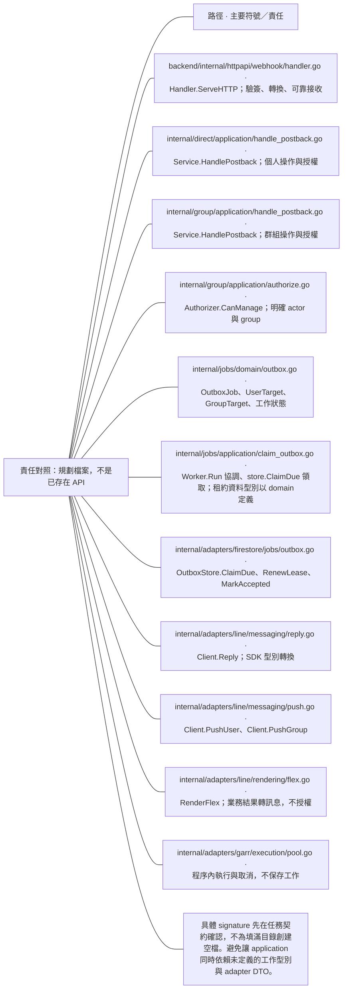
```mermaid
flowchart LR
  h["責任對照：規劃檔案，不是已存在 API"]
  h --- n0["路徑 · 主要符號／責任"]
  h --- n1["backend/internal/httpapi/webhook/handler.go ·<br/>Handler.ServeHTTP；驗簽、轉換、可靠接收"]
  h --- n2["internal/direct/application/handle_postback.go ·<br/>Service.HandlePostback；個人操作與授權"]
  h --- n3["internal/group/application/handle_postback.go ·<br/>Service.HandlePostback；群組操作與授權"]
  h --- n4["internal/group/application/authorize.go ·<br/>Authorizer.CanManage；明確 actor 與 group"]
  h --- n5["internal/jobs/domain/outbox.go ·<br/>OutboxJob、UserTarget、GroupTarget、工作狀態"]
  h --- n6["internal/jobs/application/claim_outbox.go ·<br/>Worker.Run 協調、store.ClaimDue 領取；租約資料型別以 domain<br/>定義"]
  h --- n7["internal/adapters/firestore/jobs/outbox.go ·<br/>OutboxStore.ClaimDue、RenewLease、MarkAccepted"]
  h --- n8["internal/adapters/line/messaging/reply.go ·<br/>Client.Reply；SDK 型別轉換"]
  h --- n9["internal/adapters/line/messaging/push.go ·<br/>Client.PushUser、Client.PushGroup"]
  h --- n10["internal/adapters/line/rendering/flex.go ·<br/>RenderFlex；業務結果轉訊息，不授權"]
  h --- n11["internal/adapters/garr/execution/pool.go ·<br/>程序內執行與取消，不保存工作"]
  h --- n12["具體 signature 先在任務契約確認，不為填滿目錄創建空檔。避免讓 application<br/>同時依賴未定義的工作型別與 adapter DTO。"]
```

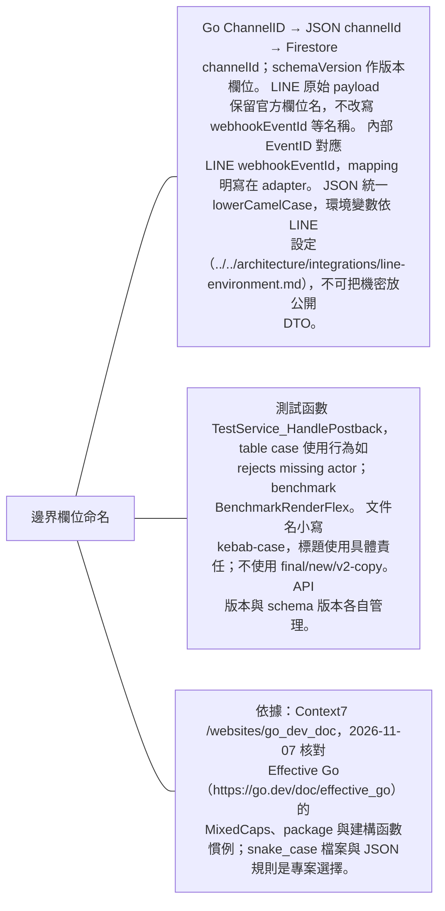
```mermaid
flowchart LR
  h["邊界欄位命名"]
  h --- n0["Go ChannelID → JSON channelId → Firestore<br/>channelId；schemaVersion 作版本欄位。 LINE 原始 payload<br/>保留官方欄位名，不改寫 webhookEventId 等名稱。 內部 EventID 對應<br/>LINE webhookEventId，mapping 明寫在 adapter。 JSON 統一<br/>lowerCamelCase，環境變數依 LINE<br/>設定（../../architecture/integrations/line-environment.md），不可把機密放公開<br/>DTO。"]
  h --- n1["測試函數 TestService_HandlePostback，table case 使用行為如<br/>rejects missing actor；benchmark<br/>BenchmarkRenderFlex。 文件名小寫<br/>kebab-case，標題使用具體責任；不使用 final/new/v2-copy。API<br/>版本與 schema 版本各自管理。"]
  h --- n2["依據：Context7 /websites/go_dev_doc，2026-11-07 核對<br/>Effective Go（https://go.dev/doc/effective_go） 的<br/>MixedCaps、package 與建構函數慣例；snake_case 檔案與 JSON<br/>規則是專案選擇。"]
```

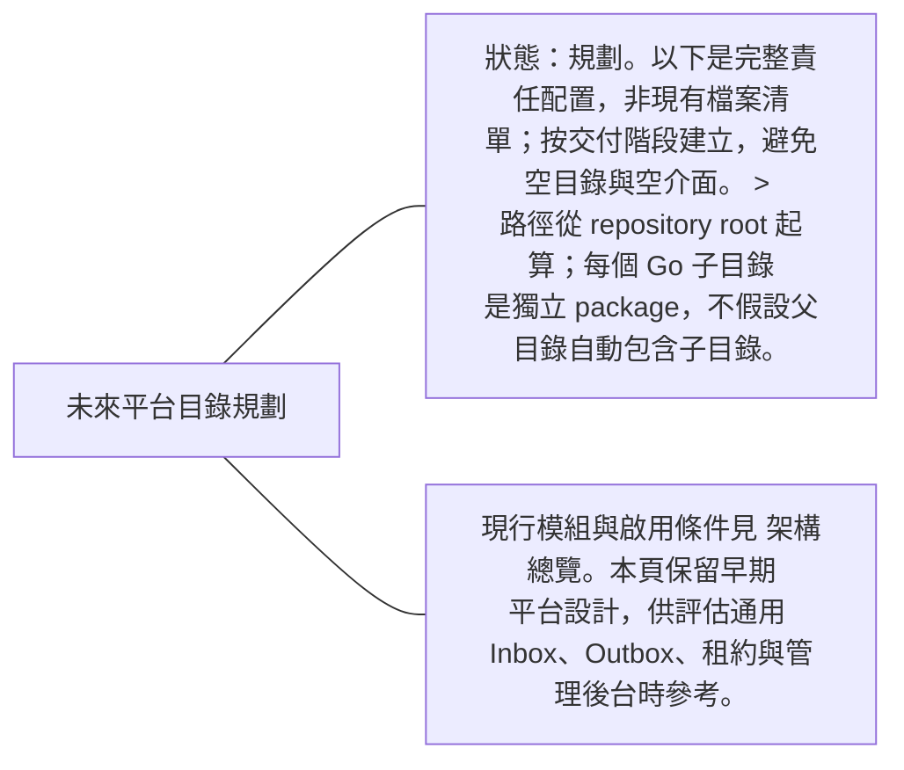
```mermaid
flowchart LR
  h["未來平台目錄規劃"]
  h --- n0["狀態：規劃。以下是完整責任配置，非現有檔案清<br/>單；按交付階段建立，避免空目錄與空介面。 &gt; <br/>路徑從 repository root 起算；每個 Go 子目錄<br/>是獨立 package，不假設父目錄自動包含子目錄。"]
  h --- n1["現行模組與啟用條件見 架構總覽。本頁保留早期<br/>平台設計，供評估通用 Inbox、Outbox、租約與管<br/>理後台時參考。"]
  click n1 "../../architecture/runtime/overview.md"
```

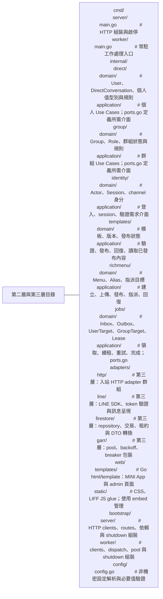
```mermaid
flowchart LR
  h["第二層與第三層目錄"]
  h --- n0["cmd/<br/>  server/<br/>    main.go                 # HTTP 組裝與啟停<br/>  worker/<br/>    main.go                 # 常駐工作處理入口<br/>internal/<br/>  direct/<br/>    domain/                 # User、DirectConversation、個人值型別與規則<br/>    application/            # 個人 Use Cases；ports.go 定義所需介面<br/>  group/<br/>    domain/                 # Group、Role、群組狀態與規則<br/>    application/            # 群組 Use Cases；ports.go 定義所需介面<br/>  identity/<br/>    domain/                 # Actor、Session、channel 身分<br/>    application/            # 登入、session、驗證需求介面<br/>  templates/<br/>    domain/                 # 模板、版本、發布狀態<br/>    application/            # 驗證、發布、回復、讀取已發布內容<br/>  richmenu/<br/>    domain/                 # Menu、Alias、指派目標<br/>    application/            # 建立、上傳、發布、指派、回復<br/>  jobs/<br/>    domain/                 # Inbox、Outbox、UserTarget、GroupTarget、Lease<br/>    application/            # 領取、續租、重試、完成；ports.go<br/>  adapters/<br/>    http/                   # 第三層：入站 HTTP adapter 群組<br/>    line/                   # 第三層：LINE SDK、token 驗證與訊息呈現<br/>    firestore/              # 第三層：repository、交易、租約與 DTO 轉換<br/>    garr/                   # 第三層：pool、backoff、breaker 包裝<br/>  web/<br/>    templates/              # Go html/template：MINI App 與 admin 頁面<br/>    static/                 # CSS、LIFF JS glue；使用 embed 管理<br/>  bootstrap/<br/>    server/                 # HTTP clients、routes、依賴與 shutdown 組裝<br/>    worker/                 # clients、dispatch、pool 與 shutdown 組裝<br/>  config/<br/>    config.go               # 非機密設定解析與必要值驗證"]
```

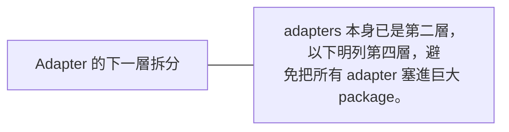
```mermaid
flowchart LR
  h["Adapter 的下一層拆分"]
  h --- n0["adapters 本身已是第二層，以下明列第四層，避<br/>免把所有 adapter 塞進巨大 package。"]
```

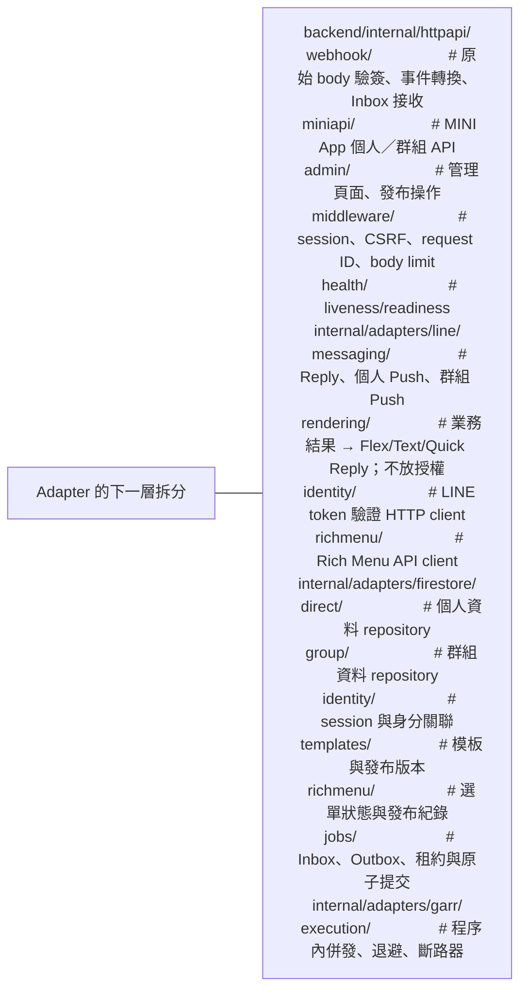
```mermaid
flowchart LR
  h["Adapter 的下一層拆分"]
  h --- n0["backend/internal/httpapi/<br/>  webhook/                  # 原始 body 驗簽、事件轉換、Inbox 接收<br/>  miniapi/                  # MINI App 個人／群組 API<br/>  admin/                    # 管理頁面、發布操作<br/>  middleware/               # session、CSRF、request ID、body limit<br/>  health/                   # liveness/readiness<br/>internal/adapters/line/<br/>  messaging/                # Reply、個人 Push、群組 Push<br/>  rendering/                # 業務結果 → Flex/Text/Quick Reply；不放授權<br/>  identity/                 # LINE token 驗證 HTTP client<br/>  richmenu/                 # Rich Menu API client<br/>internal/adapters/firestore/<br/>  direct/                   # 個人資料 repository<br/>  group/                    # 群組資料 repository<br/>  identity/                 # session 與身分關聯<br/>  templates/                # 模板與發布版本<br/>  richmenu/                 # 選單狀態與發布紀錄<br/>  jobs/                     # Inbox、Outbox、租約與原子提交<br/>internal/adapters/garr/<br/>  execution/                # 程序內併發、退避、斷路器"]
```

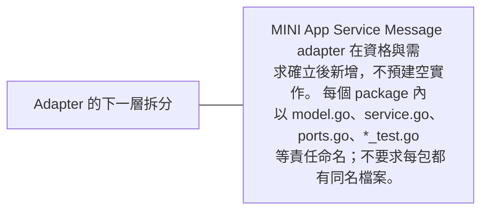
```mermaid
flowchart LR
  h["Adapter 的下一層拆分"]
  h --- n0["MINI App Service Message adapter 在資格與需<br/>求確立後新增，不預建空實作。 每個 package 內<br/>以 model.go、service.go、ports.go、*_test.go<br/> 等責任命名；不要求每包都有同名檔案。"]
```

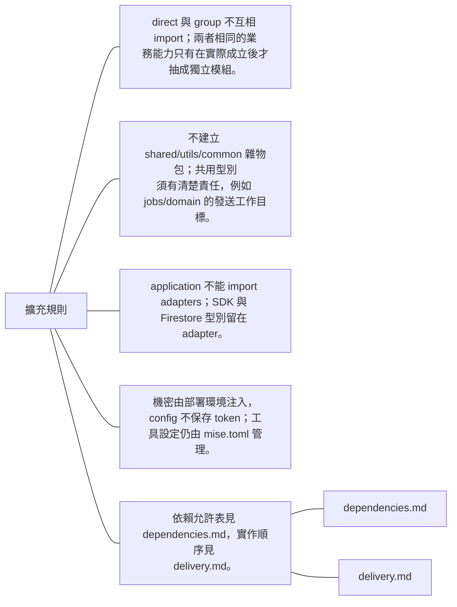
```mermaid
flowchart LR
  h["擴充規則"]
  h --- n0["direct 與 group 不互相 import；兩者相同的業<br/>務能力只有在實際成立後才抽成獨立模組。"]
  h --- n1["不建立 shared/utils/common 雜物包；共用型別<br/>須有清楚責任，例如 jobs/domain 的發送工作目<br/>標。"]
  h --- n2["application 不能 import adapters；SDK 與 <br/>Firestore 型別留在 adapter。"]
  h --- n3["機密由部署環境注入，config 不保存 token；工<br/>具設定仍由 mise.toml 管理。"]
  h --- n4["依賴允許表見 dependencies.md，實作順序見 <br/>delivery.md。"]
  n4 --- n4l0["dependencies.md"]
  click n4l0 "../../architecture/runtime/dependencies.md"
  n4 --- n4l1["delivery.md"]
  click n4l1 "delivery.md"
```

## 後續平台擴充參考流程

未來設計

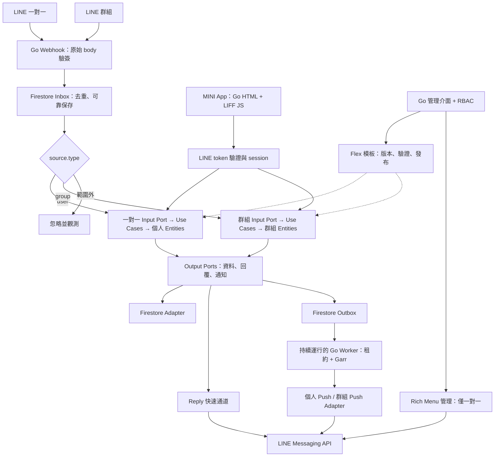
```mermaid
flowchart TD
  DM[LINE 一對一] --> WH[Go Webhook：原始 body 驗簽]
  GROUP[LINE 群組] --> WH
  WH --> INBOX[Firestore Inbox：去重、可靠保存]
  INBOX --> ROUTE{source.type}
  ROUTE -->|user| DIRECT[一對一 Input Port → Use Cases → 個人 Entities]
  ROUTE -->|group| GRP[群組 Input Port → Use Cases → 群組 Entities]
  ROUTE -->|範圍外| IGNORE[忽略並觀測]
  MINI[MINI App：Go HTML + LIFF JS] --> AUTH[LINE token 驗證與 session]
  AUTH --> DIRECT
  AUTH --> GRP
  DIRECT --> PORTS[Output Ports：資料、回覆、通知]
  GRP --> PORTS
  PORTS --> STORE[Firestore Adapter]
  PORTS --> REPLY[Reply 快速通道]
  PORTS --> OUT[Firestore Outbox]
  OUT --> WORKER[持續運行的 Go Worker：租約 + Garr]
  WORKER --> PUSH[個人 Push / 群組 Push Adapter]
  REPLY --> LINE[LINE Messaging API]
  PUSH --> LINE
  ADMIN[Go 管理介面 + RBAC] --> TM[Flex 模板：版本、驗證、發布]
  TM -.-> DIRECT
  TM -.-> GRP
  ADMIN --> RM[Rich Menu 管理：僅一對一]
  RM --> LINE
```

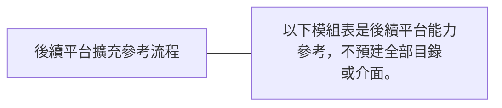
```mermaid
flowchart LR
  h["後續平台擴充參考流程"]
  h --- n0["以下模組表是後續平台能力參考，不預建全部目錄<br/>或介面。"]
```

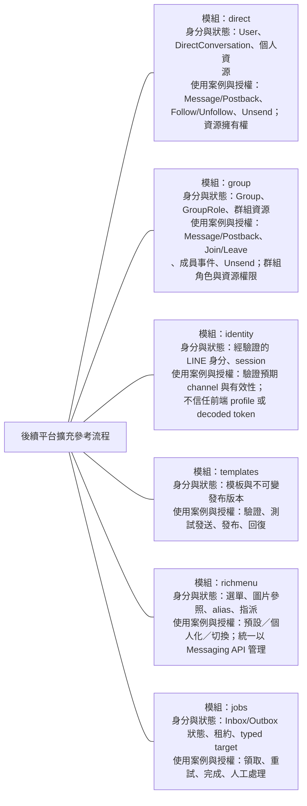
```mermaid
flowchart LR
  h["後續平台擴充參考流程"]
  h --- n0["模組：direct<br/>身分與狀態：User、DirectConversation、個人資<br/>源<br/>使用案例與授權：Message/Postback、<br/>Follow/Unfollow、Unsend；資源擁有權"]
  h --- n1["模組：group<br/>身分與狀態：Group、GroupRole、群組資源<br/>使用案例與授權：Message/Postback、Join/Leave<br/>、成員事件、Unsend；群組角色與資源權限"]
  h --- n2["模組：identity<br/>身分與狀態：經驗證的 LINE 身分、session<br/>使用案例與授權：驗證預期 channel 與有效性；<br/>不信任前端 profile 或 decoded token"]
  h --- n3["模組：templates<br/>身分與狀態：模板與不可變發布版本<br/>使用案例與授權：驗證、測試發送、發布、回復"]
  h --- n4["模組：richmenu<br/>身分與狀態：選單、圖片參照、alias、指派<br/>使用案例與授權：預設／個人化／切換；統一以 <br/>Messaging API 管理"]
  h --- n5["模組：jobs<br/>身分與狀態：Inbox/Outbox 狀態、租約、typed <br/>target<br/>使用案例與授權：領取、重試、完成、人工處理"]
```

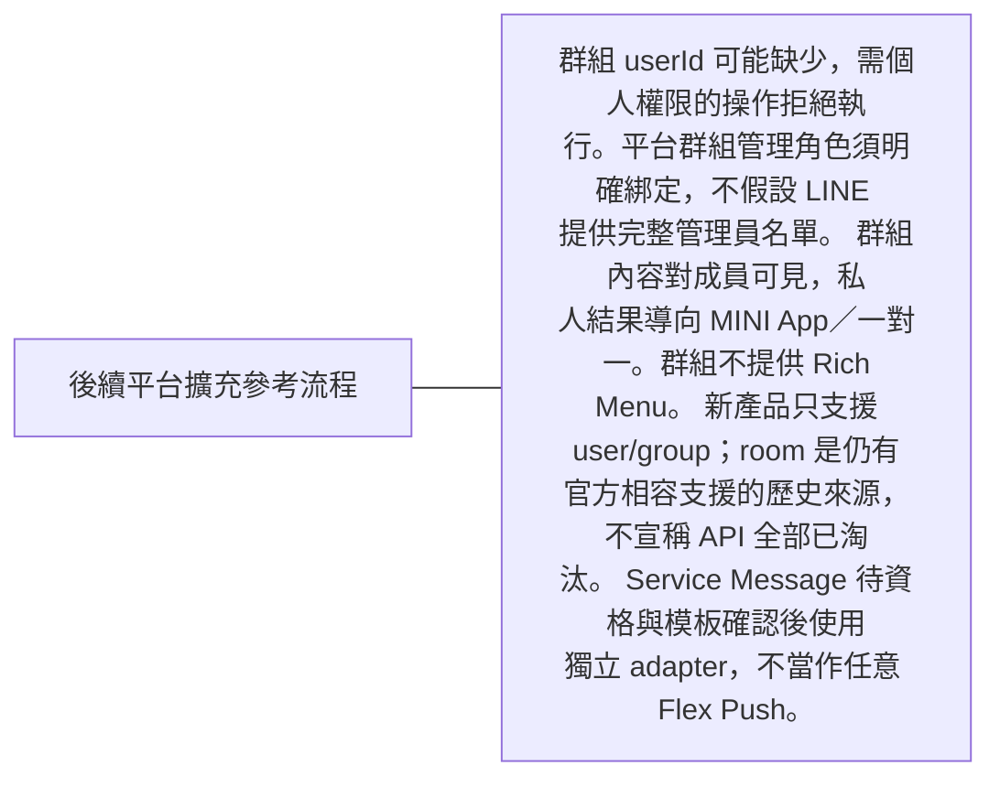
```mermaid
flowchart LR
  h["後續平台擴充參考流程"]
  h --- n0["群組 userId 可能缺少，需個人權限的操作拒絕執<br/>行。平台群組管理角色須明確綁定，不假設 LINE <br/>提供完整管理員名單。 群組內容對成員可見，私<br/>人結果導向 MINI App／一對一。群組不提供 Rich<br/> Menu。 新產品只支援 user/group；room 是仍有<br/>官方相容支援的歷史來源，不宣稱 API 全部已淘<br/>汰。 Service Message 待資格與模板確認後使用<br/>獨立 adapter，不當作任意 Flex Push。"]
```

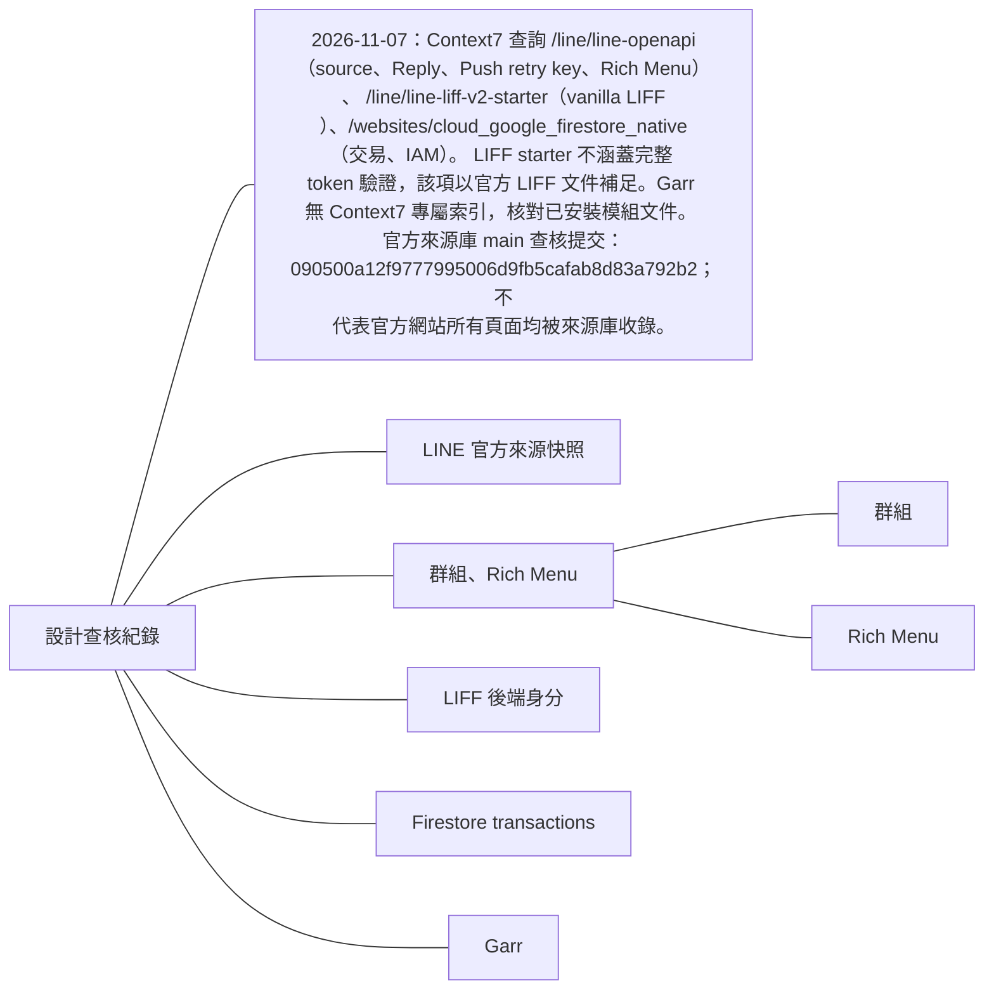
```mermaid
flowchart LR
  h["設計查核紀錄"]
  h --- n0["2026-11-07：Context7 查詢 /line/line-openapi<br/>（source、Reply、Push retry key、Rich Menu）<br/>、 /line/line-liff-v2-starter（vanilla LIFF<br/>）、/websites/cloud_google_firestore_native<br/>（交易、IAM）。 LIFF starter 不涵蓋完整 <br/>token 驗證，該項以官方 LIFF 文件補足。Garr <br/>無 Context7 專屬索引，核對已安裝模組文件。 <br/>官方來源庫 main 查核提交：<br/>090500a12f9777995006d9fb5cafab8d83a792b2；不<br/>代表官方網站所有頁面均被來源庫收錄。"]
  h --- n1["LINE 官方來源快照"]
  click n1 "https://github.com/line/line-developers-docs-source/tree/090500a12f9777995006d9fb5cafab8d83a792b2"
  h --- n2["群組、Rich Menu"]
  n2 --- n2l0["群組"]
  click n2l0 "https://developers.line.biz/en/docs/messaging-api/group-chats/"
  n2 --- n2l1["Rich Menu"]
  click n2l1 "https://developers.line.biz/en/docs/messaging-api/rich-menus-overview/"
  h --- n3["LIFF 後端身分"]
  click n3 "https://developers.line.biz/en/docs/liff/using-user-profile/"
  h --- n4["Firestore transactions"]
  click n4 "https://docs.cloud.google.com/firestore/native/docs/manage-data/transactions"
  h --- n5["Garr"]
  click n5 "https://github.com/line/garr"
```
