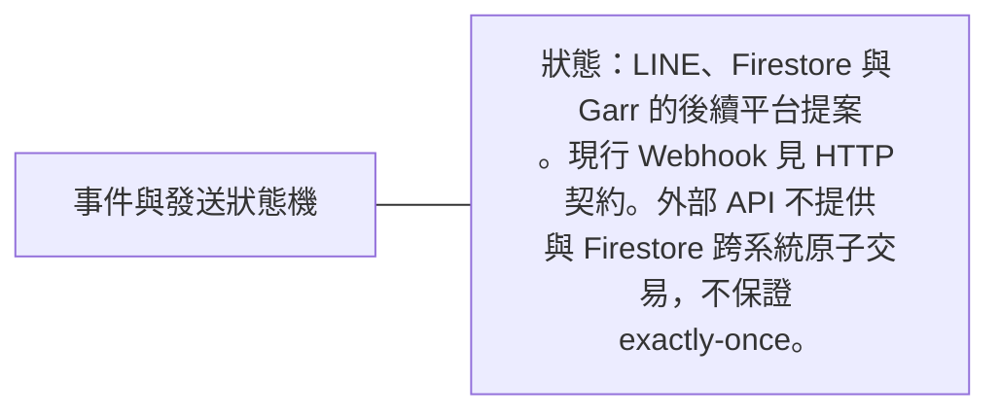
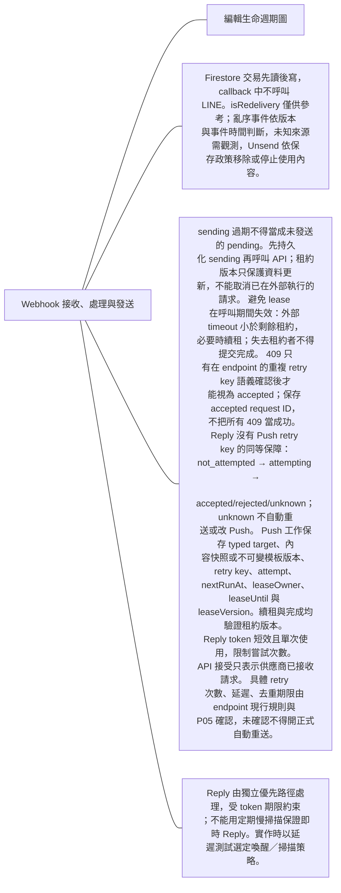
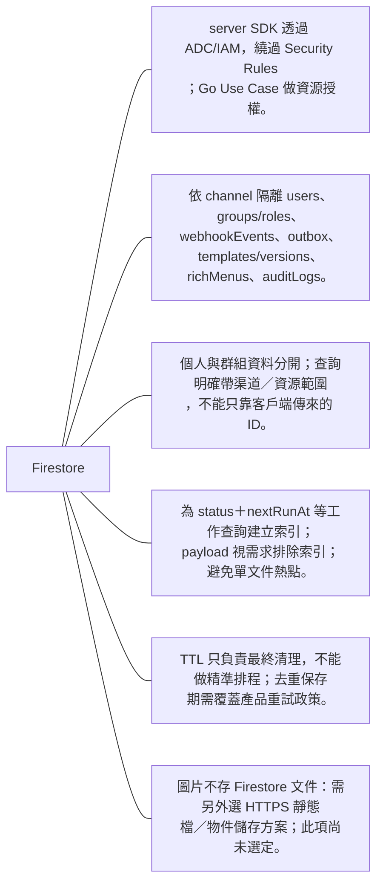
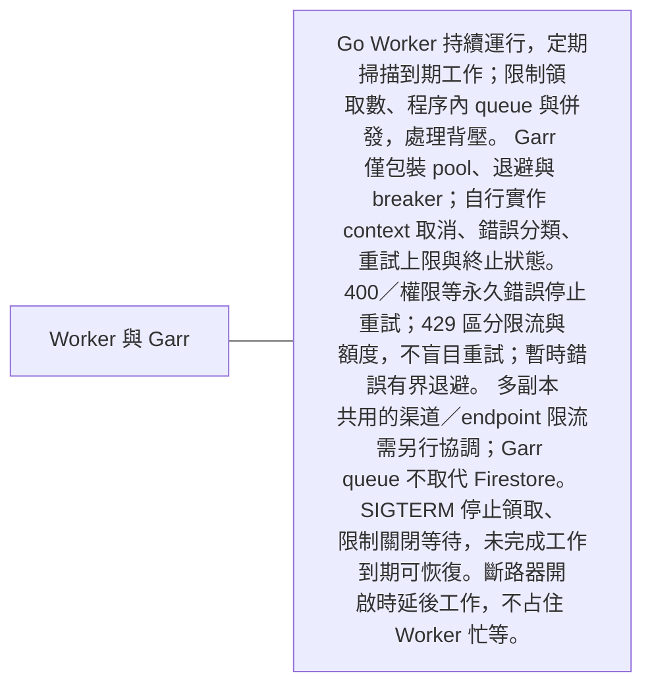
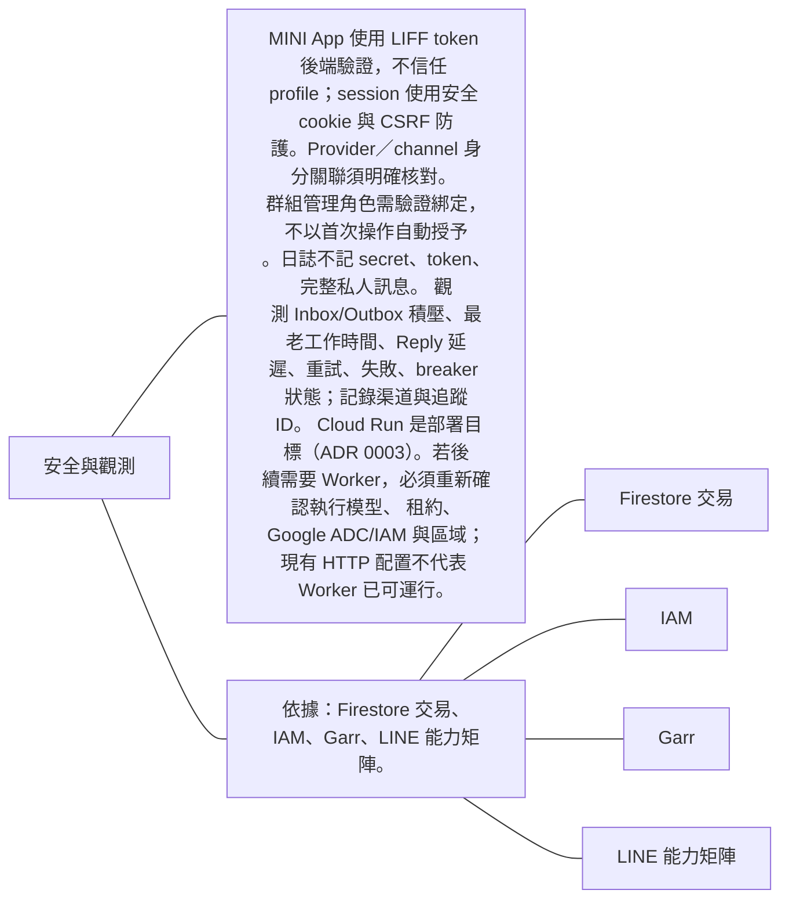

# 事件與發送狀態機

```mermaid
flowchart LR
  h["事件與發送狀態機"]
  h --- n0["狀態：LINE、Firestore 與 Garr 的後續平台提案<br/>。現行 Webhook 見 HTTP 契約。外部 API 不提供<br/>與 Firestore 跨系統原子交易，不保證 <br/>exactly-once。"]
  click n0 "../../contracts/http.md#基礎入口"
```

## Webhook 接收、處理與發送

未來設計

[Webhook 批次回覆、Inbox 交易與 Outbox Push 發送狀態（Mermaid 原始檔）](webhook-lifecycle.mermaid)

```mermaid
flowchart LR
  h["Webhook 接收、處理與發送"]
  h --- n0["編輯生命週期圖"]
  click n0 "webhook-lifecycle.mermaid"
  h --- n1["Firestore 交易先讀後寫，callback 中不呼叫 <br/>LINE。isRedelivery 僅供參考；亂序事件依版本<br/>與事件時間判斷，未知來源需觀測，Unsend 依保<br/>存政策移除或停止使用內容。"]
  h --- n2["sending 過期不得當成未發送的 pending。先持久<br/>化 sending 再呼叫 API；租約版本只保護資料更<br/>新，不能取消已在外部執行的請求。 避免 lease <br/>在呼叫期間失效：外部 timeout 小於剩餘租約，<br/>必要時續租；失去租約者不得提交完成。 409 只<br/>有在 endpoint 的重複 retry key 語義確認後才<br/>能視為 accepted；保存 accepted request ID，<br/>不把所有 409 當成功。 Reply 沒有 Push retry <br/>key 的同等保障：not_attempted → attempting →<br/> accepted/rejected/unknown；unknown 不自動重<br/>送或改 Push。 Push 工作保存 typed target、內<br/>容快照或不可變模板版本、retry key、attempt、<br/>nextRunAt、leaseOwner、leaseUntil 與 <br/>leaseVersion。續租與完成均驗證租約版本。<br/>Reply token 短效且單次使用，限制嘗試次數。<br/>API 接受只表示供應商已接收請求。 具體 retry <br/>次數、延遲、去重期限由 endpoint 現行規則與 <br/>P05 確認，未確認不得開正式自動重送。"]
  h --- n3["Reply 由獨立優先路徑處理，受 token 期限約束<br/>；不能用定期慢掃描保證即時 Reply。實作時以延<br/>遲測試選定喚醒／掃描策略。"]
```

```mermaid
flowchart LR
  h["Firestore"]
  h --- n0["server SDK 透過 ADC/IAM，繞過 Security Rules<br/>；Go Use Case 做資源授權。"]
  h --- n1["依 channel 隔離 users、groups/roles、<br/>webhookEvents、outbox、templates/versions、<br/>richMenus、auditLogs。"]
  h --- n2["個人與群組資料分開；查詢明確帶渠道／資源範圍<br/>，不能只靠客戶端傳來的 ID。"]
  h --- n3["為 status＋nextRunAt 等工作查詢建立索引；<br/>payload 視需求排除索引；避免單文件熱點。"]
  h --- n4["TTL 只負責最終清理，不能做精準排程；去重保存<br/>期需覆蓋產品重試政策。"]
  h --- n5["圖片不存 Firestore 文件：需另外選 HTTPS 靜態<br/>檔／物件儲存方案；此項尚未選定。"]
```

```mermaid
flowchart LR
  h["Worker 與 Garr"]
  h --- n0["Go Worker 持續運行，定期掃描到期工作；限制領<br/>取數、程序內 queue 與併發，處理背壓。 Garr <br/>僅包裝 pool、退避與 breaker；自行實作 <br/>context 取消、錯誤分類、重試上限與終止狀態。<br/> 400／權限等永久錯誤停止重試；429 區分限流與<br/>額度，不盲目重試；暫時錯誤有界退避。 多副本<br/>共用的渠道／endpoint 限流需另行協調；Garr <br/>queue 不取代 Firestore。 SIGTERM 停止領取、<br/>限制關閉等待，未完成工作到期可恢復。斷路器開<br/>啟時延後工作，不占住 Worker 忙等。"]
```

```mermaid
flowchart LR
  h["安全與觀測"]
  h --- n0["MINI App 使用 LIFF token 後端驗證，不信任 <br/>profile；session 使用安全 cookie 與 CSRF 防<br/>護。Provider／channel 身分關聯須明確核對。 <br/>群組管理角色需驗證綁定，不以首次操作自動授予<br/>。日誌不記 secret、token、完整私人訊息。 觀<br/>測 Inbox/Outbox 積壓、最老工作時間、Reply 延<br/>遲、重試、失敗、breaker 狀態；記錄渠道與追蹤<br/> ID。 Cloud Run 是部署目標（ADR 0003）。若後<br/>續需要 Worker，必須重新確認執行模型、 租約、<br/>Google ADC/IAM 與區域；現有 HTTP 配置不代表 <br/>Worker 已可運行。"]
  h --- n1["依據：Firestore 交易、IAM、Garr、LINE 能力矩<br/>陣。"]
  n1 --- n1l0["Firestore 交易"]
  click n1l0 "https://docs.cloud.google.com/firestore/native/docs/manage-data/transactions"
  n1 --- n1l1["IAM"]
  click n1l1 "https://docs.cloud.google.com/firestore/native/docs/security/iam"
  n1 --- n1l2["Garr"]
  click n1l2 "https://github.com/line/garr"
  n1 --- n1l3["LINE 能力矩陣"]
  click n1l3 "../../integrations/line/capabilities.md"
```
