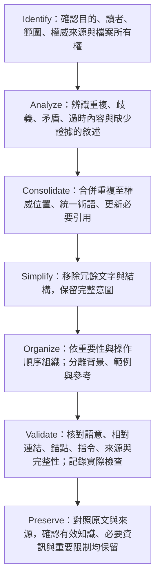
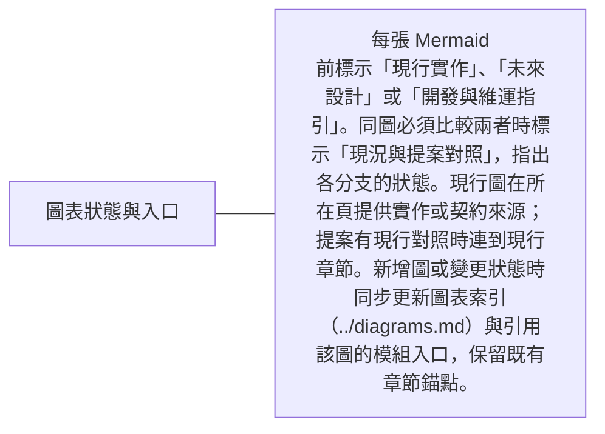
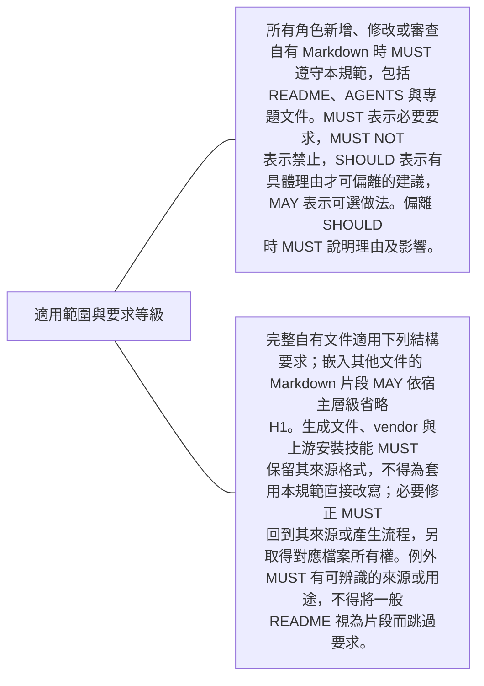
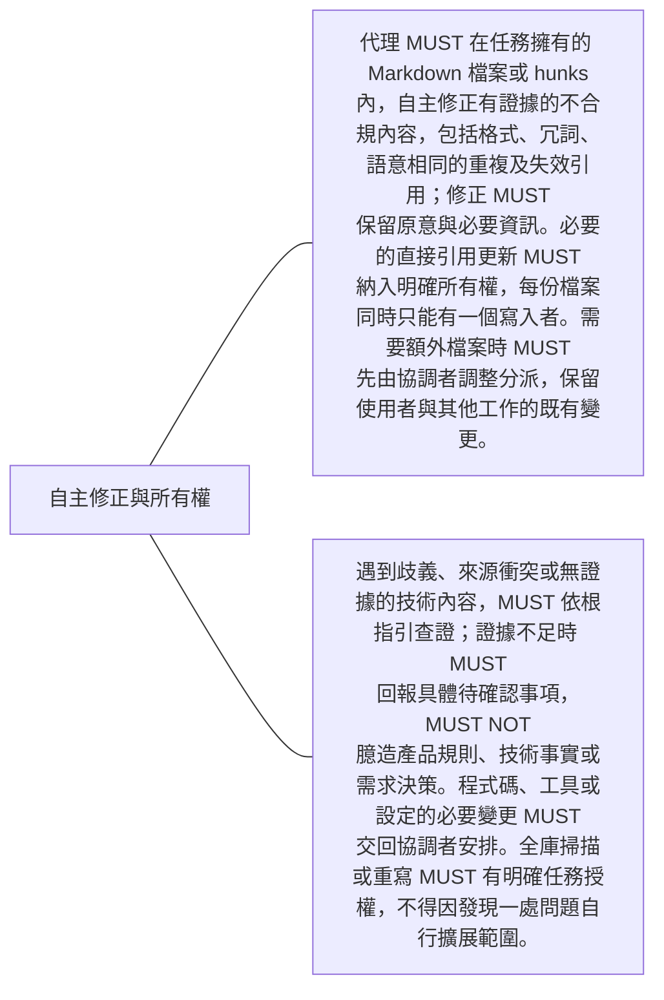
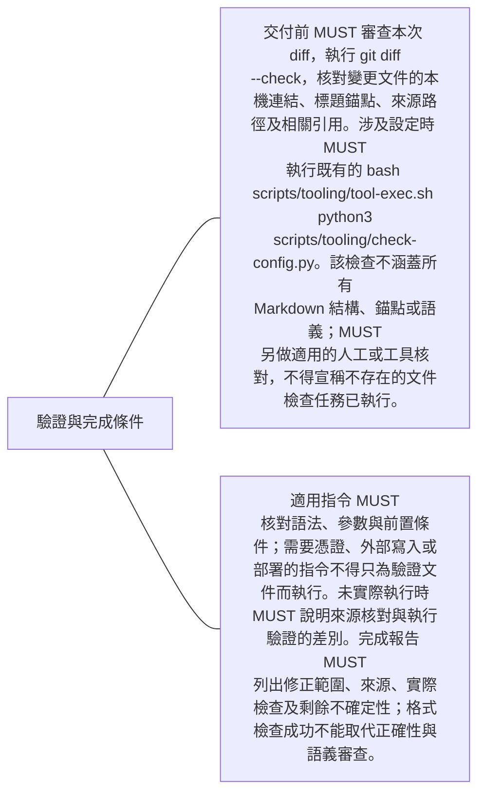
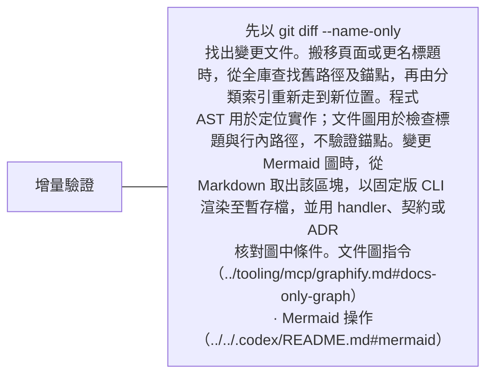
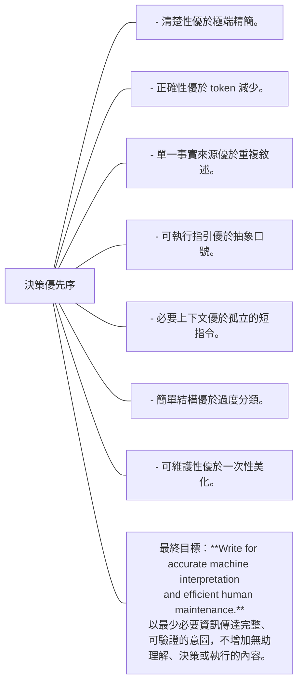

# 編寫與修正流程

```mermaid
flowchart TB
  I["Identify：確認目的、讀者、範圍、權威來源與檔案所有權"]
  I --> A["Analyze：辨識重複、歧義、矛盾、過時內容與缺少證據的敘述"]
  A --> C["Consolidate：合併重複至權威位置、統一術語、更新必要引用"]
  C --> S["Simplify：移除冗餘文字與結構，保留完整意圖"]
  S --> O["Organize：依重要性與操作順序組織；分離背景、範例與參考"]
  O --> V["Validate：核對語意、相對連結、錨點、指令、來源與完整性；記錄實際檢查"]
  V --> P["Preserve：對照原文與來源，確認有效知識、必要資訊與重要限制均保留"]
```

```mermaid
flowchart LR
  h["圖表狀態與入口"]
  h --- n0["每張 Mermaid<br/>前標示「現行實作」、「未來設計」或「開發與維運指引」。同圖必須比較兩者時標示「現況與提案對照」，指出各分支的狀態。現行圖在所在頁提供實作或契約來源；提案有現行對照時連到現行章節。新增圖或變更狀態時同步更新圖表索引（../diagrams.md）與引用該圖的模組入口，保留既有章節錨點。"]
```

## 獨立圖檔

短圖直接寫在主題文件。獨立維護的圖保存一份 Mermaid 原始檔，由使用章節連結。

```mermaid
flowchart LR
  h["適用範圍與要求等級"]
  h --- n0["所有角色新增、修改或審查自有 Markdown 時 MUST 遵守本規範，包括<br/>README、AGENTS 與專題文件。MUST 表示必要要求，MUST NOT<br/>表示禁止，SHOULD 表示有具體理由才可偏離的建議，MAY 表示可選做法。偏離 SHOULD<br/>時 MUST 說明理由及影響。"]
  h --- n1["完整自有文件適用下列結構要求；嵌入其他文件的 Markdown 片段 MAY 依宿主層級省略<br/>H1。生成文件、vendor 與上游安裝技能 MUST<br/>保留其來源格式，不得為套用本規範直接改寫；必要修正 MUST<br/>回到其來源或產生流程，另取得對應檔案所有權。例外 MUST 有可辨識的來源或用途，不得將一般<br/>README 視為片段而跳過要求。"]
```

```mermaid
flowchart LR
  h["編寫原則"]
  h --- n0["1. 清楚性（Clarity）<br/>文字 MUST 直接、精確；每段 SHOULD 聚焦一個主要概念。MUST<br/>明確區分規則、事實、假設、建議與範例，定義讀者無法由上下文確定的術語，避免模糊指代及多種解讀。"]
  h --- n2["2. 精簡性（Conciseness）<br/>MUST 刪除冗詞、重複敘述及無關背景，SHOULD 使用簡短但完整的句子。MUST<br/>保留理解、決策、執行與驗證所需的資訊；不得只以字數或 token 減少判斷改善。"]
  h --- n4["3. 結構（Structure）<br/>MUST 使用標準 Markdown；每份完整自有文件 MUST 有且只有一個明確的<br/>H1，後續標題依 H2、H3 逐級展開，不得跳級。標題 MUST<br/>描述內容，不得以「其他」「補充」等無法導航的名稱代替具體主題。SHOULD<br/>用表格比較平行項目、清單列規則或步驟、程式碼區塊呈現指令與程式範例；不得為排版增加無助理解的結構。"]
  h --- n6["4. 單一事實來源（Single Source of Truth）<br/>每條規則 MUST<br/>只有一個權威維護位置，其他文件以相對連結引用，不得複製完整政策。更新或合併規則時 MUST<br/>檢查所有相關引用、索引與錨點，確保讀者可找到有效來源且敘述一致。"]
  h --- n8["5. 可執行性（Actionability）<br/>指令與規則 MUST 使用明確動詞，交代適用條件、限制及預期結果，並依要求等級使用<br/>MUST、MUST NOT、SHOULD、MAY。MUST<br/>避免以「盡量」「適當」「最好」等無法判定完成條件的措辭代替具體要求。"]
  h --- n10["6. 上下文效率（Context Efficiency）<br/>MUST 將重要結論、限制與必要操作放在前段，將背景、範例與參考資料分離。SHOULD<br/>讓讀者或代理按需載入詳細內容，不得將所有主題集中為必須一次讀完的巨型文件。"]
  h --- n12["7. 一致性（Consistency）<br/>相同概念 MUST 使用一致術語與名稱，標題和格式 SHOULD<br/>保持一致。路徑、指令、參數與程式碼 MUST<br/>對照有效來源，避免錯誤或互相矛盾的敘述；不得憑記憶補齊未確認的技術細節。"]
  h --- n14["8. 可驗證性（Verifiability）<br/>技術事實 MUST 可追溯至實作、規格或適用版本的權威來源，明確區分已驗證結果與假設。操作<br/>MUST 有明確完成條件；檢查報告 MUST 記錄實際執行及限制，MUST NOT<br/>將未執行、工具可用或配置存在說成測試通過或功能已驗收。"]
  h --- n16["9. 可維護性（Maintainability）<br/>SHOULD<br/>依主題與責任拆分文件，移除已確認過時、重複或不適用的內容，同時保留仍有效的知識與重要限制。MUST<br/>NOT 建立尚無實際內容或維護責任的文件與分類；結構調整 MUST<br/>改善後續維護，而非只做一次性美化。"]
  h --- n18["10. 漸進揭露（Progressive Disclosure）<br/>入口文件 MUST 提供核心規則與導航，專題文件保存詳細內容，範例與參考按需讀取。MUST<br/>NOT 要求每次任務讀取全部文件；代理 SHOULD 先讀適用入口，再依任務範圍讀取所需專題。"]
```

```mermaid
flowchart LR
  h["自主修正與所有權"]
  h --- n0["代理 MUST 在任務擁有的 Markdown 檔案或 hunks<br/>內，自主修正有證據的不合規內容，包括格式、冗詞、語意相同的重複及失效引用；修正 MUST<br/>保留原意與必要資訊。必要的直接引用更新 MUST<br/>納入明確所有權，每份檔案同時只能有一個寫入者。需要額外檔案時 MUST<br/>先由協調者調整分派，保留使用者與其他工作的既有變更。"]
  h --- n1["遇到歧義、來源衝突或無證據的技術內容，MUST 依根指引查證；證據不足時 MUST<br/>回報具體待確認事項，MUST NOT<br/>臆造產品規則、技術事實或需求決策。程式碼、工具或設定的必要變更 MUST<br/>交回協調者安排。全庫掃描或重寫 MUST 有明確任務授權，不得因發現一處問題自行擴展範圍。"]
```

```mermaid
flowchart LR
  h["驗證與完成條件"]
  h --- n0["交付前 MUST 審查本次 diff，執行 git diff<br/>--check，核對變更文件的本機連結、標題錨點、來源路徑及相關引用。涉及設定時 MUST<br/>執行既有的 bash scripts/tooling/tool-exec.sh python3<br/>scripts/tooling/check-config.py。該檢查不涵蓋所有<br/>Markdown 結構、錨點或語義；MUST<br/>另做適用的人工或工具核對，不得宣稱不存在的文件檢查任務已執行。"]
  h --- n1["適用指令 MUST<br/>核對語法、參數與前置條件；需要憑證、外部寫入或部署的指令不得只為驗證文件而執行。未實際執行時<br/>MUST 說明來源核對與執行驗證的差別。完成報告 MUST<br/>列出修正範圍、來源、實際檢查及剩餘不確定性；格式檢查成功不能取代正確性與語義審查。"]
```

```mermaid
flowchart LR
  h["增量驗證"]
  h --- n0["先以 git diff --name-only<br/>找出變更文件。搬移頁面或更名標題時，從全庫查找舊路徑及錨點，再由分類索引重新走到新位置。程式<br/>AST 用於定位實作；文件圖用於檢查標題與行內路徑，不驗證錨點。變更 Mermaid 圖時，從<br/>Markdown 取出該區塊，以固定版 CLI 渲染至暫存檔，並用 handler、契約或<br/>ADR<br/>核對圖中條件。文件圖指令（../tooling/mcp/graphify.md#docs-only-graph）<br/>· Mermaid 操作（../../.codex/README.md#mermaid）"]
```

```mermaid
flowchart LR
  h["決策優先序"]
  h --- n0["- 清楚性優於極端精簡。"]
  h --- n1["- 正確性優於 token 減少。"]
  h --- n2["- 單一事實來源優於重複敘述。"]
  h --- n3["- 可執行指引優於抽象口號。"]
  h --- n4["- 必要上下文優於孤立的短指令。"]
  h --- n5["- 簡單結構優於過度分類。"]
  h --- n6["- 可維護性優於一次性美化。"]
  h --- n7["最終目標：**Write for accurate machine interpretation<br/>and efficient human maintenance.**<br/>以最少必要資訊傳達完整、可驗證的意圖，不增加無助理解、決策或執行的內容。"]
```
