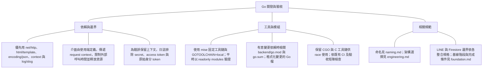

# Go 開發與驗收

```mermaid
flowchart TB
  root["Go 開發與驗收"]
  root --- b0["依賴與邊界"]
  b0 --- n0_0["優先用 net/http、html/template、encoding/json、context 與 log/slog"]
  b0 --- n0_1["介面由使用端定義。傳遞 request context，限制外部呼叫時間並釋放資源"]
  b0 --- n0_2["為錯誤保留上下文，日誌排除 secret、access token 與原始身分 token"]
  root --- b1["工具與模組"]
  b1 --- n1_0["使用 mise 固定工具鏈與 GOTOOLCHAIN=local；平時以 readonly modules 驗證"]
  b1 --- n1_1["有意變更依賴時檢閱 backend/go.mod 與 go.sum；格式化變更的 Go 檔"]
  b1 --- n1_2["保留 CGO 與 C 工具鏈供 race 使用；依既有 CI 及驗收矩陣檢查"]
  root --- b2["相關規範"]
  b2 --- n2_0["命名見 naming.md；架構選擇見 engineering.md"]
  b2 --- n2_1["LINE 與 Firestore 邊界依各整合規格；基線階段與完成條件見 foundation.md"]
```
