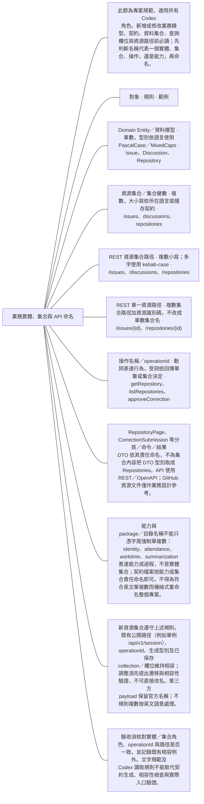
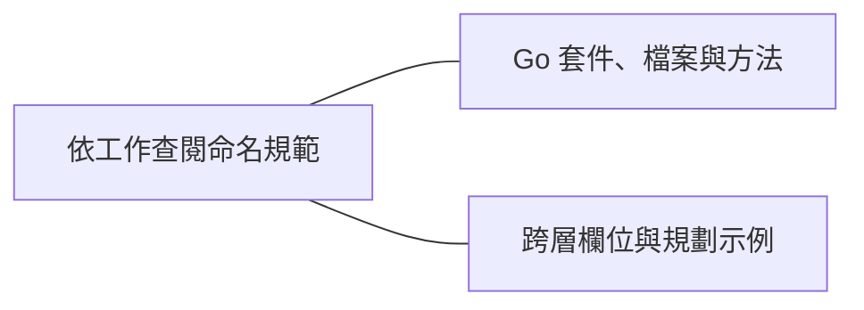
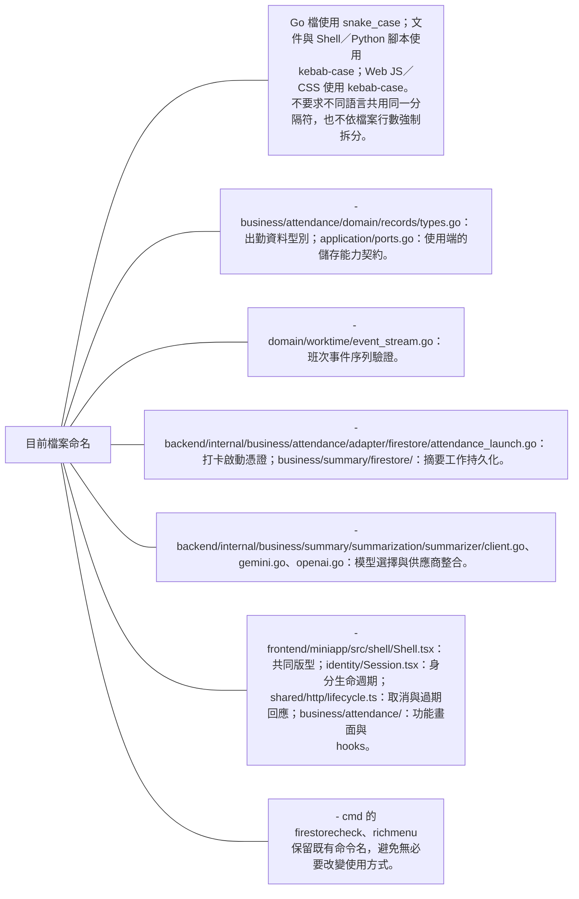

# 業務實體集合與-api-命名

```mermaid
flowchart LR
  h["業務實體、集合與 API 命名"]
  h --- n0["此節為專案規範，適用所有 Codex<br/>角色。新增或修改業務模型、契約、資料集合、查詢欄位與資源路徑前必讀；先判斷名稱代表一個實體、集合、操作，還是能力，再命名。"]
  h --- n1["對象 · 規則 · 範例"]
  h --- n2["Domain Entity／資料模型 · 單數，型別依語言使用<br/>PascalCase／MixedCaps ·<br/>Issue、Discussion、Repository"]
  h --- n3["資源集合／集合變數 · 複數，大小寫依所在語言或儲存契約 ·<br/>issues、discussions、repositories"]
  h --- n4["REST 資源集合路徑 · 複數小寫；多字使用 kebab-case ·<br/>/issues、/discussions、/repositories"]
  h --- n5["REST 單一資源路徑 · 複數集合路徑加資源識別碼，不改成單數集合名 ·<br/>/issues/{id}、/repositories/{id}"]
  h --- n6["操作名稱／operationId · 動詞表達行為，受詞依回傳單筆或集合決定 ·<br/>getRepository、listRepositories、approveCorrection"]
  h --- n7["RepositoryPage、CorrectionSubmission 等分頁／命令／結果<br/>DTO 依其責任命名，不為集合內容把 DTO 型別取成 Repositories。API 使用<br/>REST／OpenAPI；GitHub 資源文件僅作業務設計參考。"]
  h --- n8["能力與<br/>package／目錄名稱不能只憑字尾強制單複數：identity、attendance、worktime、summarization<br/>表達能力或過程，不是實體集合；契約檔案按能力或集合責任命名即可。不得為符合英文單複數而機械式重命名整個專案。"]
  h --- n9["新資源集合遵守上述規則。既有公開路徑（例如單例<br/>/api/v1/session）、operationId、生成型別及已保存<br/>collection／欄位維持相容；調整須先提出遷移與相容性驗證，不可直接改名。第三方<br/>payload 保留官方名稱；不規則複數按英文語意處理。"]
  h --- n10["驗收須核對實體／集合角色、operationId 與路徑是否一致，並記錄既有相容例外。文字規範及<br/>Codex 讀取規則不能取代契約生成、相容性檢查與實際入口驗證。"]
```

```mermaid
flowchart LR
  a["依工作查閱命名規範"]
  a --- n0["Go 套件、檔案與方法"]
  click n0 "naming.md"
  a --- n1["跨層欄位與規劃示例"]
  click n1 "../proposals/platform/package-layout.md"
```

```mermaid
flowchart LR
  h["Go 命名"]
  h --- n0["對象 · 規則 · 範例"]
  h --- n1["package · 小寫短名，不用底線與 common/utils；避免輸出 API 重複<br/>package 名 · group、jobs；group.Service"]
  h --- n2["檔案 · 小寫 snake_case，依主要責任命名 ·<br/>handle_postback.go、claim_outbox.go"]
  h --- n3["測試 · 對應檔案加 _test.go；fixture 放鄰近 testdata/ ·<br/>claim_outbox_test.go"]
  h --- n4["公開型別／函數 · MixedCaps，名稱表達業務動作 ·<br/>UserTarget、HandlePostback"]
  h --- n5["私有函數／欄位 · mixedCaps ·<br/>validateTarget、leaseVersion"]
  h --- n6["縮寫 · Go 識別字保持一致 ·<br/>HTTPClient、channelID、userID、requestURL"]
  h --- n7["建構函數 · 多型別時 NewType；單一主要型別可 New ·<br/>NewService、NewHandler；初始化可能失敗回傳 error"]
  h --- n8["方法 · 動詞＋必要受詞；不重複 receiver 語意 ·<br/>Claim、RenewLease、MarkAccepted"]
  h --- n9["bool · 正向判斷 · CanManage、IsExpired；避免雙重否定"]
  h --- n10["interface · 消費端定義、能力命名；不加 I 前綴 ·<br/>EventStore、ReplySender、Clock"]
  h --- n11["context · I/O 方法第一參數、具名 ctx · Handle(ctx<br/>context.Context, cmd Command) error"]
  h --- n12["error · 最後回傳；errors.Is/As 可識別，包裝保留 %w ·<br/>ErrForbidden、ErrLeaseLost"]
  h --- n13["時間 · Go time.Time／time.Duration；時間點 UTC ·<br/>NextRunAt、LeaseUntil、PollInterval"]
  h --- n14["不要為所有操作取名 Execute/Process/Manager，除非 receiver<br/>已明確表達該使用案例。 不要為每個 struct 強制建立 interface。小<br/>package 可用 ports.go，介面多時按能力拆檔。"]
  h --- n15["出勤內部命名以實際行為為準：ResolvePunchAttempt<br/>可能保存拒絕收據，SubmitPunch<br/>提交定位操作；verifyAndRebuildRecords<br/>驗證證據並重建回傳資料，RebuildSessions<br/>重播事件產生班次，RecordsOverlappingMonth 明確包含跨月重疊。HTTP<br/>路徑和既有資料欄位不隨內部重新命名而變更。<br/>複雜交易用一個具名命令表達身分、時間單位與模式；短方法不強制包成命令。資料層直接在公開方法轉譯技術錯誤，不為每個方法另外建立同名<br/>Operation 轉呼叫。"]
```

```mermaid
flowchart LR
  h["目前檔案命名"]
  h --- n0["Go 檔使用 snake_case；文件與 Shell／Python 腳本使用<br/>kebab-case；Web JS／CSS 使用 kebab-case。<br/>不要求不同語言共用同一分隔符，也不依檔案行數強制拆分。"]
  h --- n1["-<br/>business/attendance/domain/records/types.go：出勤資料型別；application/ports.go：使用端的儲存能力契約。"]
  h --- n2["- domain/worktime/event_stream.go：班次事件序列驗證。"]
  h --- n3["-<br/>backend/internal/business/attendance/adapter/firestore/attendance_launch.go：打卡啟動憑證；business/summary/firestore/：摘要工作持久化。"]
  h --- n4["-<br/>backend/internal/business/summary/summarization/summarizer/client.go、gemini.go、openai.go：模型選擇與供應商整合。"]
  h --- n5["-<br/>frontend/miniapp/src/shell/Shell.tsx：共同版型；identity/Session.tsx：身分生命週期；shared/http/lifecycle.ts：取消與過期回應；business/attendance/：功能畫面與<br/>hooks。"]
  h --- n6["- cmd 的<br/>firestorecheck、richmenu<br/>保留既有命令名，避免無必要改變使用方式。"]
```
