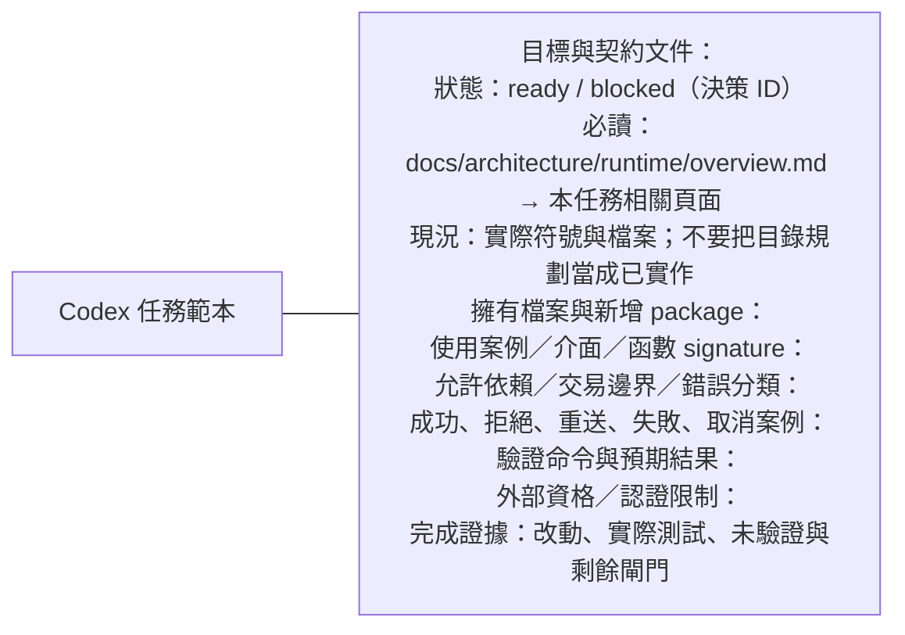
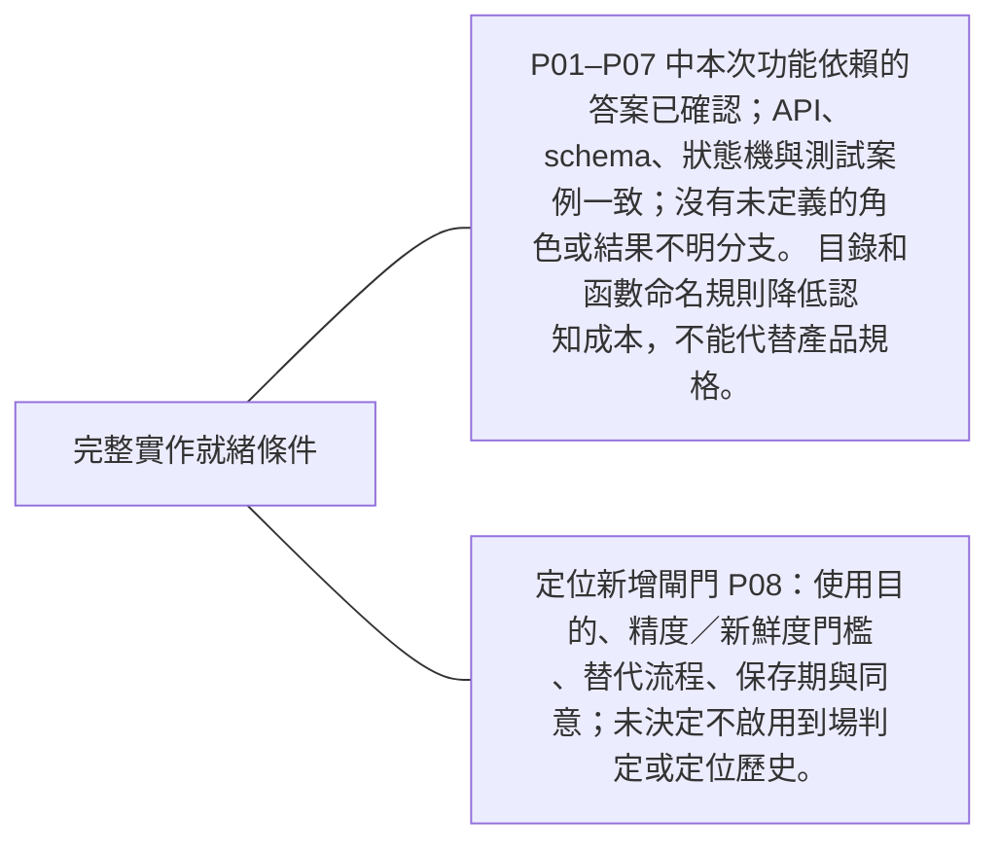

# codex-任務範本

```mermaid
flowchart LR
  h["Codex 任務範本"]
  h --- n0["目標與契約文件：<br/>狀態：ready / blocked（決策 ID）<br/>必讀：docs/architecture/runtime/overview.md → 本任務相關頁面<br/>現況：實際符號與檔案；不要把目錄規劃當成已實作<br/>擁有檔案與新增 package：<br/>使用案例／介面／函數 signature：<br/>允許依賴／交易邊界／錯誤分類：<br/>成功、拒絕、重送、失敗、取消案例：<br/>驗證命令與預期結果：<br/>外部資格／認證限制：<br/>完成證據：改動、實際測試、未驗證與剩餘閘門"]
```

```mermaid
flowchart LR
  h["完整實作就緒條件"]
  h --- n0["P01–P07 中本次功能依賴的答案已確認；API、<br/>schema、狀態機與測試案例一致；沒有未定義的角<br/>色或結果不明分支。 目錄和函數命名規則降低認<br/>知成本，不能代替產品規格。"]
  h --- n1["定位新增閘門 P08：使用目的、精度／新鮮度門檻<br/>、替代流程、保存期與同意；未決定不啟用到場判<br/>定或定位歷史。"]
```
